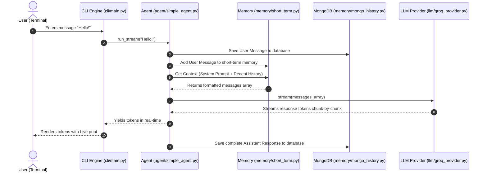

# Asynchronous Terminal AI Chatbot

A highly structured, production-grade, asynchronous terminal-based chatbot built in Python. This chatbot interfaces with **Groq Cloud API** for fast LLM inference and uses **MongoDB Atlas** for database storage and session history management. 

Designed with a clean decoupled architecture (Clean Architecture principles), this project serves as a starting point that easily scales into a single/multi-agent system equipped with short-term context windowing, long-term memory, and tool integration.

---

## 🚀 Key Features

*   **Asynchronous Core**: Fully non-blocking I/O using Python's `asyncio`, the `motor` driver (async MongoDB), and Groq's `AsyncGroq` client.
*   **Real-Time Token Streaming**: Real-time streaming response displaying in the CLI using the `rich` library.
*   **Dynamic Session Management**: Switch between existing chat sessions loaded from MongoDB or spawn new threads at startup.
*   **Decoupled Architecture**: Abstract base classes for the LLM providers, Memory layers, and Agents to prevent vendor lock-in.
*   **API Resilience**: Built-in retry handling with exponential backoff using `tenacity` for resilience against rate limits (HTTP 429) or transient API failures.
*   **Slash Commands**: Quick CLI controls to manage state (`/exit`, `/clear`).

---

## 🛠️ Technology Stack

1.  **Language**: Python 3.10+
2.  **LLM Provider**: [Groq Cloud](https://console.groq.com/) (using models such as Llama 3)
3.  **Database**: [MongoDB Atlas](https://www.mongodb.com/atlas) (Document storage for sessions & messages)
4.  **Schema Validation**: Pydantic v2 (Loads environment settings and validates DB models)
5.  **UI Styling**: Rich (Formats terminal text, spinners, panels, and streaming interfaces)

---

## 📁 Directory Structure

```text
ai_agent/
│
├── config/
│   ├── __init__.py
│   └── settings.py         # Type-safe configurations (loads from .env via Pydantic)
│
├── database/
│   ├── __init__.py
│   ├── connection.py       # Async MongoDB Atlas connection manager (Motor client)
│   └── models.py           # Pydantic schemas for Messages and Sessions
│
├── llm/
│   ├── __init__.py
│   ├── base.py             # Abstract BaseLLM definition
│   └── groq_provider.py    # Async Groq client implementation
│
├── memory/
│   ├── __init__.py
│   ├── base.py             # Abstract BaseMemory definition
│   ├── short_term.py       # Sliding context window manager
│   └── mongo_history.py    # MongoDB message persistence layer
│
├── agent/
│   ├── __init__.py
│   ├── base.py             # Abstract BaseAgent definition
│   └── simple_agent.py     # Simple conversational agent implementation
│
├── cli/
│   ├── __init__.py
│   └── main.py             # Command-line interface loop & session manager
│
├── .env                    # Secret environment credentials (git-ignored)
├── .env.template           # Template for environment credentials
├── requirements.txt        # Third-party project dependencies
└── main.py                 # Project executable entry point
```

---

## ⚙️ Setup & Configuration

### Prerequisites
1.  Python 3.10 or higher installed.
2.  A [Groq Console](https://console.groq.com/) API Key.
3.  A [MongoDB Atlas](https://www.mongodb.com/atlas) database cluster connection string.

### 1. Installation
Clone or navigate to the project directory and install dependencies:
```bash
pip install -r requirements.txt
```

### 2. Configuration
Copy the `.env.template` file to a new file named `.env`:
```bash
cp .env.template .env
```
Open the `.env` file and populate it with your credentials:
```env
# Groq API Configuration
GROQ_API_KEY=gsk_your_actual_api_key_here
GROQ_DEFAULT_MODEL=llama3-8b-8192

# MongoDB Atlas Configuration
MONGODB_URI=mongodb+srv://<username>:<password>@<cluster>.mongodb.net/?retryWrites=true&w=majority
MONGODB_DB_NAME=chatbot_db
```

---

## 🏃 Running the Application

Launch the interactive terminal session by running the root entry point:
```bash
python main.py
```

### In-App CLI Commands
During a chat session, type the following commands into the prompt:
*   `/clear`: Deletes the chat history for the current session.
*   `/exit`: Closes database connection pools safely and quits the program.

---

## 📐 Architecture & Data Flow

When a user submits a message, the data flows asynchronously through the system components:



---

## 🔮 Roadmap: Scaling to Agents & Advanced Memory

This codebase was structured explicitly to scale. Here is how to evolve it:

### 1. Multi-Agent Systems
*   Define new sub-agents (e.g. `CoderAgent`, `SearchAgent`) extending `BaseAgent`.
*   Replace `SimpleAgent` with an orchestrator class that inspects user queries, routes them to specific sub-agents, or coordinates them in a routing hierarchy.
*   Add a `sender_id` and `is_internal` boolean to the `MessageModel` schema to record agent-to-agent reasoning loops behind the scenes without printing them to the end user.

### 2. Long-Term Memory (Atlas Vector Search)
*   **The Problem:** Short-term memory eventually overflows the context window when conversations grow very long.
*   **The Fix:** Summarize key facts (e.g., "User prefers Python") and store them in a new `memories` collection.
*   Add a vector embedding field (`Array` of floats) to the `memories` documents.
*   Use MongoDB Atlas's native **Vector Search Index** to run cosine similarity queries (`$vectorSearch`), loading semantically relevant facts back into the system prompt at runtime.

### 3. Tool Execution (Function Calling)
*   Write a tool registration decorator.
*   Allow the LLM provider class to accept tool schema definitions (JSON schemas).
*   When the LLM yields a tool call request, intercept it inside the agent logic, execute the local function (e.g. executing a file read or search), append the output as a `tool` role message, and re-feed it to the LLM.
