# Long-Term Memory in Production AI Agents — Deep Dive

> **Document Version:** 1.0.0
> **Last Updated:** June 20, 2026
> **Author:** TejasH MistrY

> **Engineering Reference Document** — A comprehensive analysis of how production-grade AI assistants (ChatGPT, Claude, Perplexity) and modern agent frameworks design, implement, and manage long-term memory systems. Written to inform the architectural design of our AI Agent project's Phase 4.

---

## Table of Contents

1. [Long-Term Memory Fundamentals](#1-long-term-memory-fundamentals)
   - 1.1 [What Long-Term Memory Means in AI Agents](#11-what-long-term-memory-means-in-ai-agents)
   - 1.2 [Why Long-Term Memory Is Necessary](#12-why-long-term-memory-is-necessary)
   - 1.3 [Categories of Memory in Cognitive AI](#13-categories-of-memory-in-cognitive-ai)
2. [Memory Architectures Used in Production](#2-memory-architectures-used-in-production)
   - 2.1 [How ChatGPT Approaches Memory](#21-how-chatgpt-approaches-memory)
   - 2.2 [How Claude Manages Memory](#22-how-claude-manages-memory)
   - 2.3 [How Perplexity Handles Personalization](#23-how-perplexity-handles-personalization)
   - 2.4 [Agent Framework Memory Strategies](#24-agent-framework-memory-strategies)
3. [End-to-End System Design](#3-end-to-end-system-design)
   - 3.1 [Complete Memory Lifecycle](#31-complete-memory-lifecycle)
   - 3.2 [Context Management & Token Optimization](#32-context-management--token-optimization)
4. [Technical Implementation Details](#4-technical-implementation-details)
   - 4.1 [Databases for Memory Storage](#41-databases-for-memory-storage)
   - 4.2 [Vector Databases & Embeddings](#42-vector-databases--embeddings)
   - 4.3 [Knowledge Graphs](#43-knowledge-graphs)
   - 4.4 [Hybrid Memory Architectures](#44-hybrid-memory-architectures)
   - 4.5 [RAG Integration](#45-rag-integration)
5. [Workflow Diagrams](#5-workflow-diagrams)
   - 5.1 [Full System Architecture](#51-full-system-architecture)
   - 5.2 [Memory Retrieval & Ranking Pipeline](#52-memory-retrieval--ranking-pipeline)
   - 5.3 [Memory Write (Extraction & Storage)](#53-memory-write-extraction--storage)
   - 5.4 [Memory Consolidation (Dreaming)](#54-memory-consolidation-dreaming)
   - 5.5 [Multi-Agent Memory Sharing](#55-multi-agent-memory-sharing)
6. [Scalability & Production Considerations](#6-scalability--production-considerations)
   - 6.1 [Memory Indexing Strategies](#61-memory-indexing-strategies)
   - 6.2 [Latency Optimization](#62-latency-optimization)
   - 6.3 [Cost Optimization](#63-cost-optimization)
   - 6.4 [Privacy & Security](#64-privacy--security)
   - 6.5 [User-Specific vs Global Memory](#65-user-specific-vs-global-memory)
7. [Comparative Analysis](#7-comparative-analysis)
   - 7.1 [Feature Comparison Matrix](#71-feature-comparison-matrix)
   - 7.2 [Architecture Trade-Offs](#72-architecture-trade-offs)
8. [Implications for Our AI Agent Project](#8-implications-for-our-ai-agent-project)

---

## 1. Long-Term Memory Fundamentals

### 1.1 What Long-Term Memory Means in AI Agents

LLMs are **stateless by nature**. Each API call is independent — the model receives a context window (prompt + history), generates a response, and forgets everything. It does not "learn" from your interactions or update its weights based on your usage.

**Long-term memory** is an engineering layer built *around* the stateless LLM that:
- **Persists information** beyond the scope of a single conversation or session
- **Selectively retrieves** relevant past knowledge to enrich the current prompt
- **Creates the illusion of continuity** — making the agent feel like it "knows" you across weeks, months, or years

> **Key Insight**: The model itself never remembers anything. Memory is an **external system** that reads, writes, and injects data into the prompt before each LLM call. Think of it as a "dossier" the agent reads before every interaction.

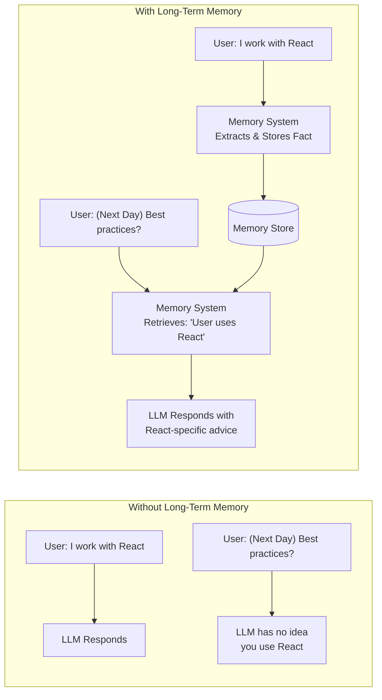
```mermaid
flowchart LR
    subgraph WITHOUT_MEMORY["Without Long-Term Memory"]
        U1["User: I work with React"] --> LLM1["LLM Responds"]
        U2["User: (Next Day) Best practices?"] --> LLM2["LLM has no idea<br/>you use React"]
    end

    subgraph WITH_MEMORY["With Long-Term Memory"]
        U3["User: I work with React"] --> EXTRACT["Memory System<br/>Extracts & Stores Fact"]
        EXTRACT --> DB1[("Memory Store")]
        U4["User: (Next Day) Best practices?"] --> RETRIEVE["Memory System<br/>Retrieves: 'User uses React'"]
        DB1 --> RETRIEVE
        RETRIEVE --> LLM3["LLM Responds with<br/>React-specific advice"]
    end
```

### 1.2 Why Long-Term Memory Is Necessary

| Problem Without Memory | How Memory Solves It |
|----------------------|---------------------|
| **Repetitive context**: User must re-explain preferences every session | Remembers preferences, tech stack, communication style |
| **Context window overflow**: Long conversations exceed token limits | Compresses and indexes history into retrievable facts |
| **No personalization**: Agent treats everyone identically | Builds user profiles that influence response style |
| **No learning from experience**: Agent repeats mistakes | Stores episodic experiences of past failures/successes |
| **Stateless tool usage**: Agent forgets tool results across sessions | Caches important findings for cross-session retrieval |
| **Cost explosion**: Sending full history costs too many tokens | Selective retrieval sends only relevant context |

### 1.3 Categories of Memory in Cognitive AI

Modern AI memory architectures draw from **cognitive science**, implementing distinct memory types inspired by how the human brain organizes knowledge:

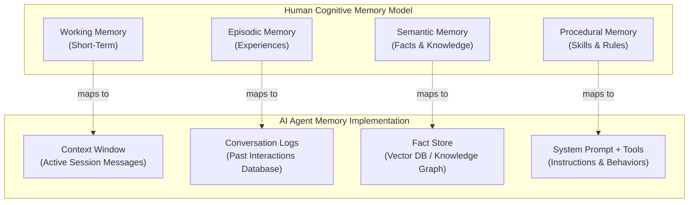
```mermaid
graph TB
    subgraph HUMAN["Human Cognitive Memory Model"]
        WM["Working Memory<br/>(Short-Term)"] 
        EM["Episodic Memory<br/>(Experiences)"]
        SM["Semantic Memory<br/>(Facts & Knowledge)"]
        PM["Procedural Memory<br/>(Skills & Rules)"]
    end

    subgraph AI["AI Agent Memory Implementation"]
        AI_WM["Context Window<br/>(Active Session Messages)"]
        AI_EM["Conversation Logs<br/>(Past Interactions Database)"]
        AI_SM["Fact Store<br/>(Vector DB / Knowledge Graph)"]
        AI_PM["System Prompt + Tools<br/>(Instructions & Behaviors)"]
    end

    WM -.->|maps to| AI_WM
    EM -.->|maps to| AI_EM
    SM -.->|maps to| AI_SM
    PM -.->|maps to| AI_PM
```

#### 1.3.1 Working Memory (Short-Term / Context Window)

| Aspect | Detail |
|--------|--------|
| **What it stores** | Current session messages, system prompt, active tool results |
| **Duration** | Single session only — cleared when session ends |
| **Size constraint** | Limited by LLM context window (4K–200K tokens) |
| **Implementation** | In-memory array of message dicts (our `ShortTermMemory`) |
| **Analogy** | Your mental workspace while solving a problem |

#### 1.3.2 Episodic Memory (Experiences)

| Aspect | Detail |
|--------|--------|
| **What it stores** | Sequential records of past interactions, events, decisions, and outcomes |
| **Duration** | Persistent across sessions — hours to years |
| **Key property** | **Temporal and contextual**: "On June 10, user asked about React deployment and I recommended Vercel" |
| **Implementation** | Time-indexed event logs in document stores or vector DBs |
| **Retrieval** | By similarity to current query + recency weighting |
| **Analogy** | Your personal diary of life events |

#### 1.3.3 Semantic Memory (Facts & Knowledge)

| Aspect | Detail |
|--------|--------|
| **What it stores** | Generalized facts, user preferences, world knowledge, relationships |
| **Duration** | Persistent and updateable — can be overwritten when facts change |
| **Key property** | **Factual and structured**: "User prefers Python", "User's OS is Windows" |
| **Implementation** | Vector databases (embeddings), knowledge graphs (entities + relationships) |
| **Retrieval** | Semantic similarity search (cosine), graph traversal |
| **Analogy** | Encyclopedia + personal fact file |

#### 1.3.4 Procedural Memory (Skills & Rules)

| Aspect | Detail |
|--------|--------|
| **What it stores** | How to perform tasks — behavioral instructions, tool definitions, workflows |
| **Duration** | Static or slowly evolving — set by developers |
| **Key property** | **Prescriptive**: "When user asks about time, use the get_world_time tool" |
| **Implementation** | System prompt, tool schemas, hard-coded logic, runbooks |
| **Retrieval** | Always loaded (system prompt) or pattern-matched (tool selection) |
| **Analogy** | Muscle memory — how to ride a bike without thinking |

#### How the Four Types Interact in a Single Turn

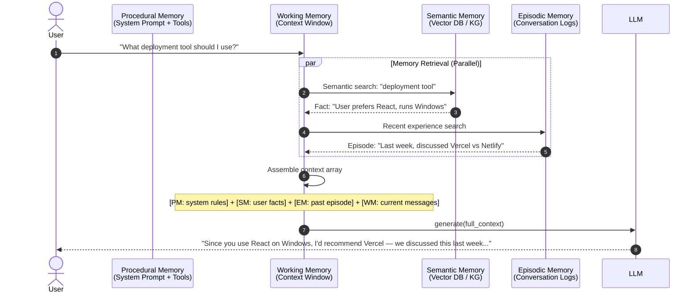
```mermaid
sequenceDiagram
    autonumber
    actor User
    participant PM as Procedural Memory<br/>(System Prompt + Tools)
    participant WM as Working Memory<br/>(Context Window)
    participant SM as Semantic Memory<br/>(Vector DB / KG)
    participant EM as Episodic Memory<br/>(Conversation Logs)
    participant LLM as LLM

    User->>WM: "What deployment tool should I use?"

    par Memory Retrieval (Parallel)
        WM->>SM: Semantic search: "deployment tool"
        SM-->>WM: Fact: "User prefers React, runs Windows"
        WM->>EM: Recent experience search
        EM-->>WM: Episode: "Last week, discussed Vercel vs Netlify"
    end

    WM->>WM: Assemble context array
    Note over WM: [PM: system rules] + [SM: user facts] + [EM: past episode] + [WM: current messages]
    WM->>LLM: generate(full_context)
    LLM-->>User: "Since you use React on Windows, I'd recommend Vercel — we discussed this last week..."
```

---

## 2. Memory Architectures Used in Production

### 2.1 How ChatGPT Approaches Memory

ChatGPT uses a **layered context injection** architecture rather than embedding-based RAG for every interaction. The system assembles a structured "context dossier" before each LLM call.

#### ChatGPT's Context Window Assembly

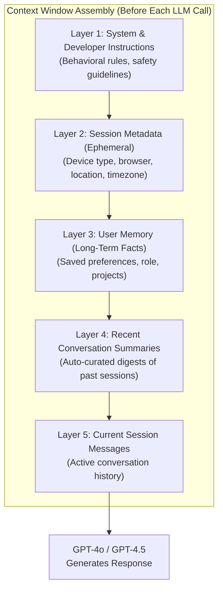
```mermaid
flowchart TB
    subgraph ASSEMBLY["Context Window Assembly (Before Each LLM Call)"]
        direction TB
        L1["Layer 1: System & Developer Instructions<br/>(Behavioral rules, safety guidelines)"]
        L2["Layer 2: Session Metadata (Ephemeral)<br/>(Device type, browser, location, timezone)"]
        L3["Layer 3: User Memory (Long-Term Facts)<br/>(Saved preferences, role, projects)"]
        L4["Layer 4: Recent Conversation Summaries<br/>(Auto-curated digests of past sessions)"]
        L5["Layer 5: Current Session Messages<br/>(Active conversation history)"]
        L1 --> L2 --> L3 --> L4 --> L5
    end

    L5 --> LLM["GPT-4o / GPT-4.5<br/>Generates Response"]
```

#### Key Mechanisms

| Mechanism | How It Works |
|-----------|-------------|
| **Explicit Memory Save** | User says "Remember that I prefer dark mode" → system extracts and stores the fact as a text string in a persistent notepad |
| **Dreaming (Auto-Curation)** | Background process periodically reviews chat history and automatically extracts, updates, and prunes facts without user intervention |
| **Memory as System Prompt Injection** | Saved facts are concatenated and injected into the system prompt section — the model reads them like instructions, not embeddings |
| **Projects (Isolated Memory Spaces)** | Users can create project-specific memory environments to prevent cross-contamination between work, personal, and hobby contexts |
| **No Weight Updates** | The model does not retrain on user data. "Learning" is simulated by reading the injected dossier before each response |

#### ChatGPT Memory Evolution Timeline

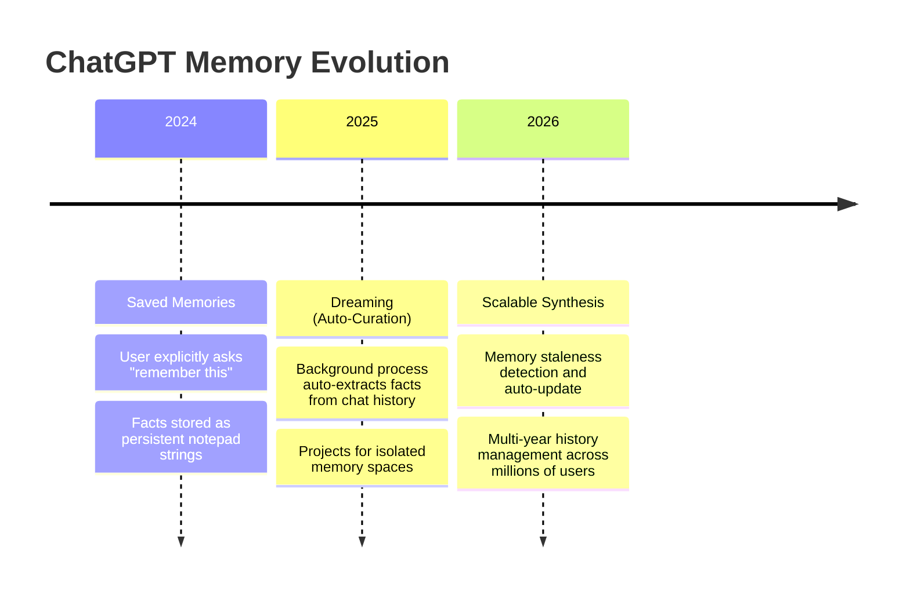
```mermaid
timeline
    title ChatGPT Memory Evolution
    2024 : Saved Memories : User explicitly asks "remember this" : Facts stored as persistent notepad strings
    2025 : Dreaming (Auto-Curation) : Background process auto-extracts facts from chat history : Projects for isolated memory spaces
    2026 : Scalable Synthesis : Memory staleness detection and auto-update : Multi-year history management across millions of users
```

#### Architecture Diagram

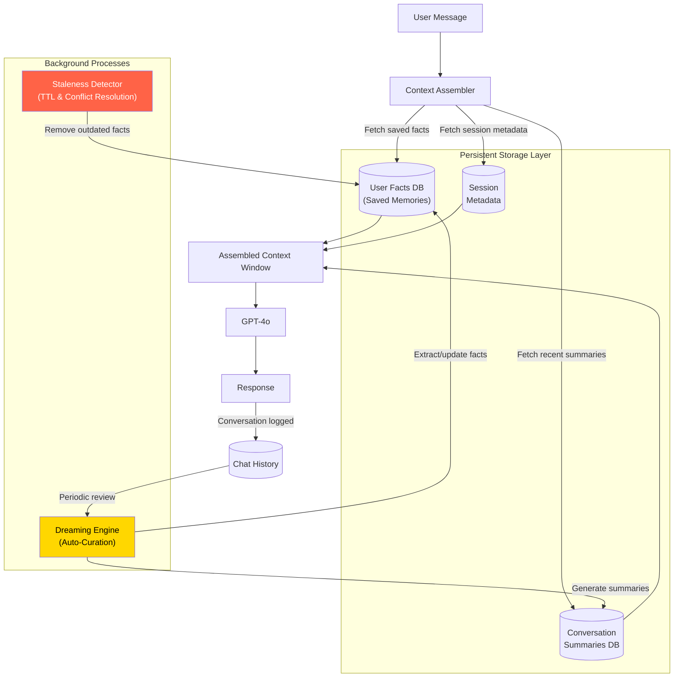
```mermaid
flowchart TB
    USER["User Message"] --> ROUTER["Context Assembler"]

    subgraph PERSISTENT["Persistent Storage Layer"]
        FACTS[("User Facts DB<br/>(Saved Memories)")]
        SUMMARIES[("Conversation<br/>Summaries DB")]
        SESSIONS[("Session<br/>Metadata")]
    end

    subgraph BACKGROUND["Background Processes"]
        DREAM["Dreaming Engine<br/>(Auto-Curation)"]
        PRUNE["Staleness Detector<br/>(TTL & Conflict Resolution)"]
    end

    ROUTER -->|"Fetch saved facts"| FACTS
    ROUTER -->|"Fetch recent summaries"| SUMMARIES
    ROUTER -->|"Fetch session metadata"| SESSIONS
    FACTS --> CONTEXT["Assembled Context Window"]
    SUMMARIES --> CONTEXT
    SESSIONS --> CONTEXT
    CONTEXT --> LLM["GPT-4o"]
    LLM --> RESPONSE["Response"]

    RESPONSE -->|"Conversation logged"| HISTORY[("Chat History")]
    HISTORY -->|"Periodic review"| DREAM
    DREAM -->|"Extract/update facts"| FACTS
    DREAM -->|"Generate summaries"| SUMMARIES
    PRUNE -->|"Remove outdated facts"| FACTS

    style DREAM fill:#ffd700,color:#000
    style PRUNE fill:#ff6347,color:#fff
```

---

### 2.2 How Claude Manages Memory

Claude uses a **dual-system architecture** — one for consumer users (Claude.ai) and one for developer agents (Claude Code).

#### Claude.ai: Memory Synthesis System

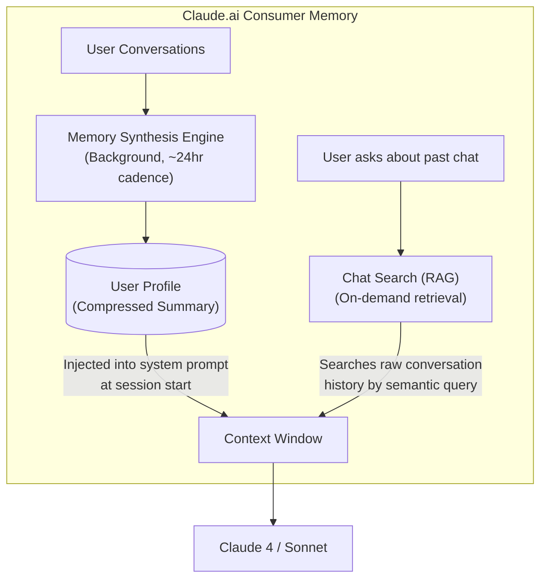
```mermaid
flowchart TB
    subgraph CONSUMER["Claude.ai Consumer Memory"]
        direction TB
        CONV["User Conversations"] --> SYNTH["Memory Synthesis Engine<br/>(Background, ~24hr cadence)"]
        SYNTH --> PROFILE[("User Profile<br/>(Compressed Summary)")]
        PROFILE -->|"Injected into system prompt<br/>at session start"| CONTEXT["Context Window"]

        CONV2["User asks about past chat"] --> SEARCH["Chat Search (RAG)<br/>(On-demand retrieval)"]
        SEARCH -->|"Searches raw conversation<br/>history by semantic query"| CONTEXT
    end

    CONTEXT --> CLAUDE["Claude 4 / Sonnet"]
```

#### Claude Code: File-Based Tiered Memory

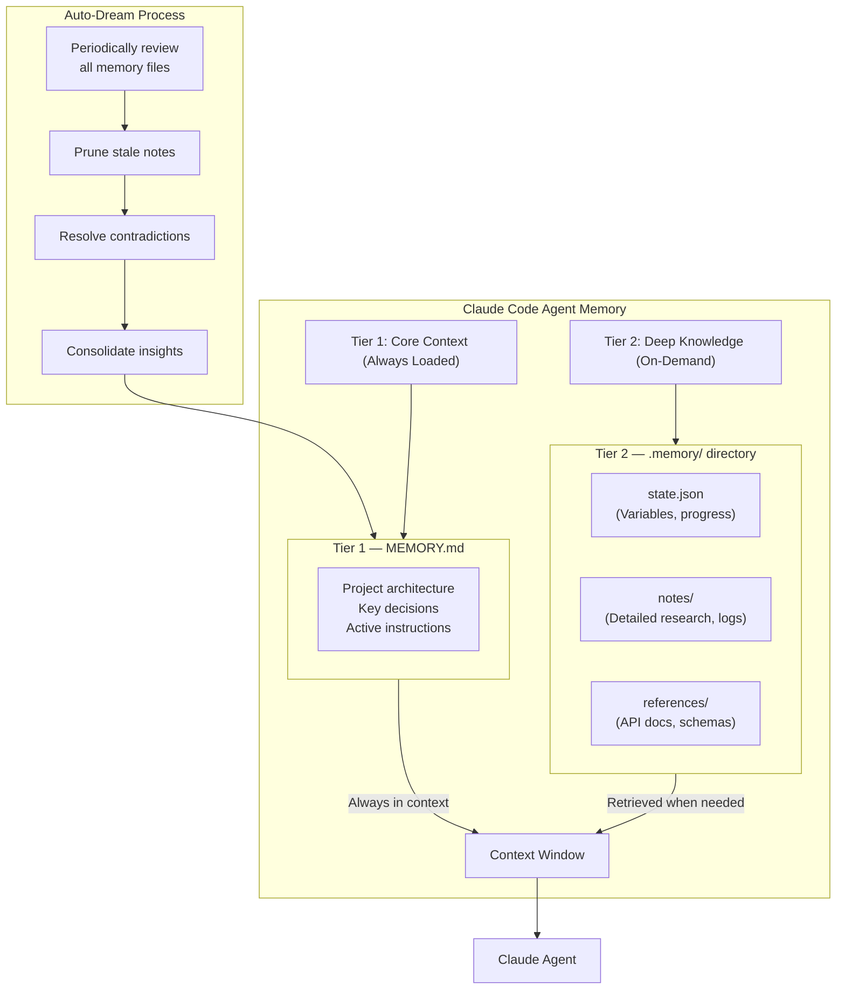
```mermaid
flowchart TB
    subgraph CODE_AGENT["Claude Code Agent Memory"]
        direction TB
        T1["Tier 1: Core Context (Always Loaded)"]
        T2["Tier 2: Deep Knowledge (On-Demand)"]

        subgraph TIER1["Tier 1 — MEMORY.md"]
            IDX["Project architecture<br/>Key decisions<br/>Active instructions"]
        end

        subgraph TIER2["Tier 2 — .memory/ directory"]
            STATE["state.json<br/>(Variables, progress)"]
            NOTES["notes/<br/>(Detailed research, logs)"]
            REFS["references/<br/>(API docs, schemas)"]
        end

        T1 --> TIER1
        T2 --> TIER2

        TIER1 -->|"Always in context"| CONTEXT["Context Window"]
        TIER2 -->|"Retrieved when needed"| CONTEXT
    end

    subgraph AUTO_DREAM["Auto-Dream Process"]
        REVIEW["Periodically review<br/>all memory files"] --> PRUNE_STALE["Prune stale notes"]
        PRUNE_STALE --> RESOLVE["Resolve contradictions"]
        RESOLVE --> CONSOLIDATE["Consolidate insights"]
        CONSOLIDATE --> TIER1
    end

    CONTEXT --> CLAUDE_CODE["Claude Agent"]
```

#### Key Differences: Claude.ai vs Claude Code

| Aspect | Claude.ai (Consumer) | Claude Code (Developer) |
|--------|---------------------|------------------------|
| **Storage** | Server-side database | Local project files (MEMORY.md, .memory/) |
| **Update Frequency** | ~24-hour synthesis cycle | After every significant task |
| **Retrieval** | Automatic injection + on-demand chat search | Always-loaded index + on-demand file reads |
| **User Control** | View, edit, delete in settings | Full file system access |
| **Memory Type** | Semantic (facts, preferences) | Semantic + Episodic (decisions, progress) |

---

### 2.3 How Perplexity Handles Personalization

Perplexity treats memory as a **retrieval-augmented personalization layer** that works across different underlying LLM models.

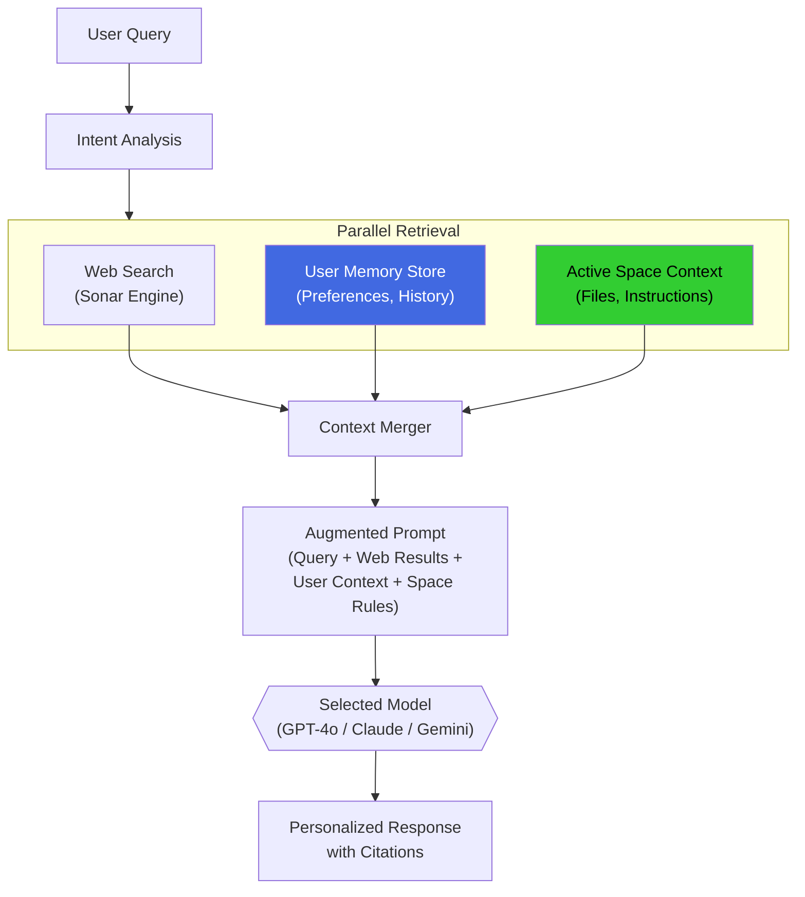
```mermaid
flowchart TB
    USER_QUERY["User Query"] --> INTENT["Intent Analysis"]

    INTENT --> PAR_SEARCH

    subgraph PAR_SEARCH["Parallel Retrieval"]
        WEB["Web Search<br/>(Sonar Engine)"]
        USER_MEM["User Memory Store<br/>(Preferences, History)"]
        SPACE["Active Space Context<br/>(Files, Instructions)"]
    end

    WEB --> MERGE["Context Merger"]
    USER_MEM --> MERGE
    SPACE --> MERGE

    MERGE --> PROMPT["Augmented Prompt<br/>(Query + Web Results +<br/>User Context + Space Rules)"]
    PROMPT --> LLM_SELECT{{"Selected Model<br/>(GPT-4o / Claude / Gemini)"}}
    LLM_SELECT --> RESPONSE["Personalized Response<br/>with Citations"]

    style USER_MEM fill:#4169e1,color:#fff
    style SPACE fill:#32cd32,color:#000
```

#### Perplexity's Key Innovation: Cross-Model Memory

| Feature | Detail |
|---------|--------|
| **Model-Agnostic Memory** | User profile persists regardless of which LLM (GPT-4o, Claude, Gemini) powers the current session |
| **Spaces** | Isolated workspaces with custom instructions, uploaded files, and scoped memory — prevents cross-contamination |
| **Implicit Learning** | System monitors interaction patterns to build dynamic preferences without explicit "remember" commands |
| **Explicit Preferences** | "About Me" section where users define role, expertise, and preferences |
| **Sensitivity Filtering** | Automated detection and exclusion of sensitive data from memory storage |

---

### 2.4 Agent Framework Memory Strategies

Modern frameworks implement memory as a dedicated layer that plugs into any agent orchestration system.

#### Framework Comparison


```mermaid
flowchart TB
    subgraph MEM0["Mem0 (Framework-Agnostic)"]
        M0_IN["Conversation Input"] --> M0_EXTRACT["Auto-Extract Facts"]
        M0_EXTRACT --> M0_STORE["Hybrid Store<br/>(Vectors + Knowledge Graph)"]
        M0_STORE --> M0_SEARCH["Semantic Search + Graph Query"]
    end

    subgraph MEMGPT["MemGPT / Letta (OS-Inspired)"]
        MG_IN["Agent Context"] --> MG_RAM["RAM (Context Window)<br/>(Active working set)"]
        MG_RAM <-->|"Swap in/out"| MG_DISK["Disk (External DB)<br/>(Full conversation history)"]
    end

    subgraph LANGGRAPH["LangGraph / LangMem (Framework-Coupled)"]
        LG_IN["Agent Node"] --> LG_HOT["Hot Path (In-Loop)<br/>(Tool call during execution)"]
        LG_IN --> LG_BG["Background Handler<br/>(Post-execution memory update)"]
        LG_HOT --> LG_STORE[("LangGraph State Store")]
        LG_BG --> LG_STORE
    end

    subgraph ZEP["Zep / Graphiti (Temporal KG)"]
        Z_IN["Conversation Events"] --> Z_ENTITY["Entity Extraction"]
        Z_ENTITY --> Z_GRAPH["Temporal Knowledge Graph<br/>(Tracks fact changes over time)"]
        Z_GRAPH --> Z_QUERY["Time-Aware Queries<br/>'What did user prefer LAST WEEK?'"]
    end
```

| Framework | Architecture Style | Key Strength | Best For |
|-----------|-------------------|-------------|---------|
| **Mem0** | Plug-and-play hybrid (Vectors + KG) | Auto-extraction, framework-agnostic | Adding memory to any existing agent |
| **MemGPT (Letta)** | OS-inspired tiered (RAM/Disk) | Handles document-heavy tasks beyond context limits | Long-horizon tasks, document processing |
| **LangGraph (LangMem)** | Framework-coupled, stateful | Deep integration with LangChain ecosystem | Complex multi-step agent workflows |
| **Zep / Graphiti** | Temporal knowledge graph | Tracks how facts change over time | CRM, research assistants, entity-heavy domains |

---

## 3. End-to-End System Design

### 3.1 Complete Memory Lifecycle

Every memory system follows the same fundamental lifecycle: **Create → Store → Retrieve → Update → Consolidate → Forget**.

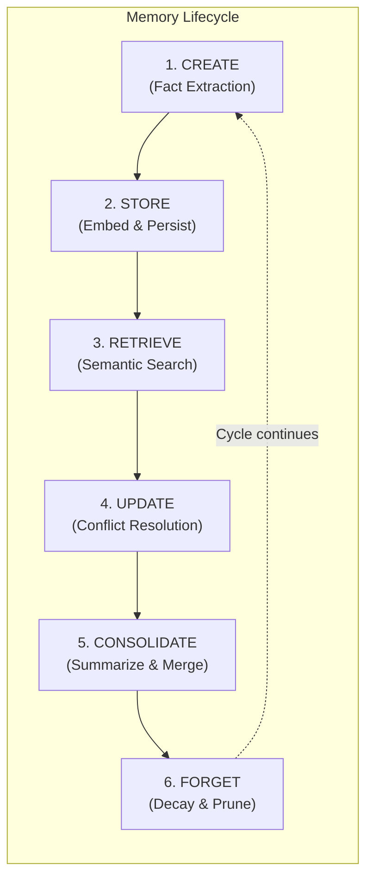
```mermaid
flowchart TB
    subgraph LIFECYCLE["Memory Lifecycle"]
        direction TB
        CREATE["1. CREATE<br/>(Fact Extraction)"]
        STORE["2. STORE<br/>(Embed & Persist)"]
        RETRIEVE["3. RETRIEVE<br/>(Semantic Search)"]
        UPDATE["4. UPDATE<br/>(Conflict Resolution)"]
        CONSOLIDATE["5. CONSOLIDATE<br/>(Summarize & Merge)"]
        FORGET["6. FORGET<br/>(Decay & Prune)"]

        CREATE --> STORE
        STORE --> RETRIEVE
        RETRIEVE --> UPDATE
        UPDATE --> CONSOLIDATE
        CONSOLIDATE --> FORGET
        FORGET -.->|"Cycle continues"| CREATE
    end
```

#### Phase 1: CREATE — Fact Extraction

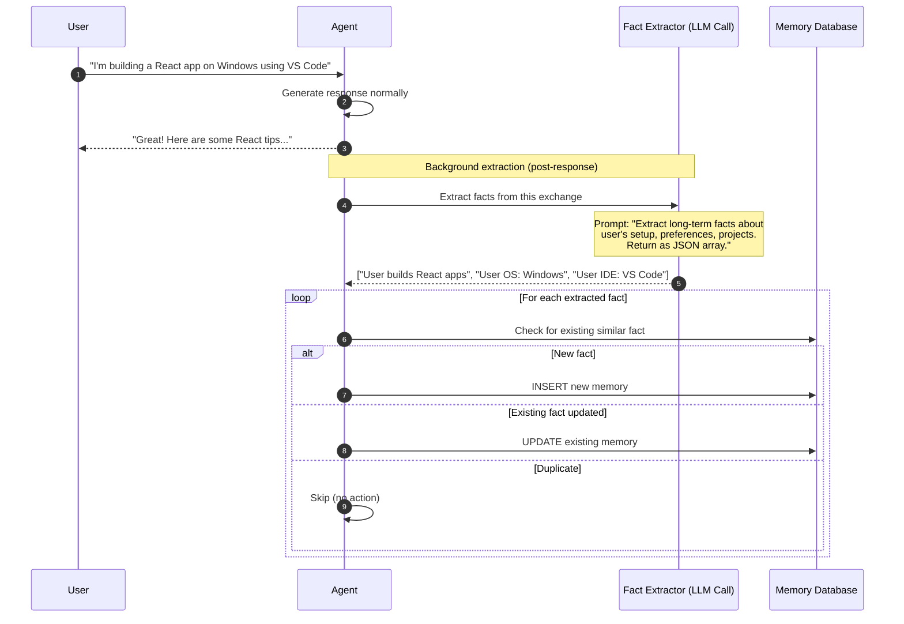
```mermaid
sequenceDiagram
    autonumber
    participant User
    participant Agent
    participant Extractor as Fact Extractor (LLM Call)
    participant MemDB as Memory Database

    User->>Agent: "I'm building a React app on Windows using VS Code"
    Agent->>Agent: Generate response normally
    Agent-->>User: "Great! Here are some React tips..."

    Note over Agent,Extractor: Background extraction (post-response)
    Agent->>Extractor: Extract facts from this exchange
    Note over Extractor: Prompt: "Extract long-term facts about<br/>user's setup, preferences, projects.<br/>Return as JSON array."
    Extractor-->>Agent: ["User builds React apps", "User OS: Windows", "User IDE: VS Code"]

    loop For each extracted fact
        Agent->>MemDB: Check for existing similar fact
        alt New fact
            Agent->>MemDB: INSERT new memory
        else Existing fact updated
            Agent->>MemDB: UPDATE existing memory
        else Duplicate
            Agent->>Agent: Skip (no action)
        end
    end
```

**Extraction Prompt Template**:
```
You are a memory extraction engine. Analyze this conversation exchange and
extract any long-term facts about the user.

Categories to look for:
- User preferences (language, framework, tools, style)
- User profile (role, company, experience level)
- Project details (tech stack, architecture, goals)
- Environment (OS, IDE, deployment targets)

Rules:
- Return ONLY a JSON array of fact strings
- Each fact should be self-contained and concise
- If no new facts are found, return an empty array []
- Do NOT extract ephemeral information (greetings, temporary questions)

User said: "{user_input}"
Agent replied: "{agent_response}"
```

#### Phase 2: STORE — Embed & Persist

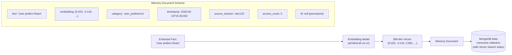
```mermaid
flowchart LR
    FACT["Extracted Fact:<br/>'User prefers React'"] --> EMBED["Embedding Model<br/>(all-MiniLM-L6-v2)"]
    EMBED --> VECTOR["384-dim Vector:<br/>[0.023, -0.142, 0.891, ...]"]
    VECTOR --> DOC["Memory Document"]

    subgraph DOC_CONTENT["Memory Document Schema"]
        F["fact: 'User prefers React'"]
        E["embedding: [0.023, -0.142, ...]"]
        C["category: 'user_preference'"]
        T["timestamp: 2026-06-13T15:30:00Z"]
        S["source_session: 'abc123'"]
        A["access_count: 0"]
        TTL["ttl: null (permanent)"]
    end

    DOC --> DB[("MongoDB Atlas<br/>memories collection<br/>(with Vector Search Index)")]
```

#### Phase 3: RETRIEVE — Semantic Search

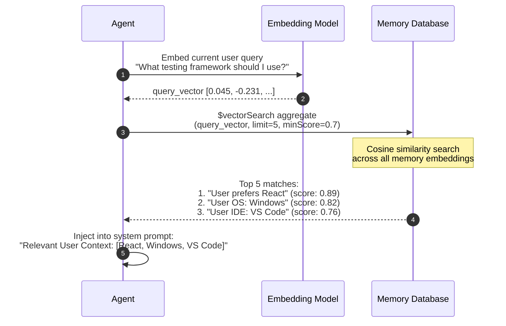
```mermaid
sequenceDiagram
    autonumber
    participant Agent
    participant Embedder as Embedding Model
    participant VectorDB as Memory Database

    Agent->>Embedder: Embed current user query<br/>"What testing framework should I use?"
    Embedder-->>Agent: query_vector [0.045, -0.231, ...]

    Agent->>VectorDB: $vectorSearch aggregate<br/>(query_vector, limit=5, minScore=0.7)

    Note over VectorDB: Cosine similarity search<br/>across all memory embeddings

    VectorDB-->>Agent: Top 5 matches:<br/>1. "User prefers React" (score: 0.89)<br/>2. "User OS: Windows" (score: 0.82)<br/>3. "User IDE: VS Code" (score: 0.76)

    Agent->>Agent: Inject into system prompt:<br/>"Relevant User Context: [React, Windows, VS Code]"
```

#### Phase 4: UPDATE — Conflict Resolution

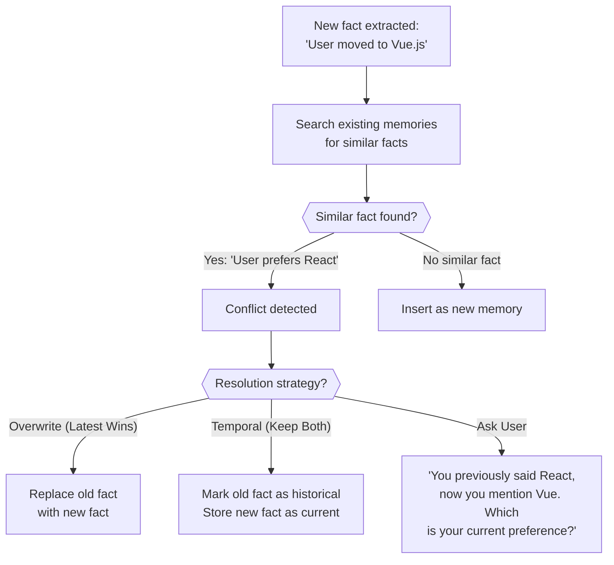
```mermaid
flowchart TB
    NEW_FACT["New fact extracted:<br/>'User moved to Vue.js'"]
    NEW_FACT --> SEARCH["Search existing memories<br/>for similar facts"]
    SEARCH --> FOUND{{"Similar fact found?"}}

    FOUND -->|"Yes: 'User prefers React'"| CONFLICT["Conflict detected"]
    CONFLICT --> STRATEGY{{"Resolution strategy?"}}

    STRATEGY -->|"Overwrite (Latest Wins)"| OVERWRITE["Replace old fact<br/>with new fact"]
    STRATEGY -->|"Temporal (Keep Both)"| TEMPORAL["Mark old fact as historical<br/>Store new fact as current"]
    STRATEGY -->|"Ask User"| ASK["'You previously said React,<br/>now you mention Vue. Which<br/>is your current preference?'"]

    FOUND -->|"No similar fact"| INSERT["Insert as new memory"]
```

#### Phase 5: CONSOLIDATE — Summarize & Merge

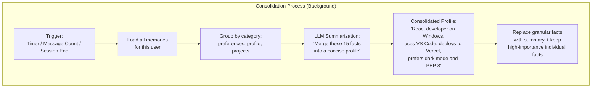
```mermaid
flowchart TB
    subgraph CONSOLIDATION["Consolidation Process (Background)"]
        TRIGGER["Trigger:<br/>Timer / Message Count / Session End"]
        TRIGGER --> LOAD["Load all memories<br/>for this user"]
        LOAD --> GROUP["Group by category:<br/>preferences, profile, projects"]
        GROUP --> SUMMARIZE["LLM Summarization:<br/>'Merge these 15 facts<br/>into a concise profile'"]
        SUMMARIZE --> PROFILE["Consolidated Profile:<br/>'React developer on Windows,<br/>uses VS Code, deploys to Vercel,<br/>prefers dark mode and PEP 8'"]
        PROFILE --> REPLACE["Replace granular facts<br/>with summary + keep<br/>high-importance individual facts"]
    end
```

#### Phase 6: FORGET — Decay & Prune

| Strategy | Implementation | When to Use |
|----------|---------------|-------------|
| **Time-Based Decay (TTL)** | Delete memories not accessed in 90 days | Low-value ephemeral facts |
| **Access-Count Decay** | Memories with `access_count = 0` after 30 days are deleted | Facts never found relevant |
| **Confidence Threshold** | Memories with low extraction confidence are pruned first | Reduce noise from uncertain extractions |
| **Explicit Deletion** | User says "forget that I use React" → delete matching fact | User-controlled privacy |
| **Contradiction Pruning** | When a newer fact contradicts an older one, delete the older | Keep memory current |

---

### 3.2 Context Management & Token Optimization

The most critical engineering challenge: **fitting the right information into a finite context window**.

#### Token Budget Allocation

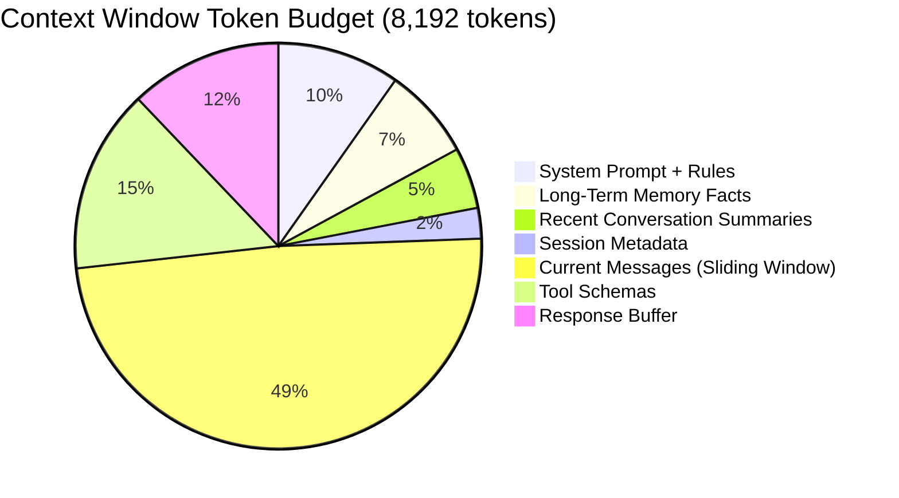
```mermaid
pie title Context Window Token Budget (8,192 tokens)
    "System Prompt + Rules" : 800
    "Long-Term Memory Facts" : 600
    "Recent Conversation Summaries" : 400
    "Session Metadata" : 200
    "Current Messages (Sliding Window)" : 4000
    "Tool Schemas" : 1200
    "Response Buffer" : 992
```

#### Optimization Strategies

| Strategy | Description | Token Savings |
|----------|-------------|---------------|
| **Sliding Window** | Keep only last N messages in context | Prevents linear growth |
| **Summarization** | Replace old messages with compressed summaries | 10:1 compression ratio |
| **Selective Retrieval** | Only inject memories relevant to current query | Avoids loading entire profile |
| **Tiered Loading** | Always-load core facts + on-demand deep retrieval | Reduces baseline overhead |
| **Schema Compression** | Minimize tool schema verbosity | ~30% reduction |
| **Message Pruning** | Remove tool call/result messages from history display | Reduces noise significantly |

---

## 4. Technical Implementation Details

### 4.1 Databases for Memory Storage

| Database Type | Technology Options | Best For | Limitation |
|--------------|-------------------|---------|-----------|
| **Vector Database** | Pinecone, Qdrant, Weaviate, Milvus, MongoDB Atlas Vector Search | Semantic similarity search | Poor at exact match or relational queries |
| **Document Store** | MongoDB, DynamoDB, Firestore | Flexible schemas, session/message storage | No native vector search (unless Atlas) |
| **Graph Database** | Neo4j, FalkorDB, Amazon Neptune | Entity relationships, multi-hop reasoning | Complex to set up and query |
| **Key-Value Store** | Redis, Memcached | Ultra-fast session state, caching | No persistence guarantees (by default) |
| **Relational** | PostgreSQL (pgvector), SQLite | Structured queries + vector search combo | Less scalable for pure vector workloads |

#### Our Project Decision: MongoDB Atlas Vector Search

For our AI Agent, **MongoDB Atlas** is the optimal choice because:
1. We already use MongoDB for sessions and messages
2. Atlas provides **native Vector Search** — no additional database required
3. Single database for all memory types (documents + vectors)
4. Free tier supports vector indexes on shared clusters

### 4.2 Vector Databases & Embeddings

#### How Vector Search Works

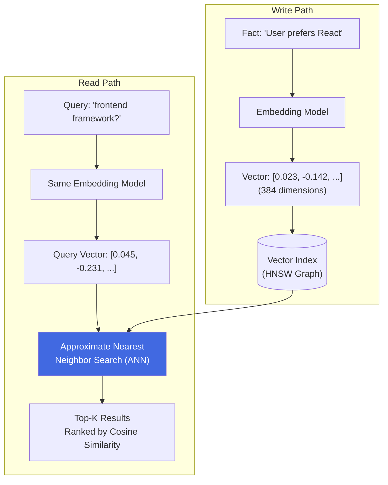
```mermaid
flowchart TB
    subgraph WRITE["Write Path"]
        FACT_IN["Fact: 'User prefers React'"] --> MODEL_W["Embedding Model"]
        MODEL_W --> VEC_W["Vector: [0.023, -0.142, ...]<br/>(384 dimensions)"]
        VEC_W --> STORE_W[("Vector Index<br/>(HNSW Graph)")]
    end

    subgraph READ["Read Path"]
        QUERY_IN["Query: 'frontend framework?'"] --> MODEL_R["Same Embedding Model"]
        MODEL_R --> VEC_R["Query Vector: [0.045, -0.231, ...]"]
        VEC_R --> SEARCH["Approximate Nearest<br/>Neighbor Search (ANN)"]
        STORE_W --> SEARCH
        SEARCH --> RESULTS["Top-K Results<br/>Ranked by Cosine Similarity"]
    end

    style SEARCH fill:#4169e1,color:#fff
```

#### Embedding Model Options

| Model | Dimensions | Speed | Quality | Cost |
|-------|-----------|-------|---------|------|
| `all-MiniLM-L6-v2` | 384 | Very Fast | Good | Free (HF API) |
| `text-embedding-3-small` (OpenAI) | 1536 | Fast | Very Good | $0.02/1M tokens |
| `text-embedding-3-large` (OpenAI) | 3072 | Moderate | Excellent | $0.13/1M tokens |
| `nomic-embed-text` | 768 | Fast | Very Good | Free (local) |
| `bge-large-en-v1.5` | 1024 | Moderate | Very Good | Free (local) |

**Our Choice**: `all-MiniLM-L6-v2` via Hugging Face Inference API — 384 dimensions, free, excellent for semantic search, small enough for efficient Atlas indexing.

#### MongoDB Atlas Vector Search Index

```json
{
  "fields": [
    {
      "numDimensions": 384,
      "path": "embedding",
      "similarity": "cosine",
      "type": "vector"
    },
    {
      "path": "user_id",
      "type": "filter"
    },
    {
      "path": "category",
      "type": "filter"
    }
  ]
}
```

#### Vector Search Aggregation Pipeline

```javascript
// MongoDB Atlas $vectorSearch aggregation
db.memories.aggregate([
  {
    $vectorSearch: {
      index: "memory_vector_index",
      path: "embedding",
      queryVector: [0.045, -0.231, ...],  // Query embedding
      numCandidates: 100,                  // ANN search breadth
      limit: 5,                            // Top-K results
      filter: {
        user_id: "user_abc123"             // Scoped to this user
      }
    }
  },
  {
    $project: {
      fact: 1,
      category: 1,
      timestamp: 1,
      score: { $meta: "vectorSearchScore" }
    }
  }
])
```

### 4.3 Knowledge Graphs

Knowledge graphs store **entities and their relationships**, enabling multi-hop reasoning that pure vector search cannot achieve.

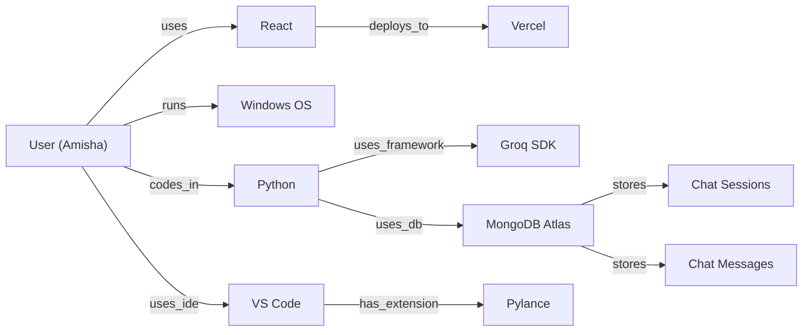
```mermaid
graph LR
    USER["User (Amisha)"] -->|"uses"| REACT["React"]
    USER -->|"runs"| WINDOWS["Windows OS"]
    USER -->|"codes_in"| PYTHON["Python"]
    USER -->|"uses_ide"| VSCODE["VS Code"]
    REACT -->|"deploys_to"| VERCEL["Vercel"]
    PYTHON -->|"uses_framework"| GROQ_SDK["Groq SDK"]
    PYTHON -->|"uses_db"| MONGODB["MongoDB Atlas"]
    MONGODB -->|"stores"| SESSIONS["Chat Sessions"]
    MONGODB -->|"stores"| MESSAGES["Chat Messages"]
    VSCODE -->|"has_extension"| PYLANCE["Pylance"]
```

#### When to Use Knowledge Graphs vs Vector Search

| Scenario | Best Choice | Why |
|----------|------------|-----|
| "What are user's preferences?" | **Vector Search** | Broad semantic similarity query |
| "Which services depend on MongoDB?" | **Knowledge Graph** | Requires relational traversal |
| "What did we discuss last week?" | **Vector Search** | Temporal similarity |
| "If user changes from React to Vue, what else is affected?" | **Knowledge Graph** | Multi-hop impact analysis |
| "Find facts similar to current question" | **Vector Search** | Approximate nearest neighbors |

### 4.4 Hybrid Memory Architectures

Production systems rarely use a single storage mechanism. The dominant pattern combines multiple stores:

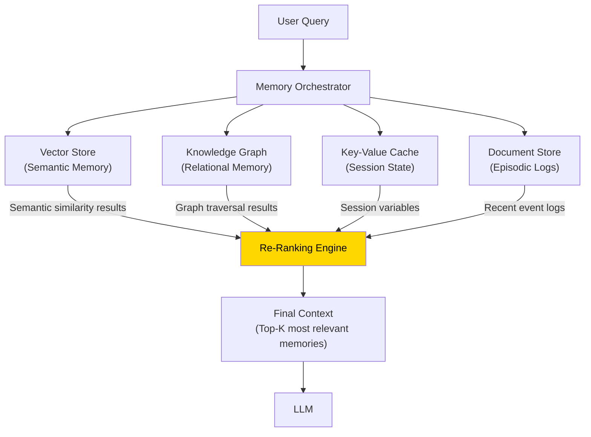
```mermaid
flowchart TB
    QUERY["User Query"] --> ORCHESTRATOR["Memory Orchestrator"]

    ORCHESTRATOR --> VS["Vector Store<br/>(Semantic Memory)"]
    ORCHESTRATOR --> KG["Knowledge Graph<br/>(Relational Memory)"]
    ORCHESTRATOR --> KV["Key-Value Cache<br/>(Session State)"]
    ORCHESTRATOR --> DOC["Document Store<br/>(Episodic Logs)"]

    VS -->|"Semantic similarity results"| RANKER["Re-Ranking Engine"]
    KG -->|"Graph traversal results"| RANKER
    KV -->|"Session variables"| RANKER
    DOC -->|"Recent event logs"| RANKER

    RANKER --> FINAL["Final Context<br/>(Top-K most relevant memories)"]
    FINAL --> LLM["LLM"]

    style RANKER fill:#ffd700,color:#000
```

#### Hybrid Architecture Schema

```json
{
  "_comment": "Single memory document in MongoDB supporting hybrid access",
  "_id": "ObjectId(...)",
  "user_id": "user_abc123",
  "fact": "User prefers React for frontend development",
  "embedding": [0.023, -0.142, 0.891, ...],
  "category": "user_preference",
  "entities": ["User", "React", "frontend"],
  "relationships": [
    {"from": "User", "relation": "prefers", "to": "React"},
    {"from": "React", "relation": "is_a", "to": "Frontend Framework"}
  ],
  "source_session_id": "ObjectId(...)",
  "created_at": "2026-06-07T18:30:00Z",
  "last_accessed": "2026-06-13T15:00:00Z",
  "access_count": 7,
  "confidence": 0.95,
  "is_current": true
}
```

### 4.5 RAG Integration

RAG (Retrieval-Augmented Generation) is the bridge between stored memories and the LLM's context window.

```mermaid
flowchart TB
    subgraph RAG_PIPELINE["RAG Pipeline for Memory"]
        QUERY["User Query"] --> EMBED_Q["Embed Query"]
        EMBED_Q --> SEARCH_MEM["Search Memory Store<br/>(Vector + Filter)"]
        SEARCH_MEM --> RANK["Re-Rank Results<br/>(Relevance + Recency + Frequency)"]
        RANK --> FORMAT["Format as Context:<br/>'User Context: [fact1, fact2, ...]'"]
        FORMAT --> INJECT["Inject into System Prompt"]

        QUERY --> SEARCH_WEB["Search Web<br/>(If real-time needed)"]
        SEARCH_WEB --> FORMAT_WEB["Format Web Results"]
        FORMAT_WEB --> INJECT

        INJECT --> PROMPT["Full Augmented Prompt"]
        PROMPT --> LLM["LLM Generate"]
        LLM --> RESPONSE["Response"]

        RESPONSE --> EXTRACT["Background: Extract New Facts"]
        EXTRACT --> STORE_NEW["Store in Memory"]
    end
```

---

## 5. Workflow Diagrams

### 5.1 Full System Architecture

Complete architecture of a production memory-enabled AI agent:

```mermaid
flowchart TB
    USER(["User"]) --> CLI["CLI / API Interface"]

    CLI --> AGENT["Agent Orchestrator"]

    subgraph MEMORY_LAYER["Memory Layer"]
        STM["Short-Term Memory<br/>(Sliding Context Window)"]
        LTM_SEM["Semantic Memory<br/>(Vector DB — Facts)"]
        LTM_EPI["Episodic Memory<br/>(Conversation Logs)"]
        LTM_KG["Knowledge Graph<br/>(Entity Relations)"]
    end

    subgraph EXTRACTION["Background Processes"]
        FACT_EXT["Fact Extractor<br/>(LLM-powered)"]
        EMBED_ENG["Embedding Engine"]
        CONSOLIDATOR["Memory Consolidator<br/>(Dreaming)"]
        DECAY["Decay Manager<br/>(TTL, Pruning)"]
    end

    subgraph TOOLS_LAYER["Tool Framework"]
        SEARCH_T["Web Search"]
        CALC_T["Calculator"]
        FILE_T["File I/O"]
        TIME_T["World Clock"]
    end

    AGENT --> STM
    AGENT --> LTM_SEM
    AGENT --> LTM_EPI
    AGENT --> TOOLS_LAYER
    AGENT --> LLM_PROVIDER["LLM Provider<br/>(Groq / OpenAI)"]

    LLM_PROVIDER --> RESPONSE_OUT["Response"]
    RESPONSE_OUT --> USER

    RESPONSE_OUT -->|"Post-response"| FACT_EXT
    FACT_EXT --> EMBED_ENG
    EMBED_ENG --> LTM_SEM
    FACT_EXT --> LTM_KG

    CONSOLIDATOR -->|"Periodic"| LTM_SEM
    DECAY -->|"Periodic"| LTM_SEM

    STM --> DB[("MongoDB Atlas")]
    LTM_SEM --> DB
    LTM_EPI --> DB

    style MEMORY_LAYER fill:#1a1a2e,color:#fff
    style EXTRACTION fill:#16213e,color:#fff
```

### 5.2 Memory Retrieval & Ranking Pipeline

```mermaid
flowchart TB
    QUERY["User Query:<br/>'How should I test my components?'"]

    QUERY --> EMBED["Step 1: Embed Query<br/>→ query_vector"]

    EMBED --> SEARCH["Step 2: Vector Search<br/>$vectorSearch(query_vector, limit=20)"]

    SEARCH --> CANDIDATES["20 Candidate Memories"]

    CANDIDATES --> SCORE["Step 3: Multi-Signal Scoring"]

    subgraph SCORING["Scoring Signals (weighted)"]
        SEM_SCORE["Semantic Similarity<br/>(cosine score × 0.5)"]
        RECENCY["Recency Score<br/>(1 / days_since_last_access × 0.25)"]
        FREQUENCY["Frequency Score<br/>(access_count / max_count × 0.15)"]
        CATEGORY["Category Boost<br/>(+0.1 if category matches query intent)"]
    end

    SCORE --> SEM_SCORE
    SCORE --> RECENCY
    SCORE --> FREQUENCY
    SCORE --> CATEGORY

    SEM_SCORE --> COMBINED["Step 4: Combined Score =<br/>Σ(signal × weight)"]
    RECENCY --> COMBINED
    FREQUENCY --> COMBINED
    CATEGORY --> COMBINED

    COMBINED --> TOP_K["Step 5: Select Top-5"]

    TOP_K --> DEDUP["Step 6: De-duplicate<br/>(Remove near-identical facts)"]

    DEDUP --> FORMAT["Step 7: Format for Injection<br/>'Relevant User Context:<br/>- User prefers React (0.92)<br/>- User OS: Windows (0.85)<br/>- User IDE: VS Code (0.78)'"]

    FORMAT --> SYSTEM_PROMPT["Inject into System Prompt"]
```

### 5.3 Memory Write (Extraction & Storage)

```mermaid
flowchart TB
    CONV["Conversation Turn Complete<br/>(User message + Agent response)"]

    CONV --> SHOULD_EXTRACT{{"Worth extracting?<br/>(Skip greetings, short<br/>responses, tool-only turns)"}}

    SHOULD_EXTRACT -->|"No"| SKIP["Skip extraction"]
    SHOULD_EXTRACT -->|"Yes"| EXTRACT["Send to Extraction LLM:<br/>'Extract long-term facts<br/>from this exchange'"]

    EXTRACT --> PARSE["Parse JSON array<br/>of fact strings"]

    PARSE --> LOOP

    subgraph LOOP["For Each Extracted Fact"]
        EMBED_FACT["Embed fact → vector"] --> DEDUP_CHECK["Check existing memories<br/>for similarity > 0.9"]
        DEDUP_CHECK --> DUP_FOUND{{"Duplicate found?"}}

        DUP_FOUND -->|"Yes, same content"| BUMP["Bump access_count<br/>Update last_accessed"]
        DUP_FOUND -->|"Yes, but updated content"| UPDATE_FACT["Update fact text<br/>Re-embed vector<br/>Set is_current=true<br/>Mark old as historical"]
        DUP_FOUND -->|"No match"| INSERT["Insert new memory document<br/>(fact + embedding + metadata)"]
    end

    BUMP --> DONE["Extraction Complete"]
    UPDATE_FACT --> DONE
    INSERT --> DONE

    style EXTRACT fill:#ffd700,color:#000
```

### 5.4 Memory Consolidation (Dreaming)

```mermaid
flowchart TB
    TRIGGER["Trigger: Scheduled Job<br/>(Every 24 hours or every 50 messages)"]

    TRIGGER --> LOAD["Load all memories for user<br/>(sorted by category)"]

    LOAD --> ANALYZE["Analyze memory health"]

    subgraph HEALTH_CHECKS["Memory Health Analysis"]
        STALE["Find stale memories<br/>(not accessed in 60+ days)"]
        CONFLICTS["Find contradicting facts<br/>(e.g., 'Uses React' vs 'Uses Vue')"]
        DUPLICATES["Find near-duplicates<br/>(similarity > 0.95)"]
        BLOAT["Count total memories<br/>(flag if > 500)"]
    end

    ANALYZE --> STALE
    ANALYZE --> CONFLICTS
    ANALYZE --> DUPLICATES
    ANALYZE --> BLOAT

    STALE --> ACTIONS
    CONFLICTS --> ACTIONS
    DUPLICATES --> ACTIONS
    BLOAT --> ACTIONS

    subgraph ACTIONS["Consolidation Actions"]
        DELETE_STALE["Delete memories with<br/>access_count=0 and age > 60d"]
        RESOLVE_CONFLICT["Keep newest fact,<br/>archive older version"]
        MERGE_DUPES["Merge duplicate facts<br/>into single comprehensive entry"]
        SUMMARIZE["If > 500 memories:<br/>LLM summarizes groups into<br/>condensed profile statements"]
    end

    ACTIONS --> UPDATED_DB[("Updated Memory Store<br/>(Cleaner, smaller, more current)")]

    style TRIGGER fill:#4169e1,color:#fff
    style ACTIONS fill:#32cd32,color:#000
```

### 5.5 Multi-Agent Memory Sharing

```mermaid
flowchart TB
    subgraph SHARED["Shared Memory Layer"]
        GLOBAL_MEM[("Global Memory<br/>(User Profile, Preferences)")]
        PROJECT_MEM[("Project Memory<br/>(Tech Stack, Architecture)")]
    end

    subgraph PRIVATE["Agent-Private Memory"]
        CODER_MEM[("Coder Agent Memory<br/>(Code patterns, errors)")]
        SEARCH_MEM[("Search Agent Memory<br/>(Search history, sources)")]
        ANALYST_MEM[("Analyst Agent Memory<br/>(Analysis results, insights)")]
    end

    ORCHESTRATOR["Orchestrator Agent"]

    ORCHESTRATOR -->|"Routes task"| CODER["Coder Agent"]
    ORCHESTRATOR -->|"Routes task"| SEARCHER["Search Agent"]
    ORCHESTRATOR -->|"Routes task"| ANALYST["Analyst Agent"]

    CODER --> GLOBAL_MEM
    CODER --> PROJECT_MEM
    CODER --> CODER_MEM

    SEARCHER --> GLOBAL_MEM
    SEARCHER --> SEARCH_MEM

    ANALYST --> GLOBAL_MEM
    ANALYST --> PROJECT_MEM
    ANALYST --> ANALYST_MEM

    CODER -->|"Writes finding"| PROJECT_MEM
    ANALYST -->|"Writes insight"| GLOBAL_MEM

    style SHARED fill:#1a5276,color:#fff
    style PRIVATE fill:#2d2d2d,color:#fff
```

#### Memory Scoping Rules

| Memory Scope | Visible To | Examples |
|-------------|-----------|---------|
| **Global (User)** | All agents for this user | Preferences, profile, communication style |
| **Project** | All agents within a project | Tech stack, architecture decisions, repo structure |
| **Agent-Private** | Only the owning agent | Agent-specific patterns, error history, search cache |
| **Session** | Current session only | Working context, active variables |

---

## 6. Scalability & Production Considerations

### 6.1 Memory Indexing Strategies

| Strategy | Implementation | Use Case |
|----------|---------------|----------|
| **HNSW (Hierarchical Navigable Small World)** | Default in most vector DBs (Pinecone, Qdrant, Atlas) | Fast approximate nearest neighbor search |
| **IVF (Inverted File Index)** | Partition vectors into clusters, search only relevant clusters | Large-scale datasets (>10M vectors) |
| **Compound Index** | Combine vector index with filter fields (user_id, category) | Multi-tenant applications |
| **TTL Index** | MongoDB TTL index on `expires_at` field | Automatic deletion of temporary memories |

### 6.2 Latency Optimization

```mermaid
flowchart LR
    subgraph OPTIMIZATIONS["Latency Optimization Stack"]
        L1["1. Cache hot memories<br/>(Redis, 1-5ms)"]
        L2["2. Pre-compute user profile<br/>(Avoid search on every turn)"]
        L3["3. Async extraction<br/>(Don't block response)"]
        L4["4. Batch embedding calls<br/>(Reduce API round-trips)"]
        L5["5. Limit search scope<br/>(Filter by user_id first)"]
    end

    L1 --> L2 --> L3 --> L4 --> L5
```

| Optimization | Latency Impact | Implementation |
|-------------|---------------|----------------|
| **Redis Cache for User Profile** | Eliminates DB query on every turn | Cache top-10 facts, invalidate on write |
| **Async Fact Extraction** | Zero added latency to user response | `asyncio.create_task()` post-response |
| **Pre-filtered Vector Search** | 10x faster than unfiltered | Add `user_id` to vector index filter |
| **Embedding Batching** | 3x fewer API calls | Batch multiple facts into single embed call |
| **Connection Pooling** | Eliminates connection overhead | Motor's built-in pool (our existing pattern) |

### 6.3 Cost Optimization

| Cost Center | Strategy | Savings |
|------------|---------|---------|
| **Embedding API calls** | Use free Hugging Face Inference API or local model | $0 vs $0.02/1M tokens |
| **LLM extraction calls** | Use small/fast model for extraction (llama3-8b) | 10x cheaper than large model |
| **Vector storage** | MongoDB Atlas free tier (512MB) supports ~500K memories | $0 for small-medium projects |
| **Token usage** | Selective retrieval (top-5 facts, not entire profile) | ~70% token reduction vs full history |
| **Extraction frequency** | Skip extraction for short/greeting messages | ~50% fewer extraction calls |

### 6.4 Privacy & Security

```mermaid
flowchart TB
    subgraph PRIVACY["Privacy & Security Architecture"]
        ENCRYPT["Data Encryption<br/>(At rest + in transit)"]
        ISOLATE["User Isolation<br/>(Every query scoped by user_id)"]
        CONSENT["User Consent<br/>(Opt-in memory, visible controls)"]
        DELETE["Right to Delete<br/>(Clear all memories on request)"]
        FILTER["Sensitivity Filter<br/>(Auto-detect PII, medical, financial)"]
        AUDIT["Audit Trail<br/>(Log all memory reads/writes)"]
    end
```

| Requirement | Implementation |
|------------|---------------|
| **Data Isolation** | Every memory document includes `user_id`; all queries filter by it |
| **Encryption at Rest** | MongoDB Atlas encrypts all data with AES-256 by default |
| **Encryption in Transit** | TLS 1.2+ for all Atlas connections |
| **User Control** | Provide `/forget` command to delete all or specific memories |
| **PII Detection** | Pre-filter extraction results to exclude passwords, credit cards, SSNs |
| **Retention Policy** | Define maximum memory age (e.g., 1 year TTL) |
| **Transparency** | Provide `/memories` command to show what the agent remembers |

### 6.5 User-Specific vs Global Memory

```mermaid
flowchart TB
    subgraph USER_SPECIFIC["User-Specific Memory"]
        U_PREF["Preferences<br/>(Dark mode, Python, VS Code)"]
        U_PROFILE["Profile<br/>(Role, company, experience)"]
        U_HISTORY["Interaction History<br/>(Past conversations)"]
    end

    subgraph GLOBAL["Global Memory (Shared)"]
        G_KNOWLEDGE["Domain Knowledge<br/>(API docs, best practices)"]
        G_PATTERNS["Common Patterns<br/>(Frequent user questions)"]
        G_TOOLS["Tool Definitions<br/>(Available capabilities)"]
    end

    subgraph CONTEXT_BUILD["Context Assembly"]
        USER_SPECIFIC --> MERGE["Merge & Rank"]
        GLOBAL --> MERGE
        MERGE --> FINAL_CONTEXT["Final Context Window"]
    end
```

---

## 7. Comparative Analysis

### 7.1 Feature Comparison Matrix

| Feature | ChatGPT | Claude | Perplexity | Mem0 | MemGPT |
|---------|---------|--------|-----------|------|--------|
| **Memory Type** | Structured fact notepad | Compressed synthesis | RAG + profile | Hybrid (Vector+KG) | Tiered (RAM/Disk) |
| **Storage Backend** | Proprietary DB | Server-side DB + Files | Vector DB | Pluggable (Qdrant, etc.) | Pluggable |
| **Auto-Extraction** | ✅ (Dreaming) | ✅ (Synthesis) | ✅ (Implicit) | ✅ | ❌ (Manual) |
| **User Control** | View, delete | View, edit, delete | View, delete | Full API | Full API |
| **Cross-Session** | ✅ | ✅ | ✅ | ✅ | ✅ |
| **Cross-Model** | ❌ (GPT only) | ❌ (Claude only) | ✅ (Any model) | ✅ | ❌ |
| **Memory Isolation** | Projects | N/A | Spaces | User scoping | N/A |
| **Conflict Resolution** | Auto (Dreaming) | Auto (Synthesis) | Unknown | Dedup engine | Manual |
| **Knowledge Graph** | ❌ | ❌ | ❌ | ✅ | ❌ |
| **Temporal Tracking** | Limited | ❌ | ❌ | ❌ | ❌ |
| **Open Source** | ❌ | ❌ | ❌ | ✅ | ✅ |
| **Max Memory Scale** | ~10K facts/user | Unknown | Unknown | Unlimited | Unlimited |

### 7.2 Architecture Trade-Offs

```mermaid
quadrantChart
    title Memory Architecture Trade-Offs
    x-axis "Simple to Implement" --> "Complex to Implement"
    y-axis "Low Capability" --> "High Capability"
    quadrant-1 "Sweet Spot"
    quadrant-2 "Over-Engineered"
    quadrant-3 "Insufficient"
    quadrant-4 "Good Starting Point"
    "System Prompt Injection (ChatGPT v1)": [0.2, 0.3]
    "Vector Search (Our Phase 4)": [0.4, 0.6]
    "Hybrid Vector+KG (Mem0)": [0.6, 0.8]
    "Tiered RAM/Disk (MemGPT)": [0.7, 0.7]
    "Full Temporal KG (Graphiti)": [0.9, 0.95]
    "Compressed Synthesis (Claude)": [0.5, 0.5]
```

#### Detailed Trade-Off Analysis

| Approach | Complexity | Scalability | Accuracy | Latency | Best For |
|----------|-----------|-------------|----------|---------|---------|
| **Fact Notepad (ChatGPT v1)** | Very Low | Low (token-limited) | Medium | Zero (pre-loaded) | Simple personal assistants |
| **Vector Search Only** | Low | High | Good | 50-200ms | FAQ bots, knowledge bases |
| **Vector + Auto-Extraction** | Medium | High | Very Good | 100-300ms | **Our Phase 4 — best balance** |
| **Hybrid Vector + KG** | High | Very High | Excellent | 200-500ms | Enterprise agents, CRM systems |
| **Temporal KG (Graphiti)** | Very High | Very High | Exceptional | 300-800ms | Research assistants, compliance |
| **Full Cognitive Architecture** | Extreme | Extreme | Best | 500ms+ | AGI research, autonomous systems |

---

## 8. Implications for Our AI Agent Project

Based on this analysis, here is how the research maps to our Phase 4 implementation:

### Architecture Decision

We will implement a **Vector Search + Auto-Extraction** architecture — the same core pattern used by ChatGPT and Claude, but tailored for our MongoDB Atlas stack.

```mermaid
flowchart TB
    subgraph OUR_SYSTEM["Our AI Agent — Phase 4 Architecture"]
        USER_MSG["User Message"] --> AGENT["SimpleAgent"]

        AGENT --> STM["ShortTermMemory<br/>(Existing: Sliding Window)"]
        AGENT --> LTM["LongTermMemory<br/>(NEW: Vector Search)"]
        AGENT --> TOOLS["ToolRegistry<br/>(Existing: 8 Tools)"]
        AGENT --> LLM["GroqProvider<br/>(Existing: Groq Cloud)"]

        LTM --> EMBED["HF Embeddings<br/>(NEW: all-MiniLM-L6-v2)"]
        LTM --> ATLAS[("MongoDB Atlas<br/>memories collection<br/>+ Vector Search Index")]

        LLM --> RESPONSE["Response"]
        RESPONSE --> EXTRACT["Background Fact Extractor<br/>(NEW: Async LLM Call)"]
        EXTRACT --> EMBED
        EMBED --> ATLAS

        STM -->|"Injects memories<br/>into system prompt"| CONTEXT["Context Window"]
        LTM -->|"Retrieves relevant facts"| STM
    end

    style LTM fill:#ffd700,color:#000
    style EMBED fill:#32cd32,color:#000
    style EXTRACT fill:#4169e1,color:#fff
```

### What We're Building (Phase 4 Components)

| Component | File | Pattern Used | Inspired By |
|-----------|------|-------------|-------------|
| **MemoryModel** | `database/models.py` | Pydantic schema with embedding field | Standard vector DB pattern |
| **HF Embeddings Client** | `llm/embeddings.py` | Free API call to HuggingFace | Cost optimization (Mem0 approach) |
| **Long-Term Memory Manager** | `memory/long_term.py` | Vector search + auto-extraction | ChatGPT Dreaming + Claude Synthesis |
| **Fact Extraction** | `agent/simple_agent.py` | Background async LLM call | ChatGPT's Dreaming engine |
| **Context Injection** | `memory/short_term.py` | Prepend relevant facts to system prompt | ChatGPT's layered context assembly |
| **Atlas Vector Index** | MongoDB Atlas Dashboard | HNSW with cosine similarity | Standard production pattern |

### Why This Architecture

| Decision | Rationale |
|----------|-----------|
| **MongoDB Atlas Vector Search** (not Pinecone/Qdrant) | Already using Atlas — no additional infrastructure needed |
| **HuggingFace free API** (not OpenAI embeddings) | Zero cost, 384-dim vectors are sufficient for our scale |
| **Async background extraction** (not synchronous) | Zero added latency to user responses |
| **Cosine similarity** (not Euclidean) | Industry standard for text embeddings; direction-based, not magnitude |
| **384 dimensions** (not 1536/3072) | Smaller vectors = faster search + less storage on free tier |
| **Top-5 retrieval** (not full profile dump) | Keeps memory injection within token budget |

---

> **Document Version**: 1.0.0
> **Last Updated**: June 13, 2026
> **Purpose**: Research reference for Phase 4 implementation of AI Agent 
  **Author**: TejasH MistrY