# Long-Term Memory Architecture — Strategic Recommendation

> **Document Version:** 1.0.0
> **Last Updated:** June 20, 2026
> **Author:** TejasH MistrY

> **Decision Document** — Recommends the optimal long-term memory architecture for our AI Agent project, answering all strategic questions about memory strategies, frameworks, databases, and pipeline design.

---

## Table of Contents

1. [Our Project Context](#1-our-project-context)
2. [Architecture Recommendation](#2-architecture-recommendation)
3. [Memory Strategies to Implement](#3-memory-strategies-to-implement)
4. [Custom Build vs Framework (Mem0)](#4-custom-build-vs-framework-mem0)
5. [Database Technology Decision](#5-database-technology-decision)
6. [Complete Memory Pipeline Design](#6-complete-memory-pipeline-design)
7. [Industry Standard Analysis](#7-industry-standard-analysis)
8. [Phased Implementation Roadmap](#8-phased-implementation-roadmap)
9. [Summary of Decisions](#9-summary-of-decisions)

---

## 1. Our Project Context

Before making any recommendations, here is what makes our project unique and what constrains our decisions:

### What We Have Today

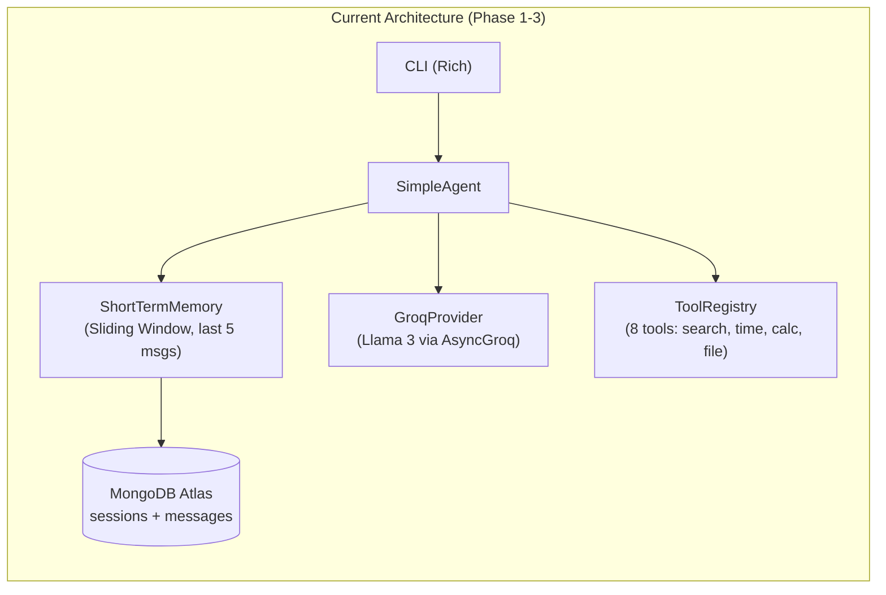

### Our Constraints

| Constraint | Impact on Decision |
|-----------|-------------------|
| **Built from scratch** (no LangChain/LlamaIndex) | Must implement memory layer ourselves — but that's the goal |
| **MongoDB Atlas (free tier)** | 512MB storage, native Vector Search available — single database for everything |
| **Groq as LLM provider** | Ultra-fast inference, but limited models — great for extraction calls |
| **Single developer** | Architecture must be implementable step-by-step, not require massive parallelism |
| **Learning project → production goal** | Start simple, evolve — don't over-engineer Phase 4 |
| **Python async-first** | Everything must work with `asyncio` and `motor` |

### Our Goals

| Goal | Priority |
|------|----------|
| Agent remembers user across sessions (preferences, context) | 🔴 Critical |
| Zero added latency to user responses | 🔴 Critical |
| Zero additional infrastructure cost | 🟡 High |
| Production-grade quality (not a toy) | 🟡 High |
| Extensible to knowledge graphs later | 🟢 Nice to have |
| Multi-user support | 🟢 Nice to have (future) |

---

## 2. Architecture Recommendation

### The Verdict: **Vector Search + Auto-Extraction (ChatGPT-Inspired)**

After analyzing all production systems (ChatGPT, Claude, Perplexity) and frameworks (Mem0, MemGPT, Zep), the recommended architecture for our project is:

> **Custom-built Semantic Memory with Vector Search + LLM-powered Auto-Extraction** — the same fundamental pattern used by ChatGPT's memory system and Claude's synthesis engine, tailored for our MongoDB Atlas + Groq stack.

### Why This Architecture

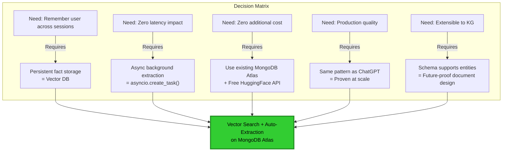

### What This Architecture Looks Like

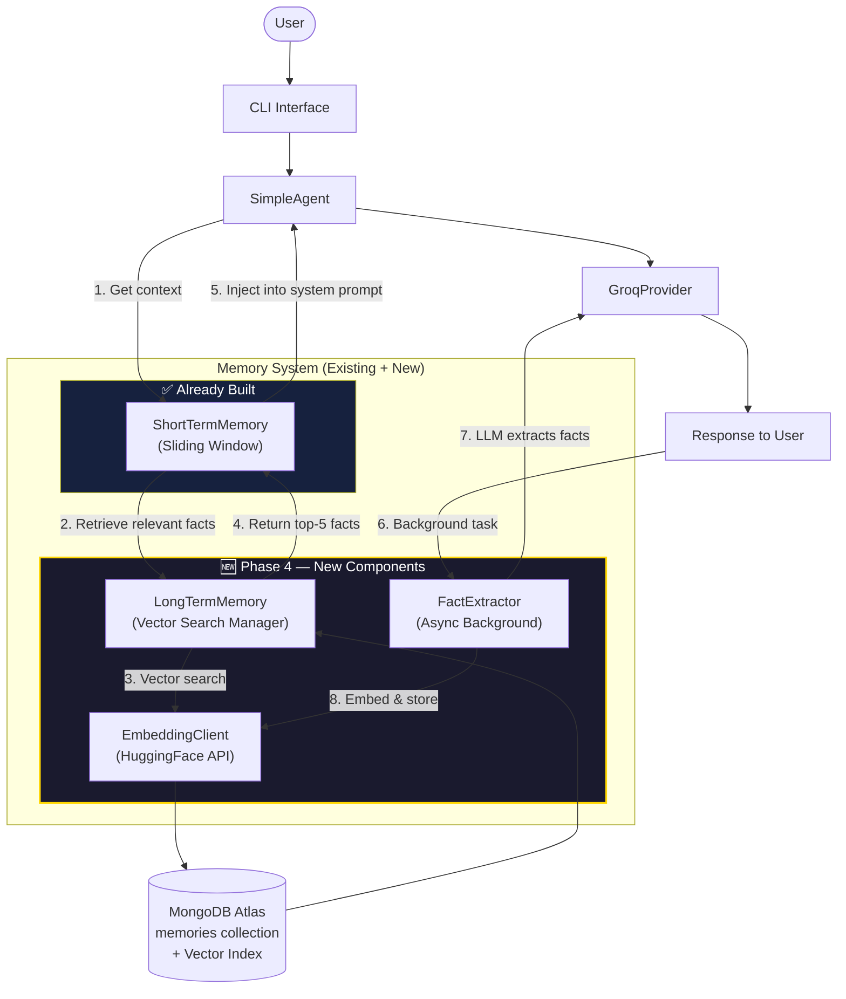

---

## 3. Memory Strategies to Implement

### Which memory types to implement and in what order

| Memory Type | Implement? | Phase | Rationale |
|-------------|-----------|-------|-----------|
| **Working Memory (Short-Term)** | ✅ Already done | Phase 1 | Our `ShortTermMemory` sliding window |
| **Semantic Memory (Facts)** | ✅ Yes — Core of Phase 4 | Phase 4A | The "remembering user" capability everyone expects |
| **Episodic Memory (Experience Logs)** | ✅ Yes — Lightweight | Phase 4B | Our existing `messages` collection IS episodic memory — we just add summarization |
| **Procedural Memory (Rules)** | ✅ Already done | Phase 1 | Our system prompt + tool definitions |
| **Knowledge Graph Memory** | ❌ Not now — Phase 6 | Future | Over-engineered for current scope; schema prepared for it |

### Detailed Strategy for Each

#### 🟢 Semantic Memory (Phase 4A — Build First)

**What**: Store factual knowledge about the user as embedded vectors in MongoDB Atlas.

**Examples**:
- "User prefers Python and React"
- "User runs Windows OS with VS Code"
- "User's project uses MongoDB Atlas and Groq"

**Implementation**:
```
User says something → Agent responds →
Background: LLM extracts facts →
Embed facts via HuggingFace → Store in memories collection →
Next query: Vector search retrieves relevant facts →
Inject into system prompt before LLM call
```

#### 🟡 Episodic Memory (Phase 4B — Add After Semantic)

**What**: Summarize past sessions into condensed digests, stored as searchable memories.

**Examples**:
- "On June 13, 2026: Discussed search tools, built query expansion, resolved timezone issues"
- "On June 14, 2026: Reviewed long-term memory architectures, decided on Vector Search approach"

**Implementation**:
```
Session ends (or every N messages) →
LLM summarizes the session into 2-3 sentence digest →
Embed and store in memories collection with category="episode" →
Future sessions: Retrieve relevant past episodes alongside semantic facts
```

> **Key Insight**: We don't need a separate database or system for episodic memory. By adding a `category` field to our memory documents, the same collection and vector index serves both semantic AND episodic memories.

#### 🟢 Procedural Memory (Already Exists)

Our system prompt + `@tool` decorator schema + grounding rules = procedural memory. No changes needed.

#### ❌ Knowledge Graph Memory (Not Now, Schema-Ready)

We include an `entities` and `relationships` field in the memory document schema (both optional, default `null`). This means:
- **Phase 4**: Fields exist but are unused — zero overhead
- **Phase 6**: We can populate them without schema migration

---

## 4. Custom Build vs Framework (Mem0)

### The Question

> Should we use Mem0 (open-source memory framework) or build our own memory layer?

### The Answer: **Build Custom**

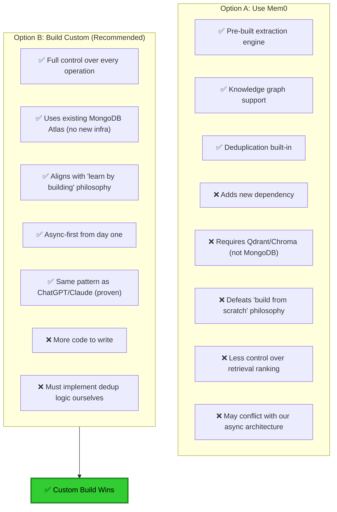

### Why Custom Wins for Our Project

| Factor | Mem0 | Custom Build | Winner |
|--------|------|-------------|--------|
| **Learning value** | Low (black box) | Very High (understand internals) | Custom |
| **Infrastructure** | Needs Qdrant/Chroma | Uses existing MongoDB | Custom |
| **Async compatibility** | Uncertain | Guaranteed (we design it) | Custom |
| **Cost** | Free + vector DB cost | Free (Atlas free tier) | Custom |
| **Codebase alignment** | Foreign patterns | Follows our Clean Architecture | Custom |
| **Production capability** | Excellent | Excellent (same pattern as ChatGPT) | Tie |
| **Knowledge graph** | Built-in | Future phase | Mem0 |
| **Speed to implement** | Faster (pre-built) | Slightly slower (but not by much) | Mem0 |

> **Bottom line**: Mem0 is an excellent framework, but using it would violate our core project goal ("build from scratch to learn"). Our custom implementation follows the exact same architectural pattern that ChatGPT uses — it's proven at massive scale, and building it ourselves gives us deep understanding.

---

## 5. Database Technology Decision

### The Decision: **MongoDB Atlas (Vector Search) — Single Database for Everything**

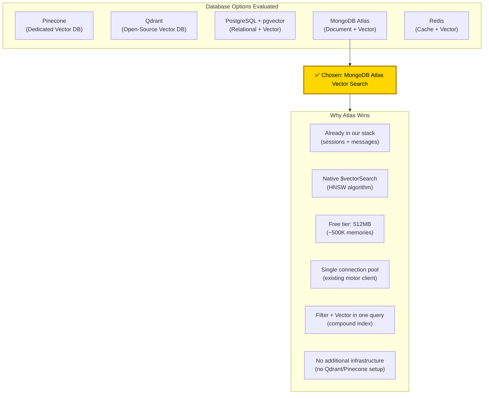

### Why NOT the Others

| Database | Why We Rejected It |
|----------|-------------------|
| **Pinecone** | Additional service, additional cost, additional latency, additional dependency |
| **Qdrant** | Requires running a separate service (Docker or cloud), overkill for our scale |
| **PostgreSQL** | Would require migrating from MongoDB — massive architectural change |
| **Redis** | Great for caching but not for persistent vector search at scale |

### What Atlas Vector Search Gives Us

| Feature | Detail |
|---------|--------|
| **Algorithm** | HNSW (Hierarchical Navigable Small World) — same as Pinecone |
| **Similarity** | Cosine, Euclidean, or Dot Product |
| **Max Dimensions** | 4096 (we use 384) |
| **Filters** | Pre-filter by any field (`user_id`, `category`, `is_current`) |
| **Aggregation** | Full MongoDB aggregation pipeline after vector search |
| **Cost** | Free on M0 (shared) tier |

### Memory Collection Schema

```json
{
  "_id": "ObjectId(...)",
  "user_id": "default_user",
  "fact": "User prefers Python for backend and React for frontend",
  "embedding": [0.023, -0.142, 0.891, "...384 floats"],
  "category": "user_preference",
  "source_session_id": "ObjectId(...)",
  "source_message": "I usually work with Python and React",
  "entities": null,
  "relationships": null,
  "created_at": "2026-06-14T12:00:00Z",
  "last_accessed": "2026-06-14T15:30:00Z",
  "access_count": 3,
  "confidence": 0.92,
  "is_current": true,
  "metadata": {}
}
```

### Vector Search Index Configuration

```json
{
  "name": "memory_vector_index",
  "type": "vectorSearch",
  "fields": [
    {
      "type": "vector",
      "path": "embedding",
      "numDimensions": 384,
      "similarity": "cosine"
    },
    {
      "type": "filter",
      "path": "user_id"
    },
    {
      "type": "filter",
      "path": "category"
    },
    {
      "type": "filter",
      "path": "is_current"
    }
  ]
}
```

---

## 6. Complete Memory Pipeline Design

### 6.1 End-to-End Flow (Single User Turn)

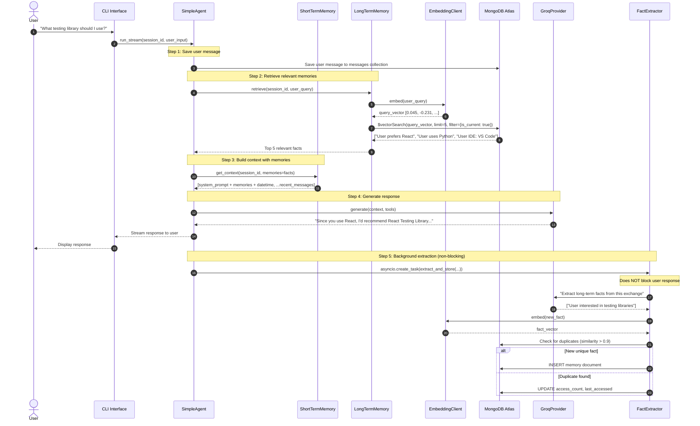

### 6.2 Memory Extraction Pipeline

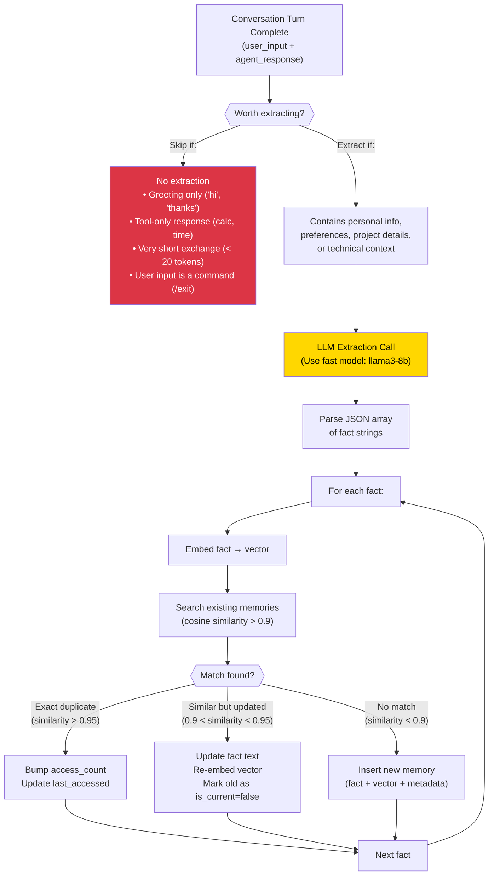

### 6.3 Memory Retrieval & Ranking Pipeline

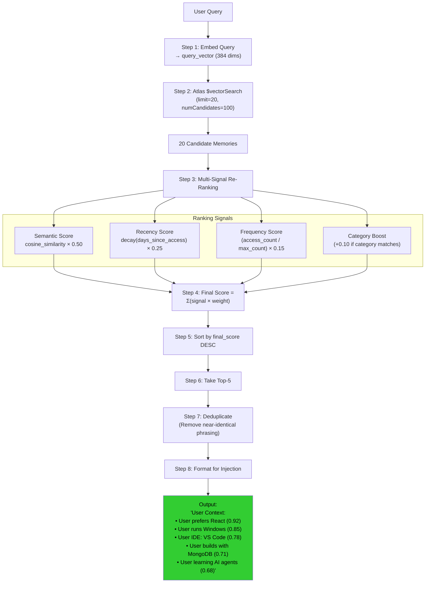

### 6.4 Memory Consolidation (Dreaming Process)

This is inspired by ChatGPT's "Dreaming" and Claude's "Auto-Dream" — a background process that keeps memory healthy.

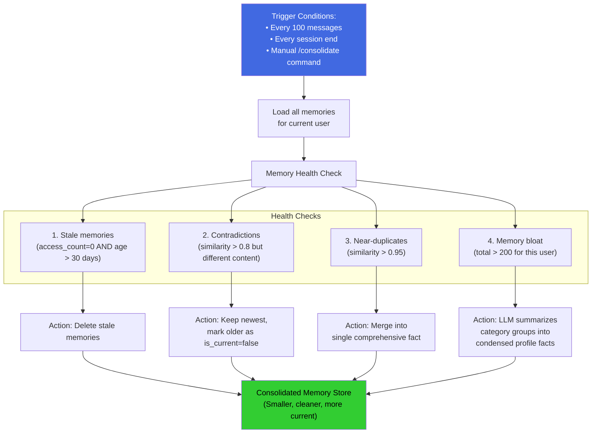

### 6.5 Memory Forgetting (User Control)

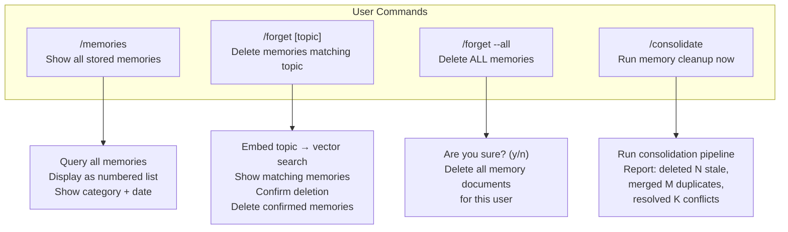

---

## 7. Industry Standard Analysis

### How Production Systems Actually Work (Simplified)

| System | What They Really Do | Complexity Level |
|--------|-------------------|-----------------|
| **ChatGPT** | Store text facts in a notepad → inject into system prompt → auto-curate with "Dreaming" background process | Medium |
| **Claude** | Synthesize 24-hour compressed profile → inject at session start → separate Chat Search for history | Medium |
| **Perplexity** | Profile + Spaces + RAG over conversation history → inject alongside web search results | Medium |
| **Google Gemini** | Activity log + preference extraction → inject into system prompt | Low-Medium |

> **Key Insight**: Even the most sophisticated production systems (ChatGPT, Claude) use fundamentally simple patterns — **extract facts → store → retrieve → inject into prompt**. The sophistication is in the *quality* of extraction, the *efficiency* of retrieval, and the *freshness* of the data. None of them use exotic architectures.

### The Industry Standard Pattern (What We're Implementing)

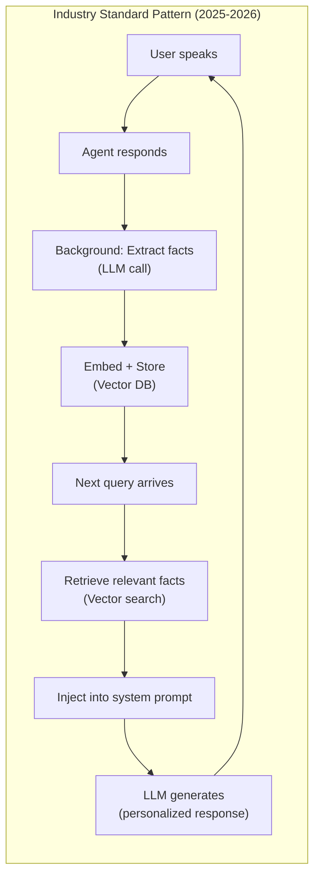

This is exactly what we're building. The pattern is identical across ChatGPT, Claude, and our system — the only differences are scale and the sophistication of the curation/consolidation layer.

---

## 8. Phased Implementation Roadmap

### Phase 4A: Core Semantic Memory (Build First)

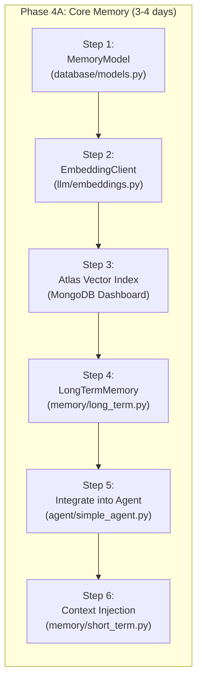

| Step | File | What Gets Built |
|------|------|----------------|
| 1 | `database/models.py` | `MemoryModel` Pydantic schema (fact, embedding, category, timestamps) |
| 2 | `llm/embeddings.py` | `EmbeddingClient` — async HuggingFace Inference API calls |
| 3 | MongoDB Atlas Dashboard | Create `memories` collection + vector search index |
| 4 | `memory/long_term.py` | `LongTermMemory` class — store, retrieve, search, delete methods |
| 5 | `agent/simple_agent.py` | Background fact extraction + retrieval in agent loop |
| 6 | `memory/short_term.py` | Inject retrieved memories into system prompt |

### Phase 4B: Episodic Memory + Consolidation

| Step | What Gets Built |
|------|----------------|
| 7 | Session summary generation (end-of-session digest) |
| 8 | Consolidation/Dreaming pipeline (prune, merge, resolve) |
| 9 | `/memories`, `/forget`, `/consolidate` CLI commands |

### Phase 4C: Advanced Features (Polish)

| Step | What Gets Built |
|------|----------------|
| 10 | Multi-signal re-ranking (recency, frequency, category) |
| 11 | Memory confidence scoring |
| 12 | Automatic staleness detection and decay |

---

## 9. Summary of Decisions

| Question | Decision | Reasoning |
|----------|----------|-----------|
| **Best memory architecture?** | Vector Search + Auto-Extraction | Same pattern as ChatGPT/Claude — proven at scale, matches our stack |
| **Which memory strategies?** | Semantic (core) + Episodic (lightweight) + Procedural (existing) | Covers 95% of use cases; KG deferred to Phase 6 |
| **Mem0 or custom?** | Custom build | Aligns with "build from scratch" philosophy; uses existing MongoDB; full control |
| **Database technology?** | MongoDB Atlas Vector Search | Already in our stack; free tier; native $vectorSearch; single connection pool |
| **Embedding model?** | `all-MiniLM-L6-v2` via HuggingFace | Free, 384-dim, fast, proven quality for semantic search |
| **Extraction approach?** | Async background LLM call (llama3-8b) | Zero latency impact; cheap model for extraction; same Groq provider |
| **Retrieval strategy?** | Top-5 vector search + multi-signal re-ranking | Balances relevance vs context window budget |
| **Consolidation strategy?** | ChatGPT-inspired "Dreaming" | Background prune/merge/resolve every 100 messages or session end |
| **User control?** | `/memories`, `/forget`, `/consolidate` commands | Transparency + privacy + user agency |
| **Industry standard?** | Extract → Embed → Store → Retrieve → Inject | Every major system uses this exact loop |

### Final Architecture Diagram

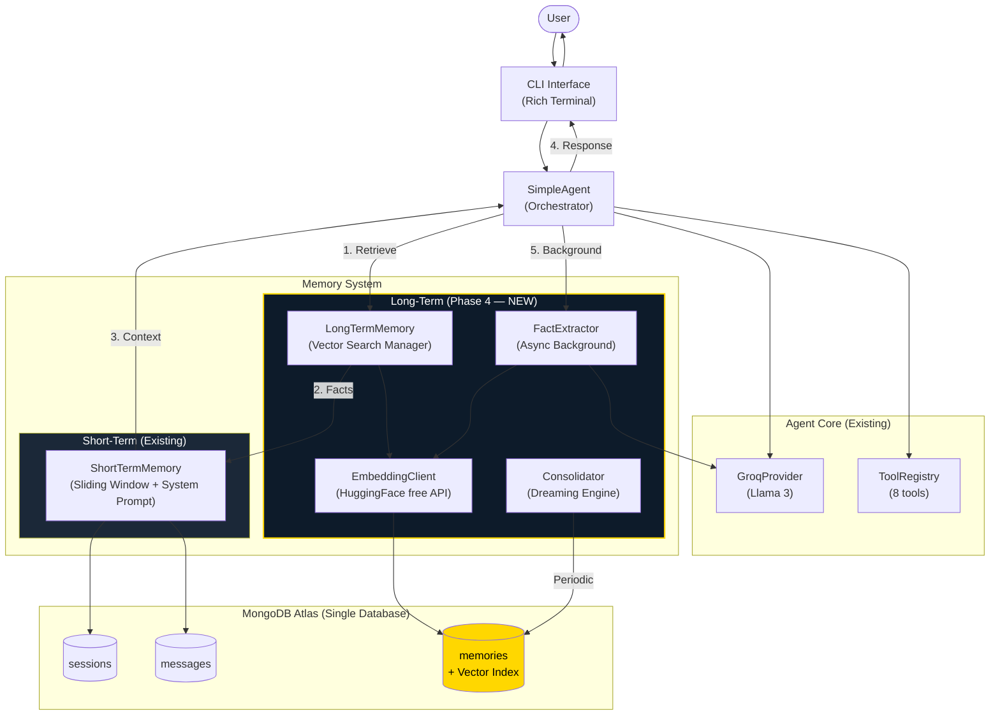

---

> [!IMPORTANT]
> **Next Step**: Once you approve this architecture, I will create the detailed implementation plan (`implementation_plan.md`) with exact file changes, code structures, and step-by-step build order for Phase 4A.

---

> **Document Version**: 1.0.0
> **Last Updated**: June 14, 2026
> **Purpose**: Strategic architecture decision for Phase 4 — Long-Term Memory
> **Author**: TejasH MistrY