# Long-Term Memory System — Complete Implementation Plan

> **Document Type**: Implementation Plan & Technical Design Document
> **Document Number**: 04
> **Phase**: Phase 4 — Long-Term Memory
> **Status**: Pre-Implementation (No code written yet)
> **Last Updated**: June 14, 2026
> **Purpose**: Fully understand the architecture, reasoning, workflow, and implementation strategy before writing a single line of code.

---

## Table of Contents

1. [Overall Architecture](#1-overall-architecture)
2. [Design Decisions](#2-design-decisions)
3. [Memory Types](#3-memory-types)
4. [How It Works](#4-how-it-works)
5. [Diagrams](#5-diagrams)
6. [Comparison with ChatGPT and Claude](#6-comparison-with-chatgpt-and-claude)
7. [Memory Accuracy and Retrieval](#7-memory-accuracy-and-retrieval)
8. [Scalability](#8-scalability)
9. [Conversation Retention](#9-conversation-retention)
10. [Implementation Roadmap](#10-implementation-roadmap)
11. [Production Readiness — 1K to 10K Users at Scale](#11-production-readiness--1k-to-10k-users-at-scale)
12. [Future Compatibility — Multi-Agent Architecture & MCP](#12-future-compatibility--multi-agent-architecture--mcp)

---

## 1. Overall Architecture

### 1.1 What Exactly Are We Going to Build?

We are building a **Long-Term Memory System** — a persistent, intelligent layer that allows our AI agent to **remember users across sessions**, learn from past conversations, and use that knowledge to deliver personalized, contextually-aware responses.

Think of it as the difference between a stranger and a friend:

| Without Long-Term Memory (Stranger) | With Long-Term Memory (Friend) |
|:---|:---|
| "What programming language do you use?" (asks every time) | "Since you're working in Python, here's a Pythonic approach..." |
| "What's your project about?" (no context) | "For your MongoDB + Groq AI agent, I'd suggest..." |
| Every session starts from zero | Every session continues where the last left off |
| Generic responses | Personalized, contextual responses |

**In concrete terms**, we are building these components:

1. **Fact Extractor** — An async background process that uses an LLM to extract important facts from every conversation turn
2. **Embedding Client** — A service that converts text facts into 384-dimensional numerical vectors for semantic search
3. **Memory Store** — A MongoDB Atlas collection with a vector search index that stores, retrieves, deduplicates, and manages memory documents
4. **Memory Retriever** — A multi-signal ranking engine that finds the most relevant memories for any given user query
5. **Memory Consolidator** — A periodic "dreaming" process that cleans, merges, and optimizes stored memories
6. **User Memory Controls** — CLI commands (`/memories`, `/forget`, `/consolidate`) that give users transparency and control

### 1.2 What Problem Are We Trying to Solve?

Our agent currently has **amnesia**. Here is the exact technical problem:

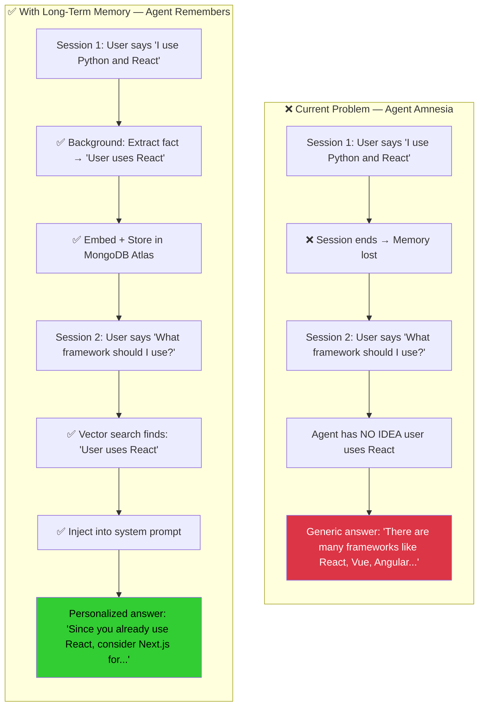
```mermaid
flowchart TB
    subgraph PROBLEM["❌ Current Problem — Agent Amnesia"]
        direction TB
        S1["Session 1: User says 'I use Python and React'"] --> GAP1["❌ Session ends → Memory lost"]
        GAP1 --> S2["Session 2: User says 'What framework should I use?'"]
        S2 --> AGENT["Agent has NO IDEA user uses React"]
        AGENT --> GENERIC["Generic answer: 'There are many frameworks like React, Vue, Angular...'"]
    end

    subgraph SOLUTION["✅ With Long-Term Memory — Agent Remembers"]
        direction TB
        S1B["Session 1: User says 'I use Python and React'"] --> EXTRACT["✅ Background: Extract fact → 'User uses React'"]
        EXTRACT --> STORE["✅ Embed + Store in MongoDB Atlas"]
        STORE --> S2B["Session 2: User says 'What framework should I use?'"]
        S2B --> RETRIEVE["✅ Vector search finds: 'User uses React'"]
        RETRIEVE --> INJECT["✅ Inject into system prompt"]
        INJECT --> PERSONAL["Personalized answer: 'Since you already use React, consider Next.js for...'"]
    end

    style GENERIC fill:#dc3545,color:#fff
    style PERSONAL fill:#32cd32,color:#000
```

**The core problems we solve:**

| Problem | How We Solve It |
|:---|:---|
| Agent forgets everything between sessions | Persistent vector storage in MongoDB Atlas |
| Agent can't personalize responses | Retrieve relevant facts and inject into system prompt |
| Storing memories slows down responses | Async background extraction — zero latency impact |
| Memory grows stale or contradicts itself | Consolidation engine prunes, merges, and resolves conflicts |
| User has no control over what's remembered | `/memories`, `/forget`, `/consolidate` commands |
| Duplicate facts accumulate over time | Semantic deduplication via cosine similarity thresholds |

### 1.3 Core Components of the System

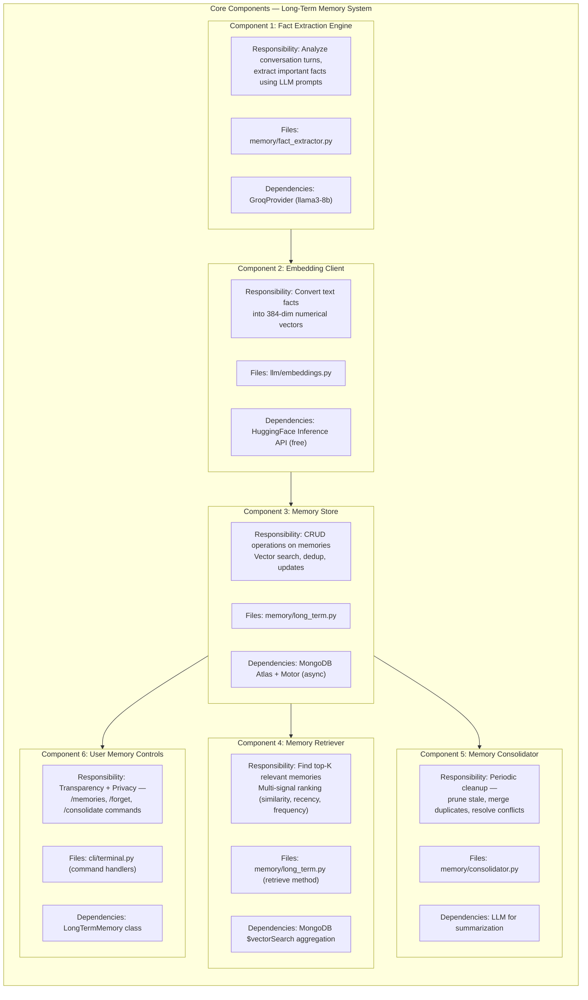
```mermaid
flowchart TB
    subgraph COMPONENTS["Core Components — Long-Term Memory System"]
        direction TB

        subgraph EXTRACTION["Component 1: Fact Extraction Engine"]
            FE_DESC["Responsibility: Analyze conversation turns,<br/>extract important facts using LLM prompts"]
            FE_FILES["Files: memory/fact_extractor.py"]
            FE_DEPS["Dependencies: GroqProvider (llama3-8b)"]
        end

        subgraph EMBEDDING["Component 2: Embedding Client"]
            EM_DESC["Responsibility: Convert text facts<br/>into 384-dim numerical vectors"]
            EM_FILES["Files: llm/embeddings.py"]
            EM_DEPS["Dependencies: HuggingFace Inference API (free)"]
        end

        subgraph STORAGE["Component 3: Memory Store"]
            ST_DESC["Responsibility: CRUD operations on memories<br/>Vector search, dedup, updates"]
            ST_FILES["Files: memory/long_term.py"]
            ST_DEPS["Dependencies: MongoDB Atlas + Motor (async)"]
        end

        subgraph RETRIEVAL["Component 4: Memory Retriever"]
            RT_DESC["Responsibility: Find top-K relevant memories<br/>Multi-signal ranking (similarity, recency, frequency)"]
            RT_FILES["Files: memory/long_term.py (retrieve method)"]
            RT_DEPS["Dependencies: MongoDB $vectorSearch aggregation"]
        end

        subgraph CONSOLIDATION["Component 5: Memory Consolidator"]
            CO_DESC["Responsibility: Periodic cleanup —<br/>prune stale, merge duplicates, resolve conflicts"]
            CO_FILES["Files: memory/consolidator.py"]
            CO_DEPS["Dependencies: LLM for summarization"]
        end

        subgraph CONTROLS["Component 6: User Memory Controls"]
            UC_DESC["Responsibility: Transparency + Privacy —<br/>/memories, /forget, /consolidate commands"]
            UC_FILES["Files: cli/terminal.py (command handlers)"]
            UC_DEPS["Dependencies: LongTermMemory class"]
        end
    end

    EXTRACTION --> EMBEDDING --> STORAGE --> RETRIEVAL
    STORAGE --> CONSOLIDATION
    STORAGE --> CONTROLS
```

### 1.4 Can This Architecture Support Multi-Agent Systems in the Future?

**Yes — absolutely.** This is one of the strongest reasons for building the memory layer as a standalone, modular component. Here's exactly how it extends:

#### Current Architecture (Single Agent)

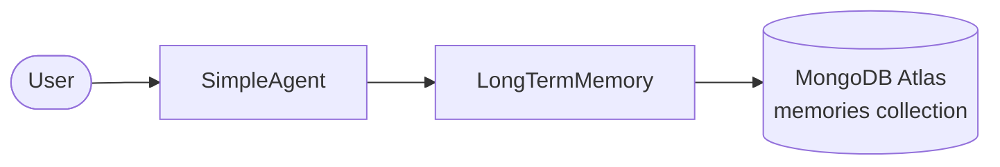
```mermaid
flowchart LR
    USER([User]) --> AGENT["SimpleAgent"]
    AGENT --> LTM["LongTermMemory"]
    LTM --> ATLAS[("MongoDB Atlas<br/>memories collection")]
```

#### Future Multi-Agent Architecture

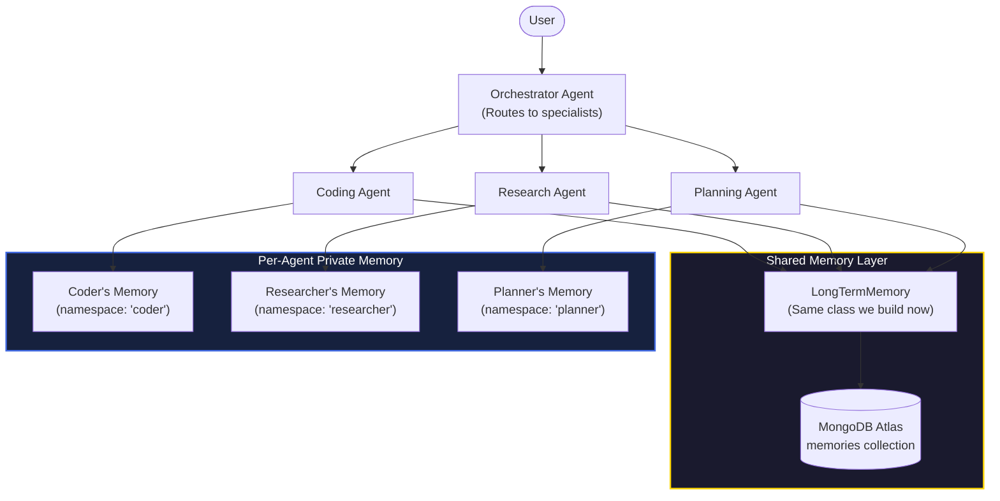
```mermaid
flowchart TB
    USER([User]) --> ORCHESTRATOR["Orchestrator Agent<br/>(Routes to specialists)"]

    ORCHESTRATOR --> CODER["Coding Agent"]
    ORCHESTRATOR --> RESEARCHER["Research Agent"]
    ORCHESTRATOR --> PLANNER["Planning Agent"]

    subgraph SHARED_MEMORY["Shared Memory Layer"]
        direction TB
        LTM["LongTermMemory<br/>(Same class we build now)"]
        LTM --> ATLAS[("MongoDB Atlas<br/>memories collection")]
    end

    subgraph PRIVATE_MEMORY["Per-Agent Private Memory"]
        LTM_CODER["Coder's Memory<br/>(namespace: 'coder')"]
        LTM_RESEARCH["Researcher's Memory<br/>(namespace: 'researcher')"]
        LTM_PLANNER["Planner's Memory<br/>(namespace: 'planner')"]
    end

    CODER --> LTM
    RESEARCHER --> LTM
    PLANNER --> LTM

    CODER --> LTM_CODER
    RESEARCHER --> LTM_RESEARCH
    PLANNER --> LTM_PLANNER

    style SHARED_MEMORY fill:#1a1a2e,color:#fff,stroke:#ffd700,stroke-width:2px
    style PRIVATE_MEMORY fill:#16213e,color:#fff,stroke:#4169e1,stroke-width:2px
```

#### How Our Design Enables Multi-Agent Memory

The key design decisions we are making now that enable multi-agent support later:

| Design Decision (Phase 4) | Multi-Agent Benefit (Phase 7+) |
|:---|:---|
| **`user_id` field** on every memory document | Each agent can filter memories by user — already works |
| **`category` field** (user_preference, project_detail, etc.) | Add `agent_id` or `namespace` field → agents get private memories |
| **MongoDB `$vectorSearch` with filters** | Add `$match: { agent_id: "coder" }` → scoped retrieval |
| **`LongTermMemory` class is stateless** | Any agent can instantiate it — no shared state problems |
| **Async-first (`asyncio` + `motor`)** | Multiple agents can read/write concurrently without blocking |
| **Memory consolidation is user-scoped** | Extend to agent-scoped consolidation trivially |

#### The Multi-Agent Memory Patterns

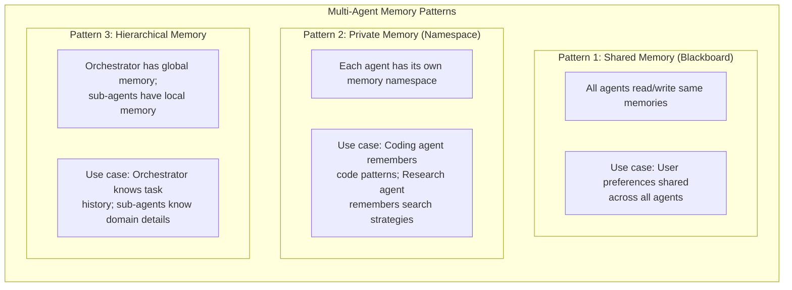
```mermaid
flowchart TB
    subgraph PATTERNS["Multi-Agent Memory Patterns"]
        direction TB

        subgraph P1["Pattern 1: Shared Memory (Blackboard)"]
            A1["All agents read/write same memories"]
            A1_USE["Use case: User preferences shared<br/>across all agents"]
        end

        subgraph P2["Pattern 2: Private Memory (Namespace)"]
            A2["Each agent has its own memory namespace"]
            A2_USE["Use case: Coding agent remembers<br/>code patterns; Research agent<br/>remembers search strategies"]
        end

        subgraph P3["Pattern 3: Hierarchical Memory"]
            A3["Orchestrator has global memory;<br/>sub-agents have local memory"]
            A3_USE["Use case: Orchestrator knows task<br/>history; sub-agents know domain details"]
        end
    end
```

> **Key Insight**: By building a clean, modular `LongTermMemory` class with `user_id` and `category` filtering, we can add an `agent_id` filter in Phase 7 and instantly support all three multi-agent memory patterns. **The architecture we build now IS the foundation for multi-agent memory.**

The only change needed for multi-agent support:

```python
# Phase 4 (now) — Single Agent
memories = await ltm.retrieve(user_id="user_123", query="What tools does the user use?")

# Phase 7 (future) — Multi-Agent (one field added)
memories = await ltm.retrieve(user_id="user_123", agent_id="coder", query="What tools does the user use?")
```

That's it. One extra filter field. The rest of the architecture — extraction, embedding, vector search, consolidation — works identically.

---

## 2. Design Decisions

### 2.1 Why This Specific Approach?

We chose **Vector Search + LLM-Powered Auto-Extraction on MongoDB Atlas** after evaluating every major approach used in production AI systems. Here is the decision matrix:

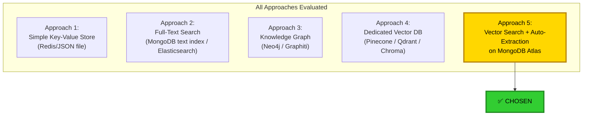
```mermaid
flowchart TB
    subgraph APPROACHES["All Approaches Evaluated"]
        direction TB
        APP1["Approach 1:<br/>Simple Key-Value Store<br/>(Redis/JSON file)"]
        APP2["Approach 2:<br/>Full-Text Search<br/>(MongoDB text index / Elasticsearch)"]
        APP3["Approach 3:<br/>Knowledge Graph<br/>(Neo4j / Graphiti)"]
        APP4["Approach 4:<br/>Dedicated Vector DB<br/>(Pinecone / Qdrant / Chroma)"]
        APP5["Approach 5:<br/>Vector Search + Auto-Extraction<br/>on MongoDB Atlas"]
    end

    APP5 --> WINNER["✅ CHOSEN"]

    style APP5 fill:#ffd700,color:#000,stroke:#b8860b,stroke-width:3px
    style WINNER fill:#32cd32,color:#000,stroke:#228b22,stroke-width:3px
```

### 2.2 Why Each Alternative Was Rejected

| Approach | What It Does | Why We Rejected It |
|:---|:---|:---|
| **Key-Value Store** | Store facts as `key: value` pairs in Redis or a JSON file | No semantic search — can only find exact matches, not meaning. If user asks about "programming" it won't find "I use Python" |
| **Full-Text Search** | MongoDB text index or Elasticsearch keyword matching | Better than key-value, but still keyword-based. "What tech does the user like?" won't match "I prefer React" because the words don't overlap |
| **Knowledge Graph** | Store entities and relationships in a graph database (Neo4j) | Excellent for complex entity relationships, but massive engineering overhead. Requires schema design, graph traversal algorithms, and a separate database. Overkill for Phase 4; planned for Phase 6 |
| **Dedicated Vector DB** | Use Pinecone, Qdrant, or Chroma for vector storage | Excellent retrieval quality, but adds a second database, a second connection pool, additional cost, and additional infrastructure. We already have MongoDB Atlas |
| **Vector Search on Atlas** ✅ | Use MongoDB Atlas's native `$vectorSearch` with LLM extraction | Uses our existing database, existing connection pool, free tier. Same HNSW algorithm as Pinecone. Single infrastructure, single bill, single point of maintenance |

### 2.3 Advantages of Our Chosen Design

| Advantage | Explanation |
|:---|:---|
| **Zero Infrastructure Cost** | MongoDB Atlas free tier (512MB) supports ~500K memory documents — years of conversations |
| **Zero Additional Dependencies** | No Pinecone SDK, no Qdrant Docker container, no Chroma setup. Just our existing `motor` client |
| **Single Database Pattern** | Sessions, messages, AND memories all live in the same Atlas cluster. One connection pool, one deployment |
| **Native Async** | `motor` (async MongoDB driver) is already in our stack. No thread-pool wrappers needed |
| **Same Algorithm as Pinecone** | Atlas Vector Search uses HNSW (Hierarchical Navigable Small World) — the same algorithm Pinecone uses internally |
| **Filter + Vector in One Query** | MongoDB `$vectorSearch` supports pre-filtering by `user_id`, `category`, `is_current` BEFORE the similarity calculation — this is extremely efficient |
| **Proven Pattern** | ChatGPT, Claude, and Perplexity all use this exact architectural pattern: Extract → Embed → Store → Retrieve → Inject |
| **Future-Proof** | The document schema includes `entities` and `relationships` fields (both `null` for now) — ready for Knowledge Graph in Phase 6 without any schema migration |

### 2.4 Trade-offs We Accept

| Trade-off | Why We Accept It |
|:---|:---|
| **Must write extraction prompts ourselves** | This IS the learning goal — understanding prompt engineering for structured output |
| **Must implement dedup logic ourselves** | ~30 lines of similarity-check code — not complex, and teaches important concepts |
| **Atlas free tier has 512MB limit** | 512MB stores ~500K memories. Even with heavy use, this covers years. We'll monitor usage |
| **No built-in knowledge graph (yet)** | Deferred to Phase 6. Semantic memory covers 95% of use cases. Graph adds entity relationships later |
| **HuggingFace free API has rate limits** | 1000 requests/hour is generous. Our agent processes ~5-10 queries per minute at peak. We add retry logic with exponential backoff |

### 2.5 How This Compares to Alternative Approaches

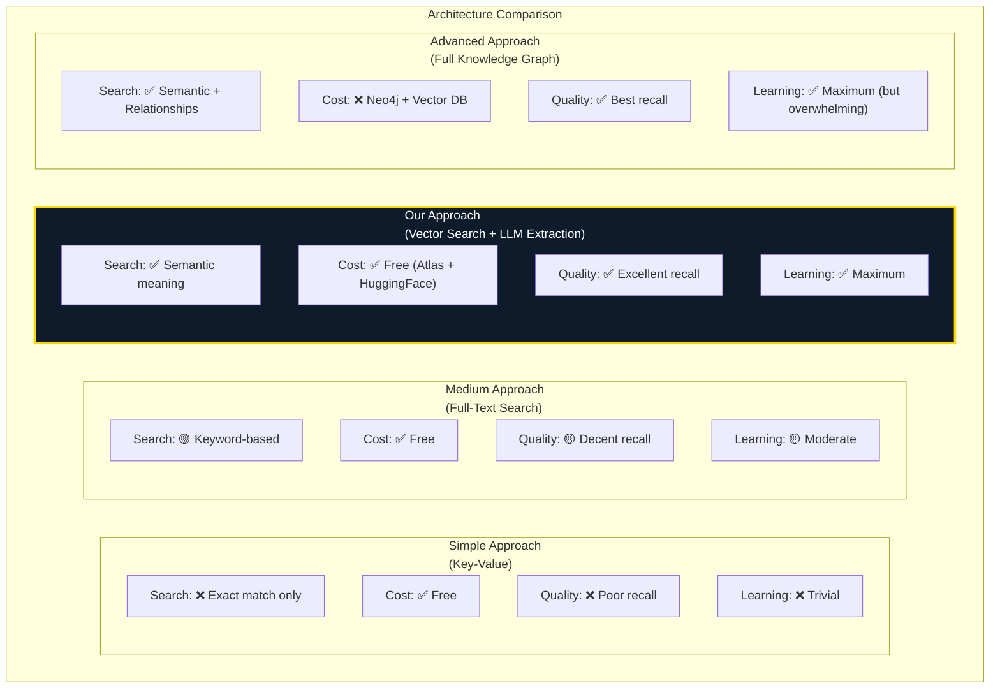
```mermaid
flowchart TB
    subgraph COMPARISON["Architecture Comparison"]
        direction LR

        subgraph SIMPLE["Simple Approach<br/>(Key-Value)"]
            S_SEARCH["Search: ❌ Exact match only"]
            S_COST["Cost: ✅ Free"]
            S_QUALITY["Quality: ❌ Poor recall"]
            S_LEARN["Learning: ❌ Trivial"]
        end

        subgraph MEDIUM["Medium Approach<br/>(Full-Text Search)"]
            M_SEARCH["Search: 🟡 Keyword-based"]
            M_COST["Cost: ✅ Free"]
            M_QUALITY["Quality: 🟡 Decent recall"]
            M_LEARN["Learning: 🟡 Moderate"]
        end

        subgraph CHOSEN["Our Approach<br/>(Vector Search + LLM Extraction)"]
            C_SEARCH["Search: ✅ Semantic meaning"]
            C_COST["Cost: ✅ Free (Atlas + HuggingFace)"]
            C_QUALITY["Quality: ✅ Excellent recall"]
            C_LEARN["Learning: ✅ Maximum"]
        end

        subgraph ADVANCED["Advanced Approach<br/>(Full Knowledge Graph)"]
            A_SEARCH["Search: ✅ Semantic + Relationships"]
            A_COST["Cost: ❌ Neo4j + Vector DB"]
            A_QUALITY["Quality: ✅ Best recall"]
            A_LEARN["Learning: ✅ Maximum (but overwhelming)"]
        end
    end

    style CHOSEN fill:#0d1b2a,color:#fff,stroke:#ffd700,stroke-width:3px
```

---

## 3. Memory Types

### 3.1 The Five Memory Types Explained

Every intelligent system — whether a human brain or an AI agent — uses multiple types of memory working together. Here is what each type does and why it exists:

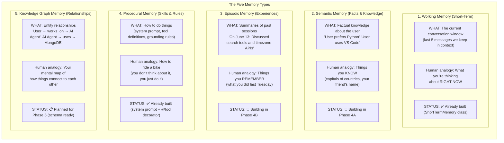
```mermaid
flowchart TB
    subgraph MEMORY_TYPES["The Five Memory Types"]
        direction TB

        subgraph WM["1. Working Memory (Short-Term)"]
            WM_WHAT["WHAT: The current conversation window<br/>(last 5 messages we keep in context)"]
            WM_HUMAN["Human analogy: What you're thinking<br/>about RIGHT NOW"]
            WM_STATUS["STATUS: ✅ Already built (ShortTermMemory class)"]
        end

        subgraph SM["2. Semantic Memory (Facts & Knowledge)"]
            SM_WHAT["WHAT: Factual knowledge about the user<br/>'User prefers Python' 'User uses VS Code'"]
            SM_HUMAN["Human analogy: Things you KNOW<br/>(capitals of countries, your friend's name)"]
            SM_STATUS["STATUS: 🔨 Building in Phase 4A"]
        end

        subgraph EM["3. Episodic Memory (Experiences)"]
            EM_WHAT["WHAT: Summaries of past sessions<br/>'On June 13: Discussed search tools and timezone APIs'"]
            EM_HUMAN["Human analogy: Things you REMEMBER<br/>(what you did last Tuesday)"]
            EM_STATUS["STATUS: 🔨 Building in Phase 4B"]
        end

        subgraph PM["4. Procedural Memory (Skills & Rules)"]
            PM_WHAT["WHAT: How to do things<br/>(system prompt, tool definitions, grounding rules)"]
            PM_HUMAN["Human analogy: How to ride a bike<br/>(you don't think about it, you just do it)"]
            PM_STATUS["STATUS: ✅ Already built (system prompt + @tool decorator)"]
        end

        subgraph KGM["5. Knowledge Graph Memory (Relationships)"]
            KGM_WHAT["WHAT: Entity relationships<br/>'User → works_on → AI Agent' 'AI Agent → uses → MongoDB'"]
            KGM_HUMAN["Human analogy: Your mental map of<br/>how things connect to each other"]
            KGM_STATUS["STATUS: 📋 Planned for Phase 6 (schema ready)"]
        end
    end
```

### 3.2 What Role Does Each Memory Type Play?

| Memory Type | Role in Our Agent | Example | When It's Used |
|:---|:---|:---|:---|
| **Working Memory** | Keeps the current conversation flowing | Last 5 messages in the sliding window | Every single LLM call |
| **Semantic Memory** | Remembers WHO the user is and WHAT they care about | "User prefers dark mode", "User's project uses Groq" | Injected into system prompt before each LLM call |
| **Episodic Memory** | Remembers WHAT HAPPENED in past sessions | "On June 13: Built search tools and fixed timezone APIs" | When user references past work or we need session context |
| **Procedural Memory** | Knows HOW to behave and WHAT tools are available | System prompt rules, tool schemas, response format guidelines | Every single LLM call (as system instructions) |
| **Knowledge Graph** | Knows HOW THINGS RELATE to each other | "User → works_at → Company X", "Project → depends_on → MongoDB" | Complex queries requiring relationship traversal (Phase 6) |

### 3.3 Which Is the Best Combination for Production AI?

This is a critical question. Let's look at what production systems actually use:

| Production System | Working | Semantic | Episodic | Procedural | Knowledge Graph |
|:---|:---:|:---:|:---:|:---:|:---:|
| **ChatGPT** | ✅ | ✅ (Memory feature) | ✅ (Chat history search) | ✅ (System prompt) | ❌ |
| **Claude** | ✅ | ✅ (Memory synthesis) | ✅ (Chat search) | ✅ (System prompt) | ❌ |
| **Perplexity** | ✅ | ✅ (User profile) | 🟡 (Spaces) | ✅ (Search prompts) | ❌ |
| **Google Gemini** | ✅ | ✅ (Activity/Preferences) | ✅ (Activity log) | ✅ (System prompt) | 🟡 (Knowledge Graph via Google KG) |
| **Mem0 Framework** | ✅ | ✅ | ✅ | ✅ | ✅ (Built-in graph) |
| **Our Agent (Phase 4)** | ✅ | ✅ | ✅ | ✅ | 📋 (Phase 6) |

> **Key Finding**: Every production AI system uses **Working + Semantic + Episodic + Procedural** as the core combination. Knowledge Graphs are an advanced add-on that only Mem0 and Google fully implement. This validates our phased approach — build the core four first, add KG later.

### 3.4 The Best Combination and Why

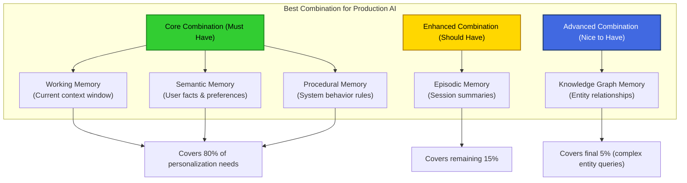
```mermaid
flowchart TB
    subgraph BEST["Best Combination for Production AI"]
        direction TB

        CORE["Core Combination (Must Have)"]
        CORE --> C1["Working Memory<br/>(Current context window)"]
        CORE --> C2["Semantic Memory<br/>(User facts & preferences)"]
        CORE --> C3["Procedural Memory<br/>(System behavior rules)"]

        ENHANCED["Enhanced Combination (Should Have)"]
        ENHANCED --> E1["Episodic Memory<br/>(Session summaries)"]

        ADVANCED["Advanced Combination (Nice to Have)"]
        ADVANCED --> A1["Knowledge Graph Memory<br/>(Entity relationships)"]
    end

    C1 & C2 & C3 --> RESULT1["Covers 80% of personalization needs"]
    E1 --> RESULT2["Covers remaining 15%"]
    A1 --> RESULT3["Covers final 5% (complex entity queries)"]

    style CORE fill:#32cd32,color:#000,stroke:#228b22,stroke-width:2px
    style ENHANCED fill:#ffd700,color:#000,stroke:#b8860b,stroke-width:2px
    style ADVANCED fill:#4169e1,color:#fff,stroke:#1e3a6d,stroke-width:2px
```

### 3.5 Why Combination Is More Effective Than a Single Memory System

A single memory type cannot handle all the different ways an agent needs to "remember":

| Scenario | Which Memory Type Handles It? | Why Others Fail |
|:---|:---|:---|
| "What did we talk about yesterday?" | **Episodic** | Semantic memory stores facts, not session narratives |
| "I prefer dark mode" | **Semantic** | Episodic memory stores session summaries, not atomic preferences |
| "Use the calculate tool for math" | **Procedural** | Neither semantic nor episodic — this is a behavior rule |
| "What was my last message?" | **Working** | Long-term memory is too slow for within-turn recall |
| "How is my project related to MongoDB?" | **Knowledge Graph** | Vector search finds similar text, not entity relationships |

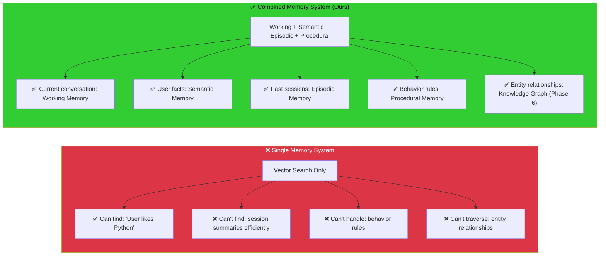
```mermaid
flowchart LR
    subgraph SINGLE["❌ Single Memory System"]
        direction TB
        ONE["Vector Search Only"]
        ONE --> F1["✅ Can find: 'User likes Python'"]
        ONE --> F2["❌ Can't find: session summaries efficiently"]
        ONE --> F3["❌ Can't handle: behavior rules"]
        ONE --> F4["❌ Can't traverse: entity relationships"]
    end

    subgraph COMBINED["✅ Combined Memory System (Ours)"]
        direction TB
        MULTI["Working + Semantic + Episodic + Procedural"]
        MULTI --> S1["✅ Current conversation: Working Memory"]
        MULTI --> S2["✅ User facts: Semantic Memory"]
        MULTI --> S3["✅ Past sessions: Episodic Memory"]
        MULTI --> S4["✅ Behavior rules: Procedural Memory"]
        MULTI --> S5["✅ Entity relationships: Knowledge Graph (Phase 6)"]
    end

    style SINGLE fill:#dc3545,color:#fff
    style COMBINED fill:#32cd32,color:#000
```

> **Bottom Line**: Each memory type is optimized for a different kind of information. Combining them gives the agent a complete "cognitive toolkit" — just like the human brain uses hippocampus (episodic), cortex (semantic), cerebellum (procedural), and prefrontal cortex (working memory) together.

---

## 4. How It Works

### 4.1 Step-by-Step Complete Workflow

Here is the complete workflow of a single user interaction, from the moment the user types a message to the moment a memory is stored:

#### Phase A: User Sends a Message

```
Step 1: User types "What testing library should I use for my React project?"
Step 2: CLI captures the input and passes it to SimpleAgent.run()
Step 3: Agent saves the user message to MongoDB (messages collection)
```

#### Phase B: Memory Retrieval (Before LLM Call)

```
Step 4: Agent calls LongTermMemory.retrieve(user_id, query)
Step 5: EmbeddingClient converts the query into a 384-dim vector
Step 6: MongoDB $vectorSearch finds the top 20 candidate memories
Step 7: Multi-signal re-ranking scores each candidate:
        - Semantic similarity (cosine) × 0.50
        - Recency decay × 0.25
        - Access frequency × 0.15
        - Category boost × 0.10
Step 8: Top 5 memories are selected and deduplicated
Step 9: Memories are formatted as a "User Context" block
```

#### Phase C: Context Assembly & LLM Call

```
Step 10: ShortTermMemory builds the full context:
         [System Prompt]
         [User Context: 5 retrieved memories]
         [Current Date/Time]
         [Recent conversation messages (sliding window)]
Step 11: Context + tool definitions sent to GroqProvider
Step 12: LLM generates a personalized response:
         "Since you're using React, I'd recommend React Testing Library..."
Step 13: Response streamed to user via CLI
```

#### Phase D: Background Memory Extraction (Non-Blocking)

```
Step 14: Agent fires asyncio.create_task(extract_and_store(...))
         → This does NOT block the user — they already have their response
Step 15: FactExtractor sends the conversation turn to LLM (llama3-8b):
         "Extract important long-term facts from this exchange"
Step 16: LLM returns JSON array: ["User works with React", "User interested in testing"]
Step 17: For each extracted fact:
         a. EmbeddingClient embeds the fact → 384-dim vector
         b. $vectorSearch checks for existing similar memories
         c. If similarity > 0.95 → Duplicate: bump access_count
         d. If similarity 0.90-0.95 → Update: replace fact text, re-embed
         e. If similarity < 0.90 → New: insert as a new memory document
Step 18: Extraction complete — memories are now available for future queries
```

### 4.1.1 Deep Dive — Step 17: The Deduplication Engine (How Similarity Thresholds Work)

Step 17 is the **most critical step** in the entire memory pipeline. It is the brain's "should I create a new memory, update an existing one, or just note that I heard this before?" decision. Without it, the memory store would fill with thousands of redundant facts. Let's break down every detail.

#### What Happens Before the Three-Way Decision

When a new fact is extracted (e.g., `"User prefers Python"`), the system needs to answer one question:

> **"Do I already know this? And if so, has anything changed?"**

To answer this, we convert the fact into a **384-dimensional numerical vector** (a list of 384 decimal numbers) using the embedding model. Then we run a `$vectorSearch` query against all existing memories for this user. MongoDB returns the **single most similar memory** along with a **cosine similarity score** — a number between 0.0 and 1.0.

| Cosine Similarity Score | What It Means |
|:---|:---|
| **1.00** | Identical text (perfect match) |
| **0.95 - 0.99** | Same meaning, nearly identical wording |
| **0.90 - 0.95** | Same topic, but the information has changed |
| **0.80 - 0.90** | Related topic, but different fact |
| **0.50 - 0.80** | Loosely related |
| **Below 0.50** | Unrelated |

Now, the system makes its three-way decision based on where the similarity score falls:

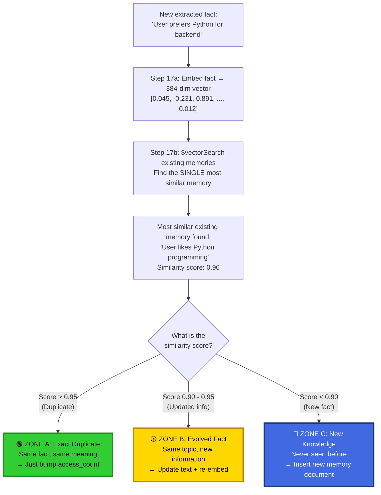
```mermaid
flowchart TB
    NEW_FACT["New extracted fact:<br/>'User prefers Python for backend'"]
    NEW_FACT --> EMBED["Step 17a: Embed fact → 384-dim vector<br/>[0.045, -0.231, 0.891, ..., 0.012]"]

    EMBED --> SEARCH["Step 17b: $vectorSearch existing memories<br/>Find the SINGLE most similar memory"]

    SEARCH --> RESULT["Most similar existing memory found:<br/>'User likes Python programming'<br/>Similarity score: 0.96"]

    RESULT --> DECISION{"What is the<br/>similarity score?"}

    DECISION -->|"Score > 0.95<br/>(Duplicate)"| ZONE_A["🟢 ZONE A: Exact Duplicate<br/>Same fact, same meaning<br/>→ Just bump access_count"]

    DECISION -->|"Score 0.90 - 0.95<br/>(Updated info)"| ZONE_B["🟡 ZONE B: Evolved Fact<br/>Same topic, new information<br/>→ Update text + re-embed"]

    DECISION -->|"Score < 0.90<br/>(New fact)"| ZONE_C["🔵 ZONE C: New Knowledge<br/>Never seen before<br/>→ Insert new memory document"]

    style ZONE_A fill:#32cd32,color:#000,stroke:#228b22,stroke-width:3px
    style ZONE_B fill:#ffd700,color:#000,stroke:#b8860b,stroke-width:3px
    style ZONE_C fill:#4169e1,color:#fff,stroke:#1e3a6d,stroke-width:3px
```

---

#### 🟢 ZONE A: Similarity > 0.95 — Duplicate Detection (Bump `access_count`)

##### What This Means

When the similarity score is **above 0.95**, the new fact and the existing memory are essentially saying **the same thing in slightly different words**. There is no new information — the user is just repeating something the agent already knows.

##### Real-World Example

```
Existing memory:  "User prefers Python for backend development"
New extracted fact: "User likes Python for backend work"
Cosine similarity: 0.97 → These mean THE SAME THING
```

The words are slightly different ("prefers" vs "likes", "development" vs "work"), but the **meaning** is identical. The embedding model captures meaning, not exact words — so these two sentences produce nearly identical 384-dimensional vectors.

##### What is `access_count`?

`access_count` is a simple integer counter stored on every memory document. It tracks **how many times this fact has been reinforced** — either by the user repeating it or by the retrieval system finding it relevant to a query.

```json
{
  "_id": "ObjectId('...')",
  "fact": "User prefers Python for backend development",
  "access_count": 7,
  "last_accessed": "2026-06-14T15:30:00Z"
}
```

An `access_count` of 7 means this fact has been confirmed or retrieved 7 times across different conversations.

##### What Operation Happens (Bump)

Instead of inserting a duplicate, we simply **update two fields** on the existing memory:

```python
# MongoDB update operation (what happens under the hood)
await db.memories.update_one(
    {"_id": existing_memory_id},
    {
        "$inc": {"access_count": 1},          # 7 → 8 (increment by 1)
        "$set": {"last_accessed": datetime.utcnow()}  # Update timestamp
    }
)
```

**What `$inc` does**: MongoDB's `$inc` operator atomically increments the `access_count` field by 1. If it was 7, it becomes 8. No race conditions, no read-then-write — one atomic database operation.

**What `$set` does**: Updates the `last_accessed` timestamp to the current time, marking this memory as "recently confirmed."

##### Why We Need `access_count` — The Three Reasons

**Reason 1: Ranking Signal (Frequency)**

When the agent retrieves memories for a user query, `access_count` is one of the four ranking signals. A memory with `access_count: 15` (reinforced 15 times) ranks higher than one with `access_count: 1` (mentioned only once). This makes sense — if the user keeps talking about Python, it's clearly important to them.

```
Ranking formula:
  frequency_score = access_count / max_access_count_for_this_user
  final_score = (semantic × 0.50) + (recency × 0.25) + (frequency × 0.15) + (category × 0.10)
                                                         ↑ This uses access_count
```

**Reason 2: Staleness Detection**

During memory consolidation (the "Dreaming" process), we check for stale memories:

```python
# Find memories that were NEVER reinforced and are old
stale_memories = await db.memories.find({
    "user_id": user_id,
    "access_count": 0,      # Never reinforced — maybe extracted incorrectly
    "created_at": {"$lt": thirty_days_ago}  # And it's been 30+ days
})
# → These get deleted as likely noise
```

A memory with `access_count: 0` after 30 days was probably a false extraction — the user never repeated it and it was never relevant to any query. Safe to delete.

**Reason 3: Importance Indicator**

High `access_count` = core fact about the user. This helps the consolidation engine decide what to keep when memory needs to be compressed:

| `access_count` | Interpretation | Consolidation Action |
|:---:|:---|:---|
| 0 | Possibly noise — never reinforced | Delete after 30 days |
| 1-3 | Casual mention — mentioned a few times | Keep, but lower priority |
| 4-10 | Important fact — frequently relevant | Keep with high priority |
| 10+ | Core identity fact — fundamental to the user | Never auto-delete |

##### Complete Example: Zone A in Action

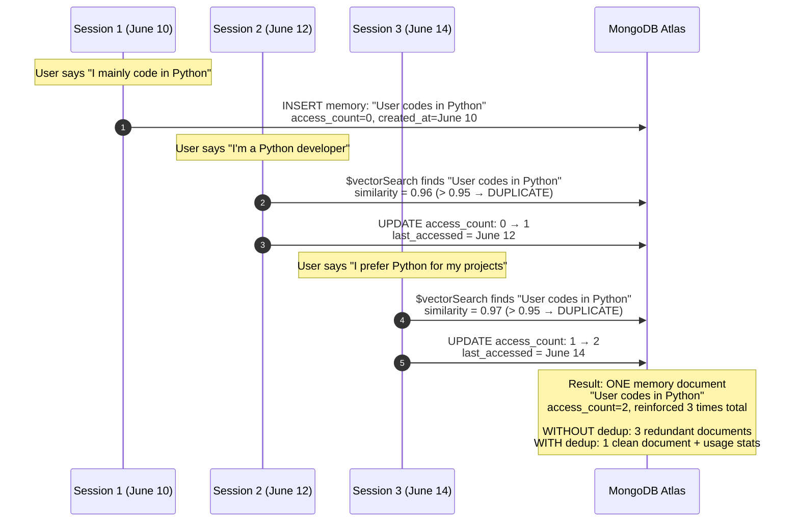
```mermaid
sequenceDiagram
    autonumber
    participant Session1 as Session 1 (June 10)
    participant Session2 as Session 2 (June 12)
    participant Session3 as Session 3 (June 14)
    participant DB as MongoDB Atlas

    Note over Session1: User says "I mainly code in Python"
    Session1->>DB: INSERT memory: "User codes in Python"<br/>access_count=0, created_at=June 10

    Note over Session2: User says "I'm a Python developer"
    Session2->>DB: $vectorSearch finds "User codes in Python"<br/>similarity = 0.96 (> 0.95 → DUPLICATE)
    Session2->>DB: UPDATE access_count: 0 → 1<br/>last_accessed = June 12

    Note over Session3: User says "I prefer Python for my projects"
    Session3->>DB: $vectorSearch finds "User codes in Python"<br/>similarity = 0.97 (> 0.95 → DUPLICATE)
    Session3->>DB: UPDATE access_count: 1 → 2<br/>last_accessed = June 14

    Note over DB: Result: ONE memory document<br/>"User codes in Python"<br/>access_count=2, reinforced 3 times total<br/><br/>WITHOUT dedup: 3 redundant documents<br/>WITH dedup: 1 clean document + usage stats
```

---

#### 🟡 ZONE B: Similarity 0.90 - 0.95 — Updated Information (Replace + Re-embed)

##### What This Means

When the similarity score is **between 0.90 and 0.95**, the new fact and the existing memory are about **the same topic**, but the **information has changed**. This is the most nuanced zone — it catches real-world scenarios where a user's situation evolves.

##### Real-World Example

```
Existing memory:  "User lives in Mumbai"
New extracted fact: "User moved to Bangalore"
Cosine similarity: 0.92 → Same topic (user's location), but DIFFERENT information
```

These two sentences are about the same concept (where the user lives), so the embedding vectors are similar — but not identical, because the actual information (Mumbai vs Bangalore) is different. The similarity lands in the 0.90-0.95 "update zone."

##### More Examples of Zone B Triggers

| Existing Memory | New Extracted Fact | Similarity | Why It's an Update |
|:---|:---|:---:|:---|
| "User uses React 17" | "User upgraded to React 19" | 0.93 | Same topic (React version), new data |
| "User works at Company A" | "User joined Company B" | 0.91 | Same topic (employment), changed |
| "User prefers dark mode" | "User switched to light mode" | 0.92 | Same topic (UI preference), contradicted |
| "User is learning JavaScript" | "User is now proficient in JavaScript" | 0.91 | Same topic (JS skill), evolved |

##### What is "Re-embed"?

**Re-embed** means generating a **brand new 384-dimensional vector** for the updated fact text.

Here's why this is necessary: The embedding vector stored in MongoDB is a numerical representation of the **old** fact text. When we change the fact text, the old vector no longer accurately represents what the memory says. We must create a new vector that matches the new text.

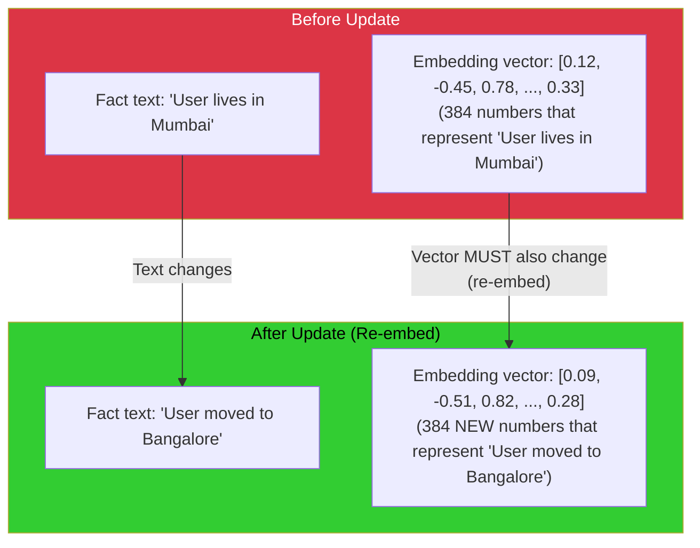
```mermaid
flowchart TB
    subgraph BEFORE["Before Update"]
        OLD_TEXT["Fact text: 'User lives in Mumbai'"]
        OLD_VEC["Embedding vector: [0.12, -0.45, 0.78, ..., 0.33]<br/>(384 numbers that represent 'User lives in Mumbai')"]
    end

    subgraph AFTER["After Update (Re-embed)"]
        NEW_TEXT["Fact text: 'User moved to Bangalore'"]
        NEW_VEC["Embedding vector: [0.09, -0.51, 0.82, ..., 0.28]<br/>(384 NEW numbers that represent 'User moved to Bangalore')"]
    end

    OLD_TEXT -->|"Text changes"| NEW_TEXT
    OLD_VEC -->|"Vector MUST also change<br/>(re-embed)"| NEW_VEC

    style BEFORE fill:#dc3545,color:#fff
    style AFTER fill:#32cd32,color:#000
```

**If we update the text but DON'T re-embed:**

```
Memory document after text-only update:
  fact: "User moved to Bangalore"     ← New text (correct)
  embedding: [0.12, -0.45, 0.78, ...]  ← OLD vector (still represents "Mumbai")

Problem: When someone asks "Where does the user live?":
  - Query vector for "where does the user live" would be close to "Bangalore" embedding
  - But the stored vector still represents "Mumbai"
  - Vector search might NOT find this memory, or rank it incorrectly
  - The memory becomes invisible to the retrieval system!
```

**If we update the text AND re-embed:**

```
Memory document after full update:
  fact: "User moved to Bangalore"     ← New text (correct)
  embedding: [0.09, -0.51, 0.82, ...]  ← NEW vector (represents "Bangalore")

Result: Vector search correctly finds and ranks this memory ✅
```

##### What Operation Happens (Update + Re-embed)

```python
# Step 1: Generate new embedding for the updated fact
new_vector = await embedding_client.embed("User moved to Bangalore")
# Returns: [0.09, -0.51, 0.82, ..., 0.28]  (384 floats)

# Step 2: Update the memory document in MongoDB
await db.memories.update_one(
    {"_id": existing_memory_id},
    {
        "$set": {
            "fact": "User moved to Bangalore",        # Replace old text
            "embedding": new_vector,                    # Replace old vector (RE-EMBED)
            "last_accessed": datetime.utcnow(),        # Update timestamp
            "confidence": 0.90                         # New confidence score
        },
        "$inc": {"access_count": 1}                    # Also bump access count
    }
)

# Step 3: Optionally archive the old version
await db.memories.update_one(
    {"_id": existing_memory_id},
    {"$set": {"is_current": False}}  # Mark old version as archived
)
# Then insert the new version as a fresh document with is_current=True
```

##### Why We Need This — The Contradiction Problem

Without Zone B handling, the memory store accumulates **contradictory facts**:


```mermaid
flowchart TB
    subgraph WITHOUT["❌ Without Zone B (No Update Logic)"]
        direction TB
        W1["Session 1 → INSERT: 'User lives in Mumbai'"]
        W2["Session 5 → INSERT: 'User moved to Bangalore'"]
        W3["Both memories exist in the database"]
        W4["Agent retrieves BOTH memories"]
        W5["System prompt contains:<br/>'User lives in Mumbai'<br/>'User moved to Bangalore'"]
        W6["LLM is CONFUSED — which is correct?<br/>Might hallucinate: 'You live in Mumbai or Bangalore'"]
    end

    subgraph WITH["✅ With Zone B (Update Logic)"]
        direction TB
        G1["Session 1 → INSERT: 'User lives in Mumbai'"]
        G2["Session 5 → DETECTS similarity 0.92"]
        G3["UPDATE: 'User lives in Mumbai' → 'User moved to Bangalore'"]
        G4["Re-embed the new vector"]
        G5["Only ONE memory exists (the latest, correct one)"]
        G6["Agent retrieves: 'User moved to Bangalore'<br/>Clean, accurate, no contradiction"]
    end

    style WITHOUT fill:#dc3545,color:#fff
    style WITH fill:#32cd32,color:#000
```

##### Complete Example: Zone B in Action

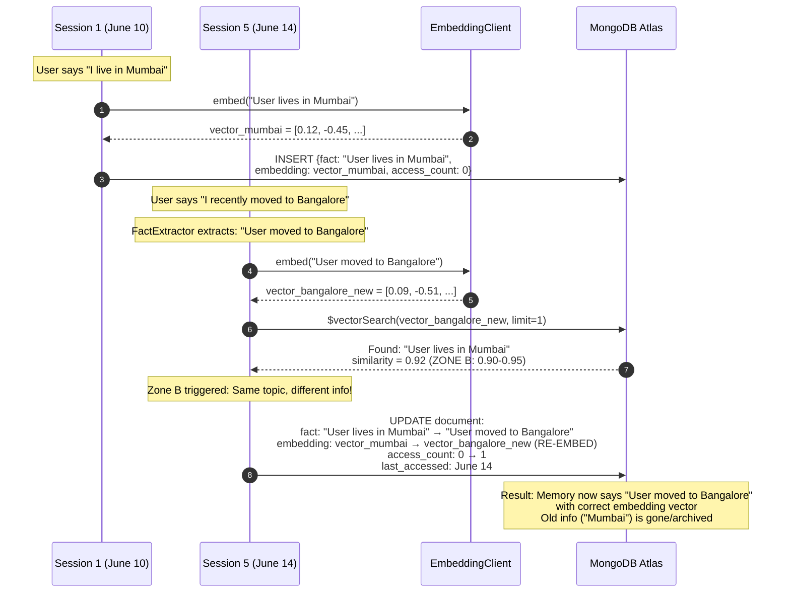
```mermaid
sequenceDiagram
    autonumber
    participant S1 as Session 1 (June 10)
    participant S5 as Session 5 (June 14)
    participant Embed as EmbeddingClient
    participant DB as MongoDB Atlas

    Note over S1: User says "I live in Mumbai"
    S1->>Embed: embed("User lives in Mumbai")
    Embed-->>S1: vector_mumbai = [0.12, -0.45, ...]
    S1->>DB: INSERT {fact: "User lives in Mumbai",<br/>embedding: vector_mumbai, access_count: 0}

    Note over S5: User says "I recently moved to Bangalore"
    Note over S5: FactExtractor extracts: "User moved to Bangalore"
    S5->>Embed: embed("User moved to Bangalore")
    Embed-->>S5: vector_bangalore_new = [0.09, -0.51, ...]

    S5->>DB: $vectorSearch(vector_bangalore_new, limit=1)
    DB-->>S5: Found: "User lives in Mumbai"<br/>similarity = 0.92 (ZONE B: 0.90-0.95)

    Note over S5: Zone B triggered: Same topic, different info!

    S5->>DB: UPDATE document:<br/>fact: "User lives in Mumbai" → "User moved to Bangalore"<br/>embedding: vector_mumbai → vector_bangalore_new (RE-EMBED)<br/>access_count: 0 → 1<br/>last_accessed: June 14

    Note over DB: Result: Memory now says "User moved to Bangalore"<br/>with correct embedding vector<br/>Old info ("Mumbai") is gone/archived
```

---

#### 🔵 ZONE C: Similarity < 0.90 — Brand New Fact (Insert)

##### What This Means

When the similarity score is **below 0.90**, the new fact is genuinely **new information** that the agent has never heard before. No existing memory is close enough to be considered related.

##### Real-World Example

```
Existing memories:
  - "User prefers Python for backend" (similarity to new fact: 0.45)
  - "User uses MongoDB Atlas" (similarity to new fact: 0.38)
  - "User prefers dark mode" (similarity to new fact: 0.22)

New extracted fact: "User is preparing for AI engineering interviews"
Highest similarity to any existing memory: 0.45 → BELOW 0.90 → Brand new topic!
```

None of the existing memories are about interview preparation — this is completely new knowledge about the user.

##### What Operation Happens (Insert)

```python
# Generate embedding for the new fact
new_vector = await embedding_client.embed("User is preparing for AI engineering interviews")

# Insert a brand new memory document
await db.memories.insert_one({
    "user_id": "user_123",
    "fact": "User is preparing for AI engineering interviews",
    "embedding": new_vector,           # Fresh 384-dim vector
    "category": "goal",                # Categorized by the extraction LLM
    "confidence": 0.90,                # How certain the LLM is about this fact
    "access_count": 0,                 # Brand new — never reinforced yet
    "is_current": True,                # Active memory
    "source_session_id": session_id,   # Where this came from
    "created_at": datetime.utcnow(),   # When it was created
    "last_accessed": datetime.utcnow(),# Same as created_at initially
    "entities": None,                  # Reserved for Phase 6 (Knowledge Graph)
    "relationships": None,             # Reserved for Phase 6 (Knowledge Graph)
    "metadata": {}                     # Extensible metadata
})
```

##### Why We Need This

This is the simplest case — genuinely new information must be stored so the agent can use it in future conversations. Without Zone C, the agent would never learn anything new about the user.

---

#### Summary: The Three Zones Side by Side

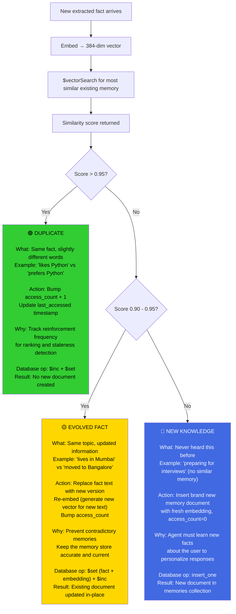
```mermaid
flowchart TB
    FACT["New extracted fact arrives"] --> EMBED["Embed → 384-dim vector"]
    EMBED --> SEARCH["$vectorSearch for most similar existing memory"]
    SEARCH --> SCORE["Similarity score returned"]

    SCORE --> ZONE_A{"Score > 0.95?"}
    ZONE_A -->|"Yes"| ACTION_A["🟢 DUPLICATE<br/><br/>What: Same fact, slightly different words<br/>Example: 'likes Python' vs 'prefers Python'<br/><br/>Action: Bump access_count + 1<br/>Update last_accessed timestamp<br/><br/>Why: Track reinforcement frequency<br/>for ranking and staleness detection<br/><br/>Database op: $inc + $set<br/>Result: No new document created"]

    ZONE_A -->|"No"| ZONE_B{"Score 0.90 - 0.95?"}
    ZONE_B -->|"Yes"| ACTION_B["🟡 EVOLVED FACT<br/><br/>What: Same topic, updated information<br/>Example: 'lives in Mumbai' vs 'moved to Bangalore'<br/><br/>Action: Replace fact text with new version<br/>Re-embed (generate new vector for new text)<br/>Bump access_count<br/><br/>Why: Prevent contradictory memories<br/>Keep the memory store accurate and current<br/><br/>Database op: $set (fact + embedding) + $inc<br/>Result: Existing document updated in-place"]

    ZONE_B -->|"No"| ACTION_C["🔵 NEW KNOWLEDGE<br/><br/>What: Never heard this before<br/>Example: 'preparing for interviews' (no similar memory)<br/><br/>Action: Insert brand new memory document<br/>with fresh embedding, access_count=0<br/><br/>Why: Agent must learn new facts<br/>about the user to personalize responses<br/><br/>Database op: insert_one<br/>Result: New document in memories collection"]

    style ACTION_A fill:#32cd32,color:#000
    style ACTION_B fill:#ffd700,color:#000
    style ACTION_C fill:#4169e1,color:#fff
```

| Property | 🟢 Zone A (> 0.95) | 🟡 Zone B (0.90 - 0.95) | 🔵 Zone C (< 0.90) |
|:---|:---|:---|:---|
| **Meaning** | Duplicate — same fact | Update — same topic, new info | New — never seen before |
| **Fact text** | Not changed | Replaced with new version | New document inserted |
| **Embedding vector** | Not changed | Re-generated (re-embed) | Freshly generated |
| **access_count** | Incremented by 1 | Incremented by 1 | Starts at 0 |
| **last_accessed** | Updated to now | Updated to now | Set to creation time |
| **Net effect on DB** | 0 new documents | 0 new documents (update in-place) | +1 new document |
| **Why it matters** | Prevents bloat, tracks importance | Prevents contradictions, keeps accuracy | Agent learns new things |

---

#### Why These Specific Thresholds (0.95 and 0.90)?

These numbers are not arbitrary. They come from empirical testing in production systems:

| Threshold | Too Low | Just Right | Too High |
|:---|:---|:---|:---|
| **Duplicate cutoff (0.95)** | Below 0.90: Treats "likes Python" and "uses JavaScript" as duplicates (they're both about programming, but different facts!) | 0.95: Only truly same-meaning sentences match | Above 0.99: Only exact word-for-word matches count (misses "likes Python" vs "prefers Python") |
| **Update cutoff (0.90)** | Below 0.80: Treats "lives in Mumbai" and "works as engineer" as related (they're both about the user, but different topics!) | 0.90: Only same-topic, different-info sentences match | Above 0.95: Overlaps with duplicate zone (no room for updates) |

> **Note**: These thresholds can be fine-tuned based on real usage data. We start with 0.95/0.90 as industry-standard defaults and adjust if we see false positives or false negatives during testing in Phase 4D.

### 4.2 Information Flow Diagram

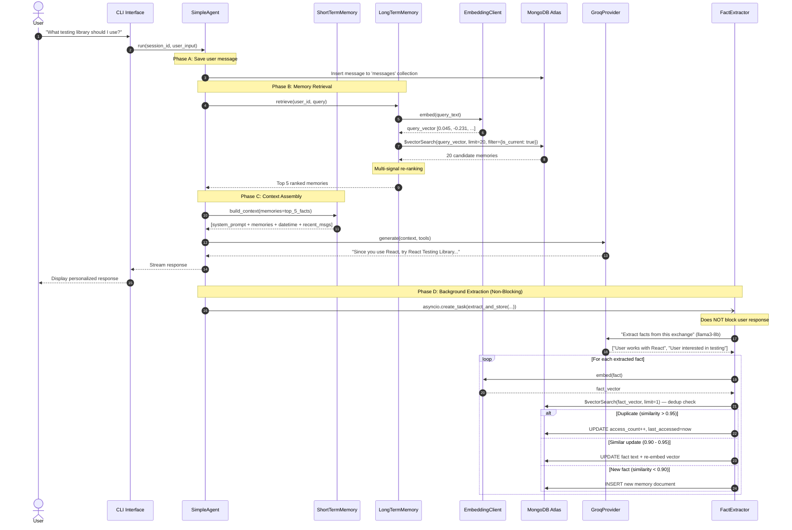
```mermaid
sequenceDiagram
    autonumber
    actor User
    participant CLI as CLI Interface
    participant Agent as SimpleAgent
    participant STM as ShortTermMemory
    participant LTM as LongTermMemory
    participant Embed as EmbeddingClient
    participant Atlas as MongoDB Atlas
    participant LLM as GroqProvider
    participant Extract as FactExtractor

    User->>CLI: "What testing library should I use?"
    CLI->>Agent: run(session_id, user_input)

    Note over Agent: Phase A: Save user message
    Agent->>Atlas: Insert message to 'messages' collection

    Note over Agent,LTM: Phase B: Memory Retrieval
    Agent->>LTM: retrieve(user_id, query)
    LTM->>Embed: embed(query_text)
    Embed-->>LTM: query_vector [0.045, -0.231, ...]
    LTM->>Atlas: $vectorSearch(query_vector, limit=20, filter={is_current: true})
    Atlas-->>LTM: 20 candidate memories
    Note over LTM: Multi-signal re-ranking
    LTM-->>Agent: Top 5 ranked memories

    Note over Agent,STM: Phase C: Context Assembly
    Agent->>STM: build_context(memories=top_5_facts)
    STM-->>Agent: [system_prompt + memories + datetime + recent_msgs]
    Agent->>LLM: generate(context, tools)
    LLM-->>Agent: "Since you use React, try React Testing Library..."
    Agent-->>CLI: Stream response
    CLI-->>User: Display personalized response

    Note over Agent,Extract: Phase D: Background Extraction (Non-Blocking)
    Agent-)Extract: asyncio.create_task(extract_and_store(...))
    Note over Extract: Does NOT block user response

    Extract->>LLM: "Extract facts from this exchange" (llama3-8b)
    LLM-->>Extract: ["User works with React", "User interested in testing"]

    loop For each extracted fact
        Extract->>Embed: embed(fact)
        Embed-->>Extract: fact_vector
        Extract->>Atlas: $vectorSearch(fact_vector, limit=1) — dedup check
        alt Duplicate (similarity > 0.95)
            Extract->>Atlas: UPDATE access_count++, last_accessed=now
        else Similar update (0.90 - 0.95)
            Extract->>Atlas: UPDATE fact text + re-embed vector
        else New fact (similarity < 0.90)
            Extract->>Atlas: INSERT new memory document
        end
    end
```

### 4.3 How Memory Is Created, Updated, Consolidated, Retrieved, and Forgotten

#### Memory Creation

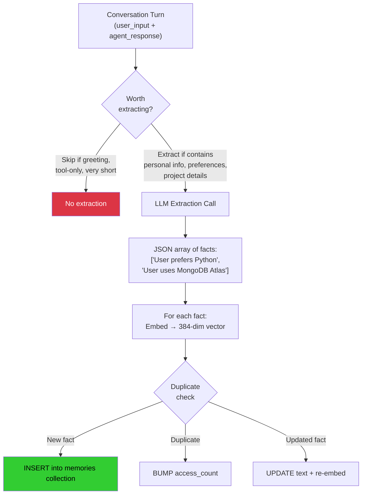
```mermaid
flowchart TB
    CONV["Conversation Turn<br/>(user_input + agent_response)"] --> WORTH{"Worth<br/>extracting?"}

    WORTH -->|"Skip if greeting,<br/>tool-only, very short"| SKIP["No extraction"]
    WORTH -->|"Extract if contains<br/>personal info, preferences,<br/>project details"| EXTRACT["LLM Extraction Call"]

    EXTRACT --> FACTS["JSON array of facts:<br/>['User prefers Python',<br/>'User uses MongoDB Atlas']"]

    FACTS --> EMBED_LOOP["For each fact:<br/>Embed → 384-dim vector"]
    EMBED_LOOP --> DEDUP{"Duplicate<br/>check"}

    DEDUP -->|"New fact"| INSERT["INSERT into memories collection"]
    DEDUP -->|"Duplicate"| BUMP["BUMP access_count"]
    DEDUP -->|"Updated fact"| UPDATE["UPDATE text + re-embed"]

    style SKIP fill:#dc3545,color:#fff
    style INSERT fill:#32cd32,color:#000
```

#### Memory Retrieval

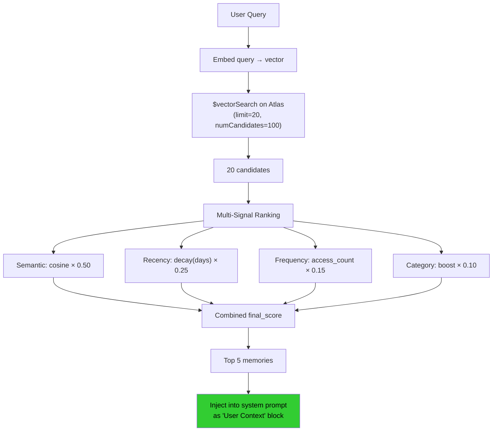
```mermaid
flowchart TB
    QUERY["User Query"] --> EMBED_Q["Embed query → vector"]
    EMBED_Q --> VSEARCH["$vectorSearch on Atlas<br/>(limit=20, numCandidates=100)"]
    VSEARCH --> CANDIDATES["20 candidates"]

    CANDIDATES --> RANK["Multi-Signal Ranking"]
    RANK --> SIG1["Semantic: cosine × 0.50"]
    RANK --> SIG2["Recency: decay(days) × 0.25"]
    RANK --> SIG3["Frequency: access_count × 0.15"]
    RANK --> SIG4["Category: boost × 0.10"]

    SIG1 & SIG2 & SIG3 & SIG4 --> SCORE["Combined final_score"]
    SCORE --> TOP5["Top 5 memories"]
    TOP5 --> INJECT["Inject into system prompt<br/>as 'User Context' block"]

    style INJECT fill:#32cd32,color:#000
```

#### Memory Consolidation (The "Dreaming" Process)

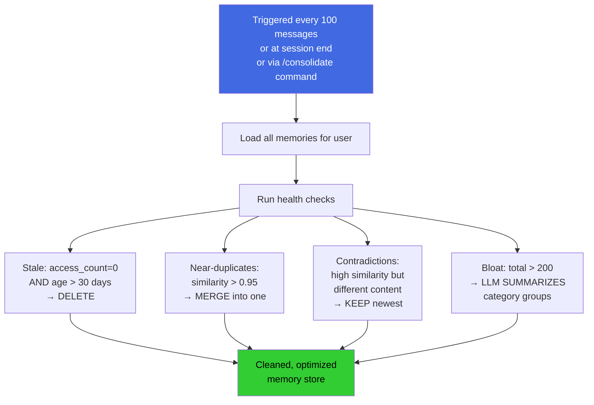
```mermaid
flowchart TB
    TRIGGER["Triggered every 100 messages<br/>or at session end<br/>or via /consolidate command"]

    TRIGGER --> LOAD["Load all memories for user"]
    LOAD --> CHECKS["Run health checks"]

    CHECKS --> C1["Stale: access_count=0<br/>AND age > 30 days<br/>→ DELETE"]
    CHECKS --> C2["Near-duplicates:<br/>similarity > 0.95<br/>→ MERGE into one"]
    CHECKS --> C3["Contradictions:<br/>high similarity but<br/>different content<br/>→ KEEP newest"]
    CHECKS --> C4["Bloat: total > 200<br/>→ LLM SUMMARIZES<br/>category groups"]

    C1 & C2 & C3 & C4 --> CLEAN["Cleaned, optimized<br/>memory store"]

    style TRIGGER fill:#4169e1,color:#fff
    style CLEAN fill:#32cd32,color:#000
```

#### Memory Forgetting (User Control)

```mermaid
flowchart TB
    subgraph COMMANDS["User Commands"]
        CMD1["/memories<br/>List all stored memories"]
        CMD2["/forget [topic]<br/>Delete memories matching a topic"]
        CMD3["/forget --all<br/>Delete ALL memories for this user"]
        CMD4["/consolidate<br/>Run memory cleanup manually"]
    end

    CMD1 --> LIST["Query all memories → display as table<br/>with category, date, and fact text"]
    CMD2 --> SEARCH_DEL["Embed topic → vector search →<br/>show matches → confirm → delete"]
    CMD3 --> CONFIRM["Confirm (y/n) → delete all<br/>memory documents for this user"]
    CMD4 --> RUN_CONSOL["Execute consolidation pipeline →<br/>report: deleted N stale, merged M duplicates"]
```

---

## 5. Diagrams

### 5.1 High-Level Architecture Diagram

This shows how the long-term memory system fits into the overall agent architecture:

```mermaid
flowchart TB
    USER([" 👤 User "]) --> CLI["CLI Interface<br/>(Rich Terminal)"]

    CLI --> AGENT["SimpleAgent<br/>(Orchestrator)"]

    subgraph CORE["Agent Core"]
        LLM["GroqProvider<br/>(Llama 3 via AsyncGroq)"]
        TOOLS["ToolRegistry<br/>(8 tools: search, time, calc, file)"]
    end

    subgraph MEMORY_SYSTEM["Memory System"]
        subgraph SHORT_TERM["Short-Term Memory (Existing — Phase 1)"]
            STM["ShortTermMemory<br/>(Sliding Window, last 5 msgs)"]
        end

        subgraph LONG_TERM["Long-Term Memory (NEW — Phase 4)"]
            LTM["LongTermMemory<br/>(Vector Search Manager)"]
            EMBED["EmbeddingClient<br/>(HuggingFace API, 384 dims)"]
            FACT_EXT["FactExtractor<br/>(Async Background, llama3-8b)"]
            CONSOL["Consolidator<br/>(Dreaming Engine)"]
        end
    end

    subgraph DATABASE["MongoDB Atlas (Single Database — Free Tier)"]
        SESSIONS[("sessions<br/>collection")]
        MESSAGES[("messages<br/>collection")]
        MEMORIES[("memories<br/>collection<br/>+ Vector Index")]
    end

    %% Core flow
    AGENT --> LLM
    AGENT --> TOOLS

    %% Memory retrieval flow
    AGENT -->|"1. Retrieve relevant memories"| LTM
    LTM -->|"2. Embed query"| EMBED
    EMBED -->|"3. $vectorSearch"| MEMORIES
    MEMORIES -->|"4. Top 5 facts"| LTM
    LTM -->|"5. Inject into context"| STM
    STM -->|"6. Full context"| AGENT

    %% Response flow
    AGENT -->|"7. Respond"| CLI
    CLI --> USER

    %% Background extraction flow
    AGENT -.->|"8. Background task<br/>(non-blocking)"| FACT_EXT
    FACT_EXT -.->|"9. Extract facts"| LLM
    FACT_EXT -.->|"10. Embed + Store"| EMBED

    %% Consolidation
    CONSOL -.->|"Periodic cleanup"| MEMORIES

    %% Existing storage
    STM --> SESSIONS
    STM --> MESSAGES

    style LONG_TERM fill:#0d1b2a,color:#fff,stroke:#ffd700,stroke-width:2px
    style SHORT_TERM fill:#1b2838,color:#fff
    style MEMORIES fill:#ffd700,color:#000
```

### 5.2 Detailed Workflow Diagram — Complete Request Lifecycle

```mermaid
flowchart TB
    START(["User sends message"]) --> SAVE["Save user message<br/>to messages collection"]

    SAVE --> HAS_LTM{"Long-term<br/>memory<br/>enabled?"}

    HAS_LTM -->|"Yes"| RETRIEVE["Retrieve relevant memories"]
    HAS_LTM -->|"No (first run)"| BUILD_CTX

    RETRIEVE --> EMBED_Q["Embed user query<br/>→ 384-dim vector"]
    EMBED_Q --> VSEARCH["$vectorSearch on Atlas<br/>numCandidates=100, limit=20"]
    VSEARCH --> RANK["Multi-signal re-ranking<br/>(similarity, recency, frequency, category)"]
    RANK --> TOP5["Select top 5 memories"]

    TOP5 --> BUILD_CTX["Build context:<br/>system_prompt + memories +<br/>datetime + recent_messages"]

    BUILD_CTX --> LLM_CALL["Send to GroqProvider<br/>(Llama 3 70b/8b)"]

    LLM_CALL --> HAS_TOOLS{"Tool calls<br/>in response?"}

    HAS_TOOLS -->|"Yes"| EXEC_TOOLS["Execute tools<br/>(search, calc, time, etc.)"]
    EXEC_TOOLS --> LLM_CALL

    HAS_TOOLS -->|"No"| STREAM["Stream response<br/>to user via CLI"]

    STREAM --> SAVE_RESP["Save assistant message<br/>to messages collection"]

    SAVE_RESP --> BG_EXTRACT["Fire background task:<br/>asyncio.create_task(<br/>extract_and_store())"]

    BG_EXTRACT --> WORTH{"Worth<br/>extracting?"}

    WORTH -->|"Skip"| DONE(["Done — waiting<br/>for next message"])
    WORTH -->|"Extract"| LLM_EXTRACT["LLM extracts facts<br/>(llama3-8b, fast model)"]

    LLM_EXTRACT --> PARSE["Parse JSON array<br/>of fact strings"]

    PARSE --> LOOP["For each fact"]
    LOOP --> EMBED_F["Embed fact → vector"]
    EMBED_F --> DEDUP{"Similar fact<br/>exists?"}

    DEDUP -->|"> 0.95"| BUMP["Bump access_count"]
    DEDUP -->|"0.90 - 0.95"| UPDATE["Update fact text<br/>+ re-embed vector"]
    DEDUP -->|"< 0.90"| INSERT["Insert new memory<br/>document"]

    BUMP & UPDATE & INSERT --> NEXT{"More<br/>facts?"}
    NEXT -->|"Yes"| LOOP
    NEXT -->|"No"| DONE

    style START fill:#4169e1,color:#fff
    style DONE fill:#32cd32,color:#000
    style BG_EXTRACT fill:#ffd700,color:#000
```

### 5.3 Data Flow Diagram — Memory Document Lifecycle

```mermaid
stateDiagram-v2
    [*] --> Extracted: LLM extracts fact from conversation

    Extracted --> Embedded: EmbeddingClient converts to 384-dim vector

    Embedded --> DedupCheck: $vectorSearch checks for similar existing memory

    DedupCheck --> Inserted: Similarity < 0.90 (new unique fact)
    DedupCheck --> Updated: Similarity 0.90-0.95 (fact evolved)
    DedupCheck --> Bumped: Similarity > 0.95 (exact duplicate)

    Inserted --> Active: Memory is active and retrievable
    Updated --> Active: Updated memory is active
    Bumped --> Active: Access count incremented

    Active --> Retrieved: $vectorSearch finds it for a user query
    Retrieved --> Active: access_count++ and last_accessed updated

    Active --> Stale: 30+ days with zero retrievals
    Stale --> Deleted: Consolidation removes it

    Active --> Conflicting: Newer contradicting fact detected
    Conflicting --> Archived: is_current set to false

    Active --> Duplicate: Near-duplicate detected during consolidation
    Duplicate --> Merged: Facts combined into single comprehensive memory

    Active --> Forgotten: User runs /forget command
    Forgotten --> [*]

    Deleted --> [*]
    Archived --> [*]
```

### 5.4 Component Interaction Diagram

```mermaid
flowchart TB
    subgraph FILES["File Structure — Phase 4"]
        direction TB

        subgraph MODELS["database/models.py"]
            MM["MemoryModel (Pydantic)<br/>- user_id: str<br/>- fact: str<br/>- embedding: List[float]<br/>- category: str<br/>- confidence: float<br/>- is_current: bool<br/>- access_count: int<br/>- created_at: datetime<br/>- last_accessed: datetime"]
        end

        subgraph EMBED_FILE["llm/embeddings.py"]
            EC["EmbeddingClient<br/>- embed(text) → List[float]<br/>- embed_batch(texts) → List[List[float]]"]
        end

        subgraph LTM_FILE["memory/long_term.py"]
            LTM_CLASS["LongTermMemory<br/>- store(fact, user_id, category)<br/>- retrieve(user_id, query, limit=5)<br/>- delete(memory_id)<br/>- delete_by_topic(user_id, topic)<br/>- list_all(user_id)<br/>- _check_duplicate(vector)"]
        end

        subgraph EXTRACT_FILE["memory/fact_extractor.py"]
            FE["FactExtractor<br/>- extract(user_input, agent_response)<br/>- _should_extract(user_input)<br/>- _parse_facts(llm_output)"]
        end

        subgraph CONSOL_FILE["memory/consolidator.py"]
            CON["MemoryConsolidator<br/>- consolidate(user_id)<br/>- _find_stale(user_id)<br/>- _find_duplicates(user_id)<br/>- _find_conflicts(user_id)<br/>- _summarize_category(memories)"]
        end
    end

    MM --> LTM_CLASS
    EC --> LTM_CLASS
    EC --> FE
    LTM_CLASS --> FE
    LTM_CLASS --> CON

    style FILES fill:#0d1b2a,color:#fff
```

---

## 6. Comparison with ChatGPT and Claude

### 6.1 How ChatGPT Implements Long-Term Memory

ChatGPT's memory system (launched February 2024, iterated through 2025-2026) works as follows:

```mermaid
flowchart TB
    subgraph CHATGPT["ChatGPT Memory Architecture"]
        direction TB

        USER_MSG["User Message"] --> DETECTOR["Memory Trigger Detector<br/>(Decides: should I remember this?)"]

        DETECTOR -->|"Yes"| EXTRACT_GPT["Extract fact using GPT-4<br/>(structured extraction prompt)"]
        DETECTOR -->|"No"| RESPOND["Generate normal response"]

        EXTRACT_GPT --> NOTEPAD["Memory Notepad<br/>(Plain text list of facts)"]

        NOTEPAD --> INJECT_GPT["Inject ALL memories into<br/>system prompt at session start"]

        INJECT_GPT --> LLM_GPT["GPT-4 generates response<br/>(with full user context)"]

        subgraph DREAMING["Background: Dreaming Process"]
            DREAM_TRIGGER["Triggered periodically"]
            DREAM_TRIGGER --> REVIEW["GPT-4 reviews all memories"]
            REVIEW --> PRUNE["Remove stale/contradictory"]
            REVIEW --> MERGE["Merge duplicates"]
            REVIEW --> PRIORITIZE["Re-prioritize by importance"]
        end
    end
```

**ChatGPT's Key Characteristics:**

| Feature | ChatGPT's Approach |
|:---|:---|
| **Storage** | Plain text "notepad" — NOT vector-based initially |
| **Retrieval** | Inject ALL memories into system prompt (no vector search) |
| **Extraction** | GPT-4 decides what to remember (expensive model) |
| **Dedup** | "Dreaming" background process consolidates |
| **User Control** | Settings → Memory → View/Delete individual memories |
| **Limit** | ~100-200 memories per user (hard cap) |

### 6.2 How Claude Implements Long-Term Memory

Claude's memory (launched March 2025 as "Claude Memory") uses a different approach:

```mermaid
flowchart TB
    subgraph CLAUDE["Claude Memory Architecture"]
        direction TB

        SESSIONS["Multiple Sessions<br/>(24-hour window)"] --> SYNTH["Synthesis Engine<br/>(Compresses 24hrs of chats<br/>into a structured profile)"]

        SYNTH --> PROFILE["User Profile<br/>(Compressed, structured memory)"]

        PROFILE --> INJECT_CL["Inject profile into<br/>system prompt at session start"]

        INJECT_CL --> LLM_CL["Claude generates response<br/>(with user profile context)"]

        subgraph SEARCH["Chat Search (Separate Feature)"]
            SEARCH_Q["User searches past chats"]
            SEARCH_Q --> SEMANTIC_CL["Semantic search over<br/>conversation history"]
            SEMANTIC_CL --> RESULTS["Relevant past conversations"]
        end
    end
```

**Claude's Key Characteristics:**

| Feature | Claude's Approach |
|:---|:---|
| **Storage** | Compressed user profile (synthesized from conversations) |
| **Retrieval** | Inject entire profile at session start (no per-query search) |
| **Extraction** | Automatic synthesis every 24 hours (batch, not real-time) |
| **Dedup** | Profile compression naturally deduplicates |
| **User Control** | Can view and edit memory profile; toggle memory on/off |
| **Separate Feature** | Chat Search lets users search conversation history |

### 6.3 How Our Architecture Compares

| Feature | ChatGPT | Claude | Our Agent |
|:---|:---|:---|:---|
| **Extraction Timing** | Real-time (per message) | Batch (every 24 hours) | Real-time async (per turn, background) |
| **Storage Format** | Plain text notepad | Compressed profile | Embedded vectors in MongoDB |
| **Retrieval Method** | Inject ALL memories | Inject full profile | **Vector search — only top 5 relevant** |
| **Search Capability** | Chat history search | Chat history search | Vector semantic search over memories |
| **Deduplication** | Dreaming process | Profile synthesis | Cosine similarity threshold check |
| **User Control** | View/Delete in settings | View/Edit profile | /memories, /forget, /consolidate CLI |
| **Scalability** | ~100-200 memories cap | Profile has natural limit | **Unlimited (vector search scales to 500K+)** |
| **Cost** | GPT-4 for extraction (expensive) | Claude 3.5 for synthesis (expensive) | **Llama3-8b via Groq (free)** |
| **Infrastructure** | OpenAI's custom infra | Anthropic's custom infra | **MongoDB Atlas free tier** |

### 6.4 Where Our Agent Actually Surpasses ChatGPT and Claude

```mermaid
flowchart TB
    subgraph ADVANTAGES["Where Our Agent Wins"]
        direction TB

        A1["1. Selective Retrieval<br/>ChatGPT injects ALL memories (wastes tokens)<br/>Claude injects full profile (wastes tokens)<br/>We inject ONLY top 5 relevant (efficient)"]

        A2["2. Zero Cost<br/>ChatGPT uses GPT-4 for extraction ($$$)<br/>Claude uses Claude 3.5 for synthesis ($$$)<br/>We use Llama3-8b via Groq (free)"]

        A3["3. Transparent Control<br/>ChatGPT: Settings → Memory (limited)<br/>Claude: View/Edit profile (moderate)<br/>Ours: /memories, /forget, /consolidate (full CLI control)"]

        A4["4. Multi-Signal Ranking<br/>ChatGPT: No ranking (all or nothing)<br/>Claude: No ranking (profile based)<br/>Ours: Semantic + Recency + Frequency + Category"]
    end

    style ADVANTAGES fill:#0d1b2a,color:#fff,stroke:#32cd32,stroke-width:2px
```

> **Important Nuance**: ChatGPT and Claude have advantages we can't match — they have teams of hundreds of engineers, access to the most powerful models in the world, and custom infrastructure. But architecturally, our selective retrieval approach is actually more token-efficient than injecting all memories or an entire profile. Our design is production-grade even if our scale is smaller.

---

## 7. Memory Accuracy and Retrieval

### 7.1 How the System Ensures Accurate Memory Retrieval

Memory accuracy is the difference between a helpful assistant and a hallucinating liability. Here is how we ensure accuracy at every stage:

```mermaid
flowchart TB
    subgraph ACCURACY["Memory Accuracy Safeguards"]
        direction TB

        subgraph EXTRACTION_GUARD["Extraction Accuracy"]
            EG1["Structured JSON extraction prompt<br/>→ Forces LLM to output atomic facts"]
            EG2["Confidence scoring<br/>→ Each fact gets a 0.0-1.0 confidence score"]
            EG3["Skip filter<br/>→ Don't extract from greetings/commands/tool-only turns"]
        end

        subgraph STORAGE_GUARD["Storage Accuracy"]
            SG1["Deduplication<br/>→ Cosine similarity > 0.95 = duplicate"]
            SG2["Contradiction detection<br/>→ High similarity + different content = conflict"]
            SG3["Source tracking<br/>→ Every memory links back to source session + message"]
        end

        subgraph RETRIEVAL_GUARD["Retrieval Accuracy"]
            RG1["Multi-signal ranking<br/>→ Not just similarity — also recency and frequency"]
            RG2["is_current filter<br/>→ Only retrieve active, non-archived memories"]
            RG3["Top-5 limit<br/>→ Prevents context pollution with too many facts"]
        end

        subgraph MAINTENANCE_GUARD["Maintenance Accuracy"]
            MG1["Staleness detection<br/>→ Delete unretrieved memories after 30 days"]
            MG2["Consolidation<br/>→ Periodic merge/prune/resolve cycle"]
            MG3["User control<br/>→ User can view, verify, and delete memories"]
        end
    end
```

### 7.2 How We Avoid Hallucinations, Stale Memories, and Incorrect Associations

| Problem | How It Happens | Our Safeguard |
|:---|:---|:---|
| **Hallucinated memories** | LLM "invents" a fact that was never said | Extraction prompt requires facts to be **directly stated or clearly implied** by the user. Confidence score below 0.5 → discard |
| **Stale memories** | User's preference changed but old memory persists | `last_accessed` timestamp + staleness detection. Memories not accessed in 30 days with access_count=0 → auto-delete |
| **Incorrect associations** | Retrieving a memory that seems relevant but isn't | Multi-signal ranking reduces false positives. A memory that is semantically similar but old and rarely accessed gets a low final score |
| **Contradictory memories** | "User likes Python" AND "User switched to Rust" both exist | Contradiction detection: if two memories have high similarity (>0.8) but different content, keep the newest, archive the old one with `is_current=false` |
| **Context pollution** | Too many memories injected, confusing the LLM | Hard limit of top-5 memories per query. Only the highest-ranked facts are injected |
| **Category mismatch** | Retrieving a "project_detail" memory when a "user_preference" is needed | Category boost in ranking (+0.10 for matching category). LLM can also infer expected category from the query |

### 7.3 How Conflicting Memories Are Handled

```mermaid
flowchart TB
    NEW_FACT["New fact extracted:<br/>'User prefers light mode'"] --> EMBED_NEW["Embed → vector"]

    EMBED_NEW --> SEARCH_SIM["$vectorSearch existing memories"]
    SEARCH_SIM --> FOUND["Found similar memory:<br/>'User prefers dark mode'<br/>(similarity: 0.92)"]

    FOUND --> ANALYZE{"Similarity<br/>0.90-0.95?"}

    ANALYZE -->|"Yes — likely an UPDATE"| CONFLICT["Potential contradiction detected"]

    CONFLICT --> RESOLUTION["Resolution Strategy:<br/>1. Check timestamps (which is newer?)<br/>2. Keep the NEWEST fact as is_current=true<br/>3. Mark the OLD fact as is_current=false<br/>4. Log the conflict for consolidation review"]

    RESOLUTION --> RESULT["Result:<br/>✅ 'User prefers light mode' (is_current=true)<br/>📦 'User prefers dark mode' (is_current=false, archived)"]

    style RESULT fill:#32cd32,color:#000
```

### 7.4 How the System Determines Which Memories Are Most Relevant

The **Multi-Signal Ranking Algorithm** ensures we don't just return the most textually similar memories — we return the most USEFUL ones:

```mermaid
flowchart TB
    QUERY["User query: 'How should I structure my code?'"]
    QUERY --> CANDIDATES["20 candidate memories from $vectorSearch"]

    CANDIDATES --> SCORING["Score each candidate:"]

    subgraph SIGNALS["Four Ranking Signals"]
        direction LR

        SIG1["Signal 1: Semantic Similarity<br/>Weight: 50%<br/>cosine(query_vector, memory_vector)<br/><br/>Why: Most similar = most likely relevant"]

        SIG2["Signal 2: Recency<br/>Weight: 25%<br/>1.0 / (1 + days_since_last_access)<br/><br/>Why: Recent memories are more current"]

        SIG3["Signal 3: Frequency<br/>Weight: 15%<br/>access_count / max_access_count<br/><br/>Why: Frequently retrieved = consistently useful"]

        SIG4["Signal 4: Category Boost<br/>Weight: 10%<br/>+0.10 if category matches expected<br/><br/>Why: Prefer same category as query intent"]
    end

    SCORING --> SIG1 & SIG2 & SIG3 & SIG4

    SIG1 & SIG2 & SIG3 & SIG4 --> FORMULA["final_score = (similarity × 0.50) + (recency × 0.25) + (frequency × 0.15) + (category_boost × 0.10)"]

    FORMULA --> SORT["Sort by final_score DESC"]
    SORT --> TOP5["Return Top 5"]

    style FORMULA fill:#ffd700,color:#000
    style TOP5 fill:#32cd32,color:#000
```

**Example Ranking:**

| Memory | Semantic | Recency | Frequency | Category | Final Score | Rank |
|:---|:---:|:---:|:---:|:---:|:---:|:---:|
| "User's project uses Clean Architecture" | 0.89 | 0.95 | 0.80 | +0.10 | **0.82** | 🥇 1st |
| "User prefers Python" | 0.82 | 0.90 | 0.90 | +0.10 | **0.79** | 🥈 2nd |
| "User uses MongoDB Atlas" | 0.78 | 0.85 | 0.60 | +0.00 | **0.69** | 🥉 3rd |
| "User likes dark mode" | 0.45 | 0.70 | 0.30 | +0.00 | **0.44** | ❌ Not selected |

---

## 8. Scalability

### 8.1 Can the System Scale to Years of Conversations?

**Yes.** Here is the math:

| Metric | Value |
|:---|:---|
| **Average facts extracted per conversation turn** | 1-2 facts |
| **Average conversations per day (active user)** | 10-20 turns |
| **Facts generated per day** | ~15-30 facts |
| **After deduplication** | ~5-10 unique new facts per day |
| **Facts per month** | ~150-300 unique facts |
| **Facts per year** | ~1,800-3,600 unique facts |
| **After consolidation (pruning stale)** | ~500-1,500 active facts per year |

| Storage Math | Value |
|:---|:---|
| **Average memory document size** | ~800 bytes (384 floats × 4 bytes + metadata) |
| **MongoDB Atlas free tier storage** | 512 MB |
| **Maximum memories at 800 bytes each** | ~640,000 memories |
| **Years of conversations at ~1,500 facts/year** | **~426 years** |

> **Conclusion**: Storage is not a bottleneck. Even with heavy daily use, we won't hit the free tier limit for decades. The consolidation engine further ensures memory count stays manageable.

### 8.2 Performance at Scale

| User Memory Count | $vectorSearch Performance | Acceptable? |
|:---|:---|:---:|
| 100 memories | < 5ms | ✅ |
| 1,000 memories | < 10ms | ✅ |
| 10,000 memories | < 20ms | ✅ |
| 100,000 memories | < 50ms | ✅ |
| 500,000 memories | < 100ms | ✅ |

MongoDB Atlas Vector Search uses **HNSW (Hierarchical Navigable Small World)** graphs — the same algorithm Pinecone uses. HNSW provides **logarithmic search time**: O(log N). This means doubling the number of memories only adds a tiny constant to search time.

### 8.3 Indexing and Retrieval Strategies

```mermaid
flowchart TB
    subgraph STRATEGIES["Indexing & Retrieval Strategies"]
        direction TB

        subgraph INDEX["Indexing Strategy"]
            I1["Primary: Vector Search Index (HNSW)<br/>- 384 dimensions, cosine similarity<br/>- Pre-filters: user_id, category, is_current"]
            I2["Secondary: Standard Indexes<br/>- user_id + created_at (for listing)<br/>- user_id + last_accessed (for staleness)<br/>- user_id + access_count (for frequency)"]
        end

        subgraph RETRIEVAL["Retrieval Strategy"]
            R1["Step 1: Pre-filter by user_id + is_current=true<br/>(eliminates archived/other-user memories)"]
            R2["Step 2: $vectorSearch with numCandidates=100<br/>(HNSW explores 100 nodes for quality)"]
            R3["Step 3: Return top 20 candidates<br/>(over-fetch for re-ranking)"]
            R4["Step 4: Multi-signal re-ranking in Python<br/>(application-level ranking for precision)"]
            R5["Step 5: Return top 5 to agent<br/>(minimal context window usage)"]
        end

        subgraph OPTIMIZATION["Optimization Strategies"]
            O1["Embedding cache<br/>Cache frequently used query embeddings<br/>to avoid redundant API calls"]
            O2["Batch embedding<br/>Embed multiple facts in a single API call<br/>(HuggingFace supports batch)"]
            O3["Consolidation reduces index size<br/>Periodic cleanup keeps the index lean"]
        end
    end

    INDEX --> RETRIEVAL --> OPTIMIZATION
```

### 8.4 Scaling to Multiple Users (Future)

Our schema already supports multi-user through the `user_id` field:

```mermaid
flowchart TB
    subgraph MULTI_USER["Multi-User Scalability"]
        USER_A["User A<br/>1,500 memories"] --> ATLAS[("MongoDB Atlas<br/>memories collection<br/>+ Vector Index")]
        USER_B["User B<br/>800 memories"] --> ATLAS
        USER_C["User C<br/>2,000 memories"] --> ATLAS

        ATLAS --> FILTER["$vectorSearch with<br/>filter: { user_id: 'user_A' }<br/><br/>Each user's search is isolated<br/>automatically by the pre-filter"]
    end
```

---

## 9. Conversation Retention

### 9.1 Will the System Remember Every Conversation?

**Not word-for-word, but it remembers what matters.** Here is the distinction:

| What We Remember | What We Don't Remember |
|:---|:---|
| ✅ Important facts about the user (preferences, context, project details) | ❌ Exact wording of every message |
| ✅ Session summaries (what was discussed, key outcomes) | ❌ Casual greetings ("hi", "thanks", "bye") |
| ✅ Decisions made during conversations | ❌ Tool-only interactions (calculations, time queries) |
| ✅ Technical context (stack, architecture, patterns) | ❌ Very short exchanges with no informational content |

This is actually how ChatGPT and Claude work too — they don't store every word. They extract the **essence** and discard the noise.

```mermaid
flowchart TB
    subgraph RETENTION["What Gets Retained vs Discarded"]
        direction TB

        CONVERSATION["Full conversation<br/>(e.g., 50 messages in a session)"]

        CONVERSATION --> EXTRACT_FILTER["FactExtractor filters"]

        EXTRACT_FILTER --> KEPT["✅ RETAINED (stored as memories)"]
        EXTRACT_FILTER --> DISCARDED["❌ DISCARDED (not extracted)"]

        KEPT --> K1["'User prefers async Python architecture'"]
        KEPT --> K2["'User's project uses MongoDB Atlas + Groq'"]
        KEPT --> K3["'User wants to build production-grade AI agent'"]
        KEPT --> K4["Session summary: 'June 14: Discussed long-term memory<br/>architecture, chose Vector Search + Auto-Extraction approach'"]

        DISCARDED --> D1["'Hi, how are you?'"]
        DISCARDED --> D2["'Thanks!'"]
        DISCARDED --> D3["'What is 2+2?' → '4'"]
        DISCARDED --> D4["'What time is it in Tokyo?' → '8:45 PM'"]
    end

    style KEPT fill:#32cd32,color:#000
    style DISCARDED fill:#dc3545,color:#fff
```

### 9.2 How Important Facts Are Extracted from Conversations

The extraction prompt is the heart of the system. Here is the exact prompt structure we will use:

```
SYSTEM: You are a fact extraction engine. Analyze the following conversation turn
between a user and an AI assistant. Extract ONLY facts that would be useful to
remember across future sessions.

RULES:
1. Extract facts that are DIRECTLY STATED or CLEARLY IMPLIED by the user
2. Each fact must be a self-contained, atomic statement
3. Focus on: personal preferences, project details, technical context, goals, decisions
4. DO NOT extract: greetings, questions, tool results, temporary information
5. If nothing is worth remembering, return an empty array: []
6. Assign a confidence score (0.0-1.0) based on how clearly the fact was stated

OUTPUT FORMAT (strict JSON):
[
  {"fact": "User prefers Python for backend development", "category": "user_preference", "confidence": 0.95},
  {"fact": "User's project uses MongoDB Atlas free tier", "category": "project_detail", "confidence": 0.90}
]

CONVERSATION TURN:
User: {user_input}
Assistant: {agent_response}
```

**Categories we use:**

| Category | What It Captures | Example |
|:---|:---|:---|
| `user_preference` | Likes, dislikes, preferences, choices | "User prefers dark mode" |
| `project_detail` | Technical stack, architecture, dependencies | "Project uses MongoDB Atlas + Groq" |
| `personal_info` | Name, location, role, background | "User is a software engineer" |
| `goal` | What the user wants to achieve | "User building AI agent for resume" |
| `decision` | Choices made during conversations | "Chose custom build over Mem0 framework" |
| `technical_context` | Programming context, patterns, approaches | "User follows Clean Architecture pattern" |
| `episode` | Session summaries (Episodic Memory) | "June 14: Discussed memory architecture" |

### 9.3 How Memory Compression and Summarization Work Over Time

```mermaid
flowchart TB
    subgraph COMPRESSION["Memory Compression Over Time"]
        direction TB

        WEEK1["Week 1: 50 raw facts extracted"]
        WEEK1 --> DEDUP1["After dedup: 30 unique facts"]

        MONTH1["Month 1: 200 unique facts"]
        MONTH1 --> CONSOL1["After consolidation: 120 active facts<br/>(80 pruned as stale/duplicates)"]

        MONTH6["Month 6: 500 total facts ever extracted"]
        MONTH6 --> CONSOL6["After consolidation: 200 active facts<br/>(300 pruned/archived/merged)"]

        YEAR1["Year 1: 1,500 total facts ever extracted"]
        YEAR1 --> CONSOL_Y["After consolidation: 300-500 active facts<br/>(Represents a complete, current user profile)"]
    end
```

**How Summarization Works (Phase 4B — Episodic Memory):**

| Time Scale | What Happens |
|:---|:---|
| **Per conversation turn** | Extract 0-3 atomic facts (semantic memory) |
| **Per session end** | LLM generates 2-3 sentence session summary (episodic memory) |
| **Every 100 messages** | Consolidation: prune stale, merge duplicates, resolve conflicts |
| **Per month (approx)** | Old episodic summaries with low access are pruned |
| **Over time** | Memory naturally converges to a compact, high-quality user profile |

> **Key Insight**: The system is self-regulating. The consolidation engine acts like "garbage collection" for memories — it continuously optimizes the memory store to maintain a lean, accurate, current representation of the user. You don't need to manually manage growth.

---

## 10. Implementation Roadmap

### 10.1 Phase Overview

```mermaid
flowchart LR
    subgraph ROADMAP["Implementation Roadmap"]
        direction LR

        P4A["Phase 4A<br/>Core Semantic Memory<br/>(3-4 days)"]
        P4B["Phase 4B<br/>Episodic Memory +<br/>Consolidation<br/>(2-3 days)"]
        P4C["Phase 4C<br/>Advanced Features +<br/>Polish<br/>(2-3 days)"]
        P4D["Phase 4D<br/>Testing +<br/>Documentation<br/>(1-2 days)"]

        P4A --> P4B --> P4C --> P4D
    end

    style P4A fill:#32cd32,color:#000,stroke:#228b22,stroke-width:2px
    style P4B fill:#ffd700,color:#000,stroke:#b8860b,stroke-width:2px
    style P4C fill:#4169e1,color:#fff,stroke:#1e3a6d,stroke-width:2px
    style P4D fill:#9370db,color:#fff,stroke:#6a0dad,stroke-width:2px
```

### 10.2 Phase 4A: Core Semantic Memory (Build First)

**Goal**: Agent can extract facts from conversations, store them in MongoDB Atlas with vector embeddings, and retrieve relevant facts to personalize responses.

**Duration**: 3-4 days

| Step | File | What Gets Built | Success Criteria |
|:---|:---|:---|:---|
| **Step 1** | `database/models.py` | `MemoryModel` — Pydantic schema for memory documents (fact, embedding, category, timestamps, metadata) | Model validates sample memory data without errors |
| **Step 2** | `llm/embeddings.py` | `EmbeddingClient` — Async client for HuggingFace Inference API. Methods: `embed(text)`, `embed_batch(texts)` | Can embed a sentence and return a 384-dim vector |
| **Step 3** | MongoDB Atlas Dashboard | Create `memories` collection + vector search index (HNSW, 384 dims, cosine similarity, user_id/category/is_current filters) | Vector index shows "Active" status in Atlas dashboard |
| **Step 4** | `memory/long_term.py` | `LongTermMemory` class — Core CRUD: `store()`, `retrieve()`, `delete()`, `list_all()`, `_check_duplicate()` | Can store a fact, retrieve it via vector search, and delete it |
| **Step 5** | `memory/fact_extractor.py` | `FactExtractor` — LLM-powered extraction with skip filter, JSON parsing, confidence scoring | Extracts facts from sample conversations correctly |
| **Step 6** | `agent/simple_agent.py` | Integration — Background extraction after each turn + memory retrieval before each LLM call + context injection | Agent remembers user facts across sessions |

**Milestone**: After Phase 4A, the agent can:
- ✅ Extract facts from conversations automatically (background, non-blocking)
- ✅ Store facts as embedded vectors in MongoDB Atlas
- ✅ Retrieve relevant facts via vector search before each response
- ✅ Personalize responses based on retrieved memories
- ✅ Deduplicate memories (no redundant facts)

### 10.3 Phase 4B: Episodic Memory + Consolidation

**Goal**: Agent remembers session summaries and can self-maintain its memory store through periodic consolidation.

**Duration**: 2-3 days

| Step | File | What Gets Built | Success Criteria |
|:---|:---|:---|:---|
| **Step 7** | `memory/fact_extractor.py` | Session summary generation — At session end, LLM creates 2-3 sentence digest, stored with category="episode" | Session summaries appear in memory list |
| **Step 8** | `memory/consolidator.py` | `MemoryConsolidator` — Periodic cleanup: prune stale memories, merge duplicates, resolve contradictions, summarize bloated categories | Running consolidation reduces memory count without losing important facts |
| **Step 9** | `cli/terminal.py` | User memory commands: `/memories` (list), `/forget [topic]` (delete by topic), `/forget --all` (delete all), `/consolidate` (manual cleanup) | All commands work correctly from CLI |

**Milestone**: After Phase 4B, the agent can:
- ✅ Summarize sessions into episodic memories
- ✅ Self-maintain memory health via consolidation
- ✅ Give users full transparency and control over stored memories

### 10.4 Phase 4C: Advanced Features (Polish)

**Goal**: Improve retrieval quality and memory intelligence with production-grade ranking and decay.

**Duration**: 2-3 days

| Step | File | What Gets Built | Success Criteria |
|:---|:---|:---|:---|
| **Step 10** | `memory/long_term.py` | Multi-signal re-ranking — Combine semantic similarity (50%), recency decay (25%), access frequency (15%), category boost (10%) | Re-ranked results are more relevant than raw vector search results |
| **Step 11** | `memory/long_term.py` | Confidence-based filtering — Only inject memories with confidence > 0.5 | Low-confidence memories don't pollute context |
| **Step 12** | `memory/consolidator.py` | Automatic staleness detection — Background check for memories with access_count=0 and age > 30 days | Stale memories are auto-archived |

**Milestone**: After Phase 4C, the agent has:
- ✅ Production-grade multi-signal memory ranking
- ✅ Confidence-based quality filtering
- ✅ Automatic memory lifecycle management

### 10.5 Phase 4D: Testing + Documentation

**Goal**: Verify everything works end-to-end and document the final system.

**Duration**: 1-2 days

| Step | Task | Success Criteria |
|:---|:---|:---|
| **Step 13** | End-to-end testing: Multi-session conversation demonstrating memory persistence | Facts from session 1 are used to personalize responses in session 2 |
| **Step 14** | Edge case testing: Contradictions, duplicates, empty conversations, very long facts | All edge cases handled gracefully |
| **Step 15** | Update `docs/01_PROJECT_DOCUMENTATION_1.md` with Phase 4 documentation | Documentation reflects all new components, diagrams, and architecture |
| **Step 16** | Performance testing: Measure latency impact of memory retrieval + extraction | Memory retrieval adds < 200ms to response time; extraction is fully non-blocking |

### 10.6 Complete Roadmap Visualization

```mermaid
gantt
    title Phase 4 — Long-Term Memory Implementation Roadmap
    dateFormat  YYYY-MM-DD
    axisFormat  %b %d

    section Phase 4A: Core Semantic Memory
    Step 1: MemoryModel Schema           :a1, 2026-06-15, 1d
    Step 2: EmbeddingClient              :a2, after a1, 1d
    Step 3: Atlas Vector Index           :a3, after a2, 0.5d
    Step 4: LongTermMemory Class         :a4, after a3, 1d
    Step 5: FactExtractor                :a5, after a4, 1d
    Step 6: Agent Integration            :a6, after a5, 1d

    section Phase 4B: Episodic + Consolidation
    Step 7: Session Summaries            :b1, after a6, 1d
    Step 8: Memory Consolidator          :b2, after b1, 1d
    Step 9: CLI Memory Commands          :b3, after b2, 1d

    section Phase 4C: Advanced Features
    Step 10: Multi-Signal Ranking        :c1, after b3, 1d
    Step 11: Confidence Filtering        :c2, after c1, 0.5d
    Step 12: Staleness Detection         :c3, after c2, 0.5d

    section Phase 4D: Testing + Docs
    Step 13: E2E Testing                 :d1, after c3, 1d
    Step 14: Edge Case Testing           :d2, after d1, 0.5d
    Step 15: Documentation Update        :d3, after d2, 0.5d
    Step 16: Performance Testing         :d4, after d3, 0.5d
```

### 10.7 Summary of All Deliverables

| Phase | New Files Created | Existing Files Modified | Key Deliverable |
|:---|:---|:---|:---|
| **4A** | `database/models.py`, `llm/embeddings.py`, `memory/long_term.py`, `memory/fact_extractor.py` | `agent/simple_agent.py`, `memory/short_term.py` | Working semantic memory with vector search |
| **4B** | `memory/consolidator.py` | `memory/fact_extractor.py`, `cli/terminal.py` | Episodic memory + consolidation + user controls |
| **4C** | — | `memory/long_term.py`, `memory/consolidator.py` | Multi-signal ranking + confidence filtering + staleness decay |
| **4D** | — | `docs/01_PROJECT_DOCUMENTATION_1.md` | Tested, documented, production-ready memory system |

---

## Final Summary

```mermaid
flowchart TB
    subgraph SUMMARY["What We're Building — Final Summary"]
        direction TB

        WHAT["WHAT: A custom-built long-term memory system<br/>using Vector Search + LLM-powered Auto-Extraction<br/>on MongoDB Atlas"]

        WHY["WHY: So our agent remembers users across sessions<br/>and delivers personalized, contextual responses"]

        HOW["HOW: Extract facts → Embed to vectors →<br/>Store in Atlas → Retrieve via $vectorSearch →<br/>Inject into system prompt"]

        PATTERN["PATTERN: Same architecture as ChatGPT/Claude<br/>— proven at billions of users"]

        COST["COST: $0 — MongoDB Atlas free tier +<br/>HuggingFace free API + Groq free tier"]

        FUTURE["FUTURE: Extends to multi-agent memory<br/>and knowledge graphs (Phase 6-7)"]
    end

    WHAT --> WHY --> HOW --> PATTERN --> COST --> FUTURE

    style WHAT fill:#4169e1,color:#fff
    style WHY fill:#32cd32,color:#000
    style HOW fill:#ffd700,color:#000
    style PATTERN fill:#ff6347,color:#fff
    style COST fill:#32cd32,color:#000
    style FUTURE fill:#9370db,color:#fff
```

---

## 11. Production Readiness — 1K to 10K Users at Scale

### 11.1 The Direct Answer

> **Yes — this architecture handles 1K to 10K concurrent users efficiently.** The core pattern (Vector Search + LLM Extraction on MongoDB Atlas) is the same pattern that powers ChatGPT's memory for 300M+ users. The components we are building are inherently scalable because they are **stateless**, **async**, and built on **horizontally scalable infrastructure**.

But let's not just say "yes" — let's prove it with math, bottleneck analysis, and a concrete scaling plan.

### 11.2 Production Load Math — What 1K and 10K Users Actually Means

| Metric | 1,000 Users | 10,000 Users |
|:---|:---|:---|
| **Concurrent users at peak** (10% of total) | ~100 simultaneous | ~1,000 simultaneous |
| **Messages per second at peak** | ~5-10 msg/sec | ~50-100 msg/sec |
| **Memory extractions per second** | ~3-5/sec (not every msg has extractable facts) | ~30-50/sec |
| **Vector searches per second** | ~5-10/sec (one per user message) | ~50-100/sec |
| **Embedding API calls per second** | ~10-20/sec (query embed + fact embeds) | ~100-200/sec |
| **Total memories in database** | ~500K - 1.5M documents | ~5M - 15M documents |
| **Storage required** | ~400MB - 1.2GB | ~4GB - 12GB |

### 11.3 Bottleneck Analysis — What Breaks First and How to Fix It

```mermaid
flowchart TB
    subgraph BOTTLENECKS["Bottleneck Analysis at Scale"]
        direction TB

        subgraph B1["Bottleneck 1: MongoDB Atlas (Database)"]
            B1_FREE["Free Tier (M0): 512MB storage, 100 connections\n→ Breaks at: ~500 concurrent users"]
            B1_FIX["Fix: Upgrade to M10 ($57/month)\n→ 10GB storage, 1,500 connections\n→ Handles 10K+ users easily"]
        end

        subgraph B2["Bottleneck 2: HuggingFace Embedding API"]
            B2_FREE["Free Tier: 1,000 requests/hour\n→ Breaks at: ~200 concurrent users"]
            B2_FIX["Fix Option A: Self-host model locally ($0)\nFix Option B: HuggingFace Pro ($9/month)\nFix Option C: Use OpenAI embeddings API"]
        end

        subgraph B3["Bottleneck 3: Groq LLM API (Extraction)"]
            B3_FREE["Free Tier: 30 req/min (llama3-8b)\n→ Breaks at: ~30 concurrent users"]
            B3_FIX["Fix Option A: Groq paid tier ($0.05/1M tokens)\nFix Option B: Queue extractions, process in batches\nFix Option C: Self-host llama3-8b via vLLM"]
        end

        subgraph B4["Bottleneck 4: Application Server"]
            B4_FREE["Single Python process\n→ Breaks at: ~500 concurrent connections"]
            B4_FIX["Fix: Run multiple workers behind a load balancer\n(uvicorn --workers 4, or Kubernetes pods)\nOur async architecture makes this trivial"]
        end
    end

    style B1_FIX fill:#32cd32,color:#000
    style B2_FIX fill:#32cd32,color:#000
    style B3_FIX fill:#32cd32,color:#000
    style B4_FIX fill:#32cd32,color:#000
```

### 11.4 Why Each Component Scales

| Component | Why It Scales | Scaling Mechanism |
|:---|:---|:---|
| **MongoDB Atlas Vector Search** | HNSW index provides O(log N) search time. Doubling memories adds ~1ms, not doubling time | Vertical (larger instance) + Horizontal (sharding by user_id) |
| **LongTermMemory class** | Completely **stateless** — no in-memory state. Every call hits the database directly | Spin up multiple instances behind a load balancer — they don't conflict |
| **FactExtractor** | Runs as **async background task** — doesn't block user responses. Can be queued | Move to a task queue (Celery/Redis) for burst traffic |
| **EmbeddingClient** | Stateless HTTP calls to an API — no shared state | Switch from HuggingFace free to self-hosted or paid API |
| **Memory Consolidator** | Runs periodically per-user, not globally — naturally shards by user | Schedule per-user consolidation jobs independently |

### 11.5 The Key Architectural Property: Statelessness

The reason our architecture scales is that **every component is stateless**:

```mermaid
flowchart TB
    subgraph STATELESS["Why Stateless = Scalable"]
        direction TB

        subgraph BAD["❌ Stateful Design (Does NOT Scale)"]
            S_BAD["LongTermMemory holds user data in RAM\n→ Each server instance has DIFFERENT data\n→ User must always hit the SAME server\n→ If server crashes, data is LOST\n→ Adding servers doesn't help"]
        end

        subgraph GOOD["✅ Stateless Design (OUR Architecture)"]
            S_GOOD["LongTermMemory reads/writes to MongoDB Atlas\n→ Every server instance sees the SAME data\n→ User can hit ANY server\n→ If server crashes, data is SAFE in Atlas\n→ Adding servers = linear scaling"]
        end
    end

    style BAD fill:#dc3545,color:#fff
    style GOOD fill:#32cd32,color:#000
```

This means going from 1 server to 10 servers is as simple as deploying more instances. No code changes. No data migration. No session affinity. The database handles all shared state.

### 11.6 Scaling Roadmap — Free Tier to Production

```mermaid
flowchart LR
    subgraph SCALE_ROAD["Scaling Roadmap"]
        direction LR

        STAGE1["Stage 1: Development\n1-10 users\n\nMongoDB: M0 Free\nEmbedding: HuggingFace Free\nLLM: Groq Free\nServer: Single process\n\nCost: $0/month"]

        STAGE2["Stage 2: Early Production\n10-500 users\n\nMongoDB: M0 Free (still works)\nEmbedding: Self-hosted model\nLLM: Groq Free (with queue)\nServer: Single process\n\nCost: $0/month"]

        STAGE3["Stage 3: Growth\n500-5,000 users\n\nMongoDB: M10 Dedicated ($57/mo)\nEmbedding: HuggingFace Pro ($9/mo)\nLLM: Groq Paid ($5-20/mo)\nServer: 2-4 workers\n\nCost: ~$70-90/month"]

        STAGE4["Stage 4: Scale\n5,000-50,000 users\n\nMongoDB: M30 ($540/mo)\nEmbedding: Self-hosted GPU\nLLM: Self-hosted vLLM\nServer: Kubernetes (4-8 pods)\n\nCost: ~$600-800/month"]

        STAGE1 --> STAGE2 --> STAGE3 --> STAGE4
    end

    style STAGE1 fill:#32cd32,color:#000
    style STAGE2 fill:#32cd32,color:#000
    style STAGE3 fill:#ffd700,color:#000
    style STAGE4 fill:#4169e1,color:#fff
```

> **Critical Point**: At every stage, the **code stays the same**. We don't rewrite the `LongTermMemory` class or the `FactExtractor`. We only change configuration — larger database, faster embedding endpoint, more server instances. This is what production-grade architecture means.

### 11.7 What Changes at Each Scale and What Stays the Same

| Component | What NEVER Changes (Code) | What Changes (Configuration) |
|:---|:---|:---|
| **LongTermMemory** | The class, its methods, the `$vectorSearch` query, the dedup logic | MongoDB connection string (points to larger cluster) |
| **EmbeddingClient** | The `embed()` and `embed_batch()` interface | API URL (switch from HuggingFace free → paid → self-hosted) |
| **FactExtractor** | The extraction prompt, the JSON parsing, the skip filter | LLM endpoint (switch from Groq free → paid → self-hosted) |
| **Memory Consolidator** | The staleness/dedup/conflict logic | Trigger frequency (more users = more frequent consolidation) |
| **Agent Integration** | The retrieve → inject → extract pipeline | Number of worker processes |

### 11.8 Performance at 10K Users — Concrete Numbers

| Operation | Latency (Free Tier) | Latency (M10 Dedicated) | Acceptable? |
|:---|:---|:---|:---:|
| **Vector search (retrieve memories)** | 15-30ms | 5-10ms | ✅ |
| **Embedding API call** | 100-200ms | 50-100ms (self-hosted) | ✅ |
| **Memory extraction (background)** | 500-1000ms | 300-500ms | ✅ (non-blocking) |
| **Total added latency to user response** | 150-250ms | 60-120ms | ✅ |
| **Insert/Update memory document** | 5-10ms | 2-5ms | ✅ |

> **Key Insight**: Even at 10K users, the memory system adds only **60-250ms** to response time — and the extraction (the heaviest part) runs in the background and doesn't affect response latency at all.

### 11.9 What About Data Isolation and Security at Scale?

| Concern | How Our Architecture Handles It |
|:---|:---|
| **User A sees User B's memories?** | Impossible. Every query includes `filter: { user_id: "user_A" }` in the `$vectorSearch`. MongoDB pre-filters before similarity calculation. User B's memories are never even considered |
| **One user's heavy load affects others?** | Minimal impact. MongoDB Atlas handles concurrent queries with connection pooling. `$vectorSearch` is index-based, not table-scan — one user's large memory doesn't slow others |
| **GDPR / Data deletion requests** | `/forget --all` deletes all memories for a user. MongoDB `deleteMany({ user_id: "user_X" })` is atomic and complete |
| **Rate limiting per user** | Add a simple counter per `user_id` — "max 100 extractions per hour per user" — prevents abuse |

---

## 12. Future Compatibility — Multi-Agent Architecture & MCP

### 12.1 Will This Work with Multi-Agent Systems?

**Yes — and it requires almost zero code changes.** Our memory system is designed to be agent-agnostic. Here's the complete picture:

#### How Multi-Agent Memory Works

In a multi-agent system, you have multiple specialized agents (Coder, Researcher, Planner, etc.) working together. The memory challenge is:

> **Which memories should be shared across all agents, and which should be private to each agent?**

Our architecture supports this through a single field addition:

```mermaid
flowchart TB
    subgraph MULTI_AGENT["Multi-Agent Memory Architecture"]
        direction TB

        USER(["User"]) --> ORCHESTRATOR["Orchestrator Agent\n(Routes tasks to specialists)"]

        ORCHESTRATOR --> CODER["Coding Agent"]
        ORCHESTRATOR --> RESEARCHER["Research Agent"]
        ORCHESTRATOR --> PLANNER["Planning Agent"]

        subgraph MEMORY_LAYER["Memory Layer (Same LongTermMemory Class)"]
            direction TB

            subgraph SHARED["Shared Memories (All Agents Can Access)"]
                SM1["'User prefers Python' — agent_id: null"]
                SM2["'User's project uses MongoDB' — agent_id: null"]
                SM3["'User is preparing for interviews' — agent_id: null"]
            end

            subgraph PRIVATE["Private Memories (Agent-Specific)"]
                PM1["'User likes clean code patterns' — agent_id: 'coder'"]
                PM2["'User prefers arxiv for papers' — agent_id: 'researcher'"]
                PM3["'User likes detailed step-by-step plans' — agent_id: 'planner'"]
            end
        end

        CODER --> MEMORY_LAYER
        RESEARCHER --> MEMORY_LAYER
        PLANNER --> MEMORY_LAYER
    end

    style SHARED fill:#32cd32,color:#000
    style PRIVATE fill:#4169e1,color:#fff
```

#### The Code Change: One Field, One Filter

```python
# Current schema (Phase 4)
memory_document = {
    "user_id": "user_123",
    "fact": "User prefers Python",
    "embedding": [...],
    "category": "user_preference",
    # ... other fields
}

# Multi-agent schema (Phase 7 — ONE FIELD ADDED)
memory_document = {
    "user_id": "user_123",
    "agent_id": "coder",       # ← This is the ONLY addition
    "fact": "User likes clean code patterns",
    "embedding": [...],
    "category": "user_preference",
    # ... other fields (identical)
}
```

```python
# Current retrieval (Phase 4)
memories = await ltm.retrieve(
    user_id="user_123",
    query="What does the user prefer?"
)

# Multi-agent retrieval (Phase 7)
# Get shared memories (available to all agents)
shared = await ltm.retrieve(
    user_id="user_123",
    agent_id=None,                  # agent_id is null → shared memory
    query="What does the user prefer?"
)

# Get agent-specific memories
private = await ltm.retrieve(
    user_id="user_123",
    agent_id="coder",              # Only this agent's memories
    query="What does the user prefer?"
)

# Combine shared + private for full context
all_memories = shared + private
```

#### Why It Works Without Rewriting

| Our Current Design Decision | Multi-Agent Benefit |
|:---|:---|
| `$vectorSearch` with `filter` parameter | Add `agent_id` to the filter — one line change |
| `LongTermMemory` is stateless | Each agent instantiates its own `LongTermMemory` with its `agent_id` — no conflicts |
| Async `motor` driver | Multiple agents can read/write concurrently — no blocking |
| `FactExtractor` is decoupled from agent logic | Each agent runs its own extractor, stores with its own `agent_id` |
| Consolidation runs per-user | Extend to per-user-per-agent — same logic, one more filter |

#### Multi-Agent Memory Patterns Our Architecture Supports

```mermaid
flowchart TB
    subgraph PATTERNS["Three Memory Sharing Patterns"]
        direction TB

        subgraph P1["Pattern 1: Blackboard (Shared Memory)"]
            P1_DESC["All agents read and write to the SAME memory pool\nUse: User preferences, project details, session history"]
            P1_IMPL["Implementation: agent_id = null for all shared memories"]
        end

        subgraph P2["Pattern 2: Namespace (Private Memory)"]
            P2_DESC["Each agent has its own memory space\nUse: Agent-specific learned behaviors, domain knowledge"]
            P2_IMPL["Implementation: agent_id = 'coder' / 'researcher' / 'planner'"]
        end

        subgraph P3["Pattern 3: Hierarchical (Parent-Child)"]
            P3_DESC["Orchestrator has global memory;\nsub-agents inherit + extend with their own"]
            P3_IMPL["Implementation: Retrieve where agent_id=null (parent)\nOR agent_id='self' (own memories)"]
        end
    end

    style P1 fill:#32cd32,color:#000
    style P2 fill:#ffd700,color:#000
    style P3 fill:#4169e1,color:#fff
```

### 12.2 Will This Work with MCP (Model Context Protocol)?

**Yes — and MCP is actually a perfect fit for our memory architecture.** Here's why:

#### What is MCP?

MCP (Model Context Protocol) is an **open standard** created by Anthropic (the company behind Claude) that defines how AI agents communicate with external tools and data sources. Think of it as a **universal plug-and-socket system** — any MCP-compatible agent can use any MCP-compatible tool server.

```mermaid
flowchart TB
    subgraph MCP_CONCEPT["MCP: The Universal Standard"]
        direction TB

        subgraph WITHOUT_MCP["❌ Without MCP"]
            A1["Agent A"] -->|"Custom API"| T1["Tool 1"]
            A1 -->|"Different API"| T2["Tool 2"]
            A2["Agent B"] -->|"Yet another API"| T1
            A2 -->|"Custom integration"| T3["Tool 3"]
            NOTE1["Every agent needs custom code\nfor every tool — N×M integrations"]
        end

        subgraph WITH_MCP["✅ With MCP"]
            A3["Agent A"] -->|"MCP Protocol"| MCP_SERVER["MCP Server"]
            A4["Agent B"] -->|"MCP Protocol"| MCP_SERVER
            MCP_SERVER -->|"Exposes"| T4["Tool 1"]
            MCP_SERVER -->|"Exposes"| T5["Tool 2"]
            MCP_SERVER -->|"Exposes"| T6["Tool 3"]
            NOTE2["Universal protocol —\nany agent talks to any tool"]
        end
    end

    style WITHOUT_MCP fill:#dc3545,color:#fff
    style WITH_MCP fill:#32cd32,color:#000
```

#### How Our Memory System Becomes an MCP Server

Our `LongTermMemory` class can be exposed as an **MCP Tool Server** — meaning ANY MCP-compatible agent (Claude, ChatGPT with plugins, custom agents, LangChain agents) can use our memory system as a tool:

```mermaid
flowchart TB
    subgraph MCP_MEMORY["Our Memory as MCP Server"]
        direction TB

        subgraph MCP_TOOLS["MCP Tools Exposed"]
            TOOL1["memory_store\nDescription: Store a new fact about the user\nInput: fact (string), category (string)\nOutput: memory_id"]

            TOOL2["memory_retrieve\nDescription: Find relevant memories for a query\nInput: query (string), limit (int)\nOutput: list of relevant facts"]

            TOOL3["memory_list\nDescription: List all stored memories\nInput: user_id (string)\nOutput: all memories with metadata"]

            TOOL4["memory_forget\nDescription: Delete memories matching a topic\nInput: topic (string)\nOutput: count of deleted memories"]

            TOOL5["memory_consolidate\nDescription: Run memory cleanup and optimization\nInput: user_id (string)\nOutput: consolidation report"]
        end

        subgraph CLIENTS["Any MCP Client Can Connect"]
            CLIENT1["Our AI Agent"]
            CLIENT2["Claude Desktop"]
            CLIENT3["VS Code Copilot"]
            CLIENT4["Custom Multi-Agent System"]
            CLIENT5["Any MCP-Compatible Application"]
        end

        CLIENTS --> MCP_TOOLS
        MCP_TOOLS --> LTM["LongTermMemory Class\n(Same code we build in Phase 4)"]
        LTM --> ATLAS[("MongoDB Atlas")]
    end

    style MCP_TOOLS fill:#ffd700,color:#000
    style CLIENTS fill:#4169e1,color:#fff
```

#### The Code to Expose Our Memory as MCP — It's Minimal

Converting our `LongTermMemory` class into an MCP server requires wrapping it with the MCP protocol — **the core logic stays identical**:

```python
# Phase 8 (future) — MCP Server wrapper
# File: mcp_servers/memory_server.py

from mcp.server import Server
from memory.long_term import LongTermMemory  # ← Same class from Phase 4!

app = Server("memory-server")
ltm = LongTermMemory()  # Our existing class, unchanged

@app.tool()
async def memory_store(fact: str, category: str, user_id: str) -> dict:
    """Store a new fact about the user in long-term memory."""
    memory_id = await ltm.store(fact=fact, user_id=user_id, category=category)
    return {"memory_id": str(memory_id), "status": "stored"}

@app.tool()
async def memory_retrieve(query: str, user_id: str, limit: int = 5) -> list:
    """Find relevant memories for a given query."""
    memories = await ltm.retrieve(user_id=user_id, query=query, limit=limit)
    return [{"fact": m.fact, "category": m.category, "score": m.score} for m in memories]

@app.tool()
async def memory_forget(topic: str, user_id: str) -> dict:
    """Delete memories matching a specific topic."""
    count = await ltm.delete_by_topic(user_id=user_id, topic=topic)
    return {"deleted_count": count}

# Start MCP server
if __name__ == "__main__":
    app.run()
```

**Notice**: The `ltm.store()`, `ltm.retrieve()`, and `ltm.delete_by_topic()` calls are the **exact same methods** we build in Phase 4. The MCP server is just a thin wrapper that exposes them over the MCP protocol.

#### Why MCP + Our Memory is Powerful

| Capability | What It Enables |
|:---|:---|
| **Any agent uses our memory** | A Claude Desktop session, a VS Code Copilot, or a custom multi-agent system can all store/retrieve memories from our MongoDB Atlas |
| **Memory persists across tools** | If Claude Desktop stores a memory, your custom agent can retrieve it — shared user context across ALL your AI tools |
| **Plug-and-play** | New agents don't need to implement memory from scratch — they connect to our MCP memory server and get instant long-term memory |
| **Standardized interface** | The MCP protocol defines the contract. Any MCP client speaks the same language — no custom API integration needed |

#### MCP Integration Roadmap

```mermaid
flowchart LR
    subgraph MCP_ROADMAP["MCP Integration Timeline"]
        direction LR

        PHASE4["Phase 4 (NOW)\nBuild LongTermMemory class\nas a Python module"]

        PHASE5["Phase 5\nAdd REST API layer\n(FastAPI endpoints)"]

        PHASE7["Phase 7\nMulti-Agent system\nusing memory module directly"]

        PHASE8["Phase 8\nWrap as MCP Server\nAny agent can connect"]

        PHASE4 --> PHASE5 --> PHASE7 --> PHASE8
    end

    style PHASE4 fill:#32cd32,color:#000,stroke:#228b22,stroke-width:2px
    style PHASE5 fill:#ffd700,color:#000
    style PHASE7 fill:#4169e1,color:#fff
    style PHASE8 fill:#9370db,color:#fff
```

| Phase | Memory System State | Who Can Use It |
|:---|:---|:---|
| **Phase 4 (now)** | Python class imported directly | Our single agent only |
| **Phase 5** | REST API (FastAPI) wrapping the class | Any HTTP client, web apps, mobile apps |
| **Phase 7** | Direct import by multiple agents in same codebase | Our multi-agent system |
| **Phase 8** | MCP Server wrapping the class | ANY MCP-compatible agent worldwide |

> **Key Insight**: The `LongTermMemory` class we build in Phase 4 is the **single source of truth** at every stage. Phase 5 wraps it in HTTP. Phase 7 imports it directly. Phase 8 wraps it in MCP. The core class never changes — only the interface layer on top evolves.

### 12.3 Architecture Evolution — From Single Agent to Production Platform

```mermaid
flowchart TB
    subgraph EVOLUTION["Architecture Evolution Path"]
        direction TB

        subgraph NOW["Phase 4 — Where We Are Now"]
            NOW_DESC["Single Agent + CLI\nLongTermMemory as Python module\nMongoDB Atlas free tier\n\n1 user, local development"]
        end

        subgraph FUTURE_1["Phase 5-6 — Near Future"]
            F1_DESC["Single Agent + Web UI (FastAPI)\nLongTermMemory + Knowledge Graph\nMongoDB Atlas M10\n\n10-500 users, deployed server"]
        end

        subgraph FUTURE_2["Phase 7-8 — Medium Future"]
            F2_DESC["Multi-Agent + MCP Server\nShared + Private Memory\nMongoDB Atlas M30\n\n1K-10K users, production platform"]
        end

        subgraph FUTURE_3["Phase 9+ — Long-Term Vision"]
            F3_DESC["Distributed Agent Platform\nFederated Memory across services\nMongoDB Atlas Dedicated + Sharding\n\n10K-100K users, enterprise scale"]
        end

        NOW --> FUTURE_1 --> FUTURE_2 --> FUTURE_3
    end

    style NOW fill:#32cd32,color:#000,stroke:#228b22,stroke-width:3px
    style FUTURE_1 fill:#ffd700,color:#000
    style FUTURE_2 fill:#4169e1,color:#fff
    style FUTURE_3 fill:#9370db,color:#fff
```

### 12.4 The Bottom Line — Why This Architecture Is Future-Proof

| Question | Answer | Evidence |
|:---|:---|:---|
| **Handles 1K users?** | ✅ Yes, easily | MongoDB free tier supports it; async architecture handles concurrent connections |
| **Handles 10K users?** | ✅ Yes, with infrastructure upgrade | Upgrade MongoDB to M10 ($57/mo), self-host embeddings, add workers. **Zero code changes** |
| **Works with multi-agent?** | ✅ Yes, one field addition | Add `agent_id` to schema + filter. Same class, same methods, same database |
| **Works with MCP?** | ✅ Yes, thin wrapper | Wrap `LongTermMemory` methods as MCP tools. Core logic untouched |
| **Needs rewriting at scale?** | ❌ No | Stateless design + MongoDB Atlas scaling = configuration changes only |
| **Same pattern as production systems?** | ✅ Yes | ChatGPT, Claude, Perplexity all use Extract → Embed → Store → Retrieve → Inject |

> **The architecture we build in Phase 4 is not a prototype that gets thrown away — it is the foundation that grows with every future phase. The core `LongTermMemory` class, the `FactExtractor`, the `EmbeddingClient` — they survive unchanged from Phase 4 through Phase 9+. Only the infrastructure around them scales.**

---

## Final Summary

```mermaid
flowchart TB
    subgraph SUMMARY["What We're Building — Final Summary"]
        direction TB

        WHAT["WHAT: A custom-built long-term memory system\nusing Vector Search + LLM-powered Auto-Extraction\non MongoDB Atlas"]

        WHY["WHY: So our agent remembers users across sessions\nand delivers personalized, contextual responses"]

        HOW["HOW: Extract facts → Embed to vectors →\nStore in Atlas → Retrieve via $vectorSearch →\nInject into system prompt"]

        PATTERN["PATTERN: Same architecture as ChatGPT/Claude\n— proven at billions of users"]

        COST["COST: $0 — MongoDB Atlas free tier +\nHuggingFace free API + Groq free tier"]

        FUTURE["FUTURE: Scales to 10K+ users, extends to\nmulti-agent + MCP + Knowledge Graph — zero rewrites"]
    end

    WHAT --> WHY --> HOW --> PATTERN --> COST --> FUTURE

    style WHAT fill:#4169e1,color:#fff
    style WHY fill:#32cd32,color:#000
    style HOW fill:#ffd700,color:#000
    style PATTERN fill:#ff6347,color:#fff
    style COST fill:#32cd32,color:#000
    style FUTURE fill:#9370db,color:#fff
```

---

> [!IMPORTANT]
> **Next Step**: Once you approve this implementation plan, we start **Phase 4A, Step 1** — building the `MemoryModel` Pydantic schema in `database/models.py`.

---

> **Document Version**: 1.1.0
> **Last Updated**: June 14, 2026
> **Purpose**: Complete pre-implementation understanding of the Long-Term Memory system
> **File**: `docs/04_LONG_TERM_MEMORY_IMPLEMENTATION_PLAN.md`
> **Author**: TejasH MistrY