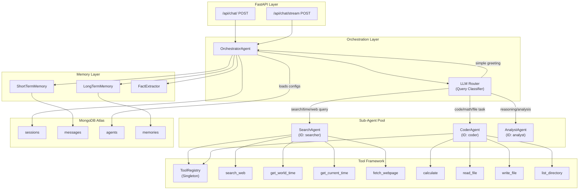
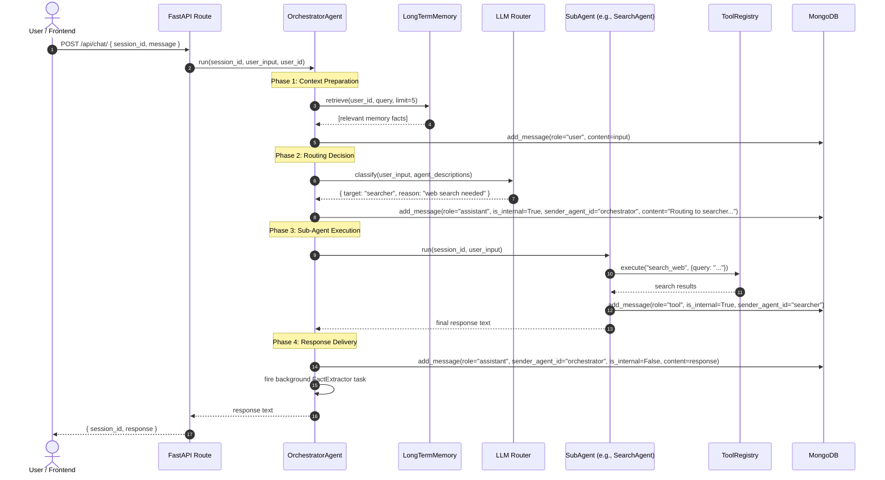
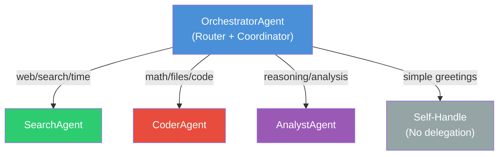
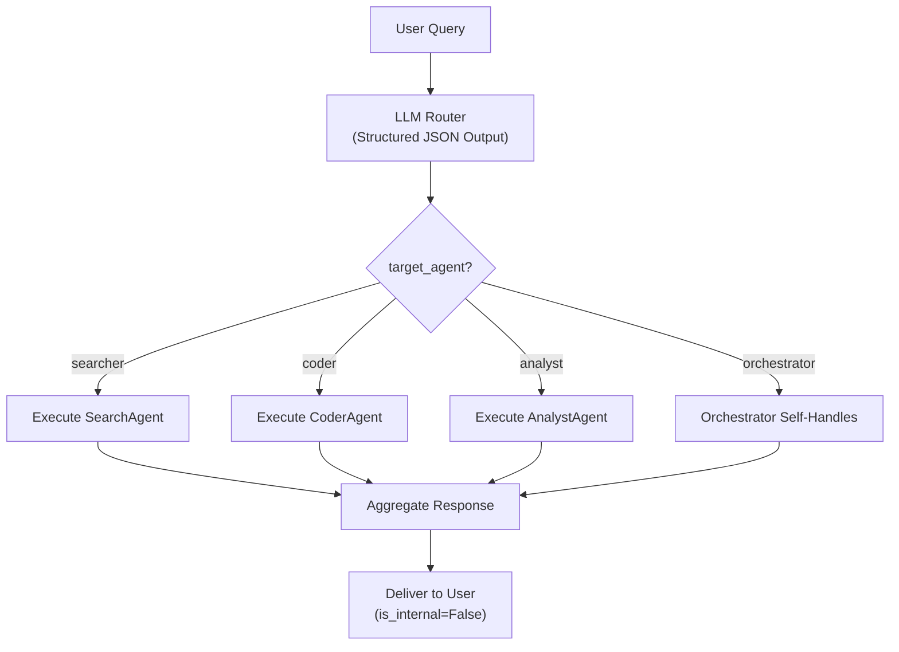
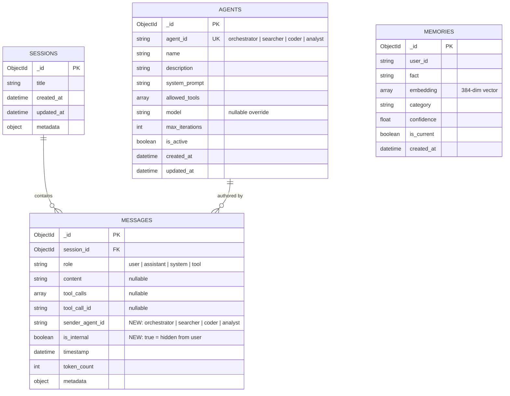
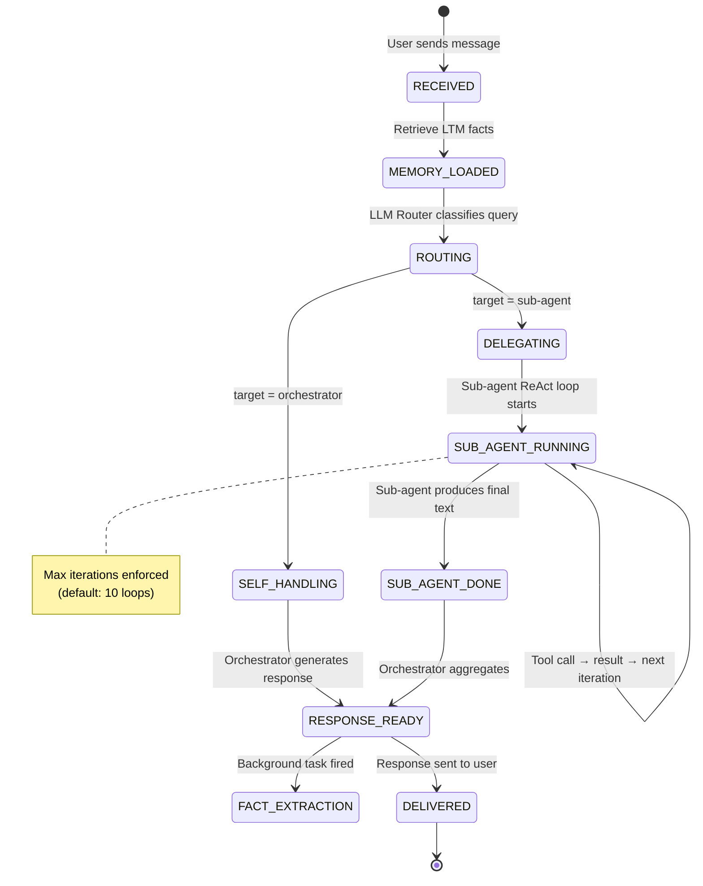
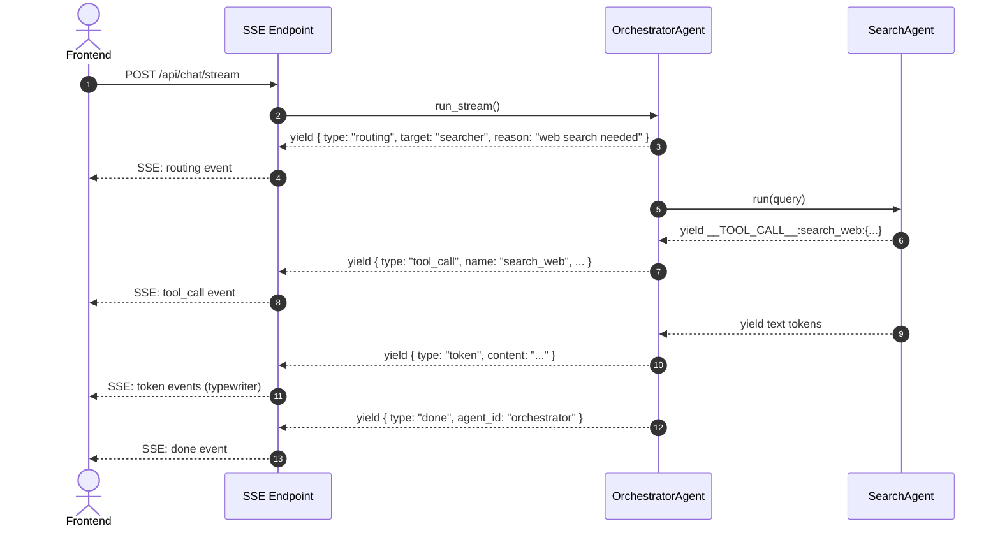
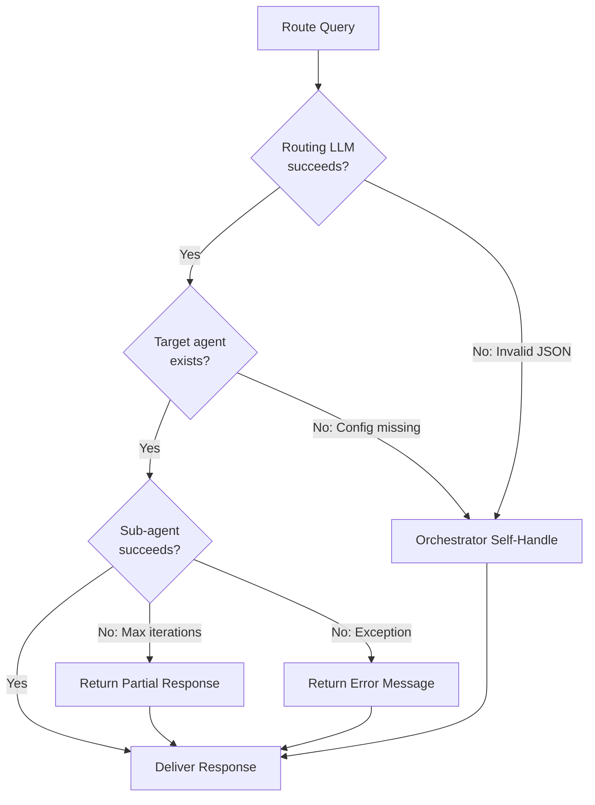
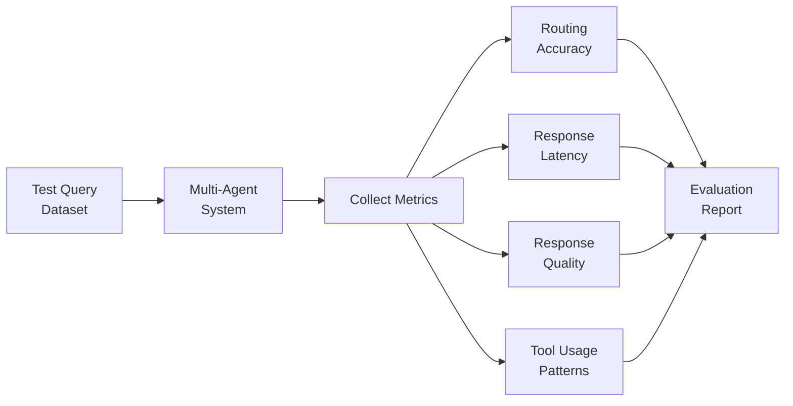
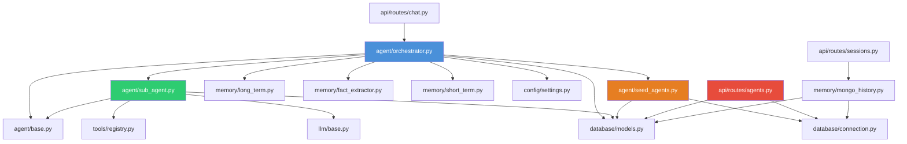

# Phase 5: Multi-Agent System — Complete Technical Design Document

> **Document Version:** 1.0.0
> **Last Updated:** June 20, 2026
> **Author:** TejasH MistrY
> **Document Number:** 06 (Doc 6)

> **Purpose** — This document serves as the complete technical architecture, design, implementation, and evaluation guide for Phase 5: Multi-Agent System. It is designed so that a new engineer can read it end-to-end and fully understand the Multi-Agent architecture before writing a single line of code.

---

## Table of Contents

1.  [Executive Summary](#1-executive-summary)
2.  [Motivation & Goals](#2-motivation--goals)
3.  [Architecture Overview](#3-architecture-overview)
4.  [System Component Inventory](#4-system-component-inventory)
5.  [Agent Design & Specialization](#5-agent-design--specialization)
6.  [Orchestration Architecture](#6-orchestration-architecture)
7.  [Communication Protocol](#7-communication-protocol)
8.  [Database Schema Changes](#8-database-schema-changes)
9.  [Memory Management in Multi-Agent Context](#9-memory-management-in-multi-agent-context)
10. [State Management](#10-state-management)
11. [Tool Access Control](#11-tool-access-control)
12. [API Layer Updates](#12-api-layer-updates)
13. [Streaming (SSE) Architecture](#13-streaming-sse-architecture)
14. [Configuration & Agent Registry](#14-configuration--agent-registry)
15. [Implementation Guide (Step-by-Step)](#15-implementation-guide-step-by-step)
16. [Error Handling & Resilience](#16-error-handling--resilience)
17. [Logging & Observability](#17-logging--observability)
18. [Testing Strategy](#18-testing-strategy)
19. [Evaluation & Monitoring](#19-evaluation--monitoring)
20. [Security Considerations](#20-security-considerations)
21. [Future Extensibility](#21-future-extensibility)

---

## 1. Executive Summary

Phase 5 transforms the existing single-agent chatbot into a **cooperative multi-agent system** where specialized sub-agents handle distinct domains of user queries, coordinated by a central **Orchestrator Agent**.

### What Changes

| Aspect | Before (Phase 4) | After (Phase 5) |
|--------|-------------------|------------------|
| Agent Architecture | Single `SimpleAgent` handles everything | `OrchestratorAgent` routes to specialized `SubAgent` instances |
| Tool Access | All tools available to one agent | Each sub-agent only accesses its permitted tools |
| Message Attribution | All messages from "assistant" | Messages tagged with `sender_agent_id` |
| Internal Deliberation | None | Agent-to-agent reasoning stored as `is_internal=True` messages |
| Routing Intelligence | None | LLM-based query classification and dynamic routing |
| Configuration | Hard-coded agent setup | Database-driven `agents` collection for dynamic agent configuration |

### What Stays the Same

- **Database**: MongoDB Atlas (Motor async client) — same connection layer
- **LLM Provider**: Groq Cloud via `GroqProvider` (or fallback `FallbackLLMProvider`)
- **Memory Systems**: Short-Term Memory (sliding window) + Long-Term Memory (vector search) — fully preserved
- **Tool Framework**: `@tool` decorator + `ToolRegistry` singleton — unchanged
- **API Layer**: FastAPI with SSE streaming — extended, not replaced
- **Fact Extraction**: Background `FactExtractor` pipeline — unchanged

---

## 2. Motivation & Goals

### 2.1 Why Multi-Agent?

The current `SimpleAgent` is a monolithic "jack-of-all-trades" — it handles web search, math, file operations, and deep reasoning all through a single system prompt and unrestricted tool access. This creates several problems:

1. **Prompt Bloat**: A single system prompt cannot be simultaneously optimized for search grounding, code generation, mathematical reasoning, and analytical thinking.
2. **Tool Overload**: Exposing all 8 tools to the LLM for every query increases hallucination risk. The LLM might invoke `write_file` when the user asked a factual question.
3. **No Separation of Concerns**: Debugging is harder because every capability lives in one monolithic agent loop.
4. **Scalability Ceiling**: Adding new capabilities (e.g., a RAG document agent) requires modifying the single agent's prompt and tool list, creating fragile coupling.

### 2.2 Design Goals

| Goal | Description |
|------|-------------|
| **Specialization** | Each sub-agent is an expert in one domain with a focused system prompt and restricted tool set |
| **Intelligent Routing** | An LLM-powered Orchestrator classifies queries and routes them to the best-suited agent |
| **Transparency** | All internal agent-to-agent deliberation is persisted in MongoDB for full auditability |
| **User Experience** | The user sees a single, clean conversation — internal routing is invisible |
| **Extensibility** | New agents can be added by inserting a document into the `agents` collection — zero code changes to the Orchestrator |
| **Backward Compatibility** | Existing API contracts (`POST /api/chat/`, `POST /api/chat/stream`, session/memory endpoints) remain unchanged |

---

## 3. Architecture Overview

### 3.1 High-Level System Diagram

```
┌───────────────────────────────────────────────────────────────────────┐
│                       FastAPI REST + SSE Layer                         │
│              POST /api/chat/    POST /api/chat/stream                 │
├───────────────────────────────────────────────────────────────────────┤
│                                                                       │
│                       ┌─────────────────────┐                         │
│                       │  OrchestratorAgent   │                         │
│                       │  ┌───────────────┐   │                         │
│                       │  │ LLM Router    │   │                         │
│                       │  │ (Query        │   │                         │
│                       │  │ Classifier)   │   │                         │
│                       │  └───────┬───────┘   │                         │
│                       │          │           │                         │
│            ┌──────────┼──────────┼───────────┼──────────┐             │
│            │          │          │           │          │             │
│    ┌───────▼──────┐ ┌─▼──────────▼─┐ ┌──────▼───────┐              │
│    │ SearchAgent  │ │  CoderAgent  │ │ AnalystAgent │              │
│    │              │ │              │ │              │              │
│    │ Tools:       │ │ Tools:       │ │ Tools: None  │              │
│    │ - search_web │ │ - calculate  │ │ (Pure LLM    │              │
│    │ - world_time │ │ - read_file  │ │  Reasoning)  │              │
│    │ - curr_time  │ │ - write_file │ │              │              │
│    │ - fetch_page │ │ - list_dir   │ │              │              │
│    └──────────────┘ └──────────────┘ └──────────────┘              │
│                                                                       │
├───────────────────────────────────────────────────────────────────────┤
│                       Memory & Storage Layer                          │
│  ┌─────────────┐  ┌──────────────┐  ┌──────────────────────────────┐│
│  │ ShortTerm   │  │ LongTerm     │  │ MongoDB Atlas                ││
│  │ Memory      │  │ Memory       │  │ ┌──────────┐ ┌────────────┐ ││
│  │ (Sliding    │  │ (Vector      │  │ │sessions  │ │messages    │ ││
│  │  Window)    │  │  Search)     │  │ │collection│ │collection  │ ││
│  └─────────────┘  └──────────────┘  │ ├──────────┤ ├────────────┤ ││
│                                      │ │agents    │ │memories    │ ││
│                                      │ │collection│ │collection  │ ││
│                                      │ └──────────┘ └────────────┘ ││
│                                      └──────────────────────────────┘│
└───────────────────────────────────────────────────────────────────────┘
```

### 3.2 Component Interaction Diagram



### 3.3 Request Lifecycle — Sequence Diagram



---

## 4. System Component Inventory

### 4.1 Existing Components (Unchanged)

| Component | File | Role |
|-----------|------|------|
| `BaseLLM` | `llm/base.py` | Abstract LLM interface |
| `GroqProvider` | `llm/groq_provider.py` | Groq Cloud API client |
| `FallbackLLMProvider` | `llm/fallback_provider.py` | Primary + fallback LLM chain |
| `EmbeddingClient` | `llm/embeddings.py` | Local `all-MiniLM-L6-v2` sentence encoder |
| `BaseTool` | `tools/base.py` | Tool wrapper with schema generation |
| `ToolRegistry` | `tools/registry.py` | Singleton tool registration and execution |
| `@tool` decorator | `tools/base.py` | Auto-registration decorator |
| All 8 tools | `tools/*.py` | `calculate`, `search_web`, `fetch_webpage`, `get_current_time`, `get_world_time`, `list_directory`, `read_file`, `write_file` |
| `BaseMemory` | `memory/base.py` | Abstract memory interface |
| `MongoDBChatHistory` | `memory/mongo_history.py` | MongoDB CRUD for sessions/messages |
| `ShortTermMemory` | `memory/short_term.py` | Sliding window context builder |
| `LongTermMemory` | `memory/long_term.py` | Vector search memory retrieval |
| `FactExtractor` | `memory/fact_extractor.py` | Background fact extraction pipeline |
| `MemoryConsolidator` | `memory/consolidator.py` | Memory deduplication and pruning |
| `DatabaseConnection` | `database/connection.py` | Async Motor connection singleton |
| `Settings` | `config/settings.py` | Pydantic BaseSettings for `.env` loading |

### 4.2 New Components (Phase 5)

| Component | File | Role |
|-----------|------|------|
| `AgentConfigModel` | `database/models.py` | Pydantic schema for agent configuration documents |
| `SubAgent` | `agent/sub_agent.py` | Generic sub-agent class with filtered tool access |
| `OrchestratorAgent` | `agent/orchestrator.py` | Central router + coordinator + response aggregator |
| Agent Seeding Script | `agent/seed_agents.py` | Seeds the `agents` MongoDB collection at startup |
| Updated `MessageModel` | `database/models.py` | Extended with `sender_agent_id` and `is_internal` fields |
| Updated `MongoDBChatHistory` | `memory/mongo_history.py` | Supports `include_internal` filtering and agent attribution |
| Updated API Routes | `api/routes/chat.py` | Initializes `OrchestratorAgent` instead of `SimpleAgent` |
| Updated Session Routes | `api/routes/sessions.py` | Supports `?include_internal=true` query parameter |

---

## 5. Agent Design & Specialization

### 5.1 Design Philosophy

Each sub-agent follows the **Single Responsibility Principle**:

- **Focused System Prompt**: Tailored for its domain, significantly shorter and more precise than a universal prompt.
- **Restricted Tool Set**: Only the tools relevant to its domain are exposed to the LLM, reducing hallucination risk.
- **Independent ReAct Loop**: Each sub-agent runs its own reasoning-action loop using the same `BaseLLM` interface.

### 5.2 Agent Specifications

#### 5.2.1 SearchAgent (ID: `searcher`)

| Property | Value |
|----------|-------|
| **Purpose** | Web queries, news search, timezone/clock details, page content parsing |
| **Allowed Tools** | `search_web`, `get_world_time`, `get_current_time`, `fetch_webpage` |
| **Trigger Queries** | "What's the news about...", "What time is it in...", "Search for...", "Find information about..." |
| **ReAct Behavior** | Performs query expansion (3 parallel Tavily searches), de-duplicates results, formats citations |

**System Prompt** (Specialized):
```
You are a Search Specialist AI. Your job is to find accurate, real-time information
from the web and present it with proper source citations.

Rules:
1. Always use search_web for factual or time-sensitive queries.
2. Use get_world_time or get_current_time for timezone queries.
3. Use fetch_webpage to extract content from specific URLs.
4. ALWAYS cite sources with markdown links: [Title](URL).
5. NEVER fabricate URLs or information not returned by your tools.
6. Prioritize recency and accuracy over comprehensiveness.
```

#### 5.2.2 CoderAgent (ID: `coder`)

| Property | Value |
|----------|-------|
| **Purpose** | Mathematical calculations, file read/write operations, directory listing |
| **Allowed Tools** | `calculate`, `list_directory`, `read_file`, `write_file` |
| **Trigger Queries** | "Calculate...", "Write a file...", "Read the file at...", "List the contents of..." |
| **ReAct Behavior** | Processes math expressions safely via AST parser, performs sandboxed file I/O |

**System Prompt** (Specialized):
```
You are a Code & Math Specialist AI. Your job is to perform precise calculations
and manage file system operations safely.

Rules:
1. Use the calculate tool for any mathematical expression. Do NOT compute math in your head.
2. Use read_file, write_file, and list_directory for file operations.
3. Always confirm file operations with the user before writing.
4. Show the calculation formula and result clearly.
5. For file reads, display the content in appropriate code blocks.
```

#### 5.2.3 AnalystAgent (ID: `analyst`)

| Property | Value |
|----------|-------|
| **Purpose** | Complex logic, deep reasoning, user profiling, multi-signal analysis, summarization |
| **Allowed Tools** | None (pure LLM reasoning) |
| **Trigger Queries** | "Explain why...", "Analyze this...", "Compare X and Y...", "Summarize...", "What should I do about..." |
| **ReAct Behavior** | Uses long-form reasoning with no tool calls — relies entirely on LLM knowledge and injected context |

**System Prompt** (Specialized):
```
You are an Analyst & Reasoning Specialist AI. Your job is to provide deep analysis,
logical reasoning, comparisons, and thoughtful recommendations.

Rules:
1. You have no external tools — rely on your training data and provided context.
2. Structure your analysis with clear sections and bullet points.
3. When comparing options, use tables or pros/cons lists.
4. Support your conclusions with reasoning chains.
5. If the question requires real-time data you don't have, clearly state that.
```

#### 5.2.4 OrchestratorAgent (ID: `orchestrator`)

| Property | Value |
|----------|-------|
| **Purpose** | Query classification, agent routing, response aggregation, simple greetings |
| **Allowed Tools** | None (delegates to sub-agents) |
| **Self-Handle Queries** | "Hello", "Thank you", "How are you?", simple conversational exchanges |
| **Behavior** | Classifies user intent → selects best agent → delegates execution → aggregates response |

### 5.3 Agent Relationship Hierarchy



---

## 6. Orchestration Architecture

### 6.1 The Orchestrator Pattern

The `OrchestratorAgent` follows the **Router-Delegator** pattern, where it:

1. **Receives** the user's query.
2. **Retrieves** long-term memories to enrich the context.
3. **Routes** the query to the best-suited sub-agent (or handles it directly).
4. **Delegates** execution to the selected sub-agent.
5. **Aggregates** the sub-agent's response into a user-facing message.
6. **Persists** all internal deliberation with `is_internal=True`.

### 6.2 LLM-Based Routing Decision

The Orchestrator uses a structured LLM call with **JSON mode** to classify user intent:

```python
ROUTING_PROMPT = """You are a query router. Analyze the user's message and decide
which specialist agent should handle it.

Available agents:
{agent_descriptions}

Respond with ONLY a JSON object:
{{
    "target_agent": "<agent_id>",
    "reason": "<brief explanation>",
    "confidence": <0.0-1.0>
}}

If the query is a simple greeting or conversational exchange, use "orchestrator" as the target.
"""
```

**Routing Decision Flow:**



### 6.3 Routing Decision Examples

| User Query | Target Agent | Reason |
|------------|-------------|--------|
| "What's the current time in Tokyo?" | `searcher` | Requires real-time timezone lookup |
| "Calculate 2^10 + sqrt(144)" | `coder` | Mathematical computation |
| "Write a Python file that prints hello world" | `coder` | File creation operation |
| "Explain the difference between REST and GraphQL" | `analyst` | Comparative analysis requiring reasoning |
| "Hello! How are you?" | `orchestrator` | Simple greeting, no specialization needed |
| "Search for latest AI news and summarize key trends" | `searcher` | Web search with news focus |
| "Read the file at /tmp/data.txt" | `coder` | File system read operation |
| "Why is MongoDB better than PostgreSQL for this project?" | `analyst` | Analytical comparison requiring reasoning |

### 6.4 Self-Handling vs Delegation

The Orchestrator **self-handles** when:
- The query is a simple greeting ("Hello", "Thanks", "Bye")
- The query is conversational and doesn't require specialized capabilities
- The routing confidence is very low (below 0.3) — fallback to Orchestrator's own reasoning

The Orchestrator **delegates** when:
- The query clearly maps to a sub-agent's domain
- Tools are required to answer the query
- The routing confidence is above 0.3

---

## 7. Communication Protocol

### 7.1 Inter-Agent Communication Model

This system uses a **Hub-and-Spoke** communication pattern:

```
        ┌──────────┐
        │  User    │
        └────┬─────┘
             │
    ┌────────▼────────┐
    │  Orchestrator    │  ◄── Hub (Central Coordinator)
    └──┬──────┬────┬──┘
       │      │    │
  ┌────▼┐ ┌──▼──┐ ┌▼─────┐
  │ SA  │ │ CA  │ │ AA   │  ◄── Spokes (Specialists)
  └─────┘ └─────┘ └──────┘
```

**Key Properties:**
- Sub-agents **never** communicate with each other directly.
- All inter-agent messages flow **through** the Orchestrator.
- The user **only** sees messages from the Orchestrator (`is_internal=False`).
- Sub-agent reasoning and tool calls are stored as `is_internal=True` messages.

### 7.2 Message Flow Protocol

```
1. User → Orchestrator: "What time is it in London?"
2. Orchestrator → Database: Save user message (is_internal=False)
3. Orchestrator → LLM Router: Classify query
4. Orchestrator → Database: Save routing decision (is_internal=True, sender_agent_id="orchestrator")
5. Orchestrator → SearchAgent: Execute(query)
6. SearchAgent → ToolRegistry: execute("get_world_time", {iana_timezone: "Europe/London"})
7. ToolRegistry → SearchAgent: "Current time in Europe/London: ..."
8. SearchAgent → Database: Save tool call + result (is_internal=True, sender_agent_id="searcher")
9. SearchAgent → Orchestrator: Final response text
10. Orchestrator → Database: Save user-facing response (is_internal=False, sender_agent_id="orchestrator")
11. Orchestrator → User: "The current time in London is..."
```

### 7.3 Message Attribution Schema

Every message in the `messages` collection now carries attribution metadata:

| Field | Type | Description |
|-------|------|-------------|
| `sender_agent_id` | `Optional[str]` | Which agent authored this message: `"orchestrator"`, `"searcher"`, `"coder"`, `"analyst"`, or `None` (for user messages) |
| `is_internal` | `bool` | `False` = user-facing conversation bubble. `True` = internal agent deliberation (hidden from user by default) |

---

## 8. Database Schema Changes

### 8.1 Updated `MessageModel`

Two new fields are added to the existing `MessageModel` in `database/models.py`:

```python
class MessageModel(BaseModel):
    # ... existing fields unchanged ...
    id: Optional[PyObjectId] = Field(default=None, alias="_id")
    session_id: PyObjectId = Field(...)
    role: str = Field(...)
    content: Optional[str] = Field(default=None)
    tool_calls: Optional[List[Dict[str, Any]]] = Field(default=None)
    tool_call_id: Optional[str] = Field(default=None)
    timestamp: datetime = Field(default_factory=lambda: datetime.now(timezone.utc))
    token_count: Optional[int] = Field(default=None)
    metadata: Dict[str, Any] = Field(default_factory=dict)

    # ── Phase 5: Multi-Agent Attribution ──
    sender_agent_id: Optional[str] = Field(
        default=None,
        description="Agent that authored this message: 'orchestrator', 'searcher', 'coder', 'analyst'"
    )
    is_internal: bool = Field(
        default=False,
        description="True = internal agent deliberation, hidden from user. False = user-facing."
    )
```

**Backward Compatibility**: Both new fields have defaults (`None` and `False`), so existing documents in MongoDB are unaffected. Old messages without these fields will be treated as non-internal, non-attributed messages — exactly the same behavior as before.

### 8.2 New `AgentConfigModel`

A new Pydantic model for the `agents` collection:

```python
class AgentConfigModel(BaseModel):
    """
    Schema for agent configuration documents stored in the 'agents' MongoDB collection.
    Each document defines a sub-agent's identity, behavior, and permitted capabilities.
    """
    id: Optional[PyObjectId] = Field(default=None, alias="_id")

    # ── Agent Identity ──
    agent_id: str = Field(..., description="Unique agent identifier: 'orchestrator', 'searcher', 'coder', 'analyst'")
    name: str = Field(..., description="Human-readable agent name")
    description: str = Field(..., description="One-line summary used by the Orchestrator for routing decisions")

    # ── Agent Behavior ──
    system_prompt: str = Field(..., description="Full system prompt injected into the agent's LLM context")
    allowed_tools: List[str] = Field(
        default_factory=list,
        description="Tool names this agent is permitted to use (empty = no tool access)"
    )

    # ── Optional Overrides ──
    model: Optional[str] = Field(
        default=None,
        description="Override LLM model for this agent (e.g., 'llama3-70b-8192' for analyst)"
    )
    max_iterations: int = Field(
        default=10,
        description="Maximum ReAct loop iterations before forced termination"
    )
    is_active: bool = Field(
        default=True,
        description="Whether this agent is available for routing"
    )

    # ── Timestamps ──
    created_at: datetime = Field(default_factory=lambda: datetime.now(timezone.utc))
    updated_at: datetime = Field(default_factory=lambda: datetime.now(timezone.utc))

    model_config = {
        "populate_by_name": True,
        "arbitrary_types_allowed": True,
    }
```

### 8.3 Updated Entity Relationship Diagram



### 8.4 MongoDB Index Strategy

```javascript
// Existing indexes (unchanged)
db.messages.createIndex({ session_id: 1, timestamp: 1 })
db.sessions.createIndex({ updated_at: -1 })

// New Phase 5 indexes
db.messages.createIndex({ session_id: 1, is_internal: 1, timestamp: 1 })
db.agents.createIndex({ agent_id: 1 }, { unique: true })
db.agents.createIndex({ is_active: 1 })
```

---

## 9. Memory Management in Multi-Agent Context

### 9.1 Memory Architecture (Multi-Agent)

```
┌─────────────────────────────────────────────────────────┐
│                    Memory Layer                          │
│                                                          │
│  ┌──────────────────┐    ┌───────────────────────────┐  │
│  │ Short-Term Memory │    │ Long-Term Memory (Vector)  │  │
│  │                   │    │                            │  │
│  │ • Sliding window  │    │ • Fact retrieval via       │  │
│  │   (last N msgs)   │    │   cosine similarity        │  │
│  │ • System prompt   │    │ • Background extraction    │  │
│  │   injection       │    │ • Memory consolidation     │  │
│  │ • is_internal     │    │                            │  │
│  │   filtering (NEW) │    │ Shared across all agents   │  │
│  └──────────────────┘    └───────────────────────────┘  │
│                                                          │
│  ┌──────────────────────────────────────────────────┐   │
│  │ Agent Configuration Memory (NEW)                  │   │
│  │                                                    │   │
│  │ • Loaded from 'agents' collection at startup      │   │
│  │ • Cached in OrchestratorAgent._agent_configs      │   │
│  │ • Contains system prompts, tool permissions        │   │
│  └──────────────────────────────────────────────────┘   │
└─────────────────────────────────────────────────────────┘
```

### 9.2 How Each Memory System Is Affected

#### Short-Term Memory
- **Change**: The `get_messages()` method in `MongoDBChatHistory` now supports an `include_internal` parameter.
- **Default Behavior**: `include_internal=False` — only user-facing messages are loaded into the context window.
- **Internal Access**: When `include_internal=True`, all messages (including routing decisions and sub-agent tool calls) are returned.
- **Impact**: The sliding context window only counts user-facing messages, preventing internal deliberation from consuming the context budget.

```python
# Updated signature
async def get_messages(self, session_id: str, include_internal: bool = False, **kwargs) -> List[Dict]:
    query = {"session_id": ObjectId(session_id)}
    if not include_internal:
        query["$or"] = [
            {"is_internal": {"$exists": False}},  # backward compat
            {"is_internal": False}
        ]
    # ... rest of query
```

#### Long-Term Memory
- **Change**: None. LTM operates at the `user_id` level, not the agent level.
- **All agents share the same user memory pool** — when the SearchAgent finds that the user prefers Python, this fact is stored in LTM and available to all agents on future queries.
- **Fact Extraction** is triggered only once per Orchestrator turn (not per sub-agent), preventing duplicate fact insertion.

#### Agent Configuration Memory
- **New**: Agent configurations are loaded from the `agents` collection at startup.
- **The Orchestrator caches all agent configs** in memory for fast routing decisions.
- **Configs can be updated at runtime** by modifying the `agents` collection — the Orchestrator can reload on demand.

### 9.3 Memory Isolation Matrix

| Memory Type | Orchestrator | SearchAgent | CoderAgent | AnalystAgent |
|-------------|:---:|:---:|:---:|:---:|
| Short-Term (user-facing history) | ✅ Read/Write | ❌ | ❌ | ❌ |
| Short-Term (internal trace) | ✅ Write | ✅ Write | ✅ Write | ✅ Write |
| Long-Term (vector memories) | ✅ Read | ❌ | ❌ | ❌ |
| Fact Extraction (background) | ✅ Triggers | ❌ | ❌ | ❌ |
| Agent Config (MongoDB) | ✅ Read | ❌ | ❌ | ❌ |

**Key Design Decision**: Sub-agents do **not** directly access short-term or long-term memory. The Orchestrator retrieves relevant memories and passes them as context to the sub-agent's system prompt. This ensures:
1. Sub-agents can't accidentally overwrite user-facing messages.
2. Memory retrieval happens once per turn, not once per agent.
3. The Orchestrator controls what context each sub-agent sees.

---

## 10. State Management

### 10.1 State Machine for a Single Request



### 10.2 Orchestrator Internal State

The `OrchestratorAgent` maintains the following state per request:

```python
@dataclass
class OrchestratorState:
    """Internal state tracked during a single orchestration cycle."""
    session_id: str
    user_id: str
    user_input: str
    memory_facts: List[str]         # Retrieved LTM facts
    routing_decision: Dict          # { target_agent, reason, confidence }
    selected_agent: Optional[str]   # The agent_id that was selected
    sub_agent_response: Optional[str]  # The sub-agent's final response
    final_response: Optional[str]   # The user-facing response
    start_time: float               # Request start timestamp
    total_tool_calls: int           # Number of tool calls executed
```

This state is **ephemeral** — it exists only for the lifetime of a single `run()` or `run_stream()` call and is not persisted. The persistent audit trail is in the `messages` collection via `is_internal=True` messages.

### 10.3 Session State

Session state is unchanged from Phase 4:
- **Session ID**: Unique identifier for a conversation thread
- **Messages**: Ordered list of messages (now with `sender_agent_id` and `is_internal` metadata)
- **Session Metadata**: Title, created_at, updated_at (unchanged)

---

## 11. Tool Access Control

### 11.1 Tool Filtering Mechanism

The `SubAgent` class implements tool access control by filtering the global `ToolRegistry`:

```python
class SubAgent:
    def __init__(self, config: AgentConfigModel, llm: BaseLLM):
        self.config = config
        self.llm = llm

    def _get_filtered_tool_schemas(self) -> List[Dict]:
        """Returns only the tool schemas this agent is permitted to use."""
        all_schemas = registry.get_all_tool_schemas()
        if not self.config.allowed_tools:
            return []  # No tool access (e.g., AnalystAgent)
        return [
            schema for schema in all_schemas
            if schema["function"]["name"] in self.config.allowed_tools
        ]

    async def _execute_tool(self, tool_name: str, args: Dict) -> str:
        """Executes a tool ONLY if it's in the agent's allowed list."""
        if tool_name not in self.config.allowed_tools:
            return f"Error: Agent '{self.config.agent_id}' is not permitted to use tool '{tool_name}'."
        return await registry.execute(tool_name, args)
```

### 11.2 Tool Permission Matrix

| Tool | SearchAgent | CoderAgent | AnalystAgent | Orchestrator |
|------|:---:|:---:|:---:|:---:|
| `search_web` | ✅ | ❌ | ❌ | ❌ |
| `fetch_webpage` | ✅ | ❌ | ❌ | ❌ |
| `get_current_time` | ✅ | ❌ | ❌ | ❌ |
| `get_world_time` | ✅ | ❌ | ❌ | ❌ |
| `calculate` | ❌ | ✅ | ❌ | ❌ |
| `read_file` | ❌ | ✅ | ❌ | ❌ |
| `write_file` | ❌ | ✅ | ❌ | ❌ |
| `list_directory` | ❌ | ✅ | ❌ | ❌ |

### 11.3 Security Enforcement

Tool access is enforced at **two layers**:

1. **Schema Filtering** (Soft): The LLM only sees tool schemas for its permitted tools. It cannot request a tool it doesn't know about.
2. **Execution Guard** (Hard): Even if an LLM somehow generates a tool call for a non-permitted tool, the `_execute_tool` method rejects it with an error message.

---

## 12. API Layer Updates

### 12.1 Endpoint Changes Summary

| Endpoint | Change | Details |
|----------|--------|---------|
| `POST /api/chat/` | **Modified** | Initializes `OrchestratorAgent` instead of `SimpleAgent` |
| `POST /api/chat/stream` | **Modified** | Streams via `OrchestratorAgent.run_stream()` |
| `GET /api/sessions/{id}/messages` | **Modified** | New query parameter `?include_internal=false` |
| `GET /api/agents/` | **New** | Lists all registered agent configurations |
| `GET /api/agents/{agent_id}` | **New** | Gets a specific agent's configuration |

### 12.2 New Agent Configuration Endpoints

#### `GET /api/agents/`
```
Response 200:
{
    "agents": [
        {
            "agent_id": "orchestrator",
            "name": "Orchestrator",
            "description": "Central router and coordinator",
            "allowed_tools": [],
            "is_active": true
        },
        {
            "agent_id": "searcher",
            "name": "Search Specialist",
            "description": "Web queries, news, timezone lookups",
            "allowed_tools": ["search_web", "get_world_time", "get_current_time", "fetch_webpage"],
            "is_active": true
        },
        ...
    ]
}
```

#### `GET /api/agents/{agent_id}`
```
Response 200:
{
    "agent_id": "searcher",
    "name": "Search Specialist",
    "description": "Web queries, news, timezone lookups",
    "system_prompt": "You are a Search Specialist AI...",
    "allowed_tools": ["search_web", "get_world_time", "get_current_time", "fetch_webpage"],
    "model": null,
    "max_iterations": 10,
    "is_active": true
}
```

### 12.3 Updated Messages Endpoint

```python
@router.get("/{session_id}/messages")
async def get_session_messages(
    session_id: str,
    include_internal: bool = Query(False, description="Include internal agent deliberation messages")
):
    messages = await db_history.get_messages(session_id, include_internal=include_internal)
    return {"session_id": session_id, "messages": messages}
```

### 12.4 Chat Response Schema (Extended)

The chat response now includes agent attribution metadata:

```python
class ChatResponse(BaseModel):
    session_id: str
    response: str
    agent_id: str = "orchestrator"  # Which agent generated the response
    routing: Optional[Dict] = None   # { target_agent, reason, confidence }
```

---

## 13. Streaming (SSE) Architecture

### 13.1 SSE Event Types (Extended)

| Event Type | Payload | Description |
|------------|---------|-------------|
| `routing` | `{ type: "routing", target: "searcher", reason: "..." }` | **NEW**: Orchestrator announces which agent will handle the query |
| `tool_call` | `{ type: "tool_call", name: "search_web", arguments: "..." }` | Sub-agent is executing a tool |
| `token` | `{ type: "token", content: "..." }` | Text content chunk for typewriter display |
| `done` | `{ type: "done", agent_id: "orchestrator" }` | Stream completion signal |
| `error` | `{ type: "error", detail: "..." }` | Error during processing |

### 13.2 SSE Flow with Multi-Agent



---

## 14. Configuration & Agent Registry

### 14.1 Agent Seeding

At application startup (during FastAPI lifespan), the `agents` collection is seeded if empty:

```python
# agent/seed_agents.py

AGENT_CONFIGS = [
    {
        "agent_id": "orchestrator",
        "name": "Orchestrator",
        "description": "Central router and coordinator. Handles simple greetings and delegates specialized queries.",
        "system_prompt": "...",  # Routing-focused prompt
        "allowed_tools": [],
        "max_iterations": 1
    },
    {
        "agent_id": "searcher",
        "name": "Search Specialist",
        "description": "Handles web searches, news queries, timezone lookups, and webpage content extraction.",
        "system_prompt": "...",  # Search-focused prompt
        "allowed_tools": ["search_web", "get_world_time", "get_current_time", "fetch_webpage"],
        "max_iterations": 10
    },
    {
        "agent_id": "coder",
        "name": "Code & Math Specialist",
        "description": "Handles mathematical calculations, file reading, file writing, and directory listing.",
        "system_prompt": "...",  # Code-focused prompt
        "allowed_tools": ["calculate", "list_directory", "read_file", "write_file"],
        "max_iterations": 10
    },
    {
        "agent_id": "analyst",
        "name": "Analyst & Reasoning Specialist",
        "description": "Handles complex reasoning, analysis, comparisons, summarization, and recommendations.",
        "system_prompt": "...",  # Reasoning-focused prompt
        "allowed_tools": [],
        "max_iterations": 5
    }
]

async def seed_agents(db):
    """Seeds agent configurations if the collection is empty."""
    agents_col = db["agents"]
    count = await agents_col.count_documents({})
    if count == 0:
        await agents_col.insert_many(AGENT_CONFIGS)
        logger.info(f"Seeded {len(AGENT_CONFIGS)} agent configurations")
    else:
        logger.info(f"Agent configurations already seeded ({count} agents found)")
```

### 14.2 Dynamic Agent Loading

The Orchestrator loads agent configurations at initialization:

```python
class OrchestratorAgent:
    async def _load_agent_configs(self):
        """Loads all active agent configs from the 'agents' collection."""
        agents_col = db_client.db["agents"]
        cursor = agents_col.find({"is_active": True})
        self._agent_configs = {}
        async for doc in cursor:
            config = AgentConfigModel(**doc)
            self._agent_configs[config.agent_id] = config
```

### 14.3 Adding a New Agent (Zero Code Changes)

To add a new specialist (e.g., a `TranslatorAgent`):

1. Insert a document into the `agents` collection:
```javascript
db.agents.insertOne({
    agent_id: "translator",
    name: "Language Translator",
    description: "Translates text between languages using reasoning.",
    system_prompt: "You are a Translation Specialist...",
    allowed_tools: [],
    max_iterations: 3,
    is_active: true
})
```

2. Restart the server (or call a reload endpoint). The Orchestrator will:
   - Load the new config automatically
   - Include "translator" in routing decisions
   - Create a `SubAgent` instance with the new config when a translation query arrives

**Zero Python code changes required.**

---

## 15. Implementation Guide (Step-by-Step)

### Step 1: Database Schema Updates

**Files Modified**: `database/models.py`

| Task | Description |
|------|-------------|
| 1.1 | Add `sender_agent_id: Optional[str]` field to `MessageModel` |
| 1.2 | Add `is_internal: bool` field to `MessageModel` with default `False` |
| 1.3 | Create new `AgentConfigModel` class |

### Step 2: Update MongoDBChatHistory

**Files Modified**: `memory/mongo_history.py`

| Task | Description |
|------|-------------|
| 2.1 | Update `add_message()` to accept `sender_agent_id` and `is_internal` kwargs |
| 2.2 | Update `get_messages()` to accept `include_internal` parameter |
| 2.3 | Default `get_messages()` to filter out `is_internal=True` messages |
| 2.4 | Ensure backward compatibility with existing messages that lack the new fields |

### Step 3: Create Agent Seeding Script

**Files Created**: `agent/seed_agents.py`

| Task | Description |
|------|-------------|
| 3.1 | Define `AGENT_CONFIGS` list with all 4 agent configurations |
| 3.2 | Write `seed_agents()` async function |
| 3.3 | Add full system prompts for each agent |

### Step 4: Implement SubAgent

**Files Created**: `agent/sub_agent.py`

| Task | Description |
|------|-------------|
| 4.1 | Create `SubAgent` class |
| 4.2 | Implement `_get_filtered_tool_schemas()` for tool access control |
| 4.3 | Implement `_execute_tool()` with permission guard |
| 4.4 | Implement `run()` method with ReAct loop (adapted from `SimpleAgent`) |
| 4.5 | Implement `run_stream()` method with SSE token yielding |
| 4.6 | Add internal message persistence (`is_internal=True`) for all sub-agent actions |

### Step 5: Implement OrchestratorAgent

**Files Created**: `agent/orchestrator.py`

| Task | Description |
|------|-------------|
| 5.1 | Create `OrchestratorAgent` extending `BaseAgent` |
| 5.2 | Implement `_load_agent_configs()` to load configs from MongoDB |
| 5.3 | Implement `_route_query()` using structured LLM JSON output |
| 5.4 | Implement `_create_sub_agent()` factory method |
| 5.5 | Implement `run()` with routing → delegation → aggregation pipeline |
| 5.6 | Implement `run_stream()` with SSE forwarding (routing events + sub-agent tokens) |
| 5.7 | Integrate LTM retrieval and FactExtractor background tasks |
| 5.8 | Implement self-handling for simple greetings |

### Step 6: Update API Lifespan (Agent Seeding)

**Files Modified**: `api/main.py`

| Task | Description |
|------|-------------|
| 6.1 | Import `seed_agents` function |
| 6.2 | Call `await seed_agents(db_client.db)` during FastAPI lifespan startup |

### Step 7: Update API Routes

**Files Modified**: `api/routes/chat.py`, `api/routes/sessions.py`

| Task | Description |
|------|-------------|
| 7.1 | Replace `SimpleAgent` with `OrchestratorAgent` in chat routes |
| 7.2 | Update SSE generator to handle new event types (`routing`) |
| 7.3 | Add `include_internal` query parameter to `GET /sessions/{id}/messages` |

### Step 8: Create Agent Routes

**Files Created**: `api/routes/agents.py`

| Task | Description |
|------|-------------|
| 8.1 | Create `GET /api/agents/` endpoint |
| 8.2 | Create `GET /api/agents/{agent_id}` endpoint |
| 8.3 | Register router in `api/main.py` |

### Step 9: Verification & Testing

**Files Created**: `Test_Scripts/test_multi_agent.py`

| Task | Description |
|------|-------------|
| 9.1 | Test search routing: "What is the current time in Tokyo?" |
| 9.2 | Test coder routing: "Calculate 2^10 + sqrt(144)" |
| 9.3 | Test analyst routing: "Explain REST vs GraphQL" |
| 9.4 | Test self-handling: "Hello! How are you?" |
| 9.5 | Test internal message filtering: verify `is_internal` messages are hidden by default |
| 9.6 | Test SSE streaming with routing events |

---

## 16. Error Handling & Resilience

### 16.1 Error Scenarios and Mitigation

| Scenario | Mitigation |
|----------|------------|
| **Routing LLM returns invalid JSON** | Fallback: route to Orchestrator's own reasoning |
| **Sub-agent exceeds max iterations** | Force termination after `max_iterations` loops and return partial response |
| **Sub-agent tool execution fails** | Tool-level error handling (existing) + sub-agent error message in response |
| **Agent config not found in MongoDB** | Fallback to Orchestrator self-handling with warning log |
| **LLM rate limit (HTTP 429)** | Tenacity retry (existing) applies to all agents equally |
| **MongoDB connection failure** | Existing `DatabaseConnection` retry logic |
| **Empty agents collection** | Auto-seed at startup (Step 6) |

### 16.2 Fallback Chain



### 16.3 Max Iteration Guard

```python
async def run(self, session_id, user_input):
    iteration = 0
    while iteration < self.config.max_iterations:
        iteration += 1
        response = await self.llm.generate(context, tools=tool_schemas)

        if "tool_calls" in response and response["tool_calls"]:
            # Process tool calls...
            continue
        else:
            return response.get("content", "")

    # Forced termination
    logger.warning(f"SubAgent '{self.config.agent_id}' exceeded max iterations ({self.config.max_iterations})")
    return "I apologize, but I wasn't able to complete the task within the allowed processing steps."
```

---

## 17. Logging & Observability

### 17.1 Log Categories

Phase 5 adds a new category of structured logs for multi-agent operations:

| Log Category | Format | Example |
|-------------|--------|---------|
| **Routing** | `[INFO] Orchestrator: Routing query to <agent> because <reason>` | `Orchestrator: Routing query to 'searcher' because 'user asked about current events'` |
| **Delegation** | `[INFO] Orchestrator: Delegating to SubAgent '<agent_id>'` | `Orchestrator: Delegating to SubAgent 'searcher'` |
| **Sub-Agent Start** | `[INFO] SubAgent '<agent_id>': Starting ReAct loop` | `SubAgent 'searcher': Starting ReAct loop` |
| **Sub-Agent Tool** | `[INFO] SubAgent '<agent_id>': Executing tool '<tool>' ` | `SubAgent 'searcher': Executing tool 'search_web'` |
| **Sub-Agent Complete** | `[INFO] SubAgent '<agent_id>': Completed (N iterations, M tool calls)` | `SubAgent 'searcher': Completed (3 iterations, 2 tool calls)` |
| **Self-Handle** | `[INFO] Orchestrator: Self-handling query (greeting/conversational)` | — |
| **Config Load** | `[INFO] Orchestrator: Loaded N agent configurations` | `Orchestrator: Loaded 4 agent configurations` |

### 17.2 Trace-Level Logging

All multi-agent operations will use the existing `config/logging_config.py` logger with structured prefixes:

```python
# In orchestrator.py
logger.info(f"Orchestrator: Routing query to '{target}' because '{reason}' (confidence: {confidence})")

# In sub_agent.py
logger.info(f"SubAgent '{self.config.agent_id}': Executing tool '{tool_name}' with args: {args}")
logger.info(f"SubAgent '{self.config.agent_id}': Tool '{tool_name}' completed ({len(result)} chars)")
```

---

## 18. Testing Strategy

### 18.1 Integration Test Matrix

| Test Case | Input | Expected Behavior |
|-----------|-------|-------------------|
| Search Routing | "What is the current time in Tokyo?" | Routes to `searcher`, executes `get_world_time` tool |
| Coder Routing | "Calculate 2^10 + sqrt(144)" | Routes to `coder`, executes `calculate` tool |
| Analyst Routing | "Explain REST vs GraphQL" | Routes to `analyst`, pure LLM reasoning (no tools) |
| Self-Handling | "Hello, how are you?" | Orchestrator responds directly (no delegation) |
| Internal Filtering | Fetch messages with `include_internal=False` | Only user-facing messages returned |
| Internal Tracing | Fetch messages with `include_internal=True` | Internal routing + tool calls visible |
| Agent Attribution | Check `sender_agent_id` on messages | Correct agent IDs on each message |
| Tool ACL | Sub-agent tries non-permitted tool | Error message returned |
| Max Iteration Guard | Complex query requiring > max_iterations | Graceful termination with partial response |
| SSE Routing Event | Stream a search query | First SSE event is `type: "routing"` |

### 18.2 Test Script Structure

```python
# Test_Scripts/test_multi_agent.py

import httpx
import asyncio

BASE_URL = "http://localhost:8000/api"

async def test_search_routing():
    """Verify that search queries route to the SearchAgent."""
    # Create session
    session = httpx.post(f"{BASE_URL}/sessions/").json()
    session_id = session["session_id"]

    # Send search query
    response = httpx.post(f"{BASE_URL}/chat/", json={
        "session_id": session_id,
        "message": "What is the current time in Tokyo?"
    }).json()

    assert response["response"]  # Non-empty response
    assert response.get("agent_id") == "orchestrator"  # Response attributed to orchestrator

    # Verify internal messages exist
    messages = httpx.get(f"{BASE_URL}/sessions/{session_id}/messages?include_internal=true").json()
    internal_msgs = [m for m in messages["messages"] if m.get("is_internal")]
    assert len(internal_msgs) > 0, "Internal routing messages should exist"

    # Verify user-facing messages are clean
    clean_msgs = httpx.get(f"{BASE_URL}/sessions/{session_id}/messages").json()
    for m in clean_msgs["messages"]:
        assert not m.get("is_internal", False), "No internal messages in default view"
```

---

## 19. Evaluation & Monitoring

### 19.1 Key Metrics

| Metric | Description | How to Measure |
|--------|-------------|----------------|
| **Routing Accuracy** | % of queries routed to the correct agent | Manual evaluation on test dataset |
| **Average Response Latency** | Time from user input to response delivery | `time.time()` delta in OrchestratorAgent |
| **Routing Overhead** | Time spent on routing decision only | `time.time()` delta around `_route_query()` |
| **Tool Call Count** | Average number of tool calls per sub-agent per query | Count from internal messages |
| **Iteration Count** | Average ReAct loop iterations per sub-agent | Counter in SubAgent.run() |
| **Fallback Rate** | % of queries where routing fails and Orchestrator self-handles | Log analysis |
| **Agent Utilization** | Distribution of queries across agents | Aggregate `sender_agent_id` from messages |

### 19.2 Monitoring Dashboard Data

Every Orchestrator request will log a summary JSON blob for monitoring:

```python
logger.info(json.dumps({
    "event": "orchestration_complete",
    "session_id": session_id,
    "user_id": user_id,
    "target_agent": routing_decision["target_agent"],
    "routing_confidence": routing_decision["confidence"],
    "total_tool_calls": total_tool_calls,
    "total_iterations": iteration_count,
    "latency_ms": (time.time() - start_time) * 1000,
    "response_length": len(final_response)
}))
```

### 19.3 Evaluation Framework



---

## 20. Security Considerations

### 20.1 Tool Access Control
- Sub-agents can **only** execute tools in their `allowed_tools` list.
- Tool access is enforced at both schema level (LLM doesn't see non-permitted tools) and execution level (hard guard in `_execute_tool`).

### 20.2 Internal Message Privacy
- Internal messages (`is_internal=True`) are **never** exposed to end users by default.
- The `include_internal=true` query parameter should be restricted in production (admin-only).

### 20.3 Prompt Injection Defense
- Each sub-agent has a focused system prompt, reducing the attack surface.
- The Orchestrator validates routing JSON before acting on it.
- Tool inputs are validated by the existing `BaseTool.execute()` error handling.

### 20.4 Agent Configuration Security
- Agent configs are stored in MongoDB, not in code — changes require database access.
- The `is_active` flag allows disabling agents without deleting their configuration.

---

## 21. Future Extensibility

### 21.1 Phase 6: Knowledge Graph Integration
- Add entity extraction to sub-agent responses
- Build relationship graphs between entities across conversations
- Enable the AnalystAgent to query the knowledge graph for complex reasoning

### 21.2 Phase 7: Advanced RAG Agent
- Add a new `RAGAgent` with tools for document chunking, embedding, and retrieval
- Zero code changes to Orchestrator — just add an `agents` collection document

### 21.3 Multi-Agent Collaboration
- Enable the Orchestrator to invoke **multiple agents** for complex queries
- Example: "Search for the latest Python 3.12 features and write a summary file"
  - Route to `SearchAgent` → get search results
  - Route to `CoderAgent` → write the results to a file
  - Orchestrator chains the two responses

### 21.4 Agent Self-Evaluation
- After each response, the Orchestrator asks an LLM to rate the response quality
- Low-quality responses trigger automatic re-routing to a different agent

### 21.5 Custom User Agents
- Allow users to create personalized agents via API
- Store custom system prompts and tool configurations in the `agents` collection
- Enable per-user agent routing preferences

### 21.6 Agent Communication Protocol v2
- Move from Hub-and-Spoke to a **Peer-to-Peer** model where agents can directly request assistance from each other
- Example: AnalystAgent can ask SearchAgent for real-time data mid-reasoning

---

## Appendix A: File Change Summary

| File | Action | Description |
|------|--------|-------------|
| `database/models.py` | **MODIFY** | Add `sender_agent_id`, `is_internal` to `MessageModel`; add `AgentConfigModel` |
| `memory/mongo_history.py` | **MODIFY** | Support `include_internal` filtering and agent attribution |
| `agent/sub_agent.py` | **NEW** | Generic sub-agent with filtered tool access and ReAct loop |
| `agent/orchestrator.py` | **NEW** | Central router, delegator, and response aggregator |
| `agent/seed_agents.py` | **NEW** | Agent configuration seeding script |
| `api/main.py` | **MODIFY** | Add agent seeding to lifespan startup |
| `api/routes/chat.py` | **MODIFY** | Replace `SimpleAgent` with `OrchestratorAgent` |
| `api/routes/sessions.py` | **MODIFY** | Add `include_internal` query parameter |
| `api/routes/agents.py` | **NEW** | Agent configuration endpoints |
| `Test_Scripts/test_multi_agent.py` | **NEW** | Integration tests for multi-agent system |

## Appendix B: Dependency Diagram



---

> **Document Version**: 1.0.0
> **Last Updated**: June 20, 2026
> **Author**: TejasH MistrY
