# Comprehensive Research & Design Document: Agentic AI Systems, Multi-Agent Architectures, and Memory Design

> **Document Version:** 1.0.0  
> **Last Updated:** June 20, 2026  
> **Author:** TejasH MistrY  
> **Document Number:** 07 (Doc 7)  

> **Purpose** — This document serves as a comprehensive system design reference and learning guide for engineers, architects, and researchers. It details the architectures, design patterns, memory designs, failure handling mechanisms, evaluation frameworks, and production operations of leading single-agent and multi-agent systems, drawing insights from industry architectures like OpenAI (ChatGPT / Deep Research), Anthropic (Claude / MCP), and Perplexity.

---

## Table of Contents

1. [Part 1: Agentic AI Fundamentals](#part-1-agentic-ai-fundamentals)
2. [Part 2: Research on OpenAI (ChatGPT)](#part-2-research-on-openai-chatgpt)
3. [Part 3: Research on Anthropic Claude](#part-3-research-on-anthropic-claude)
4. [Part 4: Research on Perplexity](#part-4-research-on-perplexity)
5. [Part 5: Single-Agent Design Patterns](#part-5-single-agent-design-patterns)
6. [Part 6: Multi-Agent Architecture](#part-6-multi-agent-architecture)
7. [Part 7: Agent Memory Architecture](#part-7-agent-memory-architecture)
8. [Part 8: Failure Handling & Recovery](#part-8-failure-handling--recovery)
9. [Part 9: Agent Evaluation Framework](#part-9-agent-evaluation-framework)
10. [Part 10: Technology Stack & Frameworks](#part-10-technology-stack--frameworks)
11. [Part 11: Production-Grade Agent Platform Design](#part-11-production-grade-agent-platform-design)
12. [Part 12: End-to-End Case Studies](#part-12-end-to-end-case-studies)

---

# Part 1: Agentic AI Fundamentals

## 1.1 What is an AI Agent?

### 1.1.1 Definition & Core Characteristics
An **AI Agent** is an autonomous software entity powered by a foundation model (typically a Large Language Model) that observes its environment, performs reasoning, makes decisions, and executes actions using tools to achieve specific goals. 

Unlike traditional static software that follows hardcoded logic pipelines, or standard conversational LLMs that generate passive textual responses, an AI Agent operates in a loop of perception, reasoning, and action (often referred to as the ReAct paradigm).

The key characteristics of an AI Agent include:
*   **Autonomy**: Operating without constant step-by-step human intervention.
*   **Goal-Orientedness**: Aligning behaviors and actions to satisfy a high-level goal or objective.
*   **Interactivity**: Engaging with external systems, databases, filesystems, and human users.
*   **Adaptability**: Dynamically altering plans when actions fail or environment states change.

### 1.1.2 Agent Components & Lifecycle
An agent consists of four main components:
1.  **Core Controller (Brain)**: The LLM that parses prompts, recalls instructions, tracks history, and decides next steps.
2.  **Memory System**: Divided into Short-Term Memory (context window, conversation buffer) and Long-Term Memory (vector databases, semantic stores).
3.  **Planning System**: The mechanism to decompose complex tasks, reflect on outcomes, and correct courses of action.
4.  **Tool Inventory (Execution Layer)**: Interfaces to execute external code, query databases, search the web, or invoke APIs.

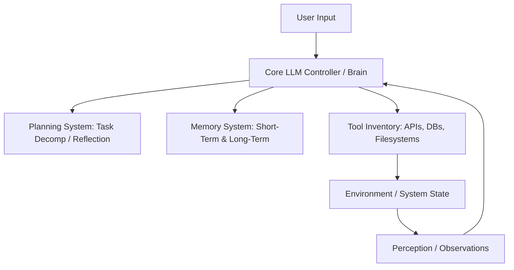

### 1.1.3 Agent Lifecycle & Workflows
The execution lifecycle of a single agent follows a continuous loop:

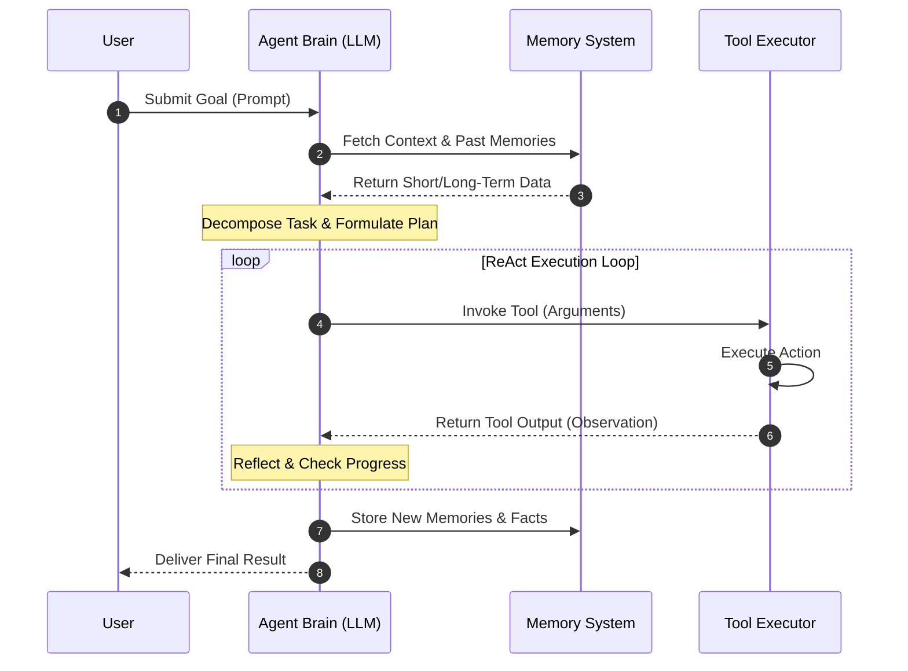

### 1.1.4 Practical Example
*   **Scenario**: The user requests the agent to update a configuration file on a remote server based on the current timezone rules of Zurich.
*   **Lifecycle Execution**:
    1.  *Perceive*: Receives query: `"Ensure the backend sync timer runs at 3 AM Zurich time daily"`.
    2.  *Retrieve*: Loads the server connection details from Long-Term Memory.
    3.  *Plan*: Realizes it needs to check Zurich's current DST rules, compute the offset, adjust the local system crontab, and write changes.
    4.  *Act*: Calls `search_web` for Zurich DST rules. Checks response: Zurich is currently UTC+2.
    5.  *Act*: Translates 3 AM Zurich to crontab representation (e.g., `0 1 * * *` UTC if the server runs in UTC).
    6.  *Act*: Invokes `write_file` to edit `/etc/cron.d/sync_timer`.
    7.  *Verify*: Executes a command tool to inspect the crontab and verify success.
    8.  *Complete*: Responds to the user.

---

## 1.2 What is Agentic AI?

### 1.2.1 Traditional LLM vs Agentic AI
Traditional LLMs operate on a single-turn, input-to-output text completion basis. They process a prompt and generate a response in a single, feed-forward inference pass. 

In contrast, **Agentic AI** systems run an active computational loop wrapping the LLM. The system allows the LLM to pause generation, call tools, observe results, modify its system context, and iteratively self-correct before outputting the final response to the user.

| Aspect | Traditional LLM | Agentic AI Systems |
|---|---|---|
| **Execution Style** | Single pass (Inference -> Output) | Multi-pass loop (Inference -> Action -> Observation -> Loop) |
| **State Management** | Stateless (relies entirely on external prompt history) | Stateful (maintains internal blackboard, scratchpads, plans) |
| **Error Handling** | Hallucinates or fails on bad initial generation | Retries tools, reformulates plans, corrects syntax |
| **Task Complexity** | Limited to what can be answered in one generation | Can handle long-running, multi-step, open-ended tasks |
| **Tool Interaction** | None (purely generative text output) | High (executes shell, API calls, database writes) |

### 1.2.2 Reactive Systems vs Agentic Systems
A reactive system operates purely on predefined triggers and mapping rules (e.g., "If keyword X is found, call API Y"). An agentic system uses autonomous reasoning to dynamically figure out *which* tools are needed, in what order, and how to combine their outputs to solve a problem that was not explicitly hardcoded.

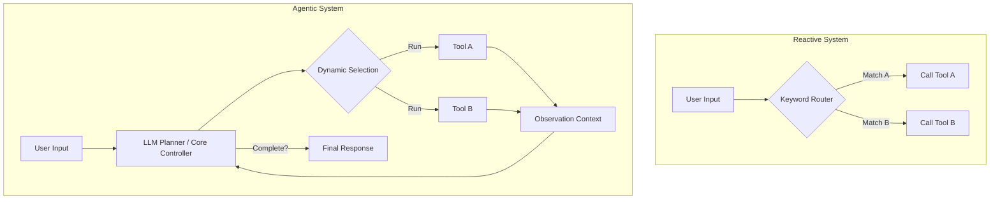

### 1.2.3 Core Principles of Agentic Systems

1.  **Autonomous Reasoning**: The agent uses Chain-of-Thought (CoT) or Tree-of-Thoughts (ToT) strategies to deduce implicit sub-steps needed to satisfy a goal.
2.  **Planning**: Building explicit scratchpads or plan arrays that are updated dynamically as tasks succeed or fail.
3.  **Memory**: Accessing both short-term memory (in-context conversation) and long-term memory (vector database of facts, credentials, and past workflows).
4.  **Tool Usage**: Deciding when to offload computational tasks (e.g., calculating math, fetching webpages) to external executables instead of solving them via LLM token generation.
5.  **Reflection & Self-Correction**: Critiquing its own output. For instance, testing a generated code snippet in a sandboxed execution tool, catching a traceback, and editing the script to resolve the error.

### 1.2.4 Production and Scaling Considerations
*   **Latent Cost Overhead**: Running ReAct loops increases tokens consumed per user request exponentially. A simple query that takes 1 token in traditional LLMs might consume 5,000 tokens during agentic tool iterations.
*   **Loop Escapes**: Agents must be wrapped in hard loop limiters (e.g., max 10 iterations) to prevent runaway execution costs if the agent enters an infinite loop of failed tool calls.

---

# Part 2: Research on OpenAI (ChatGPT)

OpenAI's ChatGPT has evolved from a simple chat interface into a complex ecosystem of specialized agents, reasoning models (such as the `o1` and `o3` series), and deep research capabilities.

## 2.1 ChatGPT Architecture Overview

The system architecture of ChatGPT is designed around a central orchestration engine that routes queries between specialized reasoning layers, vector retrieval components, and agent executors.

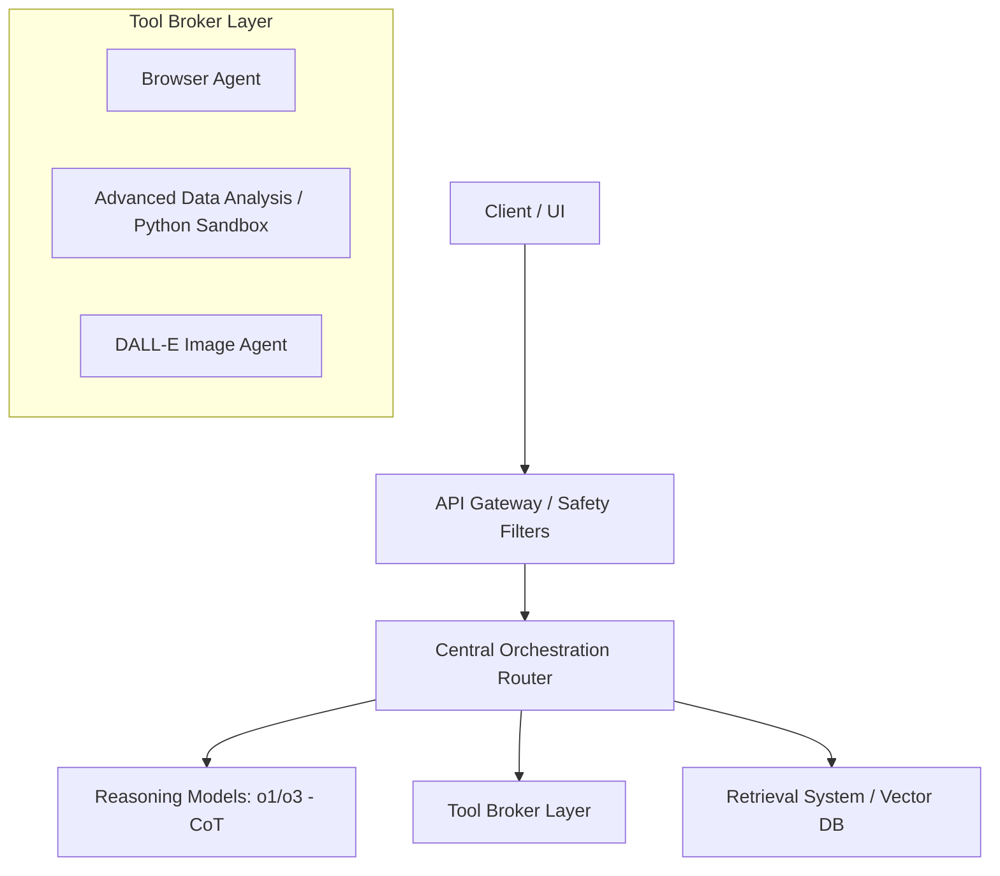

*   **Core LLM Layer**: The foundation models (e.g., GPT-4o, GPT-3.5) act as the textual generator.
*   **Reasoning Models**: `o1` and `o3` implement reinforcement learning-based Chain-of-Thought prior to output generation, allowing them to solve complex math, coding, and logical reasoning challenges before responding.
*   **Tool Calling Protocol**: An internal JSON-schema validation engine that parses function definitions from model outputs, executes them on secure microservices, and appends outputs back to the context.

---

## 2.2 Single-Agent Architecture Catalog

ChatGPT leverages a set of specialized single-agents, each configured with target system prompts, tools, and execution contexts.

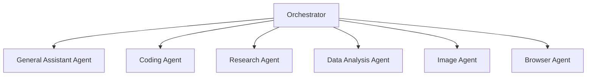

### 2.2.1 ChatGPT General Assistant
*   **Purpose**: Handle general conversation, summarization, creative writing, and basic questions.
*   **Responsibilities**: Provide direct answers, match user tone, filter toxic requests, and route complex requests to specialized agents.
*   **Inputs**: User text stream, active context window.
*   **Outputs**: Text response.
*   **Tools**: None (purely parametric knowledge).
*   **Memory**: Short-term context memory.
*   **Failure Recovery**: Fall back to simple explanations or prompt the user for clarification.

### 2.2.2 Coding Agent
*   **Purpose**: Generate, debug, explain, and refactor software.
*   **Responsibilities**: Write high-quality, syntactically correct code, match codebase styles, analyze tracebacks, and write tests.
*   **Inputs**: Problem description, error logs, code snippets, target language config.
*   **Outputs**: Code blocks, explanations, refactoring plans.
*   **Tools**: Syntax checkers, doc retrievers, local file reader/writer (in development environments).
*   **Memory**: Repository structures (semantic directory graphs), past code revisions.
*   **Failure Recovery**: If code fails, read error logs, regenerate fixing plan, and perform self-correction loops.

### 2.2.3 Research Agent
*   **Purpose**: Synthesize research briefs, locate scientific papers, and cross-reference information.
*   **Responsibilities**: Query search engines, parse PDF files, extract core statistics, and generate bibliographies.
*   **Inputs**: Topic description, source preferences, length requirements.
*   **Outputs**: Cautious, cited research reports.
*   **Tools**: Academic database APIs, PDF parsers, Web Scrapers.
*   **Memory**: Source index map, citation repository.
*   **Failure Recovery**: If a URL is blocked, search for alternative sources or archived versions of the page.

### 2.2.4 Data Analysis Agent (Advanced Data Analysis / Code Interpreter)
*   **Purpose**: Analyze tabular data, draw plots, run statistical models, and convert file formats.
*   **Responsibilities**: Read uploaded CSV/XLSX files, write Python scripts to analyze data, execute scripts in a sandboxed kernel, retrieve plots, and describe findings.
*   **Inputs**: Structured data files, analytical goals.
*   **Outputs**: Python scripts, logs, generated charts, descriptive summaries.
*   **Tools**: Jupyter Sandbox (Python kernel with libraries: pandas, matplotlib, numpy, scipy).
*   **Memory**: Temporary workspace disk state (files persist within the session).
*   **Failure Recovery**: Catch tracebacks from the Jupyter kernel, feed the stack trace back to the LLM, modify the Python script, and re-execute.

### 2.2.5 Image Agent (DALL-E Integration)
*   **Purpose**: Create and edit images, diagrams, and illustrations.
*   **Responsibilities**: Expand user prompt into detailed DALL-E prompt, invoke image generator, and verify quality.
*   **Inputs**: Natural language descriptions, aspect ratio, style requirements.
*   **Outputs**: Image URLs, generation seeds.
*   **Tools**: DALL-E 3 API.
*   **Memory**: Session image descriptions and style seeds.
*   **Failure Recovery**: If prompt triggers safety filters, rewrite the prompt with non-sensitive synonyms.

### 2.2.6 Browser Agent (Browse with Bing)
*   **Purpose**: Fetch live data from the web to answer real-time queries.
*   **Responsibilities**: Formulate search queries, crawl search index results, fetch and parse webpage texts, extract answers, and format markdown citations.
*   **Inputs**: Real-time queries.
*   **Outputs**: Grounded text answers with hyperlink citations.
*   **Tools**: Bing Search API, Web Crawler.
*   **Memory**: Search query history and crawled URL content logs.
*   **Failure Recovery**: If search queries yield no results, rephrase the queries (e.g., stripping stop words) and search again.

---

## 2.3 Deep Research Agent (Speculative Architecture)

OpenAI's Deep Research feature is designed to execute autonomous research workflows over long periods (minutes to hours), crawling hundreds of web pages to produce complete, verified, and deeply cited research papers.

### 2.3.1 Step-by-Step Workflow

1.  **Research Planning**: The system decomposes a user research prompt into a structured tree of sub-topics.
2.  **Query Generation**: Generates dozens of targeted web search queries for each node of the tree.
3.  **Multi-Step Search**: Executes parallel searches, ranking and prioritizing source URLs.
4.  **Source Ranking & Scraped Parsing**: Crawls target URLs, strips raw text, and uses a fast LLM to rate page relevance.
5.  **Evidence Extraction & Verification**: Extracts key facts, statistics, and statements. Compares contradictions between sources.
6.  **Citation Mapping**: Maintains a centralized bibliography database linking facts to URLs.
7.  **Report Synthesis**: Generates draft sections, reviews them for gaps, performs supplemental searches for missing details, and outputs the final markdown report.

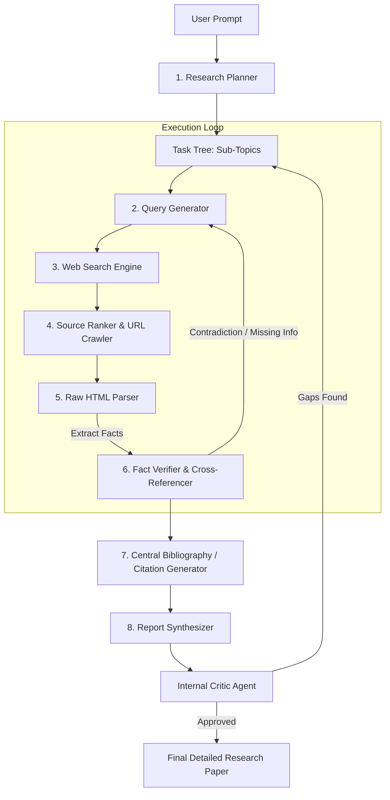

### 2.3.2 Deep Research Agent Sequence Flow

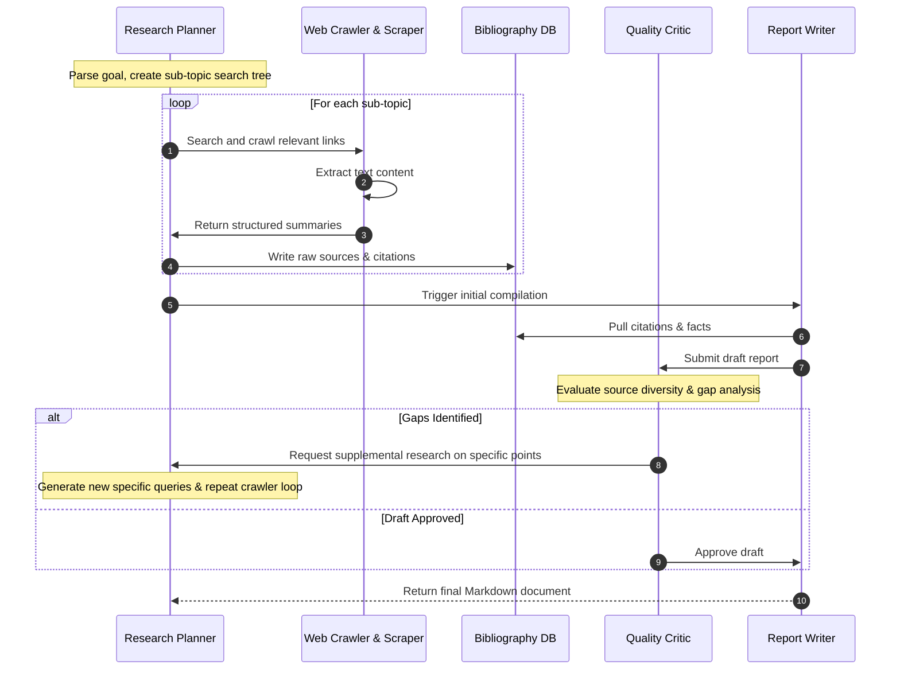

---

## 2.4 Coding Agent with Web Search Capability

To write code using modern libraries, the coding agent must perform documentation searches before generating code. This prevents the model from writing deprecated syntax or hallucinating non-existent parameters.

### 2.4.1 End-to-End Workflow Diagram

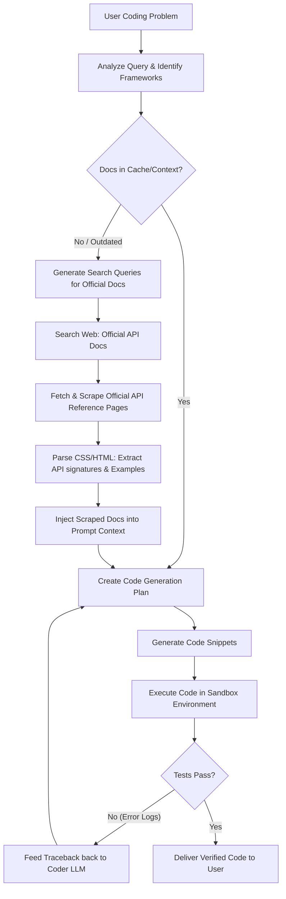

### 2.4.2 Coding Agent Tool Interaction

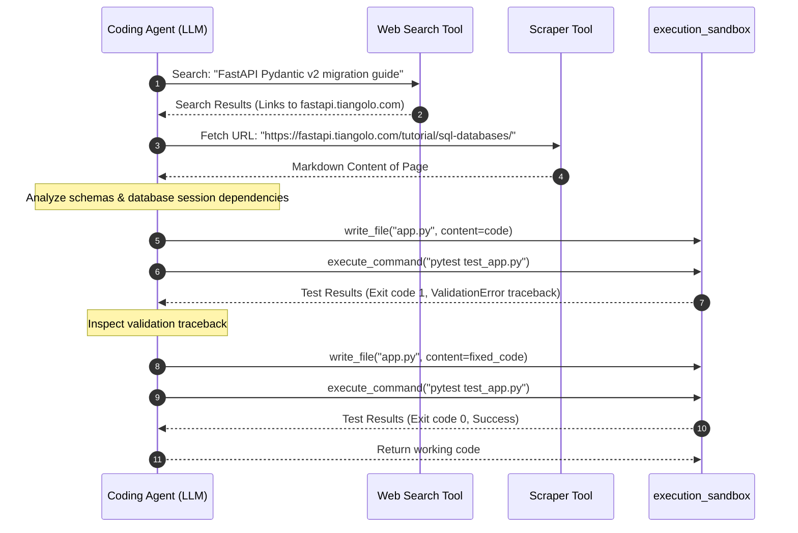

---

# Part 3: Research on Anthropic Claude

Anthropic's research focuses heavily on tool integration (via the Model Context Protocol), safety alignment, and multi-agent coordination frameworks.

## 3.1 Claude Single-Agent Design

### 3.1.1 Tool Use & MCP Integration
Claude leverages **Model Context Protocol (MCP)**, an open standard designed to connect models to data sources and tools. MCP separates the client application, the model, and the tool servers, allowing Claude to query local file servers, databases, or API integrations through a uniform protocol.

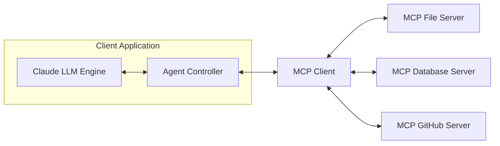

*   **MCP Protocol**: Utilizes JSON-RPC 2.0 messages over standard I/O (stdio) or Server-Sent Events (SSE).
*   **System Prompt Customization**: Claude's system prompts are dynamically injected with JSON-schema descriptors of all active MCP tools, establishing clear bounds on arguments and expected execution responses.

---

## 3.2 Claude Multi-Agent Systems

Anthropic structures complex enterprise workflows by decomposing tasks across a network of specialized sub-agents.

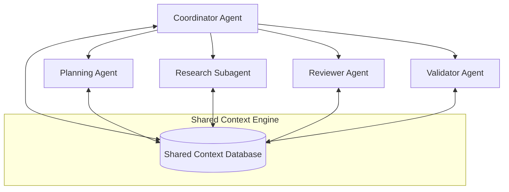

### 3.2.1 Coordination & Shared Context Management
*   **Shared Context Database**: Instead of passing the entire message history between agents (which blows up prompt costs and causes context dilution), Claude agents write structured JSON updates to a shared repository.
*   **Communication Flow**:
    1.  The **Coordinator Agent** receives the master task and queries the **Planning Agent** for a blueprint.
    2.  The blueprint is registered in the Shared Context.
    3.  **Research Subagents** claim sub-tasks, execute their tools, and write structured results back to the Context.
    4.  The **Reviewer Agent** reads the results, runs critiques, and flags gaps.
    5.  The **Validator Agent** runs final code tests or schema validations.

---

# Part 4: Research on Perplexity

Perplexity is designed as a search-centric agent system, optimized for real-time indexing, retrieval, source validation, and conversational synthesis.

## 4.1 Search-Centric Agent System Architecture

Perplexity processes queries through a dedicated pipeline that translates natural language into optimized search commands, fetches index documents, reranks them, and synthesizes cited summaries.

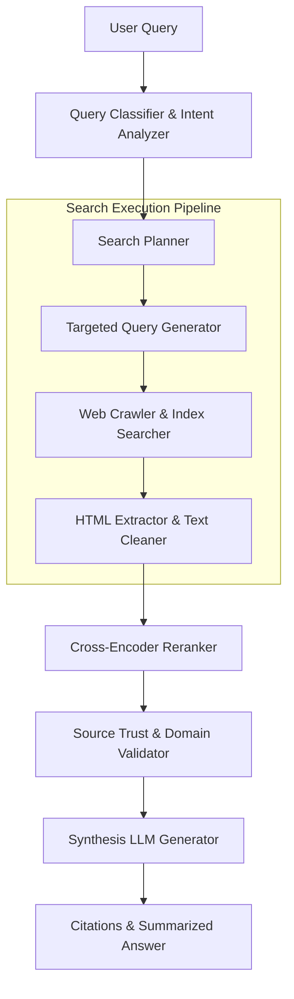

### 4.1.2 Pipeline Details
1.  **Query Understanding**: Identifies query intent (e.g., shopping, academic research, real-time news, coding).
2.  **Search Planning**: Decides if a single search is sufficient, or if it requires a multi-query, multi-step crawl.
3.  **Reranking**: Standard search engines return documents based on keyword matching (BM25) or vector embeddings. Perplexity uses a secondary Cross-Encoder model to compute semantic relevance between the user's query and the extracted paragraphs.
4.  **Source Validation**: Filters spam domains, clickbait portals, and low-trust sources.
5.  **Citation Generation**: Inserts inline tags (e.g., `[1]`, `[2]`) pointing to verified URLs.

---

## 4.2 Search & Research Agent Workflows

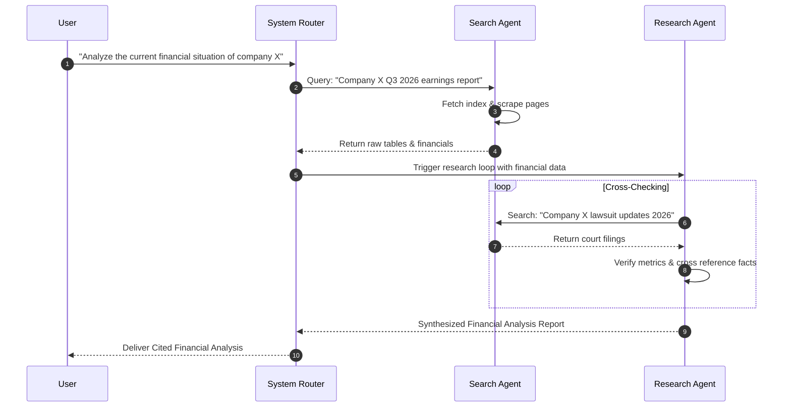

---

# Part 5: Single-Agent Design Patterns

To build an agentic system, engineers use a catalog of single-agent design patterns. Below is the comprehensive catalog of these agents.

## 5.1 General Assistant Agent
*   **Responsibilities**: Handle conversation, retrieve semantic details from system configurations, and guide user workflows.
*   **Tools**: `get_current_time`, `retrieve_user_profile`.
*   **Memory**: Short-term sliding window conversation buffer.
*   **Workflow**: Read prompt -> Check memories -> Generate response.

## 5.2 Coding Agent
*   **Responsibilities**: Read files, write scripts, execute commands, parse tracebacks, and refactor files.
*   **Tools**: `read_file`, `write_file`, `list_directory`, `execute_command`.
*   **Memory**: Working repository maps, file histories, test execution states.
*   **Workflow**: Parse request -> Read targeted files -> Create coding plan -> Write files -> Test -> Refactor on error.

## 5.3 Research Agent
*   **Responsibilities**: Search the web, fetch pages, parse raw content, index key facts, and maintain a citation database.
*   **Tools**: `search_web`, `fetch_webpage`.
*   **Memory**: Search index, document summaries, citation cache.
*   **Workflow**: Generate queries -> Fetch links -> Parse texts -> Extract facts -> Format citations.

## 5.4 Planner Agent
*   **Responsibilities**: Decompose a complex goal into a directed acyclic graph (DAG) of sub-tasks.
*   **Tools**: `none` (purely cognitive).
*   **Memory**: Goal state, execution tracker, task tree logs.
*   **Workflow**: Analyze goal -> Identify dependencies -> Output JSON list of sub-tasks with assigned agents.

## 5.5 Reviewer Agent
*   **Responsibilities**: Critically analyze generated code or text for security flaws, bugs, logical fallacies, or stylistic errors.
*   **Tools**: `none` (purely cognitive).
*   **Memory**: Style guides, security checklists.
*   **Workflow**: Read output -> Cross-reference checklist -> Identify issues -> Output review report with instructions.

## 5.6 Validator Agent
*   **Responsibilities**: Run automated tests, execute schema validations, compile binaries, and check system integrity.
*   **Tools**: `execute_command`, `validate_schema`.
*   **Memory**: Execution logs, success criteria.
*   **Workflow**: Trigger test suite -> Capture stdout/stderr/exit codes -> Output Boolean result with status details.

## 5.7 Reflection Agent
*   **Responsibilities**: Compare the final output of a workflow against the user's original goal, assessing quality, correctness, and completeness.
*   **Tools**: `none` (purely cognitive).
*   **Memory**: Original goal prompt, final generated output, evaluation rubric.
*   **Workflow**: Read goal -> Read output -> Evaluate against rubric -> Decide if execution must repeat or complete.

---

# Part 6: Multi-Agent Architecture

## 6.1 Why Multi-Agent Systems Exist

Monolithic single-agents struggle when tasks scale in complexity:
1.  **Context Dilution**: The more tools and tasks added to a single agent's prompt, the less attentive the LLM becomes to specific instructions.
2.  **Tool Overlap**: A single LLM with 20 tools frequently chooses the wrong tool or formats arguments incorrectly.
3.  **Parallelization**: Multiple sub-agents can run parallel processes (e.g., crawling different websites) and coordinate summaries later.
4.  **Security Boundaries**: Highly sensitive operations (like executing shell commands) can be isolated to a specific Coder Agent running in a sandboxed microservice, while the front-facing Router Agent has no execution permissions.

---

## 6.2 Multi-Agent Design Patterns

### 6.2.1 Hierarchical Agents Pattern
A **Manager Agent** oversees workers. Workers do not talk to each other; they communicate exclusively with the manager.

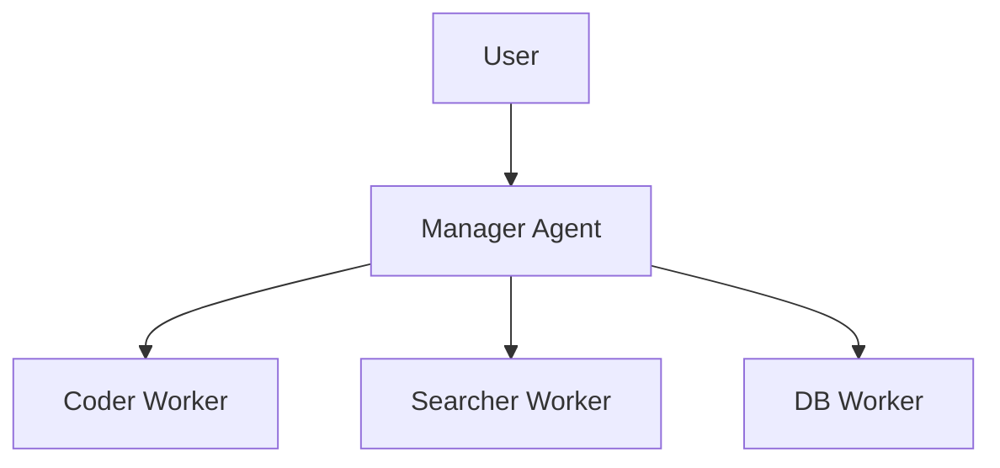

### 6.2.2 Supervisor Pattern
A **Supervisor Agent** routes tasks to specialist agents, tracks their completion status, and coordinates their interactions via a central blackboard.

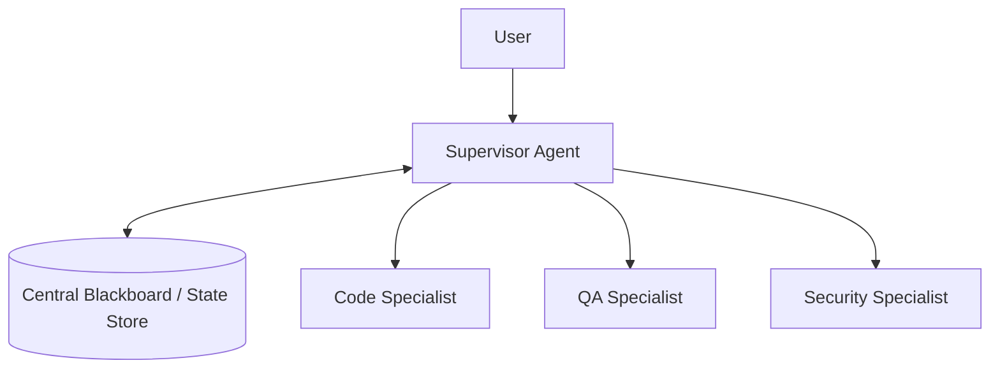

### 6.2.3 Planner-Executor Pattern
The task is split between a **Planner** (who designs the steps), the **Executor** (who runs tools to implement the steps), and the **Reviewer** (who checks quality).

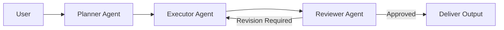

### 6.2.4 Swarm Pattern
Peers collaborate dynamically without a rigid manager. Agents broadcast updates, and any agent that is qualified can claim and process tasks.

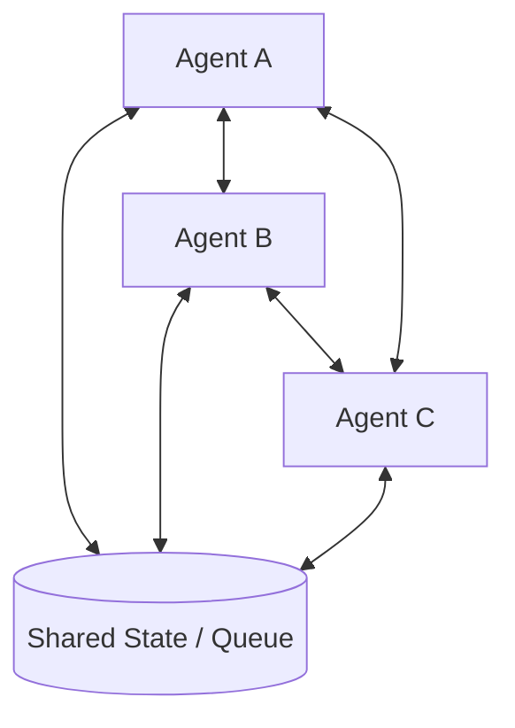

### 6.2.5 Research Team Pattern
Decomposes academic/market research into separate roles: a planner, web crawlers, validators, and a final writer.

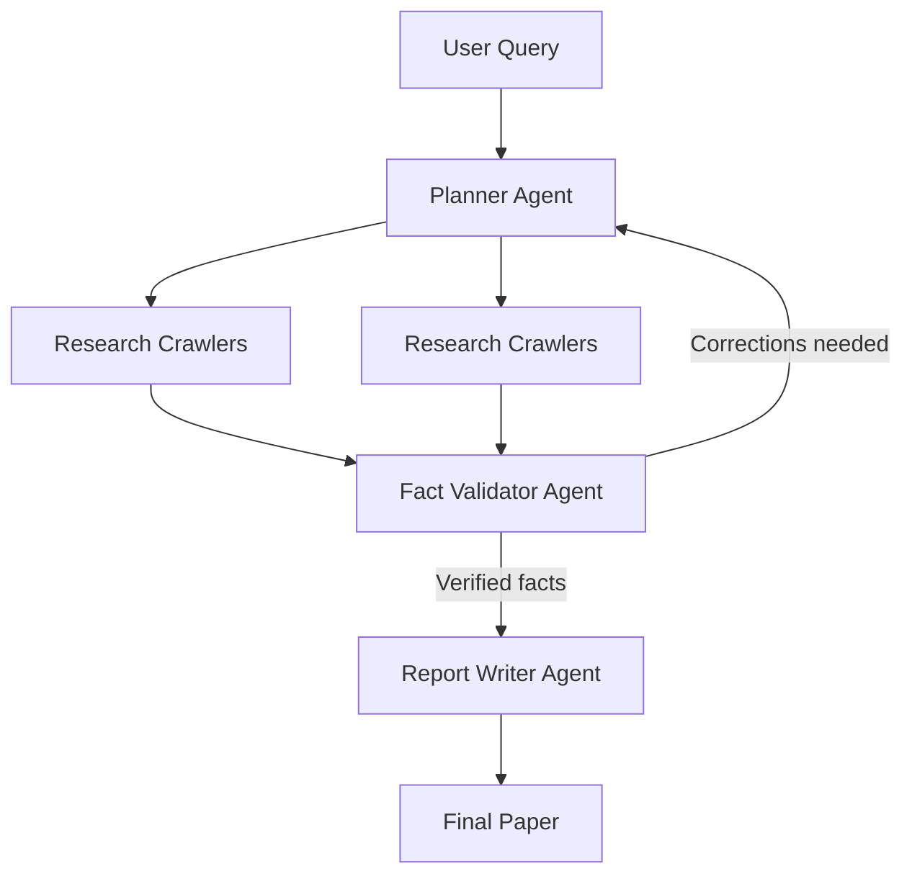

---

# Part 7: Agent Memory Architecture

Memory is what allows agents to maintain state, context, personalization, and learn from past executions.

## 7.1 Single-Agent Memory Systems

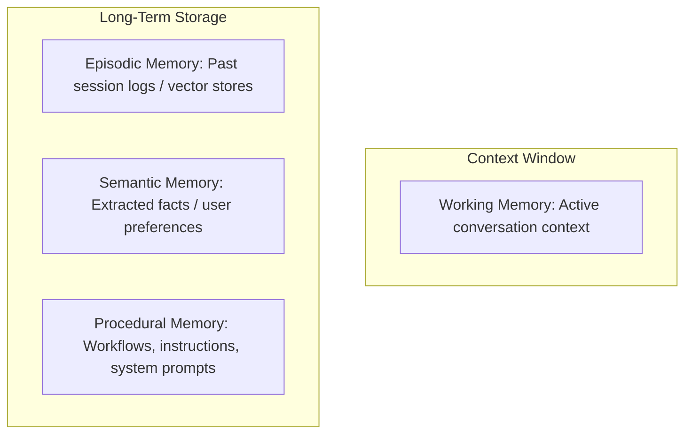

### 7.1.1 Working Memory
*   **Purpose**: Tracks the active conversation context.
*   **Implementation**: Sliding message buffer. Once tokens approach context limits, the system summarizes old messages, keeping the active state clean.

### 7.1.2 Episodic Memory
*   **Purpose**: Recalls specific past experiences or workflows (e.g., "How did we resolve the build issue last week?").
*   **Implementation**: Sessions are saved to MongoDB. User messages and tool responses are embedded using a model (e.g., `all-MiniLM-L6-v2`) and queried via vector search.

### 7.1.3 Semantic Memory
*   **Purpose**: Manages factual knowledge and preferences (e.g., "The database user is 'postgres'").
*   **Implementation**: A background extraction pipeline parses conversation histories, abstracts general facts, and stores them in a structured table or vector database.

### 7.1.4 Procedural Memory
*   **Purpose**: Maintains operational habits, system rules, and prompt directives.
*   **Implementation**: Typically stored as static system prompt configurations or dynamically fetched guidelines depending on the task type.

---

## 7.2 Multi-Agent Memory Systems

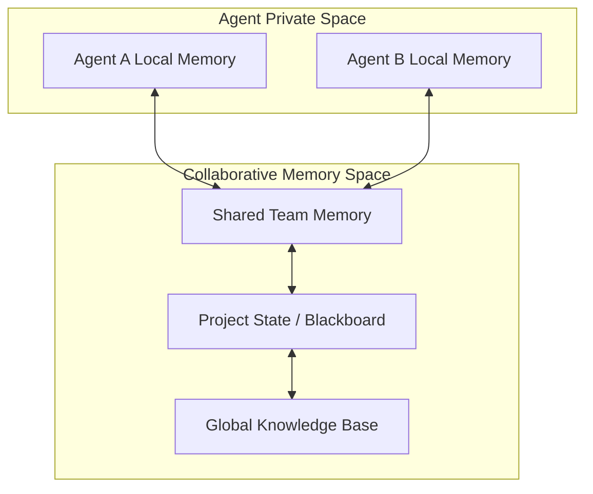

*   **Agent Local Memory**: Private scratchpads, keeping intermediate thoughts hidden from other agents.
*   **Team Memory**: Shared summaries of sub-agent discussions.
*   **Project Memory**: Task state, configuration properties, files, and resources built during task execution.
*   **Global Knowledge Base**: Organization-wide databases, documentation libraries, and schemas accessible to all agents.

---

## 7.3 Shared Memory Design & Implementation

Shared memory architectures must handle concurrent updates, data conflicts, context compression, and access controls.

```mermaid
sequenceDiagram
    autonumber
    participant AgentA as Coder Agent
    participant AgentB as Reviewer Agent
    participant Memory as Shared Memory Controller
    participant DB as MongoDB / State Store

    AgentA->>Memory: write_state(key="code_block", value="def foo(): pass", version=1)
    Memory->>DB: Check version conflict
    DB-->>Memory: Version OK, write successful
    Memory-->>AgentA: Ack (version=2)
    
    AgentB->>Memory: read_state(key="code_block")
    Memory->>DB: Fetch state
    DB-->>Memory: Return: "def foo(): pass" (version=2)
    Memory-->>AgentB: Return state
```

### 7.3.1 Memory Synchronization and Conflict Resolution
When multiple agents write to the same Shared Memory store:
1.  **Optimistic Concurrency Control (OCC)**: Each record has a version number. If an agent tries to update a key but its read version does not match the database version, the update is rejected, and the agent must pull the latest state and retry.
2.  **CRDTs (Conflict-Free Replicated Data Types)**: Useful when agents edit the same text file concurrently.

### 7.3.2 Context Compression
To avoid context window limits:
*   **Dynamic Summarization**: Summarize history while maintaining key variables (e.g., `"The host is 127.0.0.1"` is kept literal; pleasantries are discarded).
*   **Entity Mapping**: Convert long conversations into JSON key-value stores.

### 7.3.3 Shared Memory Implementation (Python Example)

```python
import datetime
from typing import Dict, Any, Optional

class SharedMemoryController:
    def __init__(self):
        self._store: Dict[str, Dict[str, Any]] = {}

    def write(self, key: str, value: Any, agent_id: str, expected_version: Optional[int] = None) -> int:
        """Writes to shared memory using version checks to prevent conflicts."""
        current_record = self._store.get(key)
        
        if current_record:
            current_version = current_record["version"]
            if expected_version is not None and current_version != expected_version:
                raise ValueError(f"Conflict detected. Expected version {expected_version}, database has {current_version}")
            new_version = current_version + 1
        else:
            new_version = 1

        self._store[key] = {
            "value": value,
            "version": new_version,
            "last_updated_by": agent_id,
            "timestamp": datetime.datetime.utcnow().isoformat()
        }
        return new_version

    def read(self, key: str) -> Optional[Dict[str, Any]]:
        return self._store.get(key)
```

---

# Part 8: Failure Handling & Recovery

Production-grade agentic AI systems must handle failure cases robustly.

## 8.1 Single-Agent Failures

```mermaid
graph TD
    Failure[Single-Agent Failure] --> Hallucination[8.1.1 Hallucination]
    Failure --> ToolFail[8.1.2 Tool Failures]
    Failure --> LimitFail[8.1.3 Context Overflow]
```

### 8.1.1 Hallucination
*   **Detection**: Cross-reference output facts against retrieval documents. Use a fast validator model to run alignment checks.
*   **Recovery**: Prompt the core model with the contradiction, requiring it to cite the source document.
*   **Prevention**: Strict system prompts: `"If you cannot find the answer in the source text, state 'Not Found'. Do not extrapolate."`

### 8.1.2 Tool Failures (API down, bad arguments)
*   **Detection**: Wrap all tool calls in `try-except` blocks, returning the traceback to the agent.
*   **Recovery**: LLM parses the traceback, corrects the arguments, and retries.
*   **Prevention**: Strict JSON-schema parameter validation at the tool broker level.

### 8.1.3 Context Window Overflow
*   **Detection**: Track the token count of active messages.
*   **Recovery**: Automatically compress or summarize older message histories, archiving them to long-term database storage.
*   **Prevention**: Use memory managers that prune system prompts and active history dynamically.

---

## 8.2 Multi-Agent Failures

```mermaid
graph TD
    MAFailure[Multi-Agent Failure] --> Deadlock[8.2.1 Deadlocks]
    MAFailure --> CircleDelegation[8.2.2 Circular Delegation]
    MAFailure --> Inconsistency[8.2.3 Memory Inconsistency]
```

### 8.2.1 Deadlocks & Circular Delegation
*   **Scenario**: Agent A waits for Agent B to complete a task, while Agent B is waiting for Agent A's output. Alternatively, Agent A delegates to B, B delegates to C, and C delegates back to A.
*   **Detection**: Maintain a global execution trace and depth counter. If depth exceeds a limit (e.g., 5 hops) or same agent is visited twice with identical goals, flag an error.
*   **Recovery**: The Orchestrator halts execution, pulls the trace, and takes over, either asking the user for input or routing to a fallback agent.

```mermaid
graph LR
    Orch[Orchestrator / Supervisor] --> AgentA[Agent A]
    AgentA --> AgentB[Agent B]
    AgentB --> AgentC[Agent C]
    AgentC -- "Circularity Detected (Depth > Threshold)" --> TraceError[Halt & Escalate to Orchestrator]
    TraceError --> Fallback[Orchestrator Fallback Execution]
```

### 8.2.2 Communication & Memory Inconsistency
*   **Scenario**: Agent A updates shared memory, but Agent B continues operating on a cached copy of old state.
*   **Detection**: Implement event listeners or publication/subscription patterns on shared variables.
*   **Recovery**: Broadcast state changes, forcing sub-agents to re-fetch memory states before running new loops.

---

# Part 9: Agent Evaluation Framework

Evaluating agents is fundamentally different from evaluating static LLMs. Standard benchmarks (e.g., MMLU) fail because agents are dynamic and use tools.

## 9.1 Core Evaluation Metrics

1.  **Task Completion Rate**: Did the agent achieve the goal?
2.  **Tool Call Efficiency**: Did the agent make unnecessary tool calls? Did it format tool arguments correctly?
3.  **Cost**: The total token usage and API execution costs.
4.  **Latency**: The time taken from initial prompt to final answer.
5.  **Robustness**: The ability to recover from tool failures, API errors, and bad inputs.

---

## 9.2 Single-Agent Evaluation Scorecard Example

```
Single-Agent Evaluation Scorecard
============================================================
Task Name: Write database connection script
Agent ID: coder_agent
Model: gpt-4o-mini
Status: PASSED
------------------------------------------------------------
Metrics:
- Goal Achieved: Yes (1 / 1)
- Tool Accuracy: 100% (Executed write_file and execute_command correctly)
- Recovery Loops: 1 (Recovered from a connection string syntax error)
- Latency: 4.8 seconds
- Cost: $0.0034 (1,200 prompt tokens, 450 completion tokens)
------------------------------------------------------------
Evaluator Comments:
"Agent handled the initial connection failure cleanly by checking
logs, correcting port configuration, and re-running tests."
============================================================
```

---

## 9.3 Multi-Agent Evaluation

Multi-agent evaluation focuses on collaboration and coordination:
*   **Coordination Overhead**: The ratio of internal coordinator-to-worker tokens compared to final user-facing tokens.
*   **Delegation Quality**: Did the supervisor route the task to the correct specialist?
*   **Conflict Resolution rate**: How effectively did reviewer and validator agents resolve disagreements?

---

# Part 10: Technology Stack & Frameworks

A comparison of the primary frameworks used for building agentic AI architectures:

| Framework | Architecture Pattern | Pros | Cons | Best Use Cases |
|---|---|---|---|---|
| **LangGraph** | Statechart / Graph-based | Highly controllable; supports cyclic loops; fine-grained state control. | Steep learning curve; verbose configuration. | Complex multi-agent systems with explicit loops and state transitions. |
| **LangChain** | Linear chain / DAG | Massive integration library; easy prototyping. | Hard to manage when state loops; complex internals. | Simple RAG pipelines, linear tool calling applications. |
| **OpenAI Agents SDK** | Native tool calling | Fast; highly integrated with OpenAI APIs; lightweight. | Tied to OpenAI models; limited multi-host coordination. | Native ChatGPT integrations and OpenAI prototypes. |
| **AutoGen** | Conversational Agents | Strong multi-agent conversation features; highly customizable. | Hard to debug; prone to infinite conversation loops. | Simulation environments, dynamic collaborative agent boards. |
| **CrewAI** | Role-based / Sequential | Easy to configure roles, goals, and backstories out-of-the-box. | Less flexible for non-sequential processes. | Standard marketing, copy-writing, and business workflow teams. |
| **LlamaIndex** | Data-centric / RAG | Excellent data connection, indexing, and retrieval capabilities. | Core agent execution capabilities are secondary to retrieval. | Deep search, RAG, and knowledge management systems. |
| **MCP (Model Context Protocol)** | Client-Server API Standard | Standardizes tool and data access; secure separation of concerns. | Emerging standard; requires writing dedicated MCP servers. | Enterprise tool sharing across disparate LLM agents. |

---

# Part 11: Production-Grade Agent Platform Design

Enterprise agent deployments require robust components for routing, security, storage, and logging.

## 11.1 Platform Architecture Overview

```mermaid
graph TD
    Client[Client / UI] --> Gateway[API Gateway / Auth / Rate Limiter]
    Gateway --> Router[Agent Router / Parser]
    
    subgraph Execution Orchestrator
        Router --> Planner[Task Decomposer / Planner]
        Planner --> Coordinator[Agent Coordinator]
    end
    
    Coordinator --> Registry[Agent Registry: Agent Config Store]
    Coordinator --> Memory[Memory Sync Layer: Redis / Cache]
    Coordinator --> Tools[Tool Broker / Sandboxed Runner]
    
    subgraph Storage & Observability
        Memory --> VectorDB[(Vector Database: LTM)]
        Memory --> RelationalDB[(Relational DB: Mongo / Postgres)]
        Coordinator --> Logger[(Structured Logging: OTEL)]
        Logger --> Eval[Evaluation & Guardrails Layer]
    end
```

### 11.1.2 Component Responsibilities
*   **API Gateway**: Manages authentication, rate limiting, and inputs/outputs sanitization.
*   **Agent Router**: Maps the incoming conversation thread to the appropriate supervisor agent.
*   **Agent Registry**: A database (e.g., MongoDB) containing agent definitions (system prompts, allowed tools).
*   **Memory Sync Layer**: Uses Redis to cache session context, ensuring fast, concurrent memory reads during loops.
*   **Tool Broker**: Runs tools in isolated containers (e.g., Docker, sandboxed Python kernels) to secure the host network.
*   **Observability Layer**: Collects OpenTelemetry traces of all agent steps, thoughts, tool calls, and execution times.

---

## 11.2 Production Platform Sequence Flow

```mermaid
sequenceDiagram
    autonumber
    participant Client as Client UI
    participant Gateway as API Gateway
    participant Router as Agent Router
    participant Sandbox as Tool Sandbox
    participant DB as MongoDB / Vector Store

    Client->>Gateway: POST /api/chat {session_id, message}
    Gateway->>Gateway: Validate request & rate limits
    Gateway->>Router: Route request
    Router->>DB: Fetch session history & LTM facts
    DB-->>Router: Session & Memory data
    Note over Router: Route to Coder Agent
    Router->>Sandbox: Execute write_file("config.json")
    Sandbox-->>Router: Success (Exit Code 0)
    Router->>DB: Write internal execution log (is_internal=True)
    Router->>DB: Save updated session state
    Router-->>Gateway: Return final response
    Gateway-->>Client: Deliver response
```

---

# Part 12: End-to-End Case Studies

## 12.1 Case Study 1: Coding Agent - Stripe Payment Integration

### 12.1.1 Scenario
A user asks: `"Build a Stripe payment integration using Python and FastAPI"`

### 12.1.2 Workflow Execution Trace

```mermaid
graph TD
    Goal[User: Build Stripe payment integration] --> Planner[Planner Agent]
    
    Planner --> Step1[1. Search official Stripe API Documentation]
    Step1 --> Crawl[Crawl stripe.com API references]
    
    Planner --> Step2[2. Generate local FastAPI application code]
    Crawl --> Step2
    
    Planner --> Step3[3. Run code quality review]
    Step2 --> Review[Reviewer Agent: Check API keys / secure configs]
    
    Planner --> Step4[4. Execute test suite]
    Review -- Passed --> Sandbox[Tester Agent: Run pytest in sandbox]
    
    Sandbox -- Test Failed --> Fix[Identify error, rewrite code]
    Fix --> Review
    
    Sandbox -- Test Passed --> Final[Deliver app.py to user]
```

### 12.1.3 Tool Execution Sequence

```mermaid
sequenceDiagram
    autonumber
    participant Planner as Planner Agent
    participant Web as Web Tool
    participant CodeGen as Coder Agent
    participant Critic as Reviewer Agent
    participant Sandbox as Test Sandbox

    Planner->>Web: search_web("Stripe python SDK fastapi checkout session example")
    Web-->>Planner: Stripe API documentation markdown
    Planner->>CodeGen: Delegate code generation with doc context
    Note over CodeGen: Write FastAPI routes, load env variables
    CodeGen->>Sandbox: write_file("stripe_app.py", content=api_code)
    CodeGen->>Critic: Submit file for security review
    Note over Critic: Inspect code for hardcoded secrets or API key leaks
    Critic-->>CodeGen: Approved (Env variables used correctly)
    CodeGen->>Sandbox: execute_command("pytest test_stripe_app.py")
    Sandbox-->>CodeGen: Execution output: 1 passed test
    CodeGen-->>Planner: Completed successfully
    Planner-->>Client: Final Stripe FastAPI implementation
```

---

## 12.2 Case Study 2: Deep Research Agent - AI Agent Framework Market Analysis

### 12.2.1 Scenario
A researcher asks: `"Research the AI Agent Framework market in 2026, comparing LangGraph, AutoGen, and CrewAI."`

### 12.2.2 Workflow Execution Trace

```mermaid
graph TD
    Goal[User: Research AI Agent Framework Market] --> Planner[Research Planner]
    
    Planner --> Q1[Query: 'LangGraph market share 2026 features']
    Planner --> Q2[Query: 'AutoGen updates 2026']
    Planner --> Q3[Query: 'CrewAI enterprise features 2026']
    
    Q1 & Q2 & Q3 --> Crawl[Web Search & Crawler Agent]
    Crawl --> Extract[Extract raw paragraphs & tables]
    Extract --> Validator[Validator: Cross-reference details for hallucination]
    
    Validator -- Discrepancies found --> Recrawl[Generate targeted queries & crawl again]
    Recrawl --> Crawl
    
    Validator -- Verified facts --> Writer[Writer Agent: Structure final paper]
    Writer --> Citations[Citation Generator: Attach hyperlinks]
    Citations --> Report[Final PDF / Markdown Analysis]
```

### 12.2.3 Deep Research Sequence Flow

```mermaid
sequenceDiagram
    autonumber
    participant Planner as Research Planner
    participant Crawler as Crawler Agent
    participant Val as Fact Validator
    participant Writer as Report Writer
    participant CitGen as Citation Generator

    Planner->>Crawler: Query: 'LangGraph vs AutoGen vs CrewAI comparison 2026'
    Crawler->>Crawler: Crawl release notes, github issues, reviews
    Crawler-->>Planner: Raw scraped text
    Planner->>Val: Check statements (e.g., pricing, licensing details)
    Note over Val: Cross-reference facts from multiple domains
    Val-->>Planner: Verified facts list
    Planner->>Writer: Delegate report sections writing
    Note over Writer: Generate comparison tables & architectural overviews
    Writer->>CitGen: Map facts to source URLs
    CitGen-->>Writer: Document with markdown reference links
    Writer-->>Planner: Final research report
    Planner-->>Client: Deliver Cited Market Analysis
```

---

## 12.3 Production Operations & Best Practices
1.  **Strict Token Limits**: Impose limits on each agentic loop step (e.g., maximum of 15 API executions) to avoid runaway loop costs.
2.  **Telemetry and Traces**: Log all sub-agent steps, tool calls, and thought logs to a centralized tracing server (e.g., OpenTelemetry, LangFuse) to enable debugging.
3.  **Sandboxing**: Execute code interpreter and commands in restricted, isolated Docker containers or WebAssembly runtimes to prevent remote code execution attacks on host servers.
4.  **Semantic Caching**: Cache common tool queries (e.g., web searches for slow-changing content) to reduce latency and execution costs.
