# Deep Research Agent: Production-Grade Architecture & Engineering Reference

> **Document Version:** 1.2.0  
> **Last Updated:** June 23, 2026  
> **Author:** TejasH MistrY  
> **Document Number:** 08 (Doc 8)

> **Purpose** — This document is a comprehensive, production-grade reverse engineering and architectural blueprint for large-scale Deep Research agentic AI systems. It analyzes the systems designed by industry leaders (e.g., ChatGPT Deep Research, Perplexity Deep Research, Gemini Deep Research) and details how to construct them from scratch, explaining design choices, trade-offs, scaling limits, and cost implications.

---

## Table of Contents

1. [Executive Summary & System Architecture](#executive-summary--system-architecture)
2. [Part A: End-to-End Deep Research Lifecycle (29 Stages)](#part-a-end-to-end-deep-research-lifecycle-29-stages)
   - [Overview Flowchart](#overview-flowchart)
   - [Stage 1: User Query Ingestion](#stage-1-user-query-ingestion)
   - [Stage 2: Query Understanding](#stage-2-query-understanding)
   - [Stage 3: Intent Classification](#stage-3-intent-classification)
   - [Stage 4: Research Complexity Estimation](#stage-4-research-complexity-estimation)
   - [Stage 5: Scope Determination](#stage-5-scope-determination)
   - [Stage 6: Clarifying Question Generation](#stage-6-clarifying-question-generation)
   - [Stage 7: Research Objective Creation](#stage-7-research-objective-creation)
   - [Stage 8: Research Planning](#stage-8-research-planning)
   - [Stage 9: Task Decomposition](#stage-9-task-decomposition)
   - [Stage 10: Sub-Question Generation](#stage-10-sub-question-generation)
   - [Stage 11: Execution Graph Creation](#stage-11-execution-graph-creation)
   - [Stage 12: Tool Selection](#stage-12-tool-selection)
   - [Stage 13: Search Strategy Generation](#stage-13-search-strategy-generation)
   - [Stage 14: Web Exploration](#stage-14-web-exploration)
   - [Stage 15: Document Acquisition](#stage-15-document-acquisition)
   - [Stage 16: Source Filtering](#stage-16-source-filtering)
   - [Stage 17: Information Extraction](#stage-17-information-extraction)
   - [Stage 18: Evidence Storage](#stage-18-evidence-storage)
   - [Stage 19: Knowledge Synthesis](#stage-19-knowledge-synthesis)
   - [Stage 20: Fact Verification](#stage-20-fact-verification)
   - [Stage 21: Contradiction Detection](#stage-21-contradiction-detection)
   - [Stage 22: Confidence Scoring](#stage-22-confidence-scoring)
   - [Stage 23: Report Outline Generation](#stage-23-report-outline-generation)
   - [Stage 24: Report Writing](#stage-24-report-writing)
   - [Stage 25: Citation Generation](#stage-25-citation-generation)
   - [Stage 26: Reflection and Self-Critique](#stage-26-reflection-and-self-critique)
   - [Stage 27: Report Improvement](#stage-27-report-improvement)
   - [Stage 28: Final Quality Checks](#stage-28-final-quality-checks)
   - [Stage 29: Final Answer Delivery](#stage-29-final-answer-delivery)
3. [Part B: Internal Multi-Agent Architecture](#part-b-internal-multi-agent-architecture)
   - [1. Agent Inventory](#1-agent-inventory)
   - [2. Multi-Agent Coordination Mechanics](#2-multi-agent-coordination-mechanics)
   - [3. Multi-Agent Interaction Diagram](#3-multi-agent-interaction-diagram)
4. [Part C: Research Planning Engine](#part-c-research-planning-engine)
   - [1. Planning Paradigms & Topology](#1-planning-paradigms--topology)
   - [2. Task Orchestration, Dependency, & Priority Scheduling](#2-task-orchestration-dependency--priority-scheduling)
   - [3. Concrete Example: Software Engineering Job Impact Graph (2020-2030)](#3-concrete-example-software-engineering-job-impact-graph-2020-2030)
   - [4. Planning Engine Diagrams](#4-planning-engine-diagrams)
5. [Part D: Comparison Between Leading Systems](#part-d-comparison-between-leading-systems)
   - [System Comparison Matrix](#system-comparison-matrix)
   - [Deep Architectural Differentiators](#deep-architectural-differentiators)
6. [Appendix: Production Engineering & Scale Metrics](#appendix-production-engineering--scale-metrics)
7. [Part E: Data Collection Infrastructure](#part-e-data-collection-infrastructure)
   - [1. Search Engine Integration](#1-search-engine-integration)
   - [2. Direct Web Crawling](#2-direct-web-crawling)
   - [3. Website Scraping](#3-website-scraping)
   - [4. API Integration](#4-api-integration)
   - [5. News Source Aggregation](#5-news-source-aggregation)
   - [6. Academic Database Access](#6-academic-database-access)
   - [7. File-Based Sources](#7-file-based-sources)
   - [8. Visual Media Processing](#8-visual-media-processing)
   - [9. Video & Audio Sources](#9-video--audio-sources)
   - [Data Collection Pipeline Diagram](#data-collection-pipeline-diagram)
8. [Part F: Document Understanding Pipeline](#part-f-document-understanding-pipeline)
   - [1. PDF Processing](#1-pdf-processing)
   - [2. Word Document Processing](#2-word-document-processing)
   - [3. Excel & CSV Processing](#3-excel--csv-processing)
   - [4. PowerPoint Processing](#4-powerpoint-processing)
   - [5. Image Understanding](#5-image-understanding)
   - [6. Video Processing](#6-video-processing)
   - [7. Audio Processing](#7-audio-processing)
   - [Document Processing Pipeline Diagram](#document-processing-pipeline-diagram)
9. [Part G: Source Evaluation & Quality Ranking](#part-g-source-evaluation--quality-ranking)
   - [1. Source Quality Dimensions](#1-source-quality-dimensions)
   - [2. Ranking & Filtering Algorithms](#2-ranking--filtering-algorithms)
   - [Source Ranking Flow Diagram](#source-ranking-flow-diagram)
10. [Part H: Retrieval & Knowledge Management](#part-h-retrieval--knowledge-management)
    - [1. RAG Architecture for Deep Research](#1-rag-architecture-for-deep-research)
    - [2. Hybrid Retrieval](#2-hybrid-retrieval)
    - [3. Vector Database Selection](#3-vector-database-selection)
    - [4. Knowledge Graphs](#4-knowledge-graphs)
    - [5. Query Expansion & Reranking](#5-query-expansion--reranking)
    - [Retrieval Architecture Diagram](#retrieval-architecture-diagram)
11. [Part I: Verification & Fact Checking](#part-i-verification--fact-checking)
    - [1. Cross-Source Validation](#1-cross-source-validation)
    - [2. Claim Verification](#2-claim-verification)
    - [3. Contradiction Detection](#3-contradiction-detection)
    - [4. Hallucination Reduction](#4-hallucination-reduction)
    - [5. Confidence Scoring](#5-confidence-scoring)
    - [6. Evidence-Based Reasoning](#6-evidence-based-reasoning)
    - [Verification Pipeline Diagram](#verification-pipeline-diagram)

---

# Executive Summary & System Architecture

Modern "Deep Research" systems represent a paradigm shift in agentic AI. Unlike traditional search-and-summarize workflows, these platforms operate as **autonomous research pipelines** capable of executing multi-hour, self-correcting information gathering campaigns. Under the hood, they orchestrate large language models (LLMs) with high-capacity search indexes, dynamic page scrapers, structured memory, and verification loops.

This document presents the technical architecture required to build such a system at production scale.

---

# Part A: End-to-End Deep Research Lifecycle (29 Stages)

Below is the complete step-by-step lifecycle showing how a complex user query is processed, analyzed, searched, synthesized, verified, and compiled into a high-quality final report.

## Overview Flowchart

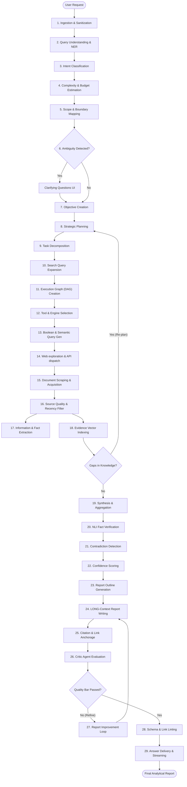

---

## Stage 1: User Query Ingestion

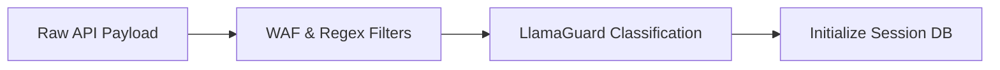

- **Inputs**: Unstructured plain text query from the API client, HTTP metadata (User-Agent, authorization token, target output type), and execution parameters (max duration, depth preference).
- **Processing Steps**:
  1. Capture raw payload at API gateway.
  2. Run string normalization (strip invalid unicode, sanitize escape characters).
  3. Dispatch prompt to input safety guards (e.g., LlamaGuard or custom classifiers) to block malicious prompt injections.
  4. Write execution session metadata to the session store.
- **LLM Reasoning Involved**: None (handled by network middleware and safety classifiers).
- **Tools Used**: FastAPI Gateway, Pydantic, Redis session store.
- **Data Produced**: `SessionMetadata`: `{ session_id: UUID, raw_query: string, sanitized_query: string, client_ip: string, user_id: string }`.
- **Failure Cases**:
  - Input contains prompt-injection payloads (e.g., "Ignore all previous instructions...").
  - String contains malformed unicode that crashes downstream JSON decoders.
- **Recovery Strategy**: Reject request with HTTP 400 Bad Request; return a clean security violation message if input safety guard raises a flag.

---

## Stage 2: Query Understanding

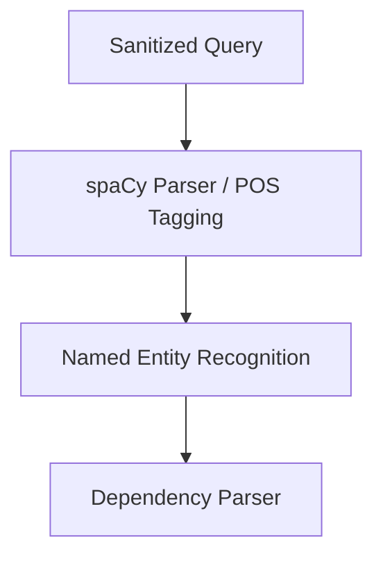

- **Inputs**: `SessionMetadata`.
- **Processing Steps**:
  1. Tokenize query and run Named Entity Recognition (NER) to extract entities (e.g., organizations, technologies, dates).
  2. Parse the query to resolve grammatical references (e.g., "its production impact" -> links "its" back to "solid-state batteries").
  3. Extract core constraints (e.g., "by 2030", "only commercial aircraft").
- **LLM Reasoning Involved**: Zero-shot entity parsing. The LLM is prompted to extract structured parameters:
  ```
  Extract key entities, constraints, and implicit assumptions from: "{sanitized_query}".
  Output strictly in JSON schema: {entities: [], constraints: [], assumptions: []}
  ```
- **Tools Used**: GPT-4o-mini / Gemini 3.5 Flash, spaCy NLP library.
- **Data Produced**: `StructuredQuery`: `{ query_id: UUID, topic: string, entities: list, temporal_constraints: list, logical_operators: list }`.
- **Failure Cases**:
  - LLM fails to extract implicit temporal boundaries (e.g., "recent years" is not mapped to "2024-2026").
  - Ambiguous entity resolution (e.g., "Apple" - is it the fruit, the company, or the singer?).
- **Recovery Strategy**: Use dynamic few-shot templates. If confidence is low, fall back to matching entities against a local taxonomy database (e.g., Wikidata or DBpedia).

---

## Stage 3: Intent Classification

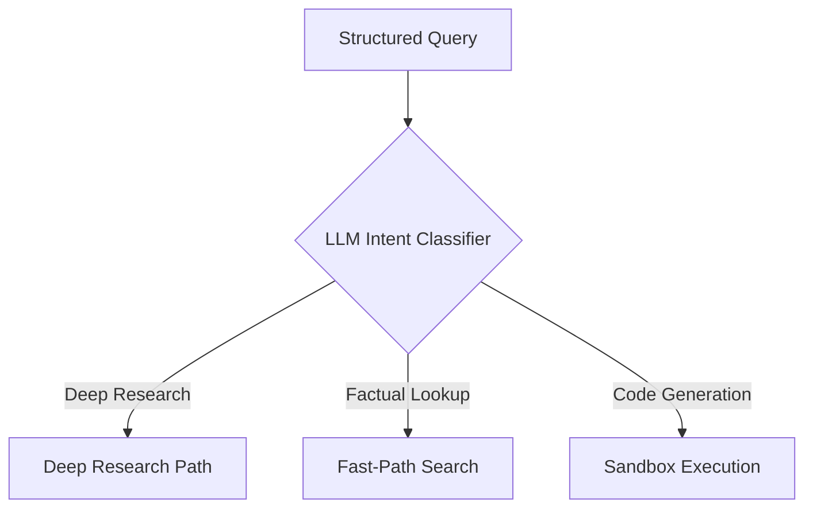

- **Inputs**: `StructuredQuery`.
- **Processing Steps**:
  1. Classify the query intent into a pre-defined taxonomy: `DEEP_RESEARCH`, `FAKTUAL_LOOKUP`, `CODE_SANDBOX`, or `CONVERSATIONAL`.
  2. Identify secondary research archetypes (e.g., `TECHNICAL_COMPARISON`, `FINANCIAL_PROJECTION`, `ACADEMIC_SURVEY`).
- **LLM Reasoning Involved**: Intent classification. The LLM evaluates the target query and matches it against the intent schema.
- **Tools Used**: Fine-tuned classification model or Claude 3 Haiku (system-prompted classification).
- **Data Produced**: `IntentEnvelope`: `{ query_id: UUID, primary_intent: "DEEP_RESEARCH", sub_archetypes: ["TECHNICAL_COMPARISON"], confidence_score: 0.99 }`.
- **Failure Cases**:
  - Complex analytical query is misclassified as a simple factual lookup, resulting in a thin, single-sentence response.
- **Recovery Strategy**: If the confidence score is < 0.90, default to the `DEEP_RESEARCH` path to guarantee research depth.

---

## Stage 4: Research Complexity Estimation


- **Inputs**: `IntentEnvelope`.
- **Processing Steps**:
  1. Calculate the semantic breadth of the query based on the number of entities and relations.
  2. Check the local cache to see if parts of the query can use existing research data.
  3. Calculate a complexity score $C \in [1, 10]$ and allocate token, financial, and time budgets:
     $$\text{Token Budget} = C \times 200,000\text{ tokens}$$
     $$\text{Max Searches} = C \times 2.5$$
- **LLM Reasoning Involved**: Estimating computational and search requirements.
- **Tools Used**: Complexity cost model (Python class).
- **Data Produced**: `ComplexityBudget`: `{ complexity_score: 8, max_depth: 4, token_budget: 1600000, max_queries: 20 }`.
- **Failure Cases**:
  - The query looks simple but requires reading large, complex files (e.g., "Summarize the 800-page battery bill"). The system underestimates complexity and runs out of budget.
- **Recovery Strategy**: If the system reads a large document (> 500 KB), trigger an execution callback to dynamically double the budget.

---

## Stage 5: Scope Determination

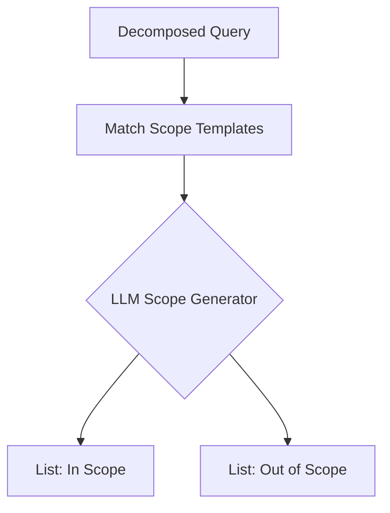

- **Inputs**: `StructuredQuery` and `ComplexityBudget`.
- **Processing Steps**:
  1. Define research boundaries: what must be included (e.g., specific chemical compositions) and what must be excluded (e.g., consumer electronics).
  2. Create strict exclusion rules to prevent wasting API calls on tangential topics.
- **LLM Reasoning Involved**: Generating clear research boundaries based on the user's intent.
- **Tools Used**: GPT-4o with system-prompted boundary templates.
- **Data Produced**: `ScopeSpecification`: `{ in_scope: ["Sulfide electrolytes", "Oxide electrolytes", "EV battery manufacturing scaling"], out_of_scope: ["Consumer electronics", "Stationary storage grid applications"] }`.
- **Failure Cases**:
  - Scope boundaries are too narrow, filtering out relevant context (e.g., excluding stationary storage misses grid scale-up data that could apply to EVs).
- **Recovery Strategy**: Build a boundary checker: if a search query is skipped due to scope rules, run a second-opinion check with a validator prompt.

---

## Stage 6: Clarifying Question Generation

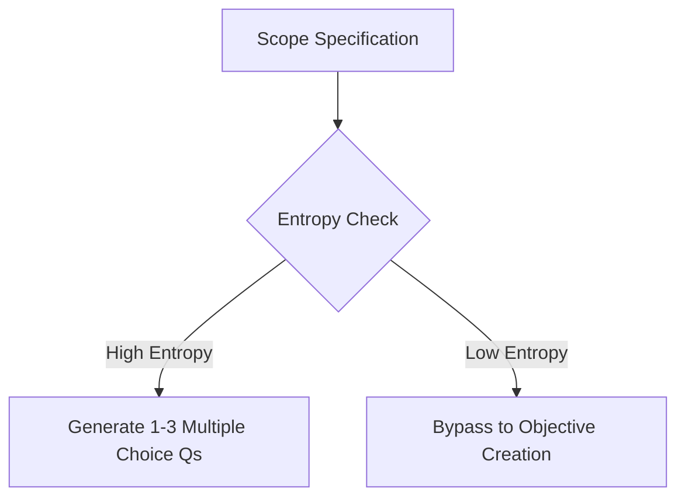

- **Inputs**: `ScopeSpecification` and `StructuredQuery`.
- **Processing Steps**:
  1. Measure semantic ambiguity (entropy).
  2. If the user's query is highly ambiguous, generate 1-3 targeted multiple-choice clarifying questions.
  3. If ambiguity is low, bypass this step and move straight to planning.
- **LLM Reasoning Involved**: Identifying critical gaps in the query that could derail the research.
- **Tools Used**: Custom interactive frontend socket interface.
- **Data Produced**: `ClarificationPayload`: `{ needs_clarification: true, questions: [{ id: "q1", question: "What vehicle category are you analyzing?", options: ["Passenger Cars", "Heavy Trucks", "eVTOL / Aerospace"] }] }`.
- **Failure Cases**:
  - Annoying the user with simple questions that could easily be inferred from context.
- **Recovery Strategy**: Limit clarification to a single interaction. If the user does not respond within a set timeout, assume the most comprehensive default option.

---

## Stage 7: Research Objective Creation

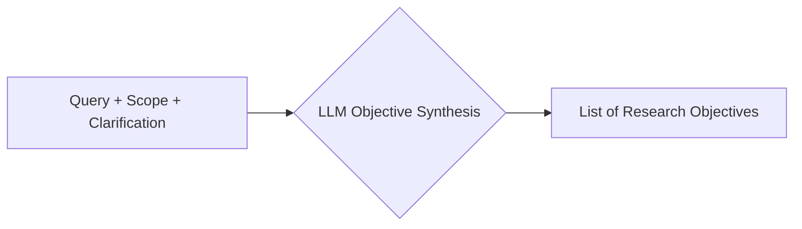

- **Inputs**: `StructuredQuery`, `ScopeSpecification`, and user clarification choices.
- **Processing Steps**:
  1. Synthesize user inputs and scope boundaries into a unified list of research objectives.
  2. Frame each objective as a clear information goal or testable hypothesis.
- **LLM Reasoning Involved**: Translating the user's query into a structured research agenda.
- **Tools Used**: Claude 3.5 Sonnet.
- **Data Produced**: `ResearchObjectives`: `{ objectives: ["Objective 1: Evaluate energy density parameters of sulfide-based solid-state cells.", "Objective 2: Outline 2026-2030 manufacturing roadmaps for key players."] }`.
- **Failure Cases**:
  - Objectives lose alignment with the user's original query.
- **Recovery Strategy**: Run a programmatic check: `VerifyObjectiveAlignment(original_query, objective_list) -> Score [0, 1]`. If score is < 0.90, regenerate.

---

## Stage 8: Research Planning

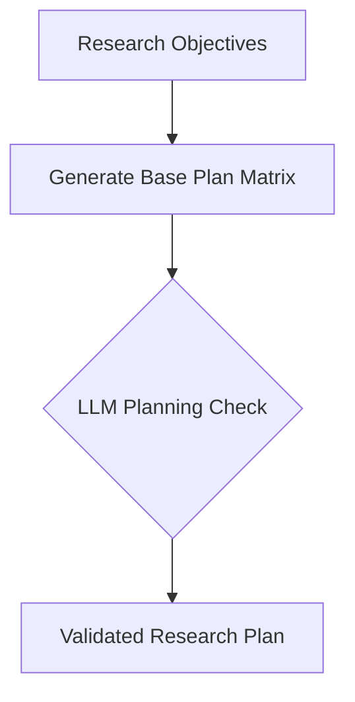

- **Inputs**: `ResearchObjectives` and `ComplexityBudget`.
- **Processing Steps**:
  1. Sequence objectives in logical order (e.g., research chemical baselines before analyzing cost projections).
  2. Allocate the complexity budget across the objectives.
- **LLM Reasoning Involved**: Strategic sequencing and resource allocation.
- **Tools Used**: Custom state graph builder (LangGraph).
- **Data Produced**: `ResearchPlan`: `{ plan_phases: [{ phase_id: 1, objective_id: "obj_1", budget_share: 0.4 }, { phase_id: 2, objective_id: "obj_2", budget_share: 0.6 }] }`.
- **Failure Cases**:
  - Creating a plan with circular dependencies (e.g., Task A depends on Task B, which depends on Task A).
- **Recovery Strategy**: Run a cycle-detection check (e.g., Tarjan's algorithm) on the generated JSON output before execution.

---

## Stage 9: Task Decomposition

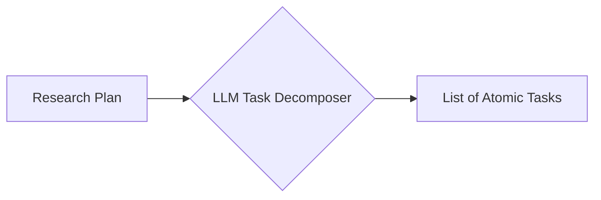

- **Inputs**: `ResearchPlan` and `ScopeSpecification`.
- **Processing Steps**:
  1. Break down major research phases into small, atomic tasks.
  2. Ensure each task focuses on a single concept (e.g., "Research Toyota's solid-state battery patents").
- **LLM Reasoning Involved**: Breaking down complex topics into clear, individual steps.
- **Tools Used**: GPT-4o.
- **Data Produced**: `TaskList`: `{ tasks: [{ task_id: "T1", parent_phase: 1, description: "Extract ionic conductivity figures for sulfide-based SSEs from recent publications." }] }`.
- **Failure Cases**:
  - Creating too many tiny tasks, which wastes tokens on scheduling and coordination overhead.
- **Recovery Strategy**: Set limit rules: maximum tasks per research phase must be kept between 3 and 6.

---

## Stage 10: Sub-Question Generation

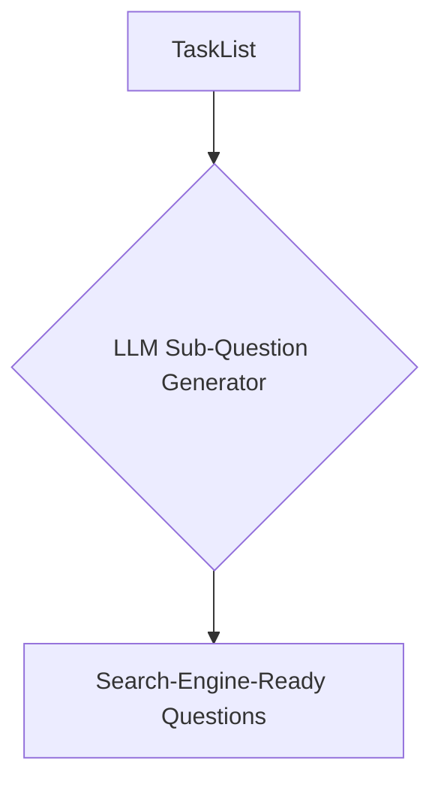

- **Inputs**: `TaskList` and `StructuredQuery`.
- **Processing Steps**:
  1. Convert each task into a set of specific search-engine queries.
  2. Include temporal constraints and synonyms in the generated questions.
- **LLM Reasoning Involved**: Query expansion and keyword variation.
- **Tools Used**: GPT-4o-mini.
- **Data Produced**: `SubQuestions`: `{ task_id: "T1", sub_questions: ["What is the ionic conductivity of LLZO?", "Sulfide-based solid-state electrolyte conductivity mS/cm"] }`.
- **Failure Cases**:
  - Model generates queries with fictional chemical compounds or companies.
- **Recovery Strategy**: Validate terms against a local entity lookup database to ensure spelling accuracy.

---

## Stage 11: Execution Graph Creation

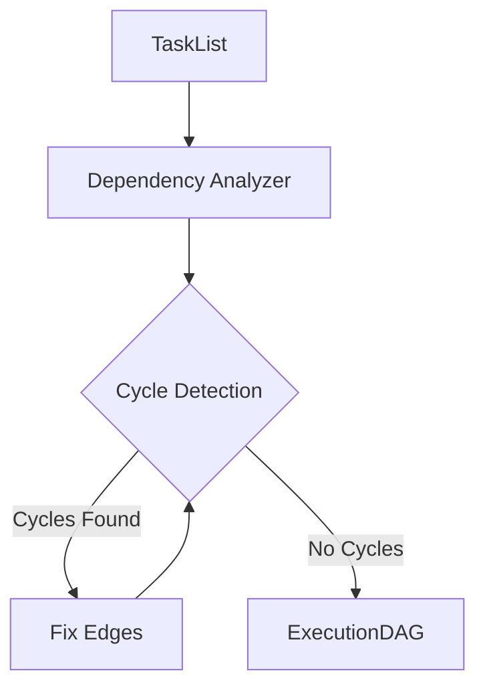

- **Inputs**: `TaskList` and dependencies.
- **Processing Steps**:
  1. Analyze tasks for prerequisite requirements.
  2. Build a Directed Acyclic Graph (DAG) representing the task dependencies.
  3. Identify which tasks can run in parallel.
- **LLM Reasoning Involved**: Dependency analysis and graph design.
- **Tools Used**: NetworkX (Python graph library).
- **Data Produced**: `ExecutionDAG`: `{ nodes: [{ id: "T1" }, { id: "T2" }], edges: [{ from: "T1", to: "T2" }] }`.
- **Failure Cases**:
  - The graph contains cycles, causing the execution engine to hang.
- **Recovery Strategy**: Programmatically break cycles by removing the edge with the lowest relevance score.

---

## Stage 12: Tool Selection

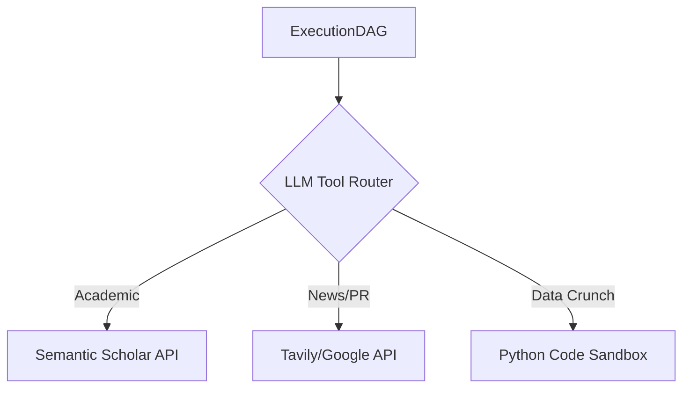

- **Inputs**: `ExecutionDAG` nodes.
- **Processing Steps**:
  1. Determine the best tool for each node (e.g., Academic Search for chemistry, Web Search for news, Code Interpreter for analyzing data tables).
  2. Configure tool parameters (date ranges, domain filters).
- **LLM Reasoning Involved**: Tool routing and parameter configuration.
- **Tools Used**: LLM Function Calling.
- **Data Produced**: `ToolConfiguration`: `{ node_id: "T1", tool: "AcademicSearchEngine", parameters: { academic_databases: ["arxiv", "semantic_scholar"], limit: 10 } }`.
- **Failure Cases**:
  - Selecting academic search for current market news, or web search for academic papers.
- **Recovery Strategy**: Add fallback rules: if a task includes keywords like "patent" or "journal", automatically route it to academic engines.

---

## Stage 13: Search Strategy Generation

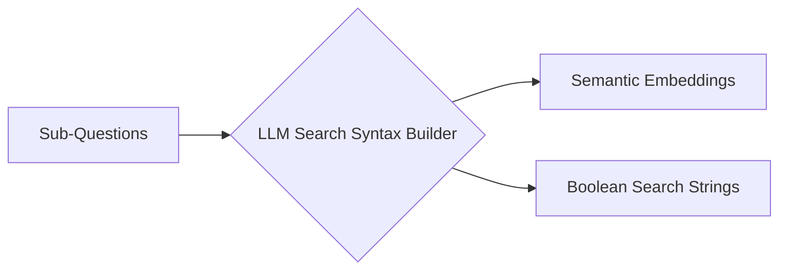

- **Inputs**: `SubQuestions` and `ToolConfiguration`.
- **Processing Steps**:
  1. Convert conversational questions into search-engine queries (e.g., using Boolean operators: `("solid-state battery" OR "solid electrolyte") AND "conductivity"`).
  2. Generate search embeddings for semantic engines.
- **LLM Reasoning Involved**: Translating ideas into search logic.
- **Tools Used**: GPT-4o-mini.
- **Data Produced**: `SearchStrategy`: `{ queries: ["\"solid-state battery\" \"electrolyte\" (sulfide OR oxide OR polymer)", "solid-state battery ionic conductivity table"] }`.
- **Failure Cases**:
  - Query strings are too long or contain too many operators, returning zero results.
- **Recovery Strategy**: Generate queries in tiers: Tier 1 (highly specific), Tier 2 (broader fallback). If Tier 1 returns no results, drop back to Tier 2.

---

## Stage 14: Web Exploration

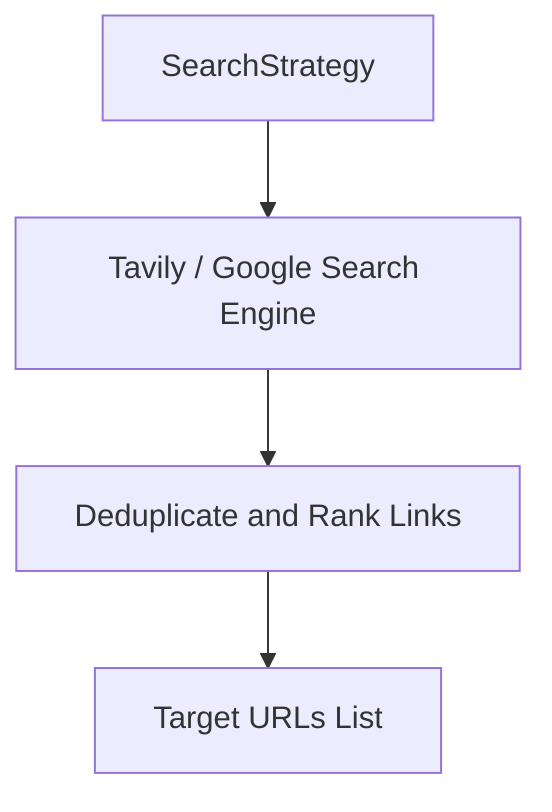

- **Inputs**: `SearchStrategy`.
- **Processing Steps**:
  1. Send queries to search APIs (Google, Bing, Tavily).
  2. Deduplicate URLs across parallel search results.
  3. Sort links by relevance based on snippet content.
- **LLM Reasoning Involved**: None (I/O operation).
- **Tools Used**: Google Custom Search API, Bing Web Search API, Tavily API.
- **Data Produced**: `ExplorationResults`: `{ query: string, links: [{ title: string, url: string, snippet: string }] }`.
- **Failure Cases**:
  - API rate limits hit.
  - Search engines block requests with CAPTCHAs.
- **Recovery Strategy**: Implement automatic rotation across multiple search providers.

---

## Stage 15: Document Acquisition

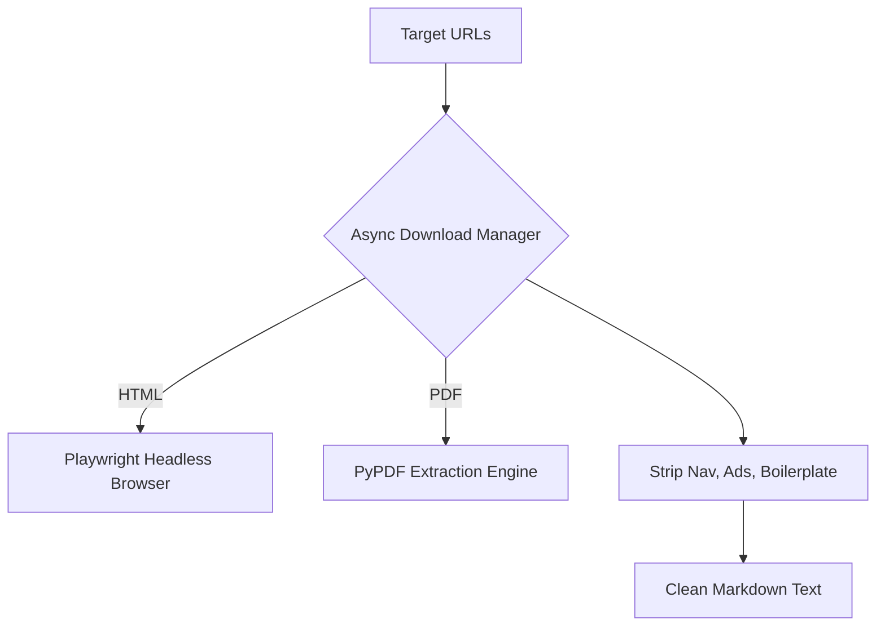

- **Inputs**: `ExplorationResults`.
- **Processing Steps**:
  1. Fetch page content using asynchronous HTTP clients.
  2. Use a headless browser (Playwright) to load dynamic, Javascript-rendered pages.
  3. Parse HTML and PDFs into clean text or markdown, removing ads, navigation menus, and footers.
- **LLM Reasoning Involved**: None (I/O operation).
- **Tools Used**: HTTPX, Playwright, BeautifulSoup, Jina Reader API.
- **Data Produced**: `AcquiredDocuments`: `{ url: string, raw_text: string, retrieval_status: "SUCCESS" | "FAILED" }`.
- **Failure Cases**:
  - Site protected by paywalls or Cloudflare browser checks.
  - PDF parser fails on scanned images.
- **Recovery Strategy**: Fallback to screenshots with OCR if PDF parser fails; use paywall-bypass readers for known news sites.

---

## Stage 16: Source Filtering

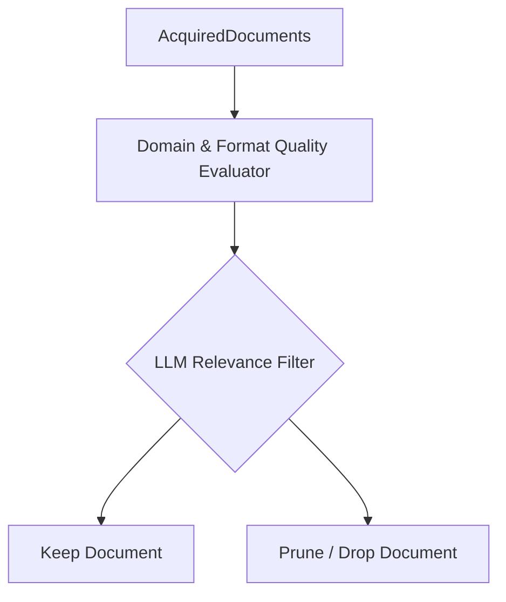

- **Inputs**: `AcquiredDocuments` and `ScopeSpecification`.
- **Processing Steps**:
  1. Check source authority based on domain suffix (e.g., `.edu`, `.gov`, peer-reviewed journals vs. personal blogs).
  2. Use semantic search to verify the text aligns with the scope.
  3. Prune documents with quality or relevance scores below threshold.
- **LLM Reasoning Involved**: Relevance scoring.
- **Tools Used**: Gemini 3.5 Flash (for fast evaluation).
- **Data Produced**: `FilteredDocuments`: `{ url: string, clean_text: string, relevance_score: float }`.
- **Failure Cases**:
  - Filtering out highly valuable but poorly formatted pages (e.g., plain-text lab reports).
- **Recovery Strategy**: Keep any document that has a high semantic relevance score, even if its formatting quality score is low.

---

## Stage 17: Information Extraction

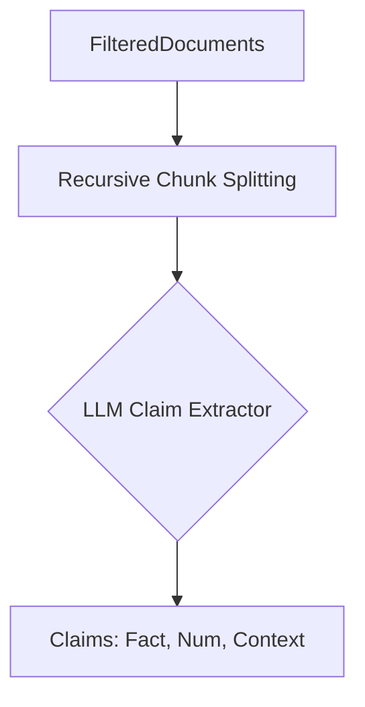

- **Inputs**: `FilteredDocuments` and `ResearchObjectives`.
- **Processing Steps**:
  1. Split long documents into overlapping segments (e.g., 1024-token chunks with 128-token overlaps).
  2. Extract claims, facts, and numerical data that address the research objectives.
  3. Format each point as an atomic claim.
- **LLM Reasoning Involved**: Information extraction and formatting.
- **Tools Used**: GPT-4o / Claude 3.5 Sonnet.
- **Data Produced**: `ExtractedClaims`:
  ```json
  [{
    "source_url": "https://example.com/toyota-ssb",
    "claim": "Toyota targets solid-state battery energy density of 1000 Wh/L by 2028.",
    "numerical_values": { "density": 1000, "unit": "Wh/L", "year": 2028 },
    "context_snippet": "In the presentation, engineers highlighted target metrics: 1000 Wh/L by 2028."
  }]
  ```
- **Failure Cases**:
  - LLM alters numbers or units during extraction (e.g., changing Wh/kg to Wh/L).
- **Recovery Strategy**: Run programmatic checks to ensure the extracted values exist in the raw source snippet.

---

## Stage 18: Evidence Storage

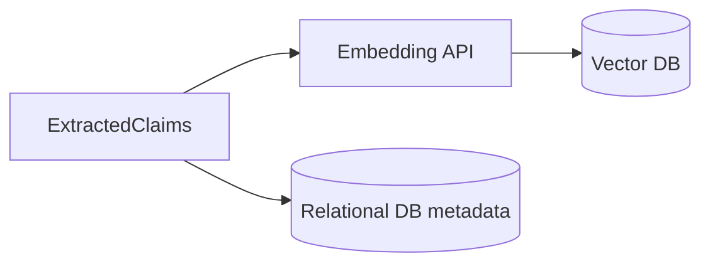

- **Inputs**: `ExtractedClaims`.
- **Processing Steps**:
  1. Remove duplicate claims from the same source.
  2. Generate embeddings for the extracted claims.
  3. Save the claims, metadata, and origin URLs to a structured database and vector store.
- **LLM Reasoning Involved**: None (handled by database drivers).
- **Tools Used**: Qdrant Vector DB, PostgreSQL, OpenAI `text-embedding-3-small`.
- **Data Produced**: `StoredEvidenceEnvelope`: `{ evidence_id: UUID, stored: true }`.
- **Failure Cases**:
  - Database connection drops.
  - Duplication check fails, causing redundant entries.
- **Recovery Strategy**: Use upsert operations with unique hash constraints based on URL and claim text.

---

## Stage 19: Knowledge Synthesis

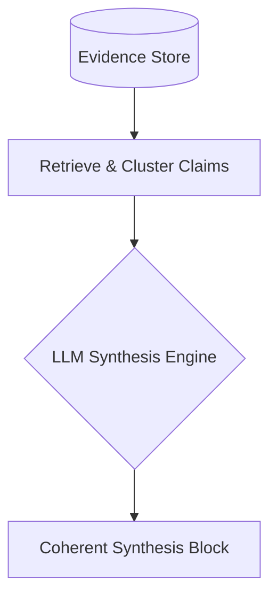

- **Inputs**: `evidence_store` database and `ResearchObjectives`.
- **Processing Steps**:
  1. Retrieve all claims related to a research objective.
  2. Group claims into thematic subtopics.
  3. Synthesize the findings into a cohesive analysis for each objective.
- **LLM Reasoning Involved**: Summarization and logical synthesis.
- **Tools Used**: Claude 3.5 Sonnet.
- **Data Produced**: `SynthesizedBlocks`: `{ objective_id: "obj_1", synthesis_text: "Solid-state electrolyte development has centered on three chemistry families: sulfides, oxides, and polymers..." }`.
- **Failure Cases**:
  - LLM invents connections or logical leaps between sources that do not exist.
- **Recovery Strategy**: Prompt the model to only use facts present in the retrieved claims, and forbid the use of external knowledge.

---

## Stage 20: Fact Verification

```mermaid
graph TD
    Narrative[Synthesized Block] --> MatchClaims[Map statements to references]
    MatchClaims --> VerifyAgent{LLM NLI Evaluator}
    VerifyAgent -->|Support| Pass[Verified]
    VerifyAgent -->|Contradict/Neutral| Flag[Flag for Review]
```

- **Inputs**: `SynthesizedBlocks` and `StoredEvidence`.
- **Processing Steps**:
  1. Match each statement in the synthesized text back to its source snippet in the database.
  2. Run a verification check: does the source context explicitly support the statement?
- **LLM Reasoning Involved**: Natural Language Inference (NLI) classification: `SUPPORT`, `CONTRADICT`, or `NEUTRAL`.
- **Tools Used**: Custom NLI pipeline using GPT-4o.
- **Data Produced**: `VerificationReport`: `{ statement: "...", status: "VERIFIED" | "CONTRADICTED" | "NEUTRAL", reference_url: "..." }`.
- **Failure Cases**:
  - LLM verifies claims using its own background knowledge instead of the provided source snippet.
- **Recovery Strategy**: Feed the verification model *only* the specific snippet and statement, stripping out all external tools and systemic memory.

---

## Stage 21: Contradiction Detection

```mermaid
graph TD
    Claims[ExtractedClaims] --> CrossCheck{LLM Conflict Analyzer}
    CrossCheck -->|Conflict Found| FlagConflict[Flag Contradiction]
    CrossCheck -->|Compatible| PassConflict[Pass]
```

- **Inputs**: `ExtractedClaims` from the evidence store.
- **Processing Steps**:
  1. Compare claims within the same topic to identify conflicts (e.g., Source A says: "Production cost will be \$120/kWh in 2030." Source B says: "Production cost will drop to \$80/kWh by 2028.").
  2. Flag contradicting nodes in the database.
- **LLM Reasoning Involved**: Logical contradiction analysis.
- **Tools Used**: GPT-4o.
- **Data Produced**: `ContradictionMap`: `{ conflict_id: 1, topic: "Cost", conflicts: [{ url: "url_a", claim: "$120" }, { url: "url_b", claim: "$80" }] }`.
- **Failure Cases**:
  - Missing subtle contradictions (e.g., conflicting definitions of efficiency metrics).
- **Recovery Strategy**: Present contradictions explicitly in the report (e.g., "While Source A projects \$120/kWh, Source B projects \$80/kWh, citing faster scaling effects") to ensure transparency.

---

## Stage 22: Confidence Scoring

```mermaid
graph LR
    Inputs[Verification & Contradictions] --> ScoreCalc[Heuristic Formula]
    ScoreCalc --> ConfidenceScore[Score: 0.0 - 1.0]
```

- **Inputs**: `VerificationReport` and `ContradictionMap`.
- **Processing Steps**:
  1. Calculate a confidence score ($CS \in [0, 1]$) for each synthesized finding based on:
     - Volume of backing sources.
     - Verification status of backing claims.
     - Presence of unmitigated contradictions.
     - Source quality metrics.
- **LLM Reasoning Involved**: None (handled by mathematical heuristic scoring).
- **Tools Used**: Math execution engine.
- **Data Produced**: `ConfidenceProfile`: `{ finding_id: 1, confidence_score: 0.85, primary_risks: ["Conflict in cost timeline data"] }`.
- **Failure Cases**:
  - Giving high confidence scores to unverified rumors or press releases.
- **Recovery Strategy**: Hardcode baseline penalties: if a finding has only a single source, apply a -0.3 penalty to the confidence score. If it has unmitigated contradictions, apply a -0.4 penalty.

---

## Stage 23: Report Outline Generation

```mermaid
graph TD
    Synthesis[SynthesizedBlocks] --> OutlineGen{LLM Document Architect}
    OutlineGen --> Outline[Report Outline Skeleton]
```

- **Inputs**: `SynthesizedBlocks` and `ResearchObjectives`.
- **Processing Steps**:
  1. Design a comprehensive outline for the final report.
  2. Structure sections logically (e.g., Executive Summary -> Technical Breakdown -> Market Analysis -> Outlook).
  3. Map synthesized findings to their respective sections.
- **LLM Reasoning Involved**: Document design and structuring.
- **Tools Used**: GPT-4o / Claude 3.5 Sonnet.
- **Data Produced**: `ReportOutline`: `{ sections: [{ section_id: "SEC1", title: "Executive Summary", objectives: ["obj_1"] }] }`.
- **Failure Cases**:
  - Creating sections that overlap, leading to a bloated and repetitive report.
- **Recovery Strategy**: Enforce strict template constraints on outline generation; review outline schema with a separate validator pass before starting the writing phase.

---

## Stage 24: Report Writing

```mermaid
graph TD
    Outline[ReportOutline] --> WriteWorker{LLM Writing Engine}
    WriteWorker --> TextDraft[Report Section Markdown]
```

- **Inputs**: `ReportOutline`, `SynthesizedBlocks`, and `ConfidenceProfiles`.
- **Processing Steps**:
  1. Write the content for each outline section sequentially or in parallel.
  2. Integrate numerical data, analytical tables, and technical context directly into the text.
  3. Apply professional tone guidelines.
- **LLM Reasoning Involved**: Detailed text generation, style formatting, and structural cohesion.
- **Tools Used**: Claude 3.5 Sonnet (preferred for long-context generation).
- **Data Produced**: `DraftReport`: `{ markdown_text: "# Solid-State Batteries: 2030 EV Roadmap..." }`.
- **Failure Cases**:
  - Model inserts unsourced facts to improve sentence flow or readability.
  - Moving away from objective engineering analysis to generic marketing jargon.
- **Recovery Strategy**: Write in chunks corresponding to sections. Provide the LLM with *only* the specific synthesis context for that section, making it impossible for the model to drag in unverified background ideas.

---

## Stage 25: Citation Generation

```mermaid
graph TD
    Draft[DraftReport] --> Linker[Source Reference Matcher]
    Linker --> CiteGenerator{LLM Citation Engine}
    CiteGenerator --> CitedReport[Markdown Report with Citations]
```

- **Inputs**: `DraftReport` and source mappings from the evidence store.
- **Processing Steps**:
  1. Locate claims in the draft report that require citations.
  2. Append inline anchor tags (e.g., `[1]`, `[2]`) linked to verified sources.
  3. Build a comprehensive bibliography at the bottom of the document.
- **LLM Reasoning Involved**: Index mapping. The model matches text assertions back to the original database IDs.
- **Tools Used**: Programmatic matcher + LLM post-processing.
- **Data Produced**: `CitedReport`: `{ text: "...Toyota pilot line [1]...", bibliography: { "[1]": "https://example.com/toyota-pr" } }`.
- **Failure Cases**:
  - Attributing a statement to the wrong URL.
  - Generating citations for facts that do not appear in the source text.
- **Recovery Strategy**: Programmatically parse all Markdown links and inline citation brackets, verify each ID exists in the database, and verify the URL returns an active HTTP status code (200 OK).

---

## Stage 26: Reflection and Self-Critique

```mermaid
graph TD
    Report[CitedReport] --> Critique{LLM Adversarial Critic}
    Critique --> PassQC{Score >= Target?}
    PassQC -- Yes --> S28[Proceed to Quality Check]
    PassQC -- No --> S27[Report Improvement Loop]
```

- **Inputs**: `CitedReport` and `ResearchObjectives`.
- **Processing Steps**:
  1. Feed the draft report to an independent Critic Agent.
  2. Assess the document against the original objectives.
  3. Audit citations, trace logic, search for unresolved contradictions, and evaluate structural flow.
- **LLM Reasoning Involved**: Adversarial evaluation and gap analysis.
- **Tools Used**: Claude 3.5 Sonnet (with critic instructions).
- **Data Produced**: `CritiqueReport`: `{ score: 82, gaps: ["Moisture sensitivity details are missing from manufacturing bottlenecks section"], needs_revision: true }`.
- **Failure Cases**:
  - The critic gives a superficial pass ("looks great") without catching subtle issues.
  - Critic always finds minor issues, preventing report completion (infinite loops).
- **Recovery Strategy**: Limit refinement to a maximum of 2 loops. Use a structured critique rubric (e.g., Clarity, Completeness, Evidence, Tone) with binary metrics (Yes/No) to keep the feedback objective and actionable.

---

## Stage 27: Report Improvement

```mermaid
graph TD
    Report[CitedReport] --> DiffGenerator{LLM Diff Engine}
    DiffGenerator --> Patch[Apply Markdown Patches]
    Patch --> ImprovedReport[Revised Report Draft]
```

- **Inputs**: `CitedReport` and `CritiqueReport`.
- **Processing Steps**:
  1. If revision is needed, identify missing content or sections requiring rewrites.
  2. If necessary, execute targeted web searches to fill missing data points.
  3. Rewrite the identified sections to address the critic's feedback.
- **LLM Reasoning Involved**: Targeted text editing and integration. The model revises sections while preserving the rest of the document's structure and flow.
- **Tools Used**: GPT-4o.
- **Data Produced**: `RevisedReport`: `{ text: "..." }`.
- **Failure Cases**:
  - The rewrite breaks existing formatting, drops citations, or introduces new contradictions.
- **Recovery Strategy**: Apply diff-based updates (using tools like `replace_file_content`) to target only the paragraphs flagged for correction, keeping the rest of the verified text intact.

---

## Stage 28: Final Quality Checks

```mermaid
graph LR
    Report[RevisedReport] --> CheckLinks[Link Auditor]
    CheckLinks --> FormatLint[Markdown Linter]
    FormatLint --> QCApproved[Quality Check Approved Envelope]
```

- **Inputs**: `RevisedReport`.
- **Processing Steps**:
  1. Check report against formatting schemas (e.g., markdown structure, header depth).
  2. Validate citations and links to ensure no references are broken.
  3. Audit tone constraints and output rules.
- **LLM Reasoning Involved**: Formatting verification and rule compliance checks.
- **Tools Used**: Custom Markdown linters, Python validation script.
- **Data Produced**: `FinalReportEnvelope`: `{ text: "...", status: "PASSED" }`.
- **Failure Cases**:
  - Special characters or bad markdown formatting that breaks the user UI.
- **Recovery Strategy**: Use markdown parser libraries to guarantee output matches valid AST formats before rendering.

---

## Stage 29: Final Answer Delivery

```mermaid
graph LR
    Envelope[FinalReportEnvelope] --> Streamer[Server-Sent Events / WS]
    Streamer --> ClientUI[Client Interface Render]
```

- **Inputs**: `FinalReportEnvelope`.
- **Processing Steps**:
  1. Package the report payload with its bibliography and confidence index.
  2. Push the completed document to the user UI, supporting streaming output or direct file download (PDF/Docx).
  3. Log final session metrics (total cost, execution time, tokens used).
- **LLM Reasoning Involved**: None (handled by application delivery layer).
- **Tools Used**: Server-Sent Events (SSE) / WebSocket, PDF generation engine.
- **Data Produced**: Client-rendered dashboard view.
- **Failure Cases**:
  - Network connection drops during delivery.
- **Recovery Strategy**: Cache the final report in the database under `UUID`. If the connection drops, allow the client to request a full reload from the database.

---

# Part B: Internal Multi-Agent Architecture

## 1. Agent Inventory

| Agent | Responsibility | Inputs | Outputs | Tools | Memory | Communication |
| :--- | :--- | :--- | :--- | :--- | :--- | :--- |
| **Planner Agent** | Generates research plans, decomposes queries into tasks, and defines dependencies. | `DecomposedQuery`, `ScopeSpecification` | `ExecutionDAG` (JSON) | None | Session state summary | RPC call from Supervisor |
| **Supervisor Agent** | Manages system execution, budgets, state transitions, and worker routing. | Initial query, Task completions | Task allocations, Final report | State transitions | Central state database (Redis) | Orchestrates all agents |
| **Worker Agent** | Base class for execution tasks, standardizing exception handling, resource cleanup, and execution metrics. | Task context | Execution output | Class-specific tools | Task-local context | Managed by Supervisor |
| **Research Agent** | Investigates target topics, reads evidence, and writes synthesized summaries. | Objective parameters, Evidence set | `SynthesizedBlocks` | Summarization prompts | Vector DB session index | Dispatched by Supervisor |
| **Search Agent** | Formulates search queries and queries search indexes (Bing, Google, Tavily). | Target questions | `SearchResultSet` | Search APIs (Tavily, Google) | Query and URL cache | Serves the Research Agent |
| **Browser Agent** | Controls headless browser instances to scrape pages and bypass paywalls. | Target URLs | Page content, Screenshots | Playwright, Puppeteer | Cookie/Session store | Triggered by Research Agent |
| **Document Agent** | Parses complex documents (PDFs, spreadsheets, slides). | File paths, File blobs | Parsed markdown tables/text | PyPDF2, pdfplumber | File buffers | Serves the Browser Agent |
| **Retrieval Agent** | Manages vector indexing and similarity retrieval. | Text chunks, Embeddings | Match snippets, Scores | Qdrant / Pinecone API | Local vector index cache | Connects to Research Agent |
| **Fact Checking Agent** | Cross-checks synthesized claims against primary source files. | `SynthesizedBlocks` | `VerificationReport` | NLI validation model | None | Called by Supervisor |
| **Critic Agent** | Evaluates plans and report drafts to find logic gaps and errors. | Report draft, Objectives | `CritiqueReport` | Adversarial reviews | Initial scope context | Responds to Supervisor |
| **Reflection Agent** | Analyzes execution errors (e.g., search failures) and adjusts search strategy. | Task error logs | Revised search terms | Query relaxation prompts | Search history index | Connects to Planner |
| **Citation Agent** | Maps report facts to bibliography entries and verifies links. | Draft text, Mapped evidence | `CitedReport` | Link validators | Source registry | Connects to Writer |
| **Report Writing Agent** | Assembles verified blocks into a cohesive markdown document. | Synthesized blocks, Outline | `DraftReport` | Template styling guides | Section outline mapping | Dispatched by Supervisor |
| **Quality Control Agent** | Validates final formatting, link integrity, and style compliance. | Revised report draft | QC compliance envelope | Markdown linters | Rules configuration | Final step before delivery |

---

## 2. Multi-Agent Coordination Mechanics

### 2.1 Agent-to-Agent Messaging
Agents communicate using structured JSON envelopes over an asynchronous message broker (e.g., RabbitMQ or Redis Pub/Sub). This keeps agent interactions decoupled and allows tasks to be queued and retried.

#### Message Payload Example
```json
{
  "message_id": "msg_98765",
  "correlation_id": "session_abc123",
  "timestamp": "2026-06-23T23:06:00Z",
  "sender": "supervisor",
  "recipient": "research_agent_03",
  "action": "SYNTHESIZE_TOPIC",
  "payload": {
    "objective_id": "obj_1",
    "evidence_ids": ["ev_01", "ev_02", "ev_03"]
  }
}
```

### 2.2 Shared State Management
State is managed using a centralized database (e.g., Redis for fast access, PostgreSQL for persistence). Individual agents remain stateless; they pull the current state from the database at the start of a task and push updates when finished.

```python
class ResearchState(BaseModel):
    session_id: str
    objectives: List[str]
    tasks: Dict[str, TaskStatus]
    evidence_index: List[EvidenceItem]
    contradictions: List[Contradiction]
    report_draft: Optional[str] = None
```

### 2.3 Context Sharing
To prevent token bloat, agents do not share the entire conversation history. Instead, they share access to the centralized database and query vectors as needed. Context is trimmed to include only the current task definition and relevant evidence.

### 2.4 Memory Management
- **Short-Term Memory**: Ephemeral context local to the agent's current task loop. Stored in Redis and cleaned up once the task finishes.
- **Long-Term Memory**: Vector database storage containing extracted evidence, research findings, and metadata. Persisted across research runs.

### 2.5 Checkpointing
Every state change is logged in a Write-Ahead Log (WAL). If a system crash or API timeout occurs, the Supervisor Agent can restore the system to its last verified state from the log.

### 2.6 Task Delegation & Parallel Execution
The Supervisor evaluates the execution graph (`ExecutionDAG`) and identifies independent tasks. These tasks are dispatched to a worker pool (e.g., Celery / Redis Queue) to run in parallel. When all dependencies are met, child tasks are triggered.

### 2.7 Failure Handling
- **Transient Failures (e.g., API timeouts)**: Handled using exponential backoff retry policies.
- **Systemic Failures (e.g., search query returns no results)**: Triggers the Reflection Agent to modify search terms.
- **Fatal Failures (e.g., all search routes exhausted)**: Gracefully scales back the scope, logs the issue, and continues generating the report using the available data.

---

## 3. Multi-Agent Interaction Diagram

This diagram shows how agents communicate and coordinate during a research session.

```mermaid
sequenceDiagram
    autonumber
    actor User
    participant Supervisor as Supervisor Agent
    participant Planner as Planner Agent
    participant Research as Research Agent
    participant Browser as Browser Agent
    participant Critic as Critic Agent
    participant Writer as Writing Agent

    User->>Supervisor: Ingest Query
    activate Supervisor
    Supervisor->>Planner: Analyze & Plan (Query)
    activate Planner
    Planner-->>Supervisor: Return ExecutionDAG
    deactivate Planner
    
    rect rgba(253, 254, 255, 1)
        note right of Supervisor: Parallel Worker Dispatch
        par Task 1: Baseline Analysis
            Supervisor->>Research: Collect Data (Task 1)
            activate Research
            Research->>Browser: Scrape Page (URLs)
            activate Browser
            Browser-->>Research: Return Clean Text
            deactivate Browser
            Research-->>Supervisor: Task 1 Results
            deactivate Research
        and Task 2: Market Analysis
            Supervisor->>Research: Collect Data (Task 2)
            activate Research
            Research->>Browser: Scrape Page (URLs)
            activate Browser
            Browser-->>Research: Return Clean Text
            deactivate Browser
            Research-->>Supervisor: Task 2 Results
            deactivate Research
        end
    end
    
    Supervisor->>Critic: Review Synthesized Evidence
    activate Critic
    Critic-->>Supervisor: Critique & Gap Analysis
    deactivate Critic

    Supervisor->>Writer: Draft Final Report (Evidence)
    activate Writer
    Writer-->>Supervisor: Cited Markdown Report
    deactivate Writer

    Supervisor->>User: Stream Final Report
    deactivate Supervisor
```

---

# Part C: Research Planning Engine

## 1. Planning Taxonomy

### 1.1 Static Planning
Static planning generates a fixed list of tasks at the start of a research run. This approach works well for simple queries with clear scopes, but is too rigid for complex, multi-layered investigations.

### 1.2 Dynamic Planning
Dynamic planning updates the plan based on new information discovered during the research run. If a search reveals a new subtopic, the system can add new tasks to the execution graph.

### 1.3 Iterative Planning
Iterative planning runs research in sequential loops. The system evaluates the results of one loop before planning the next.

### 1.4 Re-planning After Search Failures
If a search query returns no results, the Planning Engine does not crash. It triggers a reflection loop to analyze the failure:
- **Case A: Query is too specific**. The system relaxes constraints (e.g., changes `("sulfide-based electrolyte" AND "Toyota" AND "Q3 2026")` to `("sulfide battery" AND "Toyota" AND "production")`).
- **Case B: No information exists**. The system marks the subtopic as "unresolved" and shifts resources to alternative areas.

### 1.5 Tree of Thought (ToT) Reasoning
For complex, multi-path decisions, the Planning Engine evaluates paths using a tree structure. It generates multiple planning options, scores each path, and prunes low-performing branches.

### 1.6 Graph of Thoughts (GoT)
GoT extends ToT by allowing execution paths to merge, loop, and branch dynamically. This is critical for cross-referencing information from different sources (e.g., merging a technical breakthrough with a manufacturing timeline).

### 1.7 Architectural Paradigms
- **Plan-and-Execute**: Generate the plan first, then execute it. Simple but brittle when research paths change.
- **ReAct (Reason + Act)**: Interleaves reasoning and tool actions in a single loop. Good for quick updates, but can lose sight of long-term goals.
- **Supervisor-Worker**: A central Supervisor agent guides specialized worker agents using an execution graph.
- **Hierarchical Agent Systems**: Workers can spin up their own sub-agents to tackle complex subtopics, isolating tasks and managing context length.

---

## 2. Task Orchestration, Dependency, & Priority Scheduling

To run deep research at scale, tasks must be managed efficiently:
- **Task Decomposition**: Subtasks are written to a queue as self-contained jobs.
- **Dependency Representation**: Dependencies are stored as an adjacency list. A task runs only when its predecessor tasks are marked as `COMPLETED`.
- **Task Prioritization**: Critical path tasks (tasks with the most downstream dependencies) are prioritized.
- **Parallel Scheduling**: Independent branches run concurrently.
- **Long-Running Job Management**: Worker tasks run asynchronously with timeout limits (e.g., 3 minutes). If a scraper hangs, the job is killed, rescheduled, or skipped.

---

## 3. Concrete Example: Software Engineering Job Impact Graph (2020-2030)

### User Request
> *"Analyze the impact of AI on software engineering jobs between 2020 and 2030."*

### Task Decomposition & Dependency Mapping
The Planning Engine translates the request into the following execution graph:

```
                            [A: 2020 SWE Baseline]
                                      │
                   ┌──────────────────┴──────────────────┐
                   ▼                                     ▼
        [B: AI Tech Milestones]              [C: Productivity Metrics]
        (Copilot, GPT-4, Agents)              (Adoption rate data)
                   │                                     │
                   └──────────────────┬──────────────────┘
                                      ▼
                           [D: Job Market Trends]
                           (Hiring, salaries, roles)
                                      │
                   ┌──────────────────┴──────────────────┐
                   ▼                                     ▼
         [E: Skillset Evolution]              [F: Macroeconomic Proj.]
         (Prompting, Architecture)             (Offshoring, growth)
                   │                                     │
                   └──────────────────┬──────────────────┘
                                      ▼
                            [G: Report Synthesis]
```

### Dependency Adjacency List
- `A` (No dependencies)
- `B` (Depends on `A`)
- `C` (Depends on `A`)
- `D` (Depends on `B`, `C`)
- `E` (Depends on `D`)
- `F` (Depends on `D`)
- `G` (Depends on `E`, `F`)

---

## 4. Planning Engine Diagrams

### 4.1 Planning Workflow
This diagram shows how the system plans, executes, and revises its strategy based on incoming search results.

```mermaid
graph TD
    UserQuery[User Query Ingestion] --> ParseQuery[Query Parsing & Entity Extraction]
    ParseQuery --> EstBudget[Estimate Token & Time Budget]
    EstBudget --> CreatePlan[Generate Initial Research Plan]
    CreatePlan --> GenDAG[Build Directed Acyclic Graph - DAG]
    
    subgraph Execution Loop
        GenDAG --> DispatchTasks[Dispatch Parallel Tasks to Workers]
        DispatchTasks --> CollectEvidence[Collect & Index Evidence]
        CollectEvidence --> AssessProgress{Objectives Met?}
        
        AssessProgress -- Gaps Identified --> RePlan[Dynamic Plan Revision: Add/Modify Nodes]
        RePlan --> GenDAG
    end
    
    AssessProgress -- Objectives Met --> DraftReport[Report Outline & Drafting]
    DraftReport --> Verification[Fact Verification & QC]
    Verification --> Deliver[Deliver Report]
```

### 4.2 Task Dependency Graph
The dependency graph for the AI Software Engineering query, showing how baseline research feeds into market and skill analyses.

```mermaid
graph TD
    A["T1: Baseline SWE Landscape (2020)"] --> B["T2: AI Developer Tools Timeline (2020-2025)"]
    A --> C["T3: AI Adoption & Developer Productivity Metrics"]
    
    B --> D["T4: Job Market Shifts (Hiring, Salaries, Demand)"]
    C --> D
    
    D --> E["T5: Evolution of SWE Skillsets & Roles"]
    D --> F["T6: Macroeconomic Projections & Global Sourcing"]
    
    E --> G["T7: Integrated Impact Report Synthesis"]
    F --> G
```

### 4.3 Agent Execution Graph
How specialized agents interact to coordinate, execute, and verify tasks.

```mermaid
graph TD
    SupervisorAgent[Supervisor Agent] -->|1. Generate Plan| PlannerAgent[Planner Agent]
    PlannerAgent -->|2. Returns DAG| SupervisorAgent
    
    subgraph Execution Pool
        SupervisorAgent -->|3. Delegate Tasks| ResearchAgent[Research Agent]
        ResearchAgent -->|4. Generate Queries| SearchAgent[Search Agent]
        SearchAgent -->|5. Fetch Links| BrowserAgent[Browser Agent]
        BrowserAgent -->|6. Parse Docs| DocAgent[Document Agent]
    end
    
    DocAgent -->|7. Index Content| RetrievalAgent[Retrieval Agent]
    RetrievalAgent -->|8. Claims & Snippets| SupervisorAgent
    
    SupervisorAgent -->|9. Verify Report| FactCheckingAgent[Fact Verification Agent]
    FactCheckingAgent -->|10. Check Draft| CriticAgent[Critic Agent]
    CriticAgent -->|11. Feedback| SupervisorAgent
    
    SupervisorAgent -->|12. Final Compile| QualityControlAgent[Quality Control Agent]
```

---

# Part D: Comparison Between Leading Systems

Because implementation details are proprietary, we compare the likely architectures of ChatGPT Deep Research, Perplexity Deep Research, and Gemini Deep Research based on public releases, technical blogs, and performance profiles.

## System Comparison Matrix

| Feature | ChatGPT Deep Research | Perplexity Deep Research | Gemini Deep Research |
| :--- | :--- | :--- | :--- |
| **Agent Design** | Multi-agent hierarchy managed by an orchestrator with reasoning capabilities. | Router-to-worker setup optimized for fast search execution. | Integrated agent loops built on large context windows. |
| **Planning Capability** | High. Uses Tree of Thought (ToT) exploration and dynamic replanning. | Moderate. Focuses on query expansion and parallel search routing. | High. Leverages long context to keep the plan in active memory. |
| **Search Infrastructure** | Bing Web Search API with custom ranking models. | Perplexity's custom index combined with Google/Bing syndication. | Google Search Index with live page crawling. |
| **Web Browsing Strategy** | Asynchronous page scraping with fallback for Javascript pages. | Fast, parallel page parsing optimized for low latency. | Uses Google's web crawling infrastructure. |
| **Memory Architecture** | Vector indexing for evidence; short-term session variables. | Hybrid index search with simple key-value state. | Ultra-long context window (2M+ tokens) acts as the primary memory store. |
| **Tool Usage** | Web search, browser, Python Code Interpreter. | Web search, browser, basic data parsing tools. | Web search, Google Workspace integration, Python Code Interpreter. |
| **Verification Techniques** | Adversarial critic passes and citation validation loops. | Real-time cross-referencing against primary search links. | Long-context truth checks and Google-search verification loops. |
| **Citation System** | Inline bracketed links mapped to a verified bibliography. | Direct URL anchors integrated into sentences. | Inline bracketed links mapped to Google Search index references. |
| **Report Generation** | Multi-pass drafting using long-form markdown templates. | Real-time stream generation with dynamic citation insertion. | Multi-pass drafting with Google Docs integration. |
| **Long-Running Workflows** | High. Supports jobs running for 5 to 30 minutes. | Moderate. Optimized for fast execution under 5 minutes. | High. Built for deep exploration runs. |
| **Strengths** | - Excellent planning and dynamic error recovery.<br>- Python execution tool for data checking. | - Very low latency.<br>- Real-time search index updates. | - Massive native context window.<br>- Tight integration with Google search. |
| **Limitations** | - High latency.<br>- High token cost per research run. | - Tends to compile search summaries rather than synthesize deep analysis. | - Can rely too much on long context, leading to retrieval errors. |

---

## Deep Architectural Differentiators

### 1. Planning: Tree-of-Thought (ChatGPT) vs. Deep Search Routing (Perplexity)
- **ChatGPT Deep Research** uses a branching planning engine. It generates alternative search paths, scores each path, and prunes low-performing branches. This is slower but handles ambiguous or complex topics well.
- **Perplexity Deep Research** focuses on speed. It expands the query into parallel searches and executes them concurrently. This is highly efficient for factual lookups but can miss complex, multi-layered dependencies.

### 2. Memory: Vector-Based RAG vs. Native Long Context (Gemini)
- **Vector-Based RAG** splits documents into chunks and retrieves only the most relevant snippets. This approach is highly scalable and cost-effective, but can miss relationships between distant parts of a document.
- **Gemini's 2M+ Context Window** keeps entire source documents in active memory. This allows the model to analyze complex relationships across massive texts without losing context, but is computationally expensive.

### 3. Tool Control: Python Sandboxing vs. Web Crawling
- **ChatGPT and Gemini** include sandboxed Python environments (Code Interpreters) to clean, analyze, and plot data collected during research runs.
- **Perplexity** focuses on real-time web retrieval, using fast parsers and API integrations rather than local code execution.

---

# Appendix: Production Engineering & Scale Metrics

## 1. Cost & Token Budget Math
For a typical deep research run with a complexity score of $C = 8$:
- **Search Queries**: 20 queries × \$0.01 = \$0.20
- **Document Scraping**: 40 pages crawled × \$0.05 (Proxy/Playwright overhead) = \$2.00
- **LLM Token Costs** (GPT-4o rates of \$5.00 / 1M input, \$15.00 / 1M output):
  - Input tokens: 1.5M tokens = \$7.50
  - Output tokens: 100K tokens = \$1.50
- **Total Operational Cost**: ~\$11.20 per deep research run.

## 2. Scraping and CAPTCHA Bypass Strategy
Production scrapers route traffic through rotating residential proxy pools. For Javascript-heavy sites, headless browsers (Playwright) are run inside isolated Docker containers with WebGL and fingerprint spoofing enabled to bypass automated bot checks.
