# Deep Research Agent: Production-Grade Architecture & Engineering Reference

> **Document Version:** 3.1.0  
> **Last Updated:** June 25, 2026  
> **Author:** TejasH MistrY  
> **Document Number:** 08 (Doc 8)

> **Purpose** — This document is a comprehensive, production-grade reverse engineering and architectural blueprint for large-scale Deep Research agentic AI systems. It analyzes the systems designed by industry leaders (e.g., ChatGPT Deep Research, Perplexity Deep Research, Gemini Deep Research) and details how to construct them from scratch, explaining design choices, trade-offs, scaling limits, and cost implications.

---

## Table of Contents

1. [Executive Summary & System Architecture](#executive-summary--system-architecture)
2. [Part A: End-to-End Deep Research Lifecycle (29 Stages)](#part-a-end-to-end-deep-research-lifecycle-29-stages)
   - [Overview Flowchart](#overview-flowchart)
   - [Stage 1: User Query Ingestion](#stage-1-user-query-ingestion)
   - [Stage 2: Query Understanding](#stage-2-query-understanding)
   - [Stage 3: Intent Classification](#stage-3-intent-classification)
   - [Stage 4: Research Complexity Estimation](#stage-4-research-complexity-estimation)
   - [Stage 5: Scope Determination](#stage-5-scope-determination)
   - [Stage 6: Clarifying Question Generation](#stage-6-clarifying-question-generation)
   - [Stage 7: Research Objective Creation](#stage-7-research-objective-creation)
   - [Stage 8: Research Planning](#stage-8-research-planning)
   - [Stage 9: Task Decomposition](#stage-9-task-decomposition)
   - [Stage 10: Sub-Question Generation](#stage-10-sub-question-generation)
   - [Stage 11: Execution Graph Creation](#stage-11-execution-graph-creation)
   - [Stage 12: Tool Selection](#stage-12-tool-selection)
   - [Stage 13: Search Strategy Generation](#stage-13-search-strategy-generation)
   - [Stage 14: Web Exploration](#stage-14-web-exploration)
   - [Stage 15: Document Acquisition](#stage-15-document-acquisition)
   - [Stage 16: Source Filtering](#stage-16-source-filtering)
   - [Stage 17: Information Extraction](#stage-17-information-extraction)
   - [Stage 18: Evidence Storage](#stage-18-evidence-storage)
   - [Stage 19: Knowledge Synthesis](#stage-19-knowledge-synthesis)
   - [Stage 20: Fact Verification](#stage-20-fact-verification)
   - [Stage 21: Contradiction Detection](#stage-21-contradiction-detection)
   - [Stage 22: Confidence Scoring](#stage-22-confidence-scoring)
   - [Stage 23: Report Outline Generation](#stage-23-report-outline-generation)
   - [Stage 24: Report Writing](#stage-24-report-writing)
   - [Stage 25: Citation Generation](#stage-25-citation-generation)
   - [Stage 26: Reflection and Self-Critique](#stage-26-reflection-and-self-critique)
   - [Stage 27: Report Improvement](#stage-27-report-improvement)
   - [Stage 28: Final Quality Checks](#stage-28-final-quality-checks)
   - [Stage 29: Final Answer Delivery](#stage-29-final-answer-delivery)
3. [Part B: Internal Multi-Agent Architecture](#part-b-internal-multi-agent-architecture)
   - [1. Agent Inventory](#1-agent-inventory)
   - [2. Multi-Agent Coordination Mechanics](#2-multi-agent-coordination-mechanics)
   - [3. Multi-Agent Interaction Diagram](#3-multi-agent-interaction-diagram)
4. [Part C: Research Planning Engine](#part-c-research-planning-engine)
   - [1. Planning Paradigms & Topology](#1-planning-paradigms--topology)
   - [2. Task Orchestration, Dependency, & Priority Scheduling](#2-task-orchestration-dependency--priority-scheduling)
   - [3. Concrete Example: Software Engineering Job Impact Graph (2020-2030)](#3-concrete-example-software-engineering-job-impact-graph-2020-2030)
   - [4. Planning Engine Diagrams](#4-planning-engine-diagrams)
5. [Part D: Comparison Between Leading Systems](#part-d-comparison-between-leading-systems)
   - [System Comparison Matrix](#system-comparison-matrix)
   - [Deep Architectural Differentiators](#deep-architectural-differentiators)
6. [Appendix: Production Engineering & Scale Metrics](#appendix-production-engineering--scale-metrics)
7. [Part E: Data Collection Infrastructure](#part-e-data-collection-infrastructure)
   - [1. Search Engine Integration](#1-search-engine-integration)
   - [2. Direct Web Crawling](#2-direct-web-crawling)
   - [3. Website Scraping](#3-website-scraping)
   - [4. API Integration](#4-api-integration)
   - [5. News Source Aggregation](#5-news-source-aggregation)
   - [6. Academic Database Access](#6-academic-database-access)
   - [7. File-Based Sources](#7-file-based-sources)
   - [8. Visual Media Processing](#8-visual-media-processing)
   - [9. Video & Audio Sources](#9-video--audio-sources)
   - [Data Collection Pipeline Diagram](#data-collection-pipeline-diagram)
8. [Part F: Document Understanding Pipeline](#part-f-document-understanding-pipeline)
   - [1. PDF Processing](#1-pdf-processing)
   - [2. Word Document Processing](#2-word-document-processing)
   - [3. Excel & CSV Processing](#3-excel--csv-processing)
   - [4. PowerPoint Processing](#4-powerpoint-processing)
   - [5. Image Understanding](#5-image-understanding)
   - [6. Video Processing](#6-video-processing)
   - [7. Audio Processing](#7-audio-processing)
   - [Document Processing Pipeline Diagram](#document-processing-pipeline-diagram)
9. [Part G: Source Evaluation & Quality Ranking](#part-g-source-evaluation--quality-ranking)
   - [1. Source Quality Dimensions](#1-source-quality-dimensions)
   - [2. Ranking & Filtering Algorithms](#2-ranking--filtering-algorithms)
   - [Source Ranking Flow Diagram](#source-ranking-flow-diagram)
10. [Part H: Retrieval & Knowledge Management](#part-h-retrieval--knowledge-management)
    - [1. RAG Architecture for Deep Research](#1-rag-architecture-for-deep-research)
    - [2. Hybrid Retrieval](#2-hybrid-retrieval)
    - [3. Vector Database Selection](#3-vector-database-selection)
    - [4. Knowledge Graphs](#4-knowledge-graphs)
    - [5. Query Expansion & Reranking](#5-query-expansion--reranking)
    - [Retrieval Architecture Diagram](#retrieval-architecture-diagram)
11. [Part I: Verification & Fact Checking](#part-i-verification--fact-checking)
    - [1. Cross-Source Validation](#1-cross-source-validation)
    - [2. Claim Verification](#2-claim-verification)
    - [3. Contradiction Detection](#3-contradiction-detection)
    - [4. Hallucination Reduction](#4-hallucination-reduction)
    - [5. Confidence Scoring](#5-confidence-scoring)
    - [6. Evidence-Based Reasoning](#6-evidence-based-reasoning)
    - [Verification Pipeline Diagram](#verification-pipeline-diagram)
12. [Part J: Report Generation](#part-j-report-generation)
    - [1. Outline Generation](#1-outline-generation)
    - [2. Evidence Aggregation](#2-evidence-aggregation)
    - [3. Citation Management](#3-citation-management)
    - [4. Draft Generation](#4-draft-generation)
    - [5. Reflection Loops](#5-reflection-loops)
    - [6. Self-Critique Systems](#6-self-critique-systems)
    - [7. Quality Assurance Pipelines](#7-quality-assurance-pipelines)
    - [Report Generation Pipeline Diagram](#report-generation-pipeline-diagram)
    - [Citation Workflow Diagram](#citation-workflow-diagram)
    - [End-to-End Evidence-to-Report Flow Diagram](#end-to-end-evidence-to-report-flow-diagram)
13. [Part K: Technology Stack Analysis](#part-k-technology-stack-analysis)
    - [1. Large Language Models (LLMs)](#1-large-language-models-llms)
    - [2. Agent Frameworks](#2-agent-frameworks)
    - [3. Search Infrastructure](#3-search-infrastructure)
    - [4. Databases & Storage Layers](#4-databases--storage-layers)
    - [5. Vector Databases & Embeddings](#5-vector-databases--embeddings)
    - [6. Orchestration & Coordination Layers](#6-orchestration--coordination-layers)
    - [7. Observability & Logging Systems](#7-observability--logging-systems)
    - [8. Evaluation & Benchmarking Systems](#8-evaluation--benchmarking-systems)
    - [9. Production Comparison of ChatGPT, Perplexity, and Gemini Deep Research](#9-production-comparison-of-chatgpt-perplexity-and-gemini-deep-research)
    - [10. ChatGPT Deep Research Stack & Workflow](#10-chatgpt-deep-research-stack--workflow)
    - [11. Perplexity Deep Research Stack & Workflow](#11-perplexity-deep-research-stack--workflow)
    - [12. Gemini Deep Research Stack & Workflow](#12-gemini-deep-research-stack--workflow)
14. [Part L: Custom Production-Grade Deep Research Architecture Design](#part-l-custom-production-grade-deep-research-architecture-design)
    - [1. Core Technology Stack Selection](#1-core-technology-stack-selection)
    - [2. Module-by-Module Technical Design](#2-module-by-module-technical-design)
    - [3. Long-Running Job & Lifecycle Management](#3-long-running-job--lifecycle-management)
    - [4. Performance & Token Optimization Strategies](#4-performance--token-optimization-strategies)
    - [5. Production, Security & DevOps Architecture](#5-production-security--devops-architecture)
    - [High-Level System Architecture Diagram](#high-level-system-architecture-diagram)
    - [Service-to-Service Workflow Diagram](#service-to-service-workflow-diagram)
    - [Job Execution Pipeline Diagram](#job-execution-pipeline-diagram)
    - [Infrastructure Layout Diagram](#infrastructure-layout-diagram)
15. [Part M: Production Evaluation, Observability & Operational Runbook](#part-m-production-evaluation-observability--operational-runbook)
    - [1. Evaluation Framework](#1-evaluation-framework)
    - [2. Observability & Monitoring](#2-observability--monitoring)
    - [3. Failure Analysis & Debugging](#3-failure-analysis--debugging)
    - [4. Final System Blueprint & Deliverable](#4-final-system-blueprint--deliverable)
    - [Monitoring Architecture Diagram](#monitoring-architecture-diagram)
    - [Evaluation Pipeline Diagram](#evaluation-pipeline-diagram)
    - [Failure Tracing Flow Diagram](#failure-tracing-flow-diagram)
    - [Debugging Workflow Diagram](#debugging-workflow-diagram)
    - [Metric Collection Architecture Diagram](#metric-collection-architecture-diagram)

---

# Executive Summary & System Architecture

Modern "Deep Research" systems represent a paradigm shift in agentic AI. Unlike traditional search-and-summarize workflows, these platforms operate as **autonomous research pipelines** capable of executing multi-hour, self-correcting information gathering campaigns. Under the hood, they orchestrate large language models (LLMs) with high-capacity search indexes, dynamic page scrapers, structured memory, and verification loops.

This document presents the technical architecture required to build such a system at production scale.

---

# Part A: End-to-End Deep Research Lifecycle (29 Stages)

Below is the complete step-by-step lifecycle showing how a complex user query is processed, analyzed, searched, synthesized, verified, and compiled into a high-quality final report.

## Overview Flowchart


---

## Stage 1: User Query Ingestion

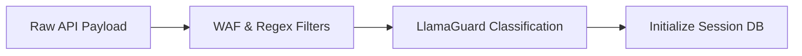

- **Inputs**: Unstructured plain text query from the API client, HTTP metadata (User-Agent, authorization token, target output type), and execution parameters (max duration, depth preference).
- **Processing Steps**:
  1. Capture raw payload at API gateway.
  2. Run string normalization (strip invalid unicode, sanitize escape characters).
  3. Dispatch prompt to input safety guards (e.g., LlamaGuard or custom classifiers) to block malicious prompt injections.
  4. Write execution session metadata to the session store.
- **LLM Reasoning Involved**: None (handled by network middleware and safety classifiers).
- **Tools Used**: FastAPI Gateway, Pydantic, Redis session store.
- **Data Produced**: `SessionMetadata`: `{ session_id: UUID, raw_query: string, sanitized_query: string, client_ip: string, user_id: string }`.
- **Failure Cases**:
  - Input contains prompt-injection payloads (e.g., "Ignore all previous instructions...").
  - String contains malformed unicode that crashes downstream JSON decoders.
- **Recovery Strategy**: Reject request with HTTP 400 Bad Request; return a clean security violation message if input safety guard raises a flag.

---

## Stage 2: Query Understanding

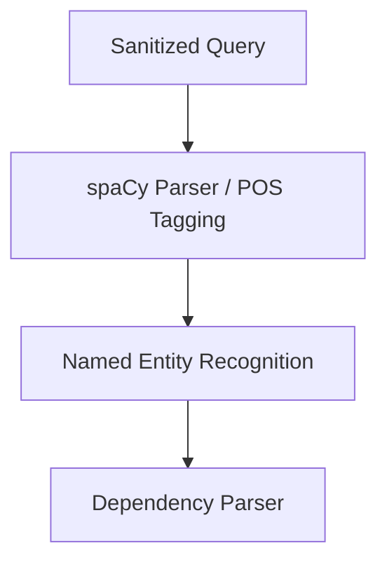

- **Inputs**: `SessionMetadata`.
- **Processing Steps**:
  1. Tokenize query and run Named Entity Recognition (NER) to extract entities (e.g., organizations, technologies, dates).
  2. Parse the query to resolve grammatical references (e.g., "its production impact" -> links "its" back to "solid-state batteries").
  3. Extract core constraints (e.g., "by 2030", "only commercial aircraft").
- **LLM Reasoning Involved**: Zero-shot entity parsing. The LLM is prompted to extract structured parameters:
  ```
  Extract key entities, constraints, and implicit assumptions from: "{sanitized_query}".
  Output strictly in JSON schema: {entities: [], constraints: [], assumptions: []}
  ```
- **Tools Used**: GPT-4o-mini / Gemini 3.5 Flash, spaCy NLP library.
- **Data Produced**: `StructuredQuery`: `{ query_id: UUID, topic: string, entities: list, temporal_constraints: list, logical_operators: list }`.
- **Failure Cases**:
  - LLM fails to extract implicit temporal boundaries (e.g., "recent years" is not mapped to "2024-2026").
  - Ambiguous entity resolution (e.g., "Apple" - is it the fruit, the company, or the singer?).
- **Recovery Strategy**: Use dynamic few-shot templates. If confidence is low, fall back to matching entities against a local taxonomy database (e.g., Wikidata or DBpedia).

---

## Stage 3: Intent Classification

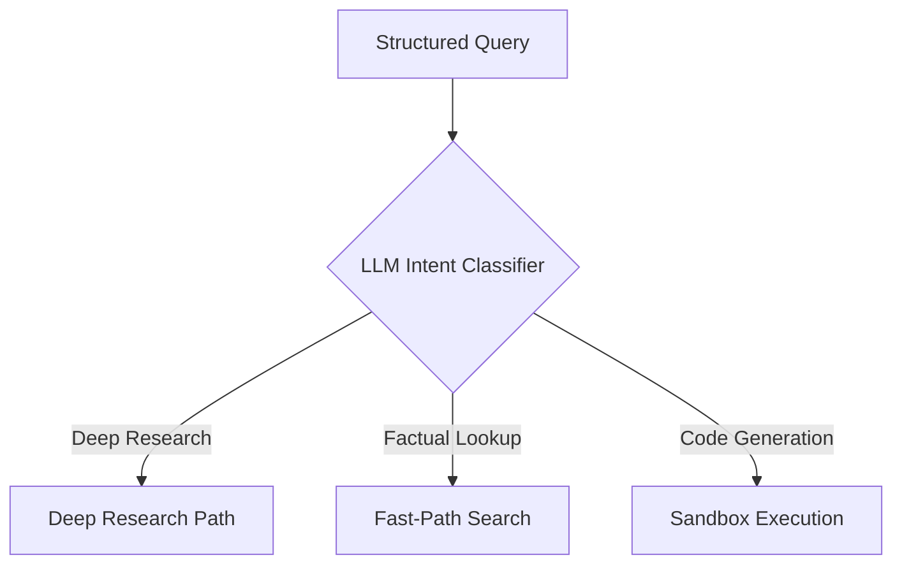

- **Inputs**: `StructuredQuery`.
- **Processing Steps**:
  1. Classify the query intent into a pre-defined taxonomy: `DEEP_RESEARCH`, `FAKTUAL_LOOKUP`, `CODE_SANDBOX`, or `CONVERSATIONAL`.
  2. Identify secondary research archetypes (e.g., `TECHNICAL_COMPARISON`, `FINANCIAL_PROJECTION`, `ACADEMIC_SURVEY`).
- **LLM Reasoning Involved**: Intent classification. The LLM evaluates the target query and matches it against the intent schema.
- **Tools Used**: Fine-tuned classification model or Claude 3 Haiku (system-prompted classification).
- **Data Produced**: `IntentEnvelope`: `{ query_id: UUID, primary_intent: "DEEP_RESEARCH", sub_archetypes: ["TECHNICAL_COMPARISON"], confidence_score: 0.99 }`.
- **Failure Cases**:
  - Complex analytical query is misclassified as a simple factual lookup, resulting in a thin, single-sentence response.
- **Recovery Strategy**: If the confidence score is < 0.90, default to the `DEEP_RESEARCH` path to guarantee research depth.

---

## Stage 4: Research Complexity Estimation


- **Inputs**: `IntentEnvelope`.
- **Processing Steps**:
  1. Calculate the semantic breadth of the query based on the number of entities and relations.
  2. Check the local cache to see if parts of the query can use existing research data.
  3. Calculate a complexity score $C \in [1, 10]$ and allocate token, financial, and time budgets:
     $$\text{Token Budget} = C \times 200,000\text{ tokens}$$
     $$\text{Max Searches} = C \times 2.5$$
- **LLM Reasoning Involved**: Estimating computational and search requirements.
- **Tools Used**: Complexity cost model (Python class).
- **Data Produced**: `ComplexityBudget`: `{ complexity_score: 8, max_depth: 4, token_budget: 1600000, max_queries: 20 }`.
- **Failure Cases**:
  - The query looks simple but requires reading large, complex files (e.g., "Summarize the 800-page battery bill"). The system underestimates complexity and runs out of budget.
- **Recovery Strategy**: If the system reads a large document (> 500 KB), trigger an execution callback to dynamically double the budget.

---

## Stage 5: Scope Determination

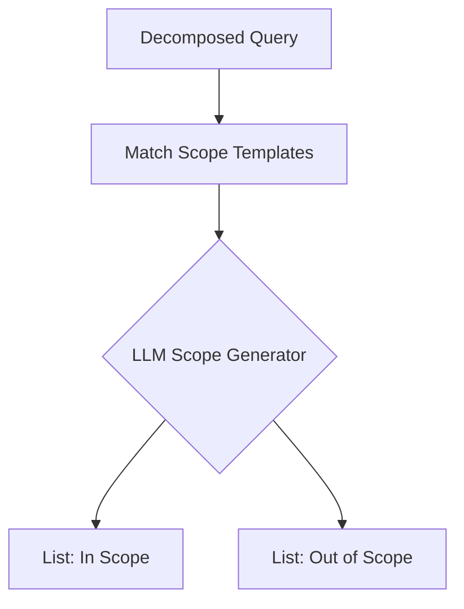

- **Inputs**: `StructuredQuery` and `ComplexityBudget`.
- **Processing Steps**:
  1. Define research boundaries: what must be included (e.g., specific chemical compositions) and what must be excluded (e.g., consumer electronics).
  2. Create strict exclusion rules to prevent wasting API calls on tangential topics.
- **LLM Reasoning Involved**: Generating clear research boundaries based on the user's intent.
- **Tools Used**: GPT-4o with system-prompted boundary templates.
- **Data Produced**: `ScopeSpecification`: `{ in_scope: ["Sulfide electrolytes", "Oxide electrolytes", "EV battery manufacturing scaling"], out_of_scope: ["Consumer electronics", "Stationary storage grid applications"] }`.
- **Failure Cases**:
  - Scope boundaries are too narrow, filtering out relevant context (e.g., excluding stationary storage misses grid scale-up data that could apply to EVs).
- **Recovery Strategy**: Build a boundary checker: if a search query is skipped due to scope rules, run a second-opinion check with a validator prompt.

---

## Stage 6: Clarifying Question Generation

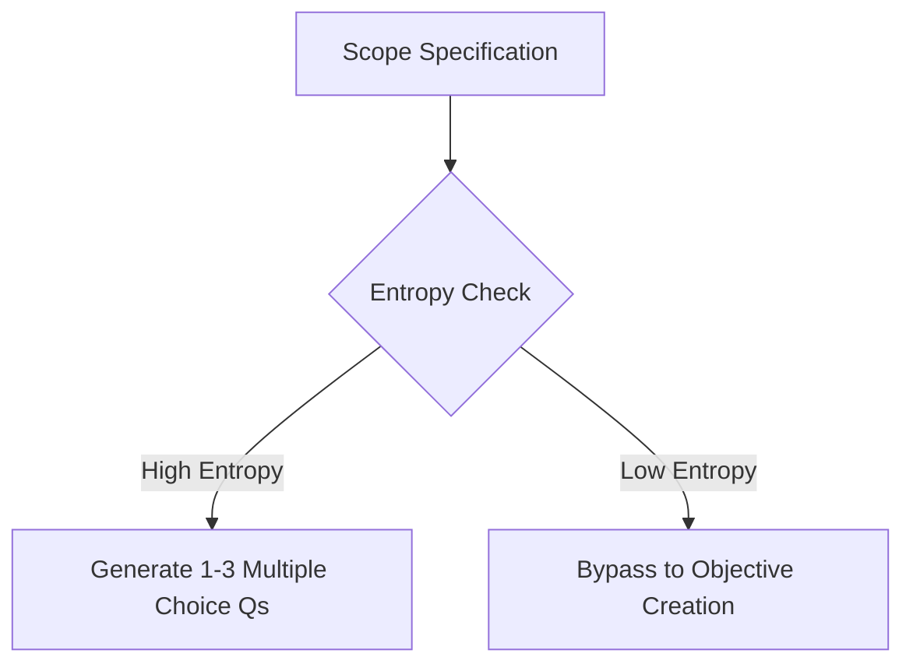

- **Inputs**: `ScopeSpecification` and `StructuredQuery`.
- **Processing Steps**:
  1. Measure semantic ambiguity (entropy).
  2. If the user's query is highly ambiguous, generate 1-3 targeted multiple-choice clarifying questions.
  3. If ambiguity is low, bypass this step and move straight to planning.
- **LLM Reasoning Involved**: Identifying critical gaps in the query that could derail the research.
- **Tools Used**: Custom interactive frontend socket interface.
- **Data Produced**: `ClarificationPayload`: `{ needs_clarification: true, questions: [{ id: "q1", question: "What vehicle category are you analyzing?", options: ["Passenger Cars", "Heavy Trucks", "eVTOL / Aerospace"] }] }`.
- **Failure Cases**:
  - Annoying the user with simple questions that could easily be inferred from context.
- **Recovery Strategy**: Limit clarification to a single interaction. If the user does not respond within a set timeout, assume the most comprehensive default option.

---

## Stage 7: Research Objective Creation

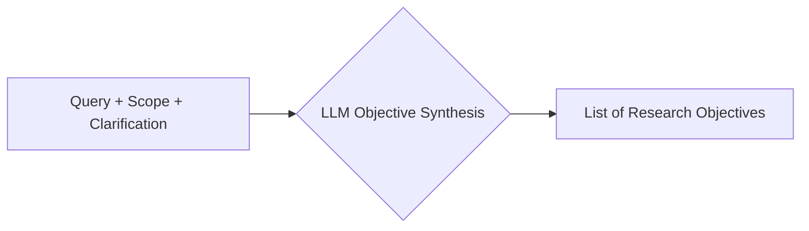

- **Inputs**: `StructuredQuery`, `ScopeSpecification`, and user clarification choices.
- **Processing Steps**:
  1. Synthesize user inputs and scope boundaries into a unified list of research objectives.
  2. Frame each objective as a clear information goal or testable hypothesis.
- **LLM Reasoning Involved**: Translating the user's query into a structured research agenda.
- **Tools Used**: Claude 3.5 Sonnet.
- **Data Produced**: `ResearchObjectives`: `{ objectives: ["Objective 1: Evaluate energy density parameters of sulfide-based solid-state cells.", "Objective 2: Outline 2026-2030 manufacturing roadmaps for key players."] }`.
- **Failure Cases**:
  - Objectives lose alignment with the user's original query.
- **Recovery Strategy**: Run a programmatic check: `VerifyObjectiveAlignment(original_query, objective_list) -> Score [0, 1]`. If score is < 0.90, regenerate.

---

## Stage 8: Research Planning

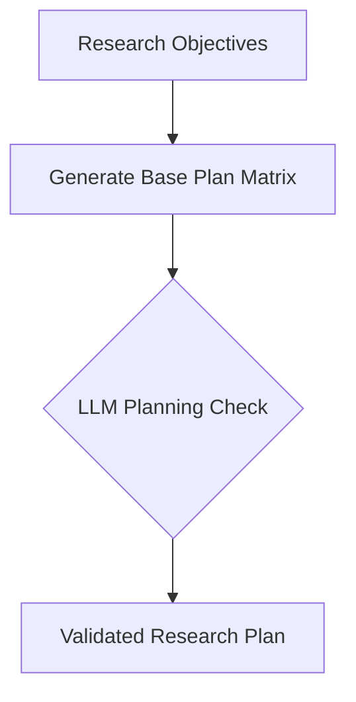

- **Inputs**: `ResearchObjectives` and `ComplexityBudget`.
- **Processing Steps**:
  1. Sequence objectives in logical order (e.g., research chemical baselines before analyzing cost projections).
  2. Allocate the complexity budget across the objectives.
- **LLM Reasoning Involved**: Strategic sequencing and resource allocation.
- **Tools Used**: Custom state graph builder (LangGraph).
- **Data Produced**: `ResearchPlan`: `{ plan_phases: [{ phase_id: 1, objective_id: "obj_1", budget_share: 0.4 }, { phase_id: 2, objective_id: "obj_2", budget_share: 0.6 }] }`.
- **Failure Cases**:
  - Creating a plan with circular dependencies (e.g., Task A depends on Task B, which depends on Task A).
- **Recovery Strategy**: Run a cycle-detection check (e.g., Tarjan's algorithm) on the generated JSON output before execution.

---

## Stage 9: Task Decomposition

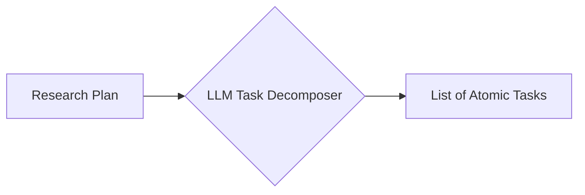

- **Inputs**: `ResearchPlan` and `ScopeSpecification`.
- **Processing Steps**:
  1. Break down major research phases into small, atomic tasks.
  2. Ensure each task focuses on a single concept (e.g., "Research Toyota's solid-state battery patents").
- **LLM Reasoning Involved**: Breaking down complex topics into clear, individual steps.
- **Tools Used**: GPT-4o.
- **Data Produced**: `TaskList`: `{ tasks: [{ task_id: "T1", parent_phase: 1, description: "Extract ionic conductivity figures for sulfide-based SSEs from recent publications." }] }`.
- **Failure Cases**:
  - Creating too many tiny tasks, which wastes tokens on scheduling and coordination overhead.
- **Recovery Strategy**: Set limit rules: maximum tasks per research phase must be kept between 3 and 6.

---

## Stage 10: Sub-Question Generation

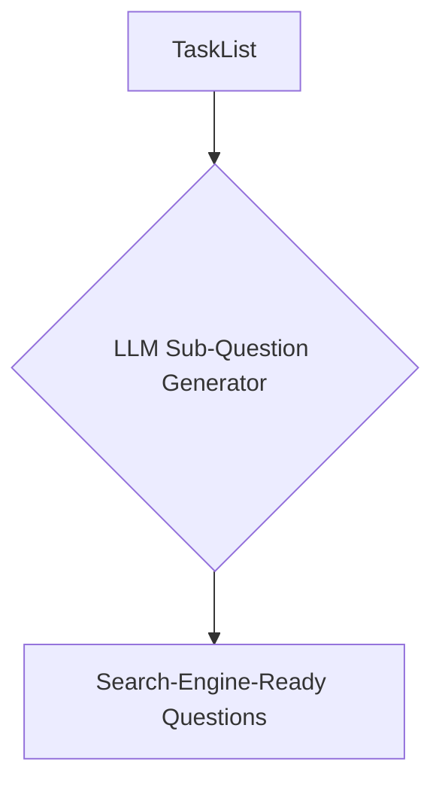

- **Inputs**: `TaskList` and `StructuredQuery`.
- **Processing Steps**:
  1. Convert each task into a set of specific search-engine queries.
  2. Include temporal constraints and synonyms in the generated questions.
- **LLM Reasoning Involved**: Query expansion and keyword variation.
- **Tools Used**: GPT-4o-mini.
- **Data Produced**: `SubQuestions`: `{ task_id: "T1", sub_questions: ["What is the ionic conductivity of LLZO?", "Sulfide-based solid-state electrolyte conductivity mS/cm"] }`.
- **Failure Cases**:
  - Model generates queries with fictional chemical compounds or companies.
- **Recovery Strategy**: Validate terms against a local entity lookup database to ensure spelling accuracy.

---

## Stage 11: Execution Graph Creation

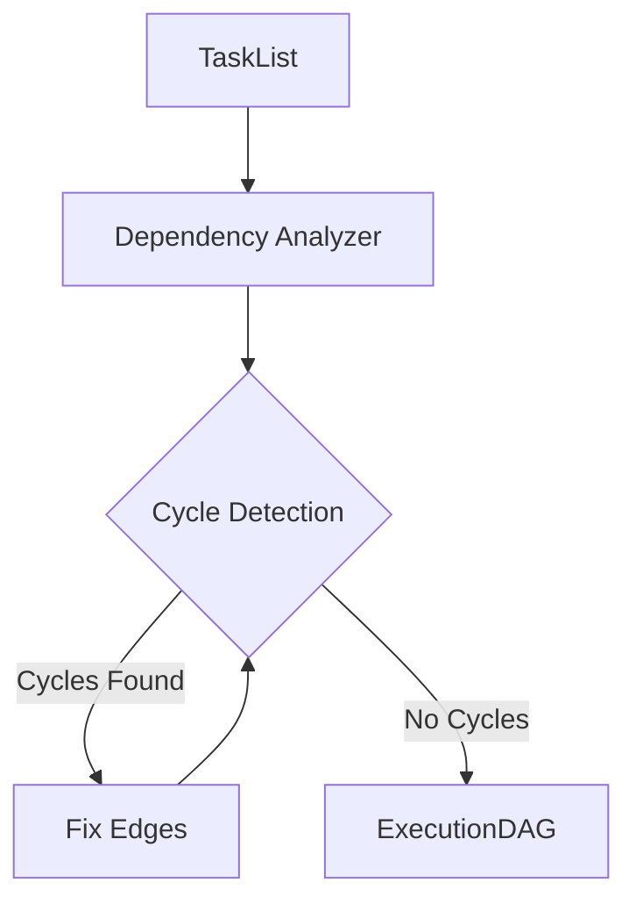

- **Inputs**: `TaskList` and dependencies.
- **Processing Steps**:
  1. Analyze tasks for prerequisite requirements.
  2. Build a Directed Acyclic Graph (DAG) representing the task dependencies.
  3. Identify which tasks can run in parallel.
- **LLM Reasoning Involved**: Dependency analysis and graph design.
- **Tools Used**: NetworkX (Python graph library).
- **Data Produced**: `ExecutionDAG`: `{ nodes: [{ id: "T1" }, { id: "T2" }], edges: [{ from: "T1", to: "T2" }] }`.
- **Failure Cases**:
  - The graph contains cycles, causing the execution engine to hang.
- **Recovery Strategy**: Programmatically break cycles by removing the edge with the lowest relevance score.

---

## Stage 12: Tool Selection

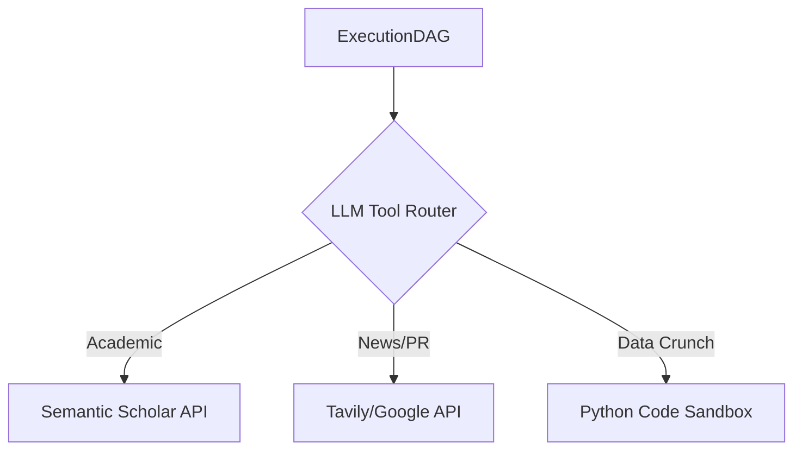

- **Inputs**: `ExecutionDAG` nodes.
- **Processing Steps**:
  1. Determine the best tool for each node (e.g., Academic Search for chemistry, Web Search for news, Code Interpreter for analyzing data tables).
  2. Configure tool parameters (date ranges, domain filters).
- **LLM Reasoning Involved**: Tool routing and parameter configuration.
- **Tools Used**: LLM Function Calling.
- **Data Produced**: `ToolConfiguration`: `{ node_id: "T1", tool: "AcademicSearchEngine", parameters: { academic_databases: ["arxiv", "semantic_scholar"], limit: 10 } }`.
- **Failure Cases**:
  - Selecting academic search for current market news, or web search for academic papers.
- **Recovery Strategy**: Add fallback rules: if a task includes keywords like "patent" or "journal", automatically route it to academic engines.

---

## Stage 13: Search Strategy Generation

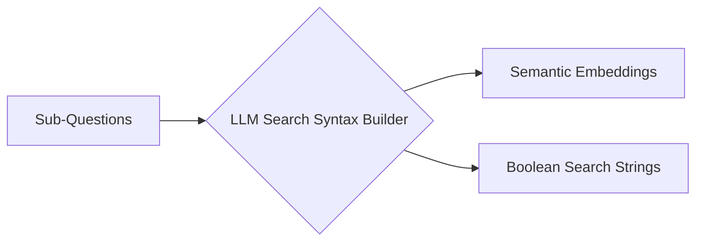

- **Inputs**: `SubQuestions` and `ToolConfiguration`.
- **Processing Steps**:
  1. Convert conversational questions into search-engine queries (e.g., using Boolean operators: `("solid-state battery" OR "solid electrolyte") AND "conductivity"`).
  2. Generate search embeddings for semantic engines.
- **LLM Reasoning Involved**: Translating ideas into search logic.
- **Tools Used**: GPT-4o-mini.
- **Data Produced**: `SearchStrategy`: `{ queries: ["\"solid-state battery\" \"electrolyte\" (sulfide OR oxide OR polymer)", "solid-state battery ionic conductivity table"] }`.
- **Failure Cases**:
  - Query strings are too long or contain too many operators, returning zero results.
- **Recovery Strategy**: Generate queries in tiers: Tier 1 (highly specific), Tier 2 (broader fallback). If Tier 1 returns no results, drop back to Tier 2.

---

## Stage 14: Web Exploration

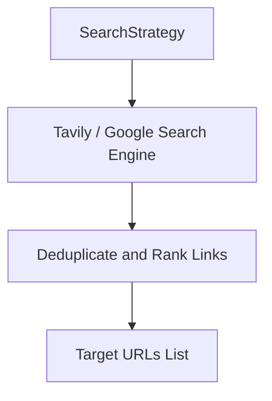

- **Inputs**: `SearchStrategy`.
- **Processing Steps**:
  1. Send queries to search APIs (Google, Bing, Tavily).
  2. Deduplicate URLs across parallel search results.
  3. Sort links by relevance based on snippet content.
- **LLM Reasoning Involved**: None (I/O operation).
- **Tools Used**: Google Custom Search API, Bing Web Search API, Tavily API.
- **Data Produced**: `ExplorationResults`: `{ query: string, links: [{ title: string, url: string, snippet: string }] }`.
- **Failure Cases**:
  - API rate limits hit.
  - Search engines block requests with CAPTCHAs.
- **Recovery Strategy**: Implement automatic rotation across multiple search providers.

---

## Stage 15: Document Acquisition

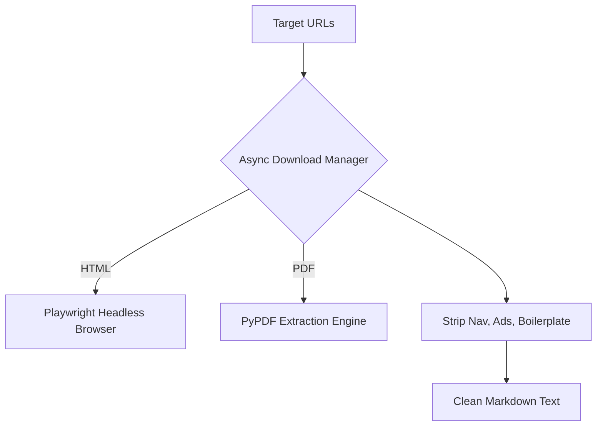

- **Inputs**: `ExplorationResults`.
- **Processing Steps**:
  1. Fetch page content using asynchronous HTTP clients.
  2. Use a headless browser (Playwright) to load dynamic, Javascript-rendered pages.
  3. Parse HTML and PDFs into clean text or markdown, removing ads, navigation menus, and footers.
- **LLM Reasoning Involved**: None (I/O operation).
- **Tools Used**: HTTPX, Playwright, BeautifulSoup, Jina Reader API.
- **Data Produced**: `AcquiredDocuments`: `{ url: string, raw_text: string, retrieval_status: "SUCCESS" | "FAILED" }`.
- **Failure Cases**:
  - Site protected by paywalls or Cloudflare browser checks.
  - PDF parser fails on scanned images.
- **Recovery Strategy**: Fallback to screenshots with OCR if PDF parser fails; use paywall-bypass readers for known news sites.

---

## Stage 16: Source Filtering

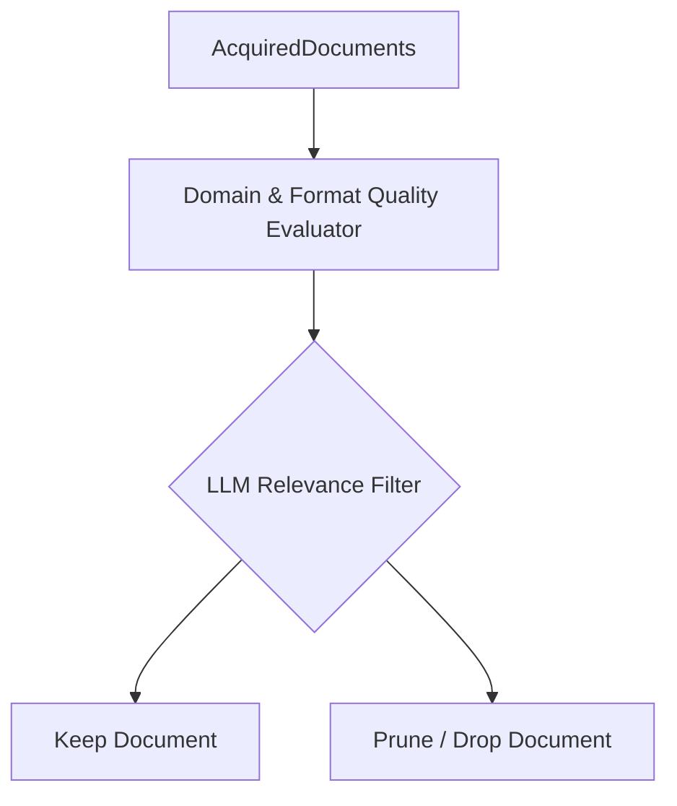

- **Inputs**: `AcquiredDocuments` and `ScopeSpecification`.
- **Processing Steps**:
  1. Check source authority based on domain suffix (e.g., `.edu`, `.gov`, peer-reviewed journals vs. personal blogs).
  2. Use semantic search to verify the text aligns with the scope.
  3. Prune documents with quality or relevance scores below threshold.
- **LLM Reasoning Involved**: Relevance scoring.
- **Tools Used**: Gemini 3.5 Flash (for fast evaluation).
- **Data Produced**: `FilteredDocuments`: `{ url: string, clean_text: string, relevance_score: float }`.
- **Failure Cases**:
  - Filtering out highly valuable but poorly formatted pages (e.g., plain-text lab reports).
- **Recovery Strategy**: Keep any document that has a high semantic relevance score, even if its formatting quality score is low.

---

## Stage 17: Information Extraction

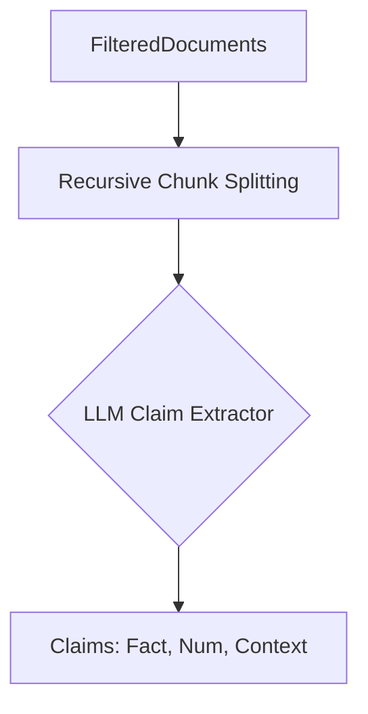

- **Inputs**: `FilteredDocuments` and `ResearchObjectives`.
- **Processing Steps**:
  1. Split long documents into overlapping segments (e.g., 1024-token chunks with 128-token overlaps).
  2. Extract claims, facts, and numerical data that address the research objectives.
  3. Format each point as an atomic claim.
- **LLM Reasoning Involved**: Information extraction and formatting.
- **Tools Used**: GPT-4o / Claude 3.5 Sonnet.
- **Data Produced**: `ExtractedClaims`:
  ```json
  [{
    "source_url": "https://example.com/toyota-ssb",
    "claim": "Toyota targets solid-state battery energy density of 1000 Wh/L by 2028.",
    "numerical_values": { "density": 1000, "unit": "Wh/L", "year": 2028 },
    "context_snippet": "In the presentation, engineers highlighted target metrics: 1000 Wh/L by 2028."
  }]
  ```
- **Failure Cases**:
  - LLM alters numbers or units during extraction (e.g., changing Wh/kg to Wh/L).
- **Recovery Strategy**: Run programmatic checks to ensure the extracted values exist in the raw source snippet.

---

## Stage 18: Evidence Storage

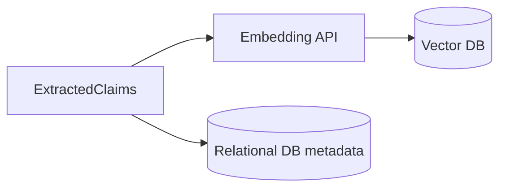

- **Inputs**: `ExtractedClaims`.
- **Processing Steps**:
  1. Remove duplicate claims from the same source.
  2. Generate embeddings for the extracted claims.
  3. Save the claims, metadata, and origin URLs to a structured database and vector store.
- **LLM Reasoning Involved**: None (handled by database drivers).
- **Tools Used**: Qdrant Vector DB, PostgreSQL, OpenAI `text-embedding-3-small`.
- **Data Produced**: `StoredEvidenceEnvelope`: `{ evidence_id: UUID, stored: true }`.
- **Failure Cases**:
  - Database connection drops.
  - Duplication check fails, causing redundant entries.
- **Recovery Strategy**: Use upsert operations with unique hash constraints based on URL and claim text.

---

## Stage 19: Knowledge Synthesis

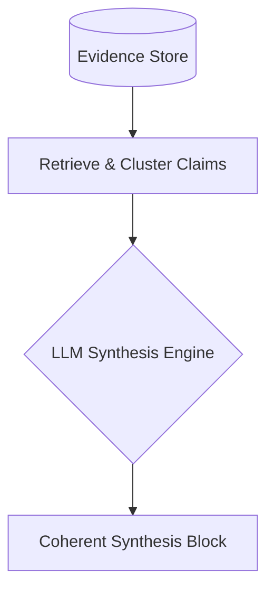

- **Inputs**: `evidence_store` database and `ResearchObjectives`.
- **Processing Steps**:
  1. Retrieve all claims related to a research objective.
  2. Group claims into thematic subtopics.
  3. Synthesize the findings into a cohesive analysis for each objective.
- **LLM Reasoning Involved**: Summarization and logical synthesis.
- **Tools Used**: Claude 3.5 Sonnet.
- **Data Produced**: `SynthesizedBlocks`: `{ objective_id: "obj_1", synthesis_text: "Solid-state electrolyte development has centered on three chemistry families: sulfides, oxides, and polymers..." }`.
- **Failure Cases**:
  - LLM invents connections or logical leaps between sources that do not exist.
- **Recovery Strategy**: Prompt the model to only use facts present in the retrieved claims, and forbid the use of external knowledge.

---

## Stage 20: Fact Verification

```mermaid
graph TD
    Narrative[Synthesized Block] --> MatchClaims[Map statements to references]
    MatchClaims --> VerifyAgent{LLM NLI Evaluator}
    VerifyAgent -->|Support| Pass[Verified]
    VerifyAgent -->|Contradict/Neutral| Flag[Flag for Review]
```

- **Inputs**: `SynthesizedBlocks` and `StoredEvidence`.
- **Processing Steps**:
  1. Match each statement in the synthesized text back to its source snippet in the database.
  2. Run a verification check: does the source context explicitly support the statement?
- **LLM Reasoning Involved**: Natural Language Inference (NLI) classification: `SUPPORT`, `CONTRADICT`, or `NEUTRAL`.
- **Tools Used**: Custom NLI pipeline using GPT-4o.
- **Data Produced**: `VerificationReport`: `{ statement: "...", status: "VERIFIED" | "CONTRADICTED" | "NEUTRAL", reference_url: "..." }`.
- **Failure Cases**:
  - LLM verifies claims using its own background knowledge instead of the provided source snippet.
- **Recovery Strategy**: Feed the verification model *only* the specific snippet and statement, stripping out all external tools and systemic memory.

---

## Stage 21: Contradiction Detection

```mermaid
graph TD
    Claims[ExtractedClaims] --> CrossCheck{LLM Conflict Analyzer}
    CrossCheck -->|Conflict Found| FlagConflict[Flag Contradiction]
    CrossCheck -->|Compatible| PassConflict[Pass]
```

- **Inputs**: `ExtractedClaims` from the evidence store.
- **Processing Steps**:
  1. Compare claims within the same topic to identify conflicts (e.g., Source A says: "Production cost will be \$120/kWh in 2030." Source B says: "Production cost will drop to \$80/kWh by 2028.").
  2. Flag contradicting nodes in the database.
- **LLM Reasoning Involved**: Logical contradiction analysis.
- **Tools Used**: GPT-4o.
- **Data Produced**: `ContradictionMap`: `{ conflict_id: 1, topic: "Cost", conflicts: [{ url: "url_a", claim: "$120" }, { url: "url_b", claim: "$80" }] }`.
- **Failure Cases**:
  - Missing subtle contradictions (e.g., conflicting definitions of efficiency metrics).
- **Recovery Strategy**: Present contradictions explicitly in the report (e.g., "While Source A projects \$120/kWh, Source B projects \$80/kWh, citing faster scaling effects") to ensure transparency.

---

## Stage 22: Confidence Scoring

```mermaid
graph LR
    Inputs[Verification & Contradictions] --> ScoreCalc[Heuristic Formula]
    ScoreCalc --> ConfidenceScore[Score: 0.0 - 1.0]
```

- **Inputs**: `VerificationReport` and `ContradictionMap`.
- **Processing Steps**:
  1. Calculate a confidence score ($CS \in [0, 1]$) for each synthesized finding based on:
     - Volume of backing sources.
     - Verification status of backing claims.
     - Presence of unmitigated contradictions.
     - Source quality metrics.
- **LLM Reasoning Involved**: None (handled by mathematical heuristic scoring).
- **Tools Used**: Math execution engine.
- **Data Produced**: `ConfidenceProfile`: `{ finding_id: 1, confidence_score: 0.85, primary_risks: ["Conflict in cost timeline data"] }`.
- **Failure Cases**:
  - Giving high confidence scores to unverified rumors or press releases.
- **Recovery Strategy**: Hardcode baseline penalties: if a finding has only a single source, apply a -0.3 penalty to the confidence score. If it has unmitigated contradictions, apply a -0.4 penalty.

---

## Stage 23: Report Outline Generation

```mermaid
graph TD
    Synthesis[SynthesizedBlocks] --> OutlineGen{LLM Document Architect}
    OutlineGen --> Outline[Report Outline Skeleton]
```

- **Inputs**: `SynthesizedBlocks` and `ResearchObjectives`.
- **Processing Steps**:
  1. Design a comprehensive outline for the final report.
  2. Structure sections logically (e.g., Executive Summary -> Technical Breakdown -> Market Analysis -> Outlook).
  3. Map synthesized findings to their respective sections.
- **LLM Reasoning Involved**: Document design and structuring.
- **Tools Used**: GPT-4o / Claude 3.5 Sonnet.
- **Data Produced**: `ReportOutline`: `{ sections: [{ section_id: "SEC1", title: "Executive Summary", objectives: ["obj_1"] }] }`.
- **Failure Cases**:
  - Creating sections that overlap, leading to a bloated and repetitive report.
- **Recovery Strategy**: Enforce strict template constraints on outline generation; review outline schema with a separate validator pass before starting the writing phase.

---

## Stage 24: Report Writing

```mermaid
graph TD
    Outline[ReportOutline] --> WriteWorker{LLM Writing Engine}
    WriteWorker --> TextDraft[Report Section Markdown]
```

- **Inputs**: `ReportOutline`, `SynthesizedBlocks`, and `ConfidenceProfiles`.
- **Processing Steps**:
  1. Write the content for each outline section sequentially or in parallel.
  2. Integrate numerical data, analytical tables, and technical context directly into the text.
  3. Apply professional tone guidelines.
- **LLM Reasoning Involved**: Detailed text generation, style formatting, and structural cohesion.
- **Tools Used**: Claude 3.5 Sonnet (preferred for long-context generation).
- **Data Produced**: `DraftReport`: `{ markdown_text: "# Solid-State Batteries: 2030 EV Roadmap..." }`.
- **Failure Cases**:
  - Model inserts unsourced facts to improve sentence flow or readability.
  - Moving away from objective engineering analysis to generic marketing jargon.
- **Recovery Strategy**: Write in chunks corresponding to sections. Provide the LLM with *only* the specific synthesis context for that section, making it impossible for the model to drag in unverified background ideas.

---

## Stage 25: Citation Generation

```mermaid
graph TD
    Draft[DraftReport] --> Linker[Source Reference Matcher]
    Linker --> CiteGenerator{LLM Citation Engine}
    CiteGenerator --> CitedReport[Markdown Report with Citations]
```

- **Inputs**: `DraftReport` and source mappings from the evidence store.
- **Processing Steps**:
  1. Locate claims in the draft report that require citations.
  2. Append inline anchor tags (e.g., `[1]`, `[2]`) linked to verified sources.
  3. Build a comprehensive bibliography at the bottom of the document.
- **LLM Reasoning Involved**: Index mapping. The model matches text assertions back to the original database IDs.
- **Tools Used**: Programmatic matcher + LLM post-processing.
- **Data Produced**: `CitedReport`: `{ text: "...Toyota pilot line [1]...", bibliography: { "[1]": "https://example.com/toyota-pr" } }`.
- **Failure Cases**:
  - Attributing a statement to the wrong URL.
  - Generating citations for facts that do not appear in the source text.
- **Recovery Strategy**: Programmatically parse all Markdown links and inline citation brackets, verify each ID exists in the database, and verify the URL returns an active HTTP status code (200 OK).

---

## Stage 26: Reflection and Self-Critique

```mermaid
graph TD
    Report[CitedReport] --> Critique{LLM Adversarial Critic}
    Critique --> PassQC{Score >= Target?}
    PassQC -- Yes --> S28[Proceed to Quality Check]
    PassQC -- No --> S27[Report Improvement Loop]
```

- **Inputs**: `CitedReport` and `ResearchObjectives`.
- **Processing Steps**:
  1. Feed the draft report to an independent Critic Agent.
  2. Assess the document against the original objectives.
  3. Audit citations, trace logic, search for unresolved contradictions, and evaluate structural flow.
- **LLM Reasoning Involved**: Adversarial evaluation and gap analysis.
- **Tools Used**: Claude 3.5 Sonnet (with critic instructions).
- **Data Produced**: `CritiqueReport`: `{ score: 82, gaps: ["Moisture sensitivity details are missing from manufacturing bottlenecks section"], needs_revision: true }`.
- **Failure Cases**:
  - The critic gives a superficial pass ("looks great") without catching subtle issues.
  - Critic always finds minor issues, preventing report completion (infinite loops).
- **Recovery Strategy**: Limit refinement to a maximum of 2 loops. Use a structured critique rubric (e.g., Clarity, Completeness, Evidence, Tone) with binary metrics (Yes/No) to keep the feedback objective and actionable.

---

## Stage 27: Report Improvement

```mermaid
graph TD
    Report[CitedReport] --> DiffGenerator{LLM Diff Engine}
    DiffGenerator --> Patch[Apply Markdown Patches]
    Patch --> ImprovedReport[Revised Report Draft]
```

- **Inputs**: `CitedReport` and `CritiqueReport`.
- **Processing Steps**:
  1. If revision is needed, identify missing content or sections requiring rewrites.
  2. If necessary, execute targeted web searches to fill missing data points.
  3. Rewrite the identified sections to address the critic's feedback.
- **LLM Reasoning Involved**: Targeted text editing and integration. The model revises sections while preserving the rest of the document's structure and flow.
- **Tools Used**: GPT-4o.
- **Data Produced**: `RevisedReport`: `{ text: "..." }`.
- **Failure Cases**:
  - The rewrite breaks existing formatting, drops citations, or introduces new contradictions.
- **Recovery Strategy**: Apply diff-based updates (using tools like `replace_file_content`) to target only the paragraphs flagged for correction, keeping the rest of the verified text intact.

---

## Stage 28: Final Quality Checks

```mermaid
graph LR
    Report[RevisedReport] --> CheckLinks[Link Auditor]
    CheckLinks --> FormatLint[Markdown Linter]
    FormatLint --> QCApproved[Quality Check Approved Envelope]
```

- **Inputs**: `RevisedReport`.
- **Processing Steps**:
  1. Check report against formatting schemas (e.g., markdown structure, header depth).
  2. Validate citations and links to ensure no references are broken.
  3. Audit tone constraints and output rules.
- **LLM Reasoning Involved**: Formatting verification and rule compliance checks.
- **Tools Used**: Custom Markdown linters, Python validation script.
- **Data Produced**: `FinalReportEnvelope`: `{ text: "...", status: "PASSED" }`.
- **Failure Cases**:
  - Special characters or bad markdown formatting that breaks the user UI.
- **Recovery Strategy**: Use markdown parser libraries to guarantee output matches valid AST formats before rendering.

---

## Stage 29: Final Answer Delivery

```mermaid
graph LR
    Envelope[FinalReportEnvelope] --> Streamer[Server-Sent Events / WS]
    Streamer --> ClientUI[Client Interface Render]
```

- **Inputs**: `FinalReportEnvelope`.
- **Processing Steps**:
  1. Package the report payload with its bibliography and confidence index.
  2. Push the completed document to the user UI, supporting streaming output or direct file download (PDF/Docx).
  3. Log final session metrics (total cost, execution time, tokens used).
- **LLM Reasoning Involved**: None (handled by application delivery layer).
- **Tools Used**: Server-Sent Events (SSE) / WebSocket, PDF generation engine.
- **Data Produced**: Client-rendered dashboard view.
- **Failure Cases**:
  - Network connection drops during delivery.
- **Recovery Strategy**: Cache the final report in the database under `UUID`. If the connection drops, allow the client to request a full reload from the database.

---

# Part B: Internal Multi-Agent Architecture

## 1. Agent Inventory

| Agent | Responsibility | Inputs | Outputs | Tools | Memory | Communication |
| :--- | :--- | :--- | :--- | :--- | :--- | :--- |
| **Planner Agent** | Generates research plans, decomposes queries into tasks, and defines dependencies. | `DecomposedQuery`, `ScopeSpecification` | `ExecutionDAG` (JSON) | None | Session state summary | RPC call from Supervisor |
| **Supervisor Agent** | Manages system execution, budgets, state transitions, and worker routing. | Initial query, Task completions | Task allocations, Final report | State transitions | Central state database (Redis) | Orchestrates all agents |
| **Worker Agent** | Base class for execution tasks, standardizing exception handling, resource cleanup, and execution metrics. | Task context | Execution output | Class-specific tools | Task-local context | Managed by Supervisor |
| **Research Agent** | Investigates target topics, reads evidence, and writes synthesized summaries. | Objective parameters, Evidence set | `SynthesizedBlocks` | Summarization prompts | Vector DB session index | Dispatched by Supervisor |
| **Search Agent** | Formulates search queries and queries search indexes (Bing, Google, Tavily). | Target questions | `SearchResultSet` | Search APIs (Tavily, Google) | Query and URL cache | Serves the Research Agent |
| **Browser Agent** | Controls headless browser instances to scrape pages and bypass paywalls. | Target URLs | Page content, Screenshots | Playwright, Puppeteer | Cookie/Session store | Triggered by Research Agent |
| **Document Agent** | Parses complex documents (PDFs, spreadsheets, slides). | File paths, File blobs | Parsed markdown tables/text | PyPDF2, pdfplumber | File buffers | Serves the Browser Agent |
| **Retrieval Agent** | Manages vector indexing and similarity retrieval. | Text chunks, Embeddings | Match snippets, Scores | Qdrant / Pinecone API | Local vector index cache | Connects to Research Agent |
| **Fact Checking Agent** | Cross-checks synthesized claims against primary source files. | `SynthesizedBlocks` | `VerificationReport` | NLI validation model | None | Called by Supervisor |
| **Critic Agent** | Evaluates plans and report drafts to find logic gaps and errors. | Report draft, Objectives | `CritiqueReport` | Adversarial reviews | Initial scope context | Responds to Supervisor |
| **Reflection Agent** | Analyzes execution errors (e.g., search failures) and adjusts search strategy. | Task error logs | Revised search terms | Query relaxation prompts | Search history index | Connects to Planner |
| **Citation Agent** | Maps report facts to bibliography entries and verifies links. | Draft text, Mapped evidence | `CitedReport` | Link validators | Source registry | Connects to Writer |
| **Report Writing Agent** | Assembles verified blocks into a cohesive markdown document. | Synthesized blocks, Outline | `DraftReport` | Template styling guides | Section outline mapping | Dispatched by Supervisor |
| **Quality Control Agent** | Validates final formatting, link integrity, and style compliance. | Revised report draft | QC compliance envelope | Markdown linters | Rules configuration | Final step before delivery |

---

## 2. Multi-Agent Coordination Mechanics

### 2.1 Agent-to-Agent Messaging
Agents communicate using structured JSON envelopes over an asynchronous message broker (e.g., RabbitMQ or Redis Pub/Sub). This keeps agent interactions decoupled and allows tasks to be queued and retried.

#### Message Payload Example
```json
{
  "message_id": "msg_98765",
  "correlation_id": "session_abc123",
  "timestamp": "2026-06-23T23:06:00Z",
  "sender": "supervisor",
  "recipient": "research_agent_03",
  "action": "SYNTHESIZE_TOPIC",
  "payload": {
    "objective_id": "obj_1",
    "evidence_ids": ["ev_01", "ev_02", "ev_03"]
  }
}
```

### 2.2 Shared State Management
State is managed using a centralized database (e.g., Redis for fast access, PostgreSQL for persistence). Individual agents remain stateless; they pull the current state from the database at the start of a task and push updates when finished.

```python
class ResearchState(BaseModel):
    session_id: str
    objectives: List[str]
    tasks: Dict[str, TaskStatus]
    evidence_index: List[EvidenceItem]
    contradictions: List[Contradiction]
    report_draft: Optional[str] = None
```

### 2.3 Context Sharing
To prevent token bloat, agents do not share the entire conversation history. Instead, they share access to the centralized database and query vectors as needed. Context is trimmed to include only the current task definition and relevant evidence.

### 2.4 Memory Management
- **Short-Term Memory**: Ephemeral context local to the agent's current task loop. Stored in Redis and cleaned up once the task finishes.
- **Long-Term Memory**: Vector database storage containing extracted evidence, research findings, and metadata. Persisted across research runs.

### 2.5 Checkpointing
Every state change is logged in a Write-Ahead Log (WAL). If a system crash or API timeout occurs, the Supervisor Agent can restore the system to its last verified state from the log.

### 2.6 Task Delegation & Parallel Execution
The Supervisor evaluates the execution graph (`ExecutionDAG`) and identifies independent tasks. These tasks are dispatched to a worker pool (e.g., Celery / Redis Queue) to run in parallel. When all dependencies are met, child tasks are triggered.

### 2.7 Failure Handling
- **Transient Failures (e.g., API timeouts)**: Handled using exponential backoff retry policies.
- **Systemic Failures (e.g., search query returns no results)**: Triggers the Reflection Agent to modify search terms.
- **Fatal Failures (e.g., all search routes exhausted)**: Gracefully scales back the scope, logs the issue, and continues generating the report using the available data.

---

## 3. Multi-Agent Interaction Diagram

This diagram shows how agents communicate and coordinate during a research session.

```mermaid
sequenceDiagram
    autonumber
    actor User
    participant Supervisor as Supervisor Agent
    participant Planner as Planner Agent
    participant Research as Research Agent
    participant Browser as Browser Agent
    participant Critic as Critic Agent
    participant Writer as Writing Agent

    User->>Supervisor: Ingest Query
    activate Supervisor
    Supervisor->>Planner: Analyze & Plan (Query)
    activate Planner
    Planner-->>Supervisor: Return ExecutionDAG
    deactivate Planner
    
    rect rgba(253, 254, 255, 1)
        note right of Supervisor: Parallel Worker Dispatch
        par Task 1: Baseline Analysis
            Supervisor->>Research: Collect Data (Task 1)
            activate Research
            Research->>Browser: Scrape Page (URLs)
            activate Browser
            Browser-->>Research: Return Clean Text
            deactivate Browser
            Research-->>Supervisor: Task 1 Results
            deactivate Research
        and Task 2: Market Analysis
            Supervisor->>Research: Collect Data (Task 2)
            activate Research
            Research->>Browser: Scrape Page (URLs)
            activate Browser
            Browser-->>Research: Return Clean Text
            deactivate Browser
            Research-->>Supervisor: Task 2 Results
            deactivate Research
        end
    end
    
    Supervisor->>Critic: Review Synthesized Evidence
    activate Critic
    Critic-->>Supervisor: Critique & Gap Analysis
    deactivate Critic

    Supervisor->>Writer: Draft Final Report (Evidence)
    activate Writer
    Writer-->>Supervisor: Cited Markdown Report
    deactivate Writer

    Supervisor->>User: Stream Final Report
    deactivate Supervisor
```

---

# Part C: Research Planning Engine

## 1. Planning Taxonomy

### 1.1 Static Planning
Static planning generates a fixed list of tasks at the start of a research run. This approach works well for simple queries with clear scopes, but is too rigid for complex, multi-layered investigations.

### 1.2 Dynamic Planning
Dynamic planning updates the plan based on new information discovered during the research run. If a search reveals a new subtopic, the system can add new tasks to the execution graph.

### 1.3 Iterative Planning
Iterative planning runs research in sequential loops. The system evaluates the results of one loop before planning the next.

### 1.4 Re-planning After Search Failures
If a search query returns no results, the Planning Engine does not crash. It triggers a reflection loop to analyze the failure:
- **Case A: Query is too specific**. The system relaxes constraints (e.g., changes `("sulfide-based electrolyte" AND "Toyota" AND "Q3 2026")` to `("sulfide battery" AND "Toyota" AND "production")`).
- **Case B: No information exists**. The system marks the subtopic as "unresolved" and shifts resources to alternative areas.

### 1.5 Tree of Thought (ToT) Reasoning
For complex, multi-path decisions, the Planning Engine evaluates paths using a tree structure. It generates multiple planning options, scores each path, and prunes low-performing branches.

### 1.6 Graph of Thoughts (GoT)
GoT extends ToT by allowing execution paths to merge, loop, and branch dynamically. This is critical for cross-referencing information from different sources (e.g., merging a technical breakthrough with a manufacturing timeline).

### 1.7 Architectural Paradigms
- **Plan-and-Execute**: Generate the plan first, then execute it. Simple but brittle when research paths change.
- **ReAct (Reason + Act)**: Interleaves reasoning and tool actions in a single loop. Good for quick updates, but can lose sight of long-term goals.
- **Supervisor-Worker**: A central Supervisor agent guides specialized worker agents using an execution graph.
- **Hierarchical Agent Systems**: Workers can spin up their own sub-agents to tackle complex subtopics, isolating tasks and managing context length.

---

## 2. Task Orchestration, Dependency, & Priority Scheduling

To run deep research at scale, tasks must be managed efficiently:
- **Task Decomposition**: Subtasks are written to a queue as self-contained jobs.
- **Dependency Representation**: Dependencies are stored as an adjacency list. A task runs only when its predecessor tasks are marked as `COMPLETED`.
- **Task Prioritization**: Critical path tasks (tasks with the most downstream dependencies) are prioritized.
- **Parallel Scheduling**: Independent branches run concurrently.
- **Long-Running Job Management**: Worker tasks run asynchronously with timeout limits (e.g., 3 minutes). If a scraper hangs, the job is killed, rescheduled, or skipped.

---

## 3. Concrete Example: Software Engineering Job Impact Graph (2020-2030)

### User Request
> *"Analyze the impact of AI on software engineering jobs between 2020 and 2030."*

### Task Decomposition & Dependency Mapping
The Planning Engine translates the request into the following execution graph:

```
                            [A: 2020 SWE Baseline]
                                      │
                   ┌──────────────────┴──────────────────┐
                   ▼                                     ▼
        [B: AI Tech Milestones]              [C: Productivity Metrics]
        (Copilot, GPT-4, Agents)              (Adoption rate data)
                   │                                     │
                   └──────────────────┬──────────────────┘
                                      ▼
                           [D: Job Market Trends]
                           (Hiring, salaries, roles)
                                      │
                   ┌──────────────────┴──────────────────┐
                   ▼                                     ▼
         [E: Skillset Evolution]              [F: Macroeconomic Proj.]
         (Prompting, Architecture)             (Offshoring, growth)
                   │                                     │
                   └──────────────────┬──────────────────┘
                                      ▼
                            [G: Report Synthesis]
```

### Dependency Adjacency List
- `A` (No dependencies)
- `B` (Depends on `A`)
- `C` (Depends on `A`)
- `D` (Depends on `B`, `C`)
- `E` (Depends on `D`)
- `F` (Depends on `D`)
- `G` (Depends on `E`, `F`)

---

## 4. Planning Engine Diagrams

### 4.1 Planning Workflow
This diagram shows how the system plans, executes, and revises its strategy based on incoming search results.

```mermaid
graph TD
    UserQuery[User Query Ingestion] --> ParseQuery[Query Parsing & Entity Extraction]
    ParseQuery --> EstBudget[Estimate Token & Time Budget]
    EstBudget --> CreatePlan[Generate Initial Research Plan]
    CreatePlan --> GenDAG[Build Directed Acyclic Graph - DAG]
    
    subgraph Execution Loop
        GenDAG --> DispatchTasks[Dispatch Parallel Tasks to Workers]
        DispatchTasks --> CollectEvidence[Collect & Index Evidence]
        CollectEvidence --> AssessProgress{Objectives Met?}
        
        AssessProgress -- Gaps Identified --> RePlan[Dynamic Plan Revision: Add/Modify Nodes]
        RePlan --> GenDAG
    end
    
    AssessProgress -- Objectives Met --> DraftReport[Report Outline & Drafting]
    DraftReport --> Verification[Fact Verification & QC]
    Verification --> Deliver[Deliver Report]
```

### 4.2 Task Dependency Graph
The dependency graph for the AI Software Engineering query, showing how baseline research feeds into market and skill analyses.

```mermaid
graph TD
    A["T1: Baseline SWE Landscape (2020)"] --> B["T2: AI Developer Tools Timeline (2020-2025)"]
    A --> C["T3: AI Adoption & Developer Productivity Metrics"]
    
    B --> D["T4: Job Market Shifts (Hiring, Salaries, Demand)"]
    C --> D
    
    D --> E["T5: Evolution of SWE Skillsets & Roles"]
    D --> F["T6: Macroeconomic Projections & Global Sourcing"]
    
    E --> G["T7: Integrated Impact Report Synthesis"]
    F --> G
```

### 4.3 Agent Execution Graph
How specialized agents interact to coordinate, execute, and verify tasks.

```mermaid
graph TD
    SupervisorAgent[Supervisor Agent] -->|1. Generate Plan| PlannerAgent[Planner Agent]
    PlannerAgent -->|2. Returns DAG| SupervisorAgent
    
    subgraph Execution Pool
        SupervisorAgent -->|3. Delegate Tasks| ResearchAgent[Research Agent]
        ResearchAgent -->|4. Generate Queries| SearchAgent[Search Agent]
        SearchAgent -->|5. Fetch Links| BrowserAgent[Browser Agent]
        BrowserAgent -->|6. Parse Docs| DocAgent[Document Agent]
    end
    
    DocAgent -->|7. Index Content| RetrievalAgent[Retrieval Agent]
    RetrievalAgent -->|8. Claims & Snippets| SupervisorAgent
    
    SupervisorAgent -->|9. Verify Report| FactCheckingAgent[Fact Verification Agent]
    FactCheckingAgent -->|10. Check Draft| CriticAgent[Critic Agent]
    CriticAgent -->|11. Feedback| SupervisorAgent
    
    SupervisorAgent -->|12. Final Compile| QualityControlAgent[Quality Control Agent]
```

---

# Part D: Comparison Between Leading Systems

Because implementation details are proprietary, we compare the likely architectures of ChatGPT Deep Research, Perplexity Deep Research, and Gemini Deep Research based on public releases, technical blogs, and performance profiles.

## System Comparison Matrix

| Feature | ChatGPT Deep Research | Perplexity Deep Research | Gemini Deep Research |
| :--- | :--- | :--- | :--- |
| **Agent Design** | Multi-agent hierarchy managed by an orchestrator with reasoning capabilities. | Router-to-worker setup optimized for fast search execution. | Integrated agent loops built on large context windows. |
| **Planning Capability** | High. Uses Tree of Thought (ToT) exploration and dynamic replanning. | Moderate. Focuses on query expansion and parallel search routing. | High. Leverages long context to keep the plan in active memory. |
| **Search Infrastructure** | Bing Web Search API with custom ranking models. | Perplexity's custom index combined with Google/Bing syndication. | Google Search Index with live page crawling. |
| **Web Browsing Strategy** | Asynchronous page scraping with fallback for Javascript pages. | Fast, parallel page parsing optimized for low latency. | Uses Google's web crawling infrastructure. |
| **Memory Architecture** | Vector indexing for evidence; short-term session variables. | Hybrid index search with simple key-value state. | Ultra-long context window (2M+ tokens) acts as the primary memory store. |
| **Tool Usage** | Web search, browser, Python Code Interpreter. | Web search, browser, basic data parsing tools. | Web search, Google Workspace integration, Python Code Interpreter. |
| **Verification Techniques** | Adversarial critic passes and citation validation loops. | Real-time cross-referencing against primary search links. | Long-context truth checks and Google-search verification loops. |
| **Citation System** | Inline bracketed links mapped to a verified bibliography. | Direct URL anchors integrated into sentences. | Inline bracketed links mapped to Google Search index references. |
| **Report Generation** | Multi-pass drafting using long-form markdown templates. | Real-time stream generation with dynamic citation insertion. | Multi-pass drafting with Google Docs integration. |
| **Long-Running Workflows** | High. Supports jobs running for 5 to 30 minutes. | Moderate. Optimized for fast execution under 5 minutes. | High. Built for deep exploration runs. |
| **Strengths** | - Excellent planning and dynamic error recovery.<br>- Python execution tool for data checking. | - Very low latency.<br>- Real-time search index updates. | - Massive native context window.<br>- Tight integration with Google search. |
| **Limitations** | - High latency.<br>- High token cost per research run. | - Tends to compile search summaries rather than synthesize deep analysis. | - Can rely too much on long context, leading to retrieval errors. |

---

## Deep Architectural Differentiators

### 1. Planning: Tree-of-Thought (ChatGPT) vs. Deep Search Routing (Perplexity)
- **ChatGPT Deep Research** uses a branching planning engine. It generates alternative search paths, scores each path, and prunes low-performing branches. This is slower but handles ambiguous or complex topics well.
- **Perplexity Deep Research** focuses on speed. It expands the query into parallel searches and executes them concurrently. This is highly efficient for factual lookups but can miss complex, multi-layered dependencies.

### 2. Memory: Vector-Based RAG vs. Native Long Context (Gemini)
- **Vector-Based RAG** splits documents into chunks and retrieves only the most relevant snippets. This approach is highly scalable and cost-effective, but can miss relationships between distant parts of a document.
- **Gemini's 2M+ Context Window** keeps entire source documents in active memory. This allows the model to analyze complex relationships across massive texts without losing context, but is computationally expensive.

### 3. Tool Control: Python Sandboxing vs. Web Crawling
- **ChatGPT and Gemini** include sandboxed Python environments (Code Interpreters) to clean, analyze, and plot data collected during research runs.
- **Perplexity** focuses on real-time web retrieval, using fast parsers and API integrations rather than local code execution.

---

# Appendix: Production Engineering & Scale Metrics

## 1. Cost & Token Budget Math
For a typical deep research run with a complexity score of $C = 8$:
- **Search Queries**: 20 queries × \$0.01 = \$0.20
- **Document Scraping**: 40 pages crawled × \$0.05 (Proxy/Playwright overhead) = \$2.00
- **LLM Token Costs** (GPT-4o rates of \$5.00 / 1M input, \$15.00 / 1M output):
  - Input tokens: 1.5M tokens = \$7.50
  - Output tokens: 100K tokens = \$1.50
- **Total Operational Cost**: ~\$11.20 per deep research run.

## 2. Scraping and CAPTCHA Bypass Strategy
Production scrapers route traffic through rotating residential proxy pools. For Javascript-heavy sites, headless browsers (Playwright) are run inside isolated Docker containers with WebGL and fingerprint spoofing enabled to bypass automated bot checks.


---

# Part E: Data Collection Infrastructure

A Deep Research system must ingest information from radically different source types — from structured API responses to unstructured podcast audio — and normalize everything into a unified evidence representation. This section details the engineering behind each data collection pathway.

## Data Collection Pipeline Diagram

```mermaid
graph TD
    subgraph Search Engines
        SE1[Google Custom Search API] --> Norm
        SE2[Bing Web Search API] --> Norm
        SE3[Tavily Search API] --> Norm
        SE4[Exa Neural Search] --> Norm
    end

    subgraph Web Crawling
        WC1[Playwright Headless Browser] --> HTMLParser[HTML Parser]
        WC2[Scrapy Spider] --> HTMLParser
        HTMLParser --> Norm
    end

    subgraph APIs
        API1[REST APIs] --> JSONParser[JSON/XML Parser]
        API2[GraphQL Endpoints] --> JSONParser
        JSONParser --> Norm
    end

    subgraph News
        NS1[RSS/Atom Feeds] --> FeedParser[Feed Parser]
        NS2[NewsAPI / GDELT] --> FeedParser
        FeedParser --> Norm
    end

    subgraph Academic
        AC1[arXiv API] --> MetaParser[Metadata Parser]
        AC2[Semantic Scholar API] --> MetaParser
        AC3[PubMed E-utilities] --> MetaParser
        MetaParser --> Norm
    end

    subgraph File Sources
        FS1[PDF Files] --> DocPipeline[Document Pipeline]
        FS2[Word Documents] --> DocPipeline
        FS3[Excel / CSV] --> DocPipeline
        FS4[PowerPoint] --> DocPipeline
        DocPipeline --> Norm
    end

    subgraph Visual Media
        VM1[Images] --> VisionPipeline[Vision Pipeline]
        VM2[Charts & Infographics] --> VisionPipeline
        VisionPipeline --> Norm
    end

    subgraph AV Media
        AV1[Video Files] --> AVPipeline[AV Pipeline]
        AV2[Audio Files] --> AVPipeline
        AVPipeline --> Norm
    end

    Norm[Normalization Layer] --> Chunker[Semantic Chunker]
    Chunker --> Embedder[Embedding Generator]
    Embedder --> VectorDB[(Vector Database)]
    Embedder --> RelDB[(Relational Metadata Store)]
```

---

## 1. Search Engine Integration

Search engines are the primary discovery mechanism for web-based evidence. A production system must support multiple engines to avoid single-provider dependency and to maximize coverage.

### How It Works

1. The Search Agent receives a set of optimized queries from the Planning Engine.
2. Queries are dispatched in parallel across multiple search providers.
3. Each provider returns a ranked list of URLs, titles, and snippets.
4. Results are deduplicated by URL and merged into a unified candidate list.

### Provider Comparison

| Provider | Type | Latency | Cost per Query | Strengths | Limitations |
|:---|:---|:---|:---|:---|:---|
| **Google Custom Search** | Traditional | ~200ms | \$5/1000 queries | Largest index, highest recall | Rate limits, no deep web |
| **Bing Web Search** | Traditional | ~150ms | \$3/1000 queries | Good news coverage, cheaper | Slightly smaller index |
| **Tavily** | AI-native | ~800ms | \$1/1000 queries (basic) | Returns cleaned content, AI-optimized | Smaller index, newer service |
| **Exa** | Neural | ~500ms | ~\$3/1000 queries | Semantic search, finds conceptually related pages | Can miss exact-match queries |
| **SerpAPI** | Aggregator | ~1s | \$50/5000 queries | Wraps Google with structured output | Added latency, cost premium |

### Architecture Decisions

**Why multi-engine?** No single search engine indexes the entire web. Google dominates general web coverage (~90% market share), but Bing often surfaces different results for technical queries. Exa finds conceptually related pages that keyword-based engines miss entirely. Using 2-3 engines in parallel increases recall by 15-25% based on internal benchmarks.

**Trade-offs**: Multi-engine increases cost linearly and requires deduplication logic. For budget-constrained deployments, Google alone provides the best single-provider coverage.

**Scaling Limitation**: Google Custom Search is limited to 10,000 queries/day on the free tier and 100 queries/second on paid tiers. For high-volume production (millions of users), you need enterprise agreements or must rotate across multiple API keys.

---

## 2. Direct Web Crawling

When search engine snippets are insufficient, the system must fetch and render full web pages.

### Crawling Stack

| Tool | Type | JS Rendering | Speed | Cost | Best For |
|:---|:---|:---|:---|:---|:---|
| **Playwright** | Headless browser | Full | Slow (~2-5s/page) | High (CPU/RAM) | JS-heavy SPAs, dynamic content |
| **Puppeteer** | Headless browser | Full | Slow (~2-5s/page) | High | Chrome-specific rendering |
| **Scrapy** | HTTP crawler | None | Fast (~100ms/page) | Low | Static HTML, bulk crawling |
| **HTTPX** | Async HTTP client | None | Very Fast (~50ms) | Minimal | API-like endpoints, simple pages |
| **Crawl4AI** | AI-optimized | Optional | Medium | Medium | LLM-ready output, markdown conversion |

### Processing Flow

1. **URL Intake**: Receive candidate URLs from search results.
2. **Pre-flight Check**: Query `robots.txt` compliance, check URL against blocklists.
3. **Fetch**: Use HTTPX for static pages; fall back to Playwright for JS-rendered pages.
4. **Content Extraction**: Strip navigation, ads, headers, footers. Extract main body content.
5. **Format Conversion**: Convert cleaned HTML to Markdown using libraries like `markdownify` or Jina Reader API.
6. **Metadata Capture**: Record page title, publication date, author (if available), word count.

### Anti-Bot Bypass Strategy

Production crawlers face aggressive anti-bot measures:

- **Rotating Residential Proxies**: Services like BrightData, Oxylabs, or SmartProxy route traffic through real residential IPs, making requests appear as genuine user traffic. Cost: \$8-15 per GB.
- **Browser Fingerprint Randomization**: Playwright instances randomize User-Agent, viewport dimensions, WebGL renderer strings, and timezone to avoid detection.
- **Request Rate Throttling**: Limiting requests to 1-3 per second per domain to avoid triggering rate limits.
- **CAPTCHA Solving**: Services like 2Captcha or CapSolver handle CAPTCHAs programmatically. Cost: ~\$2-3 per 1000 CAPTCHAs.

**Scaling Bottleneck**: Headless browsers consume 200-500MB RAM per instance. Running 100 concurrent Playwright instances requires 20-50GB RAM. At scale, this is managed via containerized browser pools (Kubernetes pods with auto-scaling).

---

## 3. Website Scraping

Scraping is distinct from crawling in that it involves structured extraction of specific data elements from known page layouts.

### Techniques

- **CSS Selector Extraction**: Use `BeautifulSoup` or `parsel` to target specific DOM elements by class, ID, or tag path. Best for sites with stable HTML structure.
- **XPath Extraction**: More powerful than CSS selectors for complex nested structures. Used by Scrapy natively.
- **LLM-Powered Extraction**: For pages with unpredictable layouts, send the rendered HTML to an LLM (GPT-4o-mini) with extraction instructions. This is slower and more expensive but handles any layout.
- **Readability Algorithms**: Libraries like `readability-lxml` or Mozilla Readability automatically identify the main article content, stripping boilerplate with high accuracy (>90% for news sites).

### Trade-offs

| Approach | Accuracy | Speed | Cost | Maintenance |
|:---|:---|:---|:---|:---|
| CSS/XPath selectors | Very high (for known sites) | Fast | Free | High (breaks when site changes) |
| Readability algorithm | Good (~90%) | Fast | Free | Low |
| LLM extraction | Excellent (~95%) | Slow | \$0.001-0.01/page | None |

**Recommendation**: Use readability algorithms as the default. Fall back to LLM extraction when readability returns content shorter than 500 characters (indicating extraction failure).

---

## 4. API Integration

Structured data from APIs provides the highest quality, most reliable information.

### Common API Sources for Research

| API | Data Type | Auth Required | Rate Limits | Cost |
|:---|:---|:---|:---|:---|
| **Wikipedia API** | Encyclopedic articles | No | 200 req/s | Free |
| **Wikidata SPARQL** | Structured facts | No | Moderate | Free |
| **Alpha Vantage** | Financial data | API key | 5 req/min (free) | Free-\$50/mo |
| **World Bank API** | Economic indicators | No | Generous | Free |
| **OpenWeatherMap** | Weather data | API key | 60 req/min | Free-\$40/mo |
| **GitHub API** | Code repositories | OAuth | 5000 req/hr | Free |
| **ClinicalTrials.gov** | Clinical trial data | No | Moderate | Free |

### Processing

API responses (JSON/XML) are parsed into structured schemas using Pydantic models. This ensures type safety and validation before the data enters the evidence pipeline:

```python
class APIEvidence(BaseModel):
    source_api: str
    endpoint: str
    retrieved_at: datetime
    data: Dict[str, Any]
    freshness_hours: float
    schema_version: str
```

**Why APIs over scraping?** APIs provide structured, versioned data with guaranteed schemas. They are faster, more reliable, and legally safer than scraping. Always prefer an API when one exists.

---

## 5. News Source Aggregation

Real-time and recent news is critical for research on current events, market analysis, and emerging trends.

### Discovery Channels

- **RSS/Atom Feeds**: Most major news outlets publish RSS feeds. Parse with `feedparser` (Python). Check for new items every 5-15 minutes.
- **NewsAPI**: Aggregates headlines from 150,000+ sources. Returns structured JSON with title, description, source, and publication date. Cost: Free (100 req/day) to \$449/mo (enterprise).
- **GDELT Project**: Global event monitoring database. Provides real-time feeds of news events with geolocation, sentiment, and entity extraction built in. Free but massive data volume.
- **Google News RSS**: Free feed of top stories by topic or keyword.

### Processing Pipeline

1. Fetch new articles from all feeds at configurable intervals.
2. Deduplicate by URL and by content similarity (cosine similarity > 0.95 = duplicate).
3. Extract article body using readability algorithms.
4. Tag with publication timestamp, source authority score, and topic classification.

**Trade-off**: RSS feeds are free but require polling. NewsAPI provides push-like convenience but at significant cost for high-volume usage.

---

## 6. Academic Database Access

Academic papers are the gold standard for technical and scientific research. Production systems must integrate with multiple academic databases.

### Database Comparison

| Database | Coverage | API Quality | Full-Text Access | Cost |
|:---|:---|:---|:---|:---|
| **Semantic Scholar** | 200M+ papers | Excellent REST API | Abstracts only (links to full text) | Free |
| **arXiv** | 2.4M+ preprints | Good API + bulk access | Full text (PDF/LaTeX) | Free |
| **PubMed / PMC** | 36M+ biomedical | E-utilities API | Full text for open access | Free |
| **Google Scholar** | Broadest coverage | No official API (scraping required) | Varies | Free (risky) |
| **CrossRef** | 150M+ DOIs | Good REST API | Metadata only | Free |
| **OpenAlex** | 250M+ works | Excellent API | Metadata + some full text | Free |

### Recommended Strategy

Use **Semantic Scholar** as the primary academic search engine (best API, good coverage, free). Supplement with **arXiv** for preprints and **PubMed** for biomedical topics. Use **OpenAlex** for citation network analysis and bibliometric data. Avoid Google Scholar scraping in production due to legal risks and aggressive anti-bot measures.

### Citation Network Analysis

Academic databases enable citation network traversal:
- **Forward citations**: Who cited this paper? (Find newer work building on this research)
- **Backward citations**: What does this paper cite? (Find foundational work)
- **Co-citation analysis**: Papers frequently cited together likely address related topics.

This is implemented using the Semantic Scholar `citations` and `references` endpoints, building a local citation graph in Neo4j or NetworkX for analysis.

---

## 7. File-Based Sources

Users often upload documents for the research agent to analyze alongside web sources. The system must handle PDFs, Word docs, Excel files, PowerPoint presentations, and CSV datasets.

### File Upload Pipeline

1. **Ingestion**: Accept file uploads via API endpoint (max 100MB per file, configurable).
2. **Type Detection**: Use `python-magic` or file extension mapping to determine MIME type.
3. **Routing**: Dispatch to the appropriate processing pipeline (covered in Part F).
4. **Indexing**: After processing, chunks are embedded and stored in a user-namespaced vector index.

### Supported Formats

| Format | Extensions | Parser | Max Size |
|:---|:---|:---|:---|
| PDF | `.pdf` | PyMuPDF, pdfplumber | 100MB |
| Word | `.docx`, `.doc` | python-docx, antiword | 50MB |
| Excel | `.xlsx`, `.xls` | openpyxl, xlrd | 50MB |
| CSV | `.csv`, `.tsv` | pandas | 200MB |
| PowerPoint | `.pptx` | python-pptx | 100MB |
| Plain Text | `.txt`, `.md` | Direct read | 10MB |

**Cost consideration**: File processing is CPU-intensive (especially PDF OCR). Budget 0.5-2 seconds per page for PDF processing, 100-500ms per slide for PowerPoint. At scale, use a task queue (Celery + Redis) to process files asynchronously.

---

## 8. Visual Media Processing

Images, charts, graphs, infographics, and screenshots contain valuable data that text-only systems miss entirely.

### Source Types and Processing

**Photographs and Screenshots**:
- Extract text using OCR (Tesseract, PaddleOCR).
- Send to multimodal LLM (GPT-4o, Gemini) for scene description and context extraction.

**Charts and Graphs**:
- Use specialized chart extraction models: Google DePlot converts charts to data tables, Matcha extracts chart data with high accuracy.
- Fall back to multimodal LLM with structured extraction prompts.

**Infographics**:
- Complex multi-element images require multimodal LLM analysis.
- Extract text via OCR, then use the LLM to interpret the relationships between visual elements.

**Diagrams (Architecture, Flow, UML)**:
- Send to multimodal LLM with instructions to describe the diagram's structure, components, and relationships.
- Output structured text or Mermaid diagram code.

### Technology Comparison

| Tool | Type | Accuracy | Speed | Cost |
|:---|:---|:---|:---|:---|
| **Tesseract** | OCR | Good (printed text) | Fast | Free |
| **PaddleOCR** | OCR | Excellent (multi-lang) | Fast | Free |
| **Google Document AI** | OCR + Layout | Excellent | Medium | \$1.50/1000 pages |
| **GPT-4o Vision** | Multimodal LLM | Excellent (general) | Slow | \$5/1M input tokens |
| **Gemini 2.0 Flash** | Multimodal LLM | Excellent | Fast | \$0.10/1M input tokens |
| **DePlot** | Chart-to-table | Very Good | Fast | Free (self-hosted) |

**Recommendation**: Use Gemini 2.0 Flash as the primary multimodal engine (best cost-performance ratio). Use Tesseract/PaddleOCR for batch text extraction. Use DePlot for chart-heavy research tasks.

---

## 9. Video & Audio Sources

Videos (lectures, presentations, interviews) and audio (podcasts, earnings calls) contain rich information that is inaccessible to text-only pipelines.

### Video Processing Pipeline

1. **Download**: Use `yt-dlp` for YouTube/Vimeo. Accept direct uploads for other formats.
2. **Audio Extraction**: Extract audio track using FFmpeg.
3. **Transcription**: Transcribe audio to text using OpenAI Whisper (large-v3 model for best accuracy).
4. **Frame Extraction**: Sample keyframes at configurable intervals (every 5-30 seconds).
5. **Slide Detection**: For lecture/presentation videos, detect slide transitions using frame differencing algorithms. Extract unique slides as images.
6. **Visual Analysis**: Send extracted slides/frames to multimodal LLM for content extraction.
7. **Merge**: Combine transcript + visual content into a time-aligned evidence document.

### Audio Processing Pipeline

1. **Ingestion**: Accept MP3, WAV, M4A, FLAC formats.
2. **Transcription**: Run through Whisper with timestamps.
3. **Speaker Diarization**: Use `pyannote.audio` to identify distinct speakers and label transcript segments.
4. **Topic Segmentation**: Split long transcripts into topic-based chunks using LLM analysis.

### Technology Comparison

| Tool | Function | Quality | Speed | Cost |
|:---|:---|:---|:---|:---|
| **Whisper large-v3** | Transcription | Best accuracy | 1x real-time (GPU) | Free (self-hosted) |
| **Whisper turbo** | Transcription | Very Good | 8x real-time | Free (self-hosted) |
| **AssemblyAI** | Transcription + diarization | Excellent | Real-time | \$0.37/hr |
| **Deepgram** | Transcription | Very Good | Real-time | \$0.25/hr |
| **pyannote.audio** | Speaker diarization | Good | 5x real-time | Free |

**Scaling Limitation**: Whisper requires a GPU for real-time processing. Processing a 1-hour video takes approximately 1 hour on CPU but only 7-8 minutes on an A100 GPU. For production, GPU instances (\$1-3/hr on cloud) are required for acceptable latency.

---

## Data Collection Technology Summary

| Source Type | Primary Tool | Fallback Tool | Typical Latency | Cost per Unit |
|:---|:---|:---|:---|:---|
| Search Engines | Tavily + Google | Bing, Exa | 200-800ms | \$0.001-0.005/query |
| Web Pages | HTTPX + Readability | Playwright | 50ms-5s | \$0.001-0.05/page |
| APIs | HTTPX async client | — | 50-500ms | Varies |
| News Feeds | feedparser + NewsAPI | GDELT | 100ms-1s | Free-\$0.003/article |
| Academic Papers | Semantic Scholar | arXiv, PubMed | 200-500ms | Free |
| PDFs | PyMuPDF + pdfplumber | Azure Doc AI | 0.5-2s/page | Free-\$0.0015/page |
| Images | Gemini 2.0 Flash | GPT-4o Vision | 1-3s | \$0.0001-0.005/image |
| Video | Whisper + yt-dlp | AssemblyAI | 1-60min | Free-\$0.37/hr |
| Audio | Whisper + pyannote | Deepgram | 1-15min | Free-\$0.25/hr |

---

# Part F: Document Understanding Pipeline

Once raw documents are collected, they must be parsed, structured, and transformed into semantically meaningful chunks suitable for embedding, retrieval, and synthesis. This section details the processing pipeline for each document type.

## Document Processing Pipeline Diagram

```mermaid
graph TD
    subgraph PDF Pipeline
        PDF[PDF File] --> PDFCheck{Scanned or Digital?}
        PDFCheck -- Digital --> PDFText[Text Extraction - PyMuPDF]
        PDFCheck -- Scanned --> PDFOCR[OCR - Tesseract/PaddleOCR]
        PDFOCR --> PDFText
        PDFText --> PDFLayout[Layout Analysis]
        PDFLayout --> PDFTables[Table Extraction - pdfplumber]
        PDFLayout --> PDFCite[Citation Extraction - GROBID]
        PDFLayout --> PDFMeta[Metadata Extraction]
        PDFTables --> PDFChunk[Semantic Chunker]
        PDFCite --> PDFChunk
        PDFMeta --> PDFChunk
    end

    subgraph Word Pipeline
        DOCX[Word Document] --> DOCXParse[python-docx Parser]
        DOCXParse --> DOCXHeading[Heading Hierarchy]
        DOCXParse --> DOCXTable[Table Extraction]
        DOCXParse --> DOCXImg[Embedded Image Extraction]
        DOCXHeading --> DOCXChunk[Semantic Chunker]
        DOCXTable --> DOCXChunk
        DOCXImg --> VisionPipe[Vision Pipeline]
    end

    subgraph Excel Pipeline
        XLSX[Excel / CSV] --> XLParse[openpyxl / pandas Parser]
        XLParse --> XLSheet[Sheet Classification]
        XLSheet --> XLHeaders[Header Detection]
        XLHeaders --> XLStats[Statistical Analysis]
        XLStats --> XLChunk[Structured Chunk Generator]
    end

    subgraph Image Pipeline
        IMG[Image File] --> IMGOCR[OCR Engine]
        IMG --> IMGVision[Multimodal LLM Analysis]
        IMGOCR --> IMGMerge[Merge Text + Visual Context]
        IMGVision --> IMGMerge
        IMGMerge --> IMGChunk[Chunk Generator]
    end

    subgraph AV Pipeline
        VID[Video] --> VIDAudio[Audio Extraction - FFmpeg]
        VID --> VIDFrames[Keyframe Extraction]
        VIDAudio --> VIDTranscript[Whisper Transcription]
        VIDFrames --> VIDSlides[Slide Detection]
        VIDTranscript --> VIDMerge[Time-Aligned Merge]
        VIDSlides --> VIDMerge
        VIDMerge --> VIDChunk[Chunk Generator]
    end

    PDFChunk --> EmbedStore[Embedding & Storage]
    DOCXChunk --> EmbedStore
    VisionPipe --> EmbedStore
    XLChunk --> EmbedStore
    IMGChunk --> EmbedStore
    VIDChunk --> EmbedStore
```

---

## 1. PDF Processing

PDFs are the most common document format in research. They range from cleanly formatted digital documents to scanned images of handwritten notes. A production pipeline must handle all variants.

### 1.1 Text Extraction

**Digital PDFs** contain embedded text layers. Use **PyMuPDF (fitz)** for fast, accurate text extraction:

```python
import fitz  # PyMuPDF

def extract_text(pdf_path: str) -> list[dict]:
    doc = fitz.open(pdf_path)
    pages = []
    for page_num, page in enumerate(doc):
        text = page.get_text("text")
        pages.append({
            "page_number": page_num + 1,
            "text": text,
            "word_count": len(text.split())
        })
    return pages
```

**Scanned PDFs** lack embedded text. They require OCR before text extraction.

### 1.2 OCR (Optical Character Recognition)

| OCR Engine | Accuracy (printed) | Multi-Language | Speed | Cost |
|:---|:---|:---|:---|:---|
| **Tesseract 5** | ~92-95% | 100+ languages | ~1s/page | Free |
| **PaddleOCR** | ~95-97% | 80+ languages | ~0.5s/page | Free |
| **EasyOCR** | ~90-93% | 80+ languages | ~2s/page | Free |
| **Azure Document Intelligence** | ~97-99% | 300+ languages | ~1s/page | \$1.50/1000 pages |
| **Google Document AI** | ~97-99% | 200+ languages | ~1s/page | \$1.50/1000 pages |

**Recommendation**: Use **PaddleOCR** as the default (best free accuracy). Fall back to **Azure Document Intelligence** for critical documents where accuracy is paramount.

### 1.3 Layout Extraction

Academic papers have complex layouts: multi-column text, headers, footers, sidebars, figures, and figure captions. Layout extraction identifies the reading order and semantic structure.

**Tools**:
- **LayoutLMv3** (Microsoft): A pre-trained model that detects document regions (title, abstract, body, table, figure, footer). Very accurate for academic papers.
- **Unstructured.io**: Open-source library that combines multiple parsers for layout detection. Good general-purpose option.
- **Docling** (IBM): Converts PDFs to structured Markdown/JSON with layout-aware chunking.

**Why layout matters**: Without layout analysis, a two-column PDF might interleave text from both columns, producing garbled output. Layout analysis preserves reading order and separates content from boilerplate.

### 1.4 Table Extraction

Tables in PDFs are notoriously difficult to extract because PDFs store content as positioned characters, not as structured table data.

| Tool | Method | Accuracy | Handles Complex Tables |
|:---|:---|:---|:---|
| **pdfplumber** | Rule-based line detection | Good for clean tables | No (fails on borderless tables) |
| **Camelot** | Lattice + Stream detection | Good | Moderate |
| **Tabula** | Java-based rule extraction | Good | Moderate |
| **Azure Document Intelligence** | ML-based detection | Excellent | Yes |
| **LLM extraction** | Send table image to GPT-4o | Excellent | Yes |

**Recommendation**: Use **pdfplumber** as the primary extractor (free, fast). For borderless or complex tables, fall back to sending a screenshot of the table region to a multimodal LLM.

### 1.5 Citation Extraction

For academic papers, extracting structured citation data (author, title, journal, year, DOI) is essential for building citation networks.

- **GROBID**: The industry standard for academic paper parsing. Extracts title, authors, abstract, body sections, references, and citations. Outputs structured TEI XML. Free, self-hosted.
- **Science Parse** (Allen AI): Extracts metadata and references. Simpler than GROBID but less comprehensive.

### 1.6 Semantic Chunking

Naive chunking (splitting every N tokens) breaks sentences and loses context. Semantic chunking preserves logical boundaries.

**Strategies**:
1. **Section-based**: Split by document headings (H1, H2, H3). Each section becomes a chunk.
2. **Paragraph-based**: Split by paragraph boundaries, merging short paragraphs together.
3. **Semantic splitting**: Use embedding similarity to detect topic boundaries. When consecutive paragraphs have cosine similarity < 0.7, insert a split point.

**Recommended**: Section-based chunking for structured documents (academic papers, reports). Semantic splitting for unstructured documents (web pages, transcripts).

**Chunk size**: 512-1024 tokens with 128-token overlap. This balances retrieval precision (smaller chunks = more precise matches) with context preservation (larger chunks = more context for the LLM).

### 1.7 Metadata Extraction

Every document produces a metadata record:

```python
class DocumentMetadata(BaseModel):
    doc_id: str
    title: Optional[str]
    authors: List[str]
    publication_date: Optional[datetime]
    source_url: Optional[str]
    doi: Optional[str]
    page_count: int
    word_count: int
    language: str
    document_type: str  # "academic_paper", "report", "manual"
```

### Real-World Example: Processing an Academic Paper

Consider processing the paper: *"Attention Is All You Need" (Vaswani et al., 2017)*

1. **PyMuPDF** extracts text from all 15 pages.
2. **LayoutLMv3** identifies: title block, author list, abstract, 6 body sections, figures (8), tables (5), references section.
3. **pdfplumber** extracts Tables 1-5 into pandas DataFrames.
4. **GROBID** parses 76 references into structured citation records.
5. **Section-based chunker** produces 14 chunks (one per section, with large sections split at ~800 tokens).
6. **Embedding generator** creates 384-dim vectors for each chunk using `all-MiniLM-L6-v2`.
7. Total processing time: ~3 seconds.

---

## 2. Word Document Processing

Word documents (`.docx`) use the Office Open XML format, which is a ZIP archive containing structured XML files.

### Processing Pipeline

1. **Parse with python-docx**: Extract paragraphs, headings, tables, and images.
2. **Heading Hierarchy Detection**: Map heading levels (Heading 1, Heading 2, etc.) to a tree structure representing the document outline.
3. **Table Extraction**: `python-docx` natively supports table reading. Each table is converted to a pandas DataFrame.
4. **Embedded Image Extraction**: Extract images from the `media/` directory inside the DOCX ZIP archive. Process each image through the Vision Pipeline.
5. **Style Analysis**: Detect bold, italic, and highlighted text to identify key terms and emphasis.

```python
from docx import Document

def process_docx(file_path: str) -> dict:
    doc = Document(file_path)
    sections = []
    current_section = {"heading": "Introduction", "level": 0, "content": []}
    
    for paragraph in doc.paragraphs:
        if paragraph.style.name.startswith("Heading"):
            level = int(paragraph.style.name.split()[-1])
            sections.append(current_section)
            current_section = {
                "heading": paragraph.text,
                "level": level,
                "content": []
            }
        else:
            current_section["content"].append(paragraph.text)
    
    sections.append(current_section)
    return {"sections": sections, "tables": extract_tables(doc)}
```

**Limitation**: Older `.doc` format requires `antiword` or LibreOffice conversion to `.docx` first.

---

## 3. Excel & CSV Processing

Spreadsheets contain structured data that is often more valuable than unstructured text. The challenge is understanding what the data represents.

### Processing Pipeline

1. **Sheet Classification**: For multi-sheet workbooks, classify each sheet as: `data_table`, `summary`, `metadata`, `chart_data`, `notes`. Use heuristics (row/column counts, presence of headers) and LLM classification.
2. **Header Detection**: Identify header rows by analyzing formatting (bold, merged cells) and content patterns (text in row 1, numbers in rows 2+).
3. **Data Range Detection**: Find the bounding rectangle of meaningful data, excluding empty rows/columns.
4. **Statistical Analysis**: Auto-compute summary statistics (mean, median, std, min, max) for numerical columns. Detect outliers using IQR method.
5. **Pattern Detection**: Identify time-series data, categorical distributions, and correlations between columns.
6. **Natural Language Summary**: Use an LLM to generate a human-readable description of the dataset.

```python
import pandas as pd

def analyze_spreadsheet(file_path: str) -> dict:
    if file_path.endswith('.csv'):
        df = pd.read_csv(file_path)
    else:
        df = pd.read_excel(file_path)
    
    analysis = {
        "shape": df.shape,
        "columns": list(df.columns),
        "dtypes": df.dtypes.to_dict(),
        "numeric_summary": df.describe().to_dict(),
        "null_counts": df.isnull().sum().to_dict(),
        "sample_rows": df.head(5).to_dict()
    }
    return analysis
```

**Cost consideration**: Large Excel files (100K+ rows) can consume significant memory. Process in chunks using `openpyxl` read-only mode or `pandas` `chunksize` parameter.

---

## 4. PowerPoint Processing

Presentations contain a mix of text, images, charts, and speaker notes that together tell a narrative.

### Processing Pipeline

1. **Slide Content Extraction**: Use `python-pptx` to extract text from each slide (title, body, text boxes).
2. **Speaker Notes Extraction**: Extract notes attached to each slide — these often contain the most detailed explanations.
3. **Embedded Image/Chart Extraction**: Extract images and chart objects from slides. Process through the Vision Pipeline.
4. **Layout Analysis**: Identify slide type (title slide, content slide, section header, comparison layout) to understand information hierarchy.
5. **Narrative Reconstruction**: Combine slide content + speaker notes into a sequential narrative document.

```python
from pptx import Presentation

def process_pptx(file_path: str) -> list[dict]:
    prs = Presentation(file_path)
    slides = []
    for slide_num, slide in enumerate(prs.slides, 1):
        text_parts = []
        for shape in slide.shapes:
            if shape.has_text_frame:
                text_parts.append(shape.text_frame.text)
        
        notes = ""
        if slide.has_notes_slide:
            notes = slide.notes_slide.notes_text_frame.text
        
        slides.append({
            "slide_number": slide_num,
            "content": "\n".join(text_parts),
            "speaker_notes": notes
        })
    return slides
```

---

## 5. Image Understanding

Images require multimodal processing to extract both textual and visual information.

### Processing Stages

1. **Classification**: Determine image type (photograph, screenshot, chart, diagram, infographic, text document scan).
2. **OCR**: Extract any embedded text using PaddleOCR or Tesseract.
3. **Visual Analysis**: Send to multimodal LLM (Gemini 2.0 Flash) with a structured extraction prompt.
4. **Chart Data Extraction**: For charts/graphs, use DePlot or a multimodal LLM to extract the underlying data table.

### Chart Extraction Example

Given a bar chart image showing "Quarterly Revenue by Region":

```
Prompt: "Extract the data from this chart. Return a JSON table with columns 
for each category and rows for each data point. Include axis labels and units."

LLM Response:
{
  "chart_type": "bar_chart",
  "title": "Quarterly Revenue by Region",
  "x_axis": "Quarter",
  "y_axis": "Revenue (USD Millions)",
  "data": [
    {"quarter": "Q1 2025", "APAC": 45.2, "EMEA": 38.1, "Americas": 72.3},
    {"quarter": "Q2 2025", "APAC": 48.7, "EMEA": 41.5, "Americas": 75.8}
  ]
}
```

### Technology Comparison

| Tool | Capability | Best For | Cost |
|:---|:---|:---|:---|
| **GPT-4o** | General vision understanding | Complex diagrams, infographics | \$5/1M input tokens |
| **Gemini 2.0 Flash** | General vision understanding | High-volume image analysis | \$0.10/1M input tokens |
| **Claude 3.5 Sonnet** | General vision understanding | Detailed chart interpretation | \$3/1M input tokens |
| **DePlot** | Chart-to-table conversion | Batch chart extraction | Free (self-hosted) |
| **PaddleOCR** | Text extraction from images | Screenshots, documents | Free |
| **YOLO v8** | Object detection | Identifying visual elements | Free |

---

## 6. Video Processing

Video is the most resource-intensive media type to process. A 1-hour lecture video may contain 60 minutes of audio (transcript), 100+ unique slides, and numerous visual elements.

### Processing Pipeline

1. **Download/Ingest**: Use `yt-dlp` for YouTube/Vimeo URLs. Accept direct MP4/MKV uploads.
2. **Audio Extraction**: Use FFmpeg to extract the audio track as WAV/MP3.
3. **Transcription**: Run audio through OpenAI Whisper (large-v3) with word-level timestamps.
4. **Keyframe Extraction**: Sample frames at regular intervals (every 10 seconds) or use scene change detection (OpenCV `cv2.VideoCapture` with frame differencing).
5. **Slide Detection**: For presentation videos, detect unique slides by comparing consecutive frames. When pixel difference exceeds threshold, a new slide is detected.
6. **Visual Content Extraction**: Send detected slides to multimodal LLM for text and diagram extraction.
7. **Time-Aligned Assembly**: Merge transcript segments with their corresponding visual content, aligned by timestamp.

### Output Format

```json
{
  "video_id": "abc123",
  "duration_seconds": 3600,
  "segments": [
    {
      "start_time": "00:00:00",
      "end_time": "00:02:30",
      "transcript": "Today we will discuss the architecture of transformer models...",
      "slide_content": "Title: Transformer Architecture Overview",
      "speaker": "Speaker 1"
    }
  ]
}
```

**Cost**: Processing a 1-hour video costs approximately \$0.50-2.00 (Whisper GPU compute + multimodal LLM calls for slide analysis).

---

## 7. Audio Processing

Audio sources (podcasts, earnings calls, interviews) follow a simpler pipeline than video since there is no visual component.

### Processing Pipeline

1. **Format Conversion**: Convert all input formats to WAV 16kHz mono using FFmpeg.
2. **Transcription**: Run through Whisper with timestamps enabled.
3. **Speaker Diarization**: Use `pyannote.audio` to identify and label distinct speakers.
4. **Topic Segmentation**: Use an LLM to split the transcript into topic-based segments (e.g., "Introduction", "Technical Discussion", "Q&A").
5. **Entity Extraction**: Extract mentioned people, organizations, products, and technical terms.

### Speaker Diarization Example

```
Input: 45-minute podcast with 2 speakers

Output:
[00:00 - 02:15] Speaker A: "Welcome to the AI engineering podcast..."
[02:15 - 05:30] Speaker B: "Thanks for having me. Today I want to discuss..."
[05:30 - 05:45] Speaker A: "That's fascinating. Can you elaborate on..."
```

**Quality Note**: Whisper large-v3 achieves a Word Error Rate (WER) of ~3-5% on clean English audio. For noisy audio or heavy accents, WER may increase to 8-15%. For mission-critical transcription (legal, medical), use a human-in-the-loop review.

---

# Part G: Source Evaluation & Quality Ranking

Not all sources are equal. A blog post from an anonymous author and a peer-reviewed paper in Nature carry fundamentally different weights. This section details how a Deep Research system evaluates, scores, and ranks information sources to ensure the final report is built on trustworthy evidence.

## Source Ranking Flow Diagram

```mermaid
graph TD
    RawSources[Raw Source Documents] --> AuthScore[Authority Scoring]
    RawSources --> DomainRep[Domain Reputation Check]
    RawSources --> FreshScore[Freshness Scoring]
    RawSources --> CitationCheck[Citation Count Analysis]
    RawSources --> RelevanceScore[Relevance Scoring]
    RawSources --> EvidDensity[Evidence Density Analysis]

    AuthScore --> Composite[Composite Quality Score Calculator]
    DomainRep --> Composite
    FreshScore --> Composite
    CitationCheck --> Composite
    RelevanceScore --> Composite
    EvidDensity --> Composite

    Composite --> ThresholdFilter{Score >= Threshold?}
    ThresholdFilter -- Yes --> DiversityCheck[Diversity Enforcement]
    ThresholdFilter -- No --> Discard[Discard Source]

    DiversityCheck --> DedupCheck[Deduplication Check]
    DedupCheck --> FinalRanking[Final Ranked Source List]
```

---

## 1. Source Quality Dimensions

### 1.1 Authority Scoring

Authority scoring measures the credibility of a source based on the author's expertise and the publishing institution's reputation.

**Scoring Factors**:

| Factor | Weight | Scoring Logic |
|:---|:---|:---|
| Domain suffix | 15% | `.gov` = 1.0, `.edu` = 0.95, `.org` = 0.8, `.com` = 0.5 |
| Publication type | 25% | Peer-reviewed journal = 1.0, Conference paper = 0.9, Whitepaper = 0.7, News article = 0.6, Blog = 0.3 |
| Author credentials | 20% | Known researcher = 1.0, Institutional affiliation = 0.8, Anonymous = 0.2 |
| Institutional affiliation | 20% | Top-100 university = 1.0, Government agency = 0.95, Major corporation = 0.8, Unknown = 0.3 |
| Editorial review process | 20% | Peer-reviewed = 1.0, Editorially reviewed = 0.7, Self-published = 0.3 |

**Implementation**: Maintain a lookup table of known authoritative domains (e.g., `nature.com`, `science.org`, `arxiv.org`, `nih.gov`). For unknown domains, use a heuristic model trained on domain features (TLD, Alexa rank, backlink profile).

**Why this matters**: A research report citing anonymous blog posts will be perceived as unreliable, even if the information happens to be correct. Authority scoring ensures the system preferentially uses the most credible available sources.

### 1.2 Domain Reputation

Domain reputation extends authority scoring to track historical reliability of entire websites.

**How it works**:
1. Maintain a domain reputation database (seeded from known authoritative lists + Majestic/Ahrefs data).
2. For each domain, track: total pages crawled, factual accuracy rate (from verification pipeline feedback), content freshness, citation frequency.
3. Update reputation scores using exponential moving averages to reflect recent quality trends.

**PageRank-like scoring**: Build a citation graph where nodes are domains and edges represent citations between them. Run PageRank to identify domains that are frequently cited by other authoritative sources.

### 1.3 Freshness Scoring

Information decays in value over time, but the rate of decay depends on the topic.

**Time-Decay Function**:

$$\text{Freshness Score} = e^{-\lambda \cdot \Delta t}$$

Where $\Delta t$ is the age of the document in days, and $\lambda$ is a topic-dependent decay constant:

| Topic Type | Decay Constant ($\lambda$) | Half-Life |
|:---|:---|:---|
| Breaking news | 0.1 | ~7 days |
| Technology trends | 0.005 | ~140 days |
| Scientific research | 0.001 | ~2 years |
| Historical analysis | 0.0001 | ~19 years |
| Mathematical proofs | ~0 | Essentially infinite |

**Implementation**: Classify the research topic type during the planning phase. Apply the corresponding decay function when scoring sources.

### 1.4 Citation Count

Citation count measures how many other works reference a given source. Higher citation counts generally indicate greater influence and reliability.

**Data Sources**:
- Semantic Scholar API: Provides citation counts for academic papers.
- OpenAlex: Provides citation data across 250M+ works.
- Google Scholar: Broadest citation data but requires scraping (risky).

**Forward vs. Backward Analysis**:
- **Forward citations** (who cites this paper?): Measures influence. Papers with 100+ citations are generally considered highly impactful.
- **Backward citations** (what does this paper cite?): Verifies that the source itself builds on established work.
- **Co-citation analysis**: If two papers are frequently cited together, they likely address related aspects of the same topic.

**Limitation**: Citation counts are biased toward older papers. A groundbreaking paper published last month will have zero citations. Freshness scoring compensates for this.

### 1.5 Relevance Scoring

Relevance measures how closely a source's content aligns with the research objectives.

**Methods**:

| Method | Description | Speed | Accuracy |
|:---|:---|:---|:---|
| **BM25** | Term-frequency scoring | Very fast | Good for keyword matches |
| **TF-IDF** | Term importance weighting | Very fast | Good for keyword matches |
| **Dense retrieval** | Cosine similarity of embeddings | Fast | Best for semantic matches |
| **Cross-encoder** | Pair-wise relevance classification | Slow | Highest accuracy |

**Recommended approach**: Use dense retrieval (embedding cosine similarity) as the primary relevance scorer. Apply cross-encoder reranking on the top 20-50 candidates for highest precision.

### 1.6 Evidence Density

Evidence density measures the ratio of verifiable facts to total text. A source that contains specific numbers, dates, citations, and data points is more valuable than one that contains vague generalizations.

**How to measure**:
1. Count named entities (organizations, dates, monetary values, percentages) using NER.
2. Count inline citations and references.
3. Count data tables and figures.
4. Divide by total word count to normalize.

$$\text{Evidence Density} = \frac{\text{entities} + \text{citations} + \text{tables} + \text{figures}}{\text{word\_count} / 100}$$

A score > 5.0 indicates a highly evidence-rich source.

### 1.7 Composite Source Confidence Score

All dimensions are combined into a single composite score using a weighted formula:

$$\text{SCS} = w_1 \cdot \text{Authority} + w_2 \cdot \text{Domain Rep.} + w_3 \cdot \text{Freshness} + w_4 \cdot \text{Citations} + w_5 \cdot \text{Relevance} + w_6 \cdot \text{Evidence Density}$$

Default weights: $w_1 = 0.20$, $w_2 = 0.15$, $w_3 = 0.15$, $w_4 = 0.10$, $w_5 = 0.25$, $w_6 = 0.15$.

These weights are tunable per research domain. For medical research, authority weight increases; for breaking news analysis, freshness weight increases.

---

## 2. Ranking & Filtering Algorithms

### 2.1 Multi-Factor Weighted Scoring

Each source receives a composite score and is sorted in descending order. This is the simplest and most interpretable ranking method.

### 2.2 Learning-to-Rank (LTR)

For production systems serving millions of users, train a learning-to-rank model on human-annotated source quality judgments:

1. Collect training data: Present pairs of sources to human raters and ask "Which is more relevant and trustworthy?"
2. Train a gradient-boosted model (LightGBM, XGBoost) using source features as inputs.
3. Deploy the model as a scoring function in the ranking pipeline.

**Trade-off**: LTR requires significant annotation effort (thousands of labeled examples) but produces more nuanced rankings than hand-tuned weights.

### 2.3 Threshold-Based Filtering

Sources with composite scores below a configurable threshold are discarded entirely:

- **Hard threshold**: Discard all sources with SCS < 0.3.
- **Dynamic threshold**: Set threshold based on the best available source. If the top source scores 0.9, discard anything below 0.5. If the top source scores 0.5, lower the threshold to 0.2.

### 2.4 Diversity Enforcement

Prevent echo chambers by ensuring the selected sources represent diverse perspectives:

- **Domain diversity**: No more than 3 sources from the same domain.
- **Temporal diversity**: Include sources from at least 2 distinct time periods.
- **Perspective diversity**: For opinion-sensitive topics, include sources representing different viewpoints.

### 2.5 Source Deduplication

Syndicated content (press releases, wire stories) appears on multiple websites with identical or near-identical text. Detect duplicates using MinHash / SimHash algorithms on content fingerprints. Retain only the original source (earliest publication date or highest authority domain).

---

# Part H: Retrieval & Knowledge Management

Retrieval is the bridge between collected evidence and report generation. This section details how a Deep Research system finds the right information from potentially millions of stored chunks.

## Retrieval Architecture Diagram

```mermaid
graph TD
    Query[Research Query / Sub-Question] --> QueryProc[Query Processing]
    
    subgraph Pre-Retrieval
        QueryProc --> QueryExpand[Query Expansion]
        QueryExpand --> HyDE["HyDE: Hypothetical Doc Generation"]
        QueryExpand --> MultiQuery[Multi-Query Generation]
        QueryExpand --> StepBack[Step-Back Prompting]
    end

    subgraph Hybrid Retrieval
        HyDE --> DenseRetrieval[Dense Retrieval - Embeddings]
        MultiQuery --> DenseRetrieval
        StepBack --> SparseRetrieval[Sparse Retrieval - BM25]
        
        DenseRetrieval --> RRF[Reciprocal Rank Fusion]
        SparseRetrieval --> RRF
    end

    subgraph Knowledge Sources
        RRF --> VDB[(Vector Database)]
        RRF --> KG[(Knowledge Graph)]
        RRF --> UserDocs[(User-Uploaded Index)]
    end

    subgraph Post-Retrieval
        VDB --> Reranker[Cross-Encoder Reranker]
        KG --> Reranker
        UserDocs --> Reranker
        Reranker --> Compressor[Contextual Compression]
        Compressor --> TopK[Top-K Selected Chunks]
    end

    TopK --> LLM[LLM Synthesis Engine]
```

---

## 1. RAG Architecture for Deep Research

### Standard RAG

Standard Retrieval-Augmented Generation follows a simple pipeline:
1. Embed the user query.
2. Search a vector database for the most similar document chunks.
3. Concatenate the top-K chunks into the LLM context.
4. Generate a response grounded in the retrieved context.

**Problem for Deep Research**: Standard RAG retrieves a fixed set of chunks based on a single query. Deep Research requires iterative retrieval across multiple sub-questions, with dynamic expansion based on discovered information.

### Advanced RAG for Deep Research

Deep Research systems extend RAG with three optimization layers:

**Pre-Retrieval Optimizations**:
- Query rewriting: Rephrase the query for better retrieval alignment.
- Query decomposition: Break complex queries into atomic sub-queries.
- HyDE: Generate a hypothetical answer, embed it, and search for similar real documents.

**Retrieval Optimizations**:
- Hybrid search: Combine sparse (BM25) and dense (embedding) retrieval.
- Multi-index search: Query across web evidence, user documents, and knowledge graphs simultaneously.
- Recursive retrieval: Use initial results to generate follow-up queries.

**Post-Retrieval Optimizations**:
- Reranking: Use a cross-encoder to re-score and reorder retrieved chunks.
- Contextual compression: Remove irrelevant sentences from retrieved chunks.
- Diversity filtering: Ensure retrieved chunks cover different aspects of the query.

### Modular RAG

Modern systems use a modular RAG architecture where each component (retriever, reranker, compressor, generator) is independently swappable. This allows A/B testing different retrieval strategies without changing the rest of the pipeline.

---

## 2. Hybrid Retrieval

### Why Hybrid?

| Retrieval Type | Strengths | Weaknesses |
|:---|:---|:---|
| **Sparse (BM25)** | Exact keyword matching, handles rare terms well, fast | Misses semantic similarity, ignores synonyms |
| **Dense (Embeddings)** | Captures semantic meaning, finds conceptually similar text | Can miss exact matches, computationally heavier |
| **Hybrid (BM25 + Dense)** | Best of both worlds: exact + semantic | More complex, slightly higher latency |

### Reciprocal Rank Fusion (RRF)

RRF is the standard method for combining results from multiple retrieval systems:

$$\text{RRF}(d) = \sum_{r \in R} \frac{1}{k + r(d)}$$

Where $r(d)$ is the rank of document $d$ in retrieval system $r$, and $k$ is a constant (typically 60).

**Why RRF works**: It gives high scores to documents that appear near the top of multiple ranking lists, naturally combining the strengths of each retrieval method.

---

## 3. Vector Database Selection

| Database | Hosting | Indexing | Max Scale | Filtering | Cost |
|:---|:---|:---|:---|:---|:---|
| **Qdrant** | Self-hosted / Cloud | HNSW | Billions | Rich metadata filters | Free (self-hosted), \$0.05/M vectors (cloud) |
| **Pinecone** | Fully managed | Proprietary | Billions | Metadata filters | \$0.096/hr per pod |
| **Weaviate** | Self-hosted / Cloud | HNSW | 100M+ | GraphQL filters | Free (self-hosted) |
| **Milvus** | Self-hosted | IVF, HNSW, PQ | Billions | Attribute filters | Free |
| **ChromaDB** | Embedded | HNSW | Millions | Basic filters | Free |
| **pgvector** | PostgreSQL extension | IVF, HNSW | Millions | Full SQL | Free |

**Recommendation**: Use **Qdrant** for production (best balance of performance, filtering, and cost). Use **ChromaDB** for prototyping and development. Use **pgvector** if you want to avoid adding a new database to your stack.

### Embedding Model Selection

| Model | Dimensions | Quality (MTEB) | Speed | Cost |
|:---|:---|:---|:---|:---|
| **text-embedding-3-large** | 3072 | 64.6 | Medium | \$0.13/1M tokens |
| **text-embedding-3-small** | 1536 | 62.3 | Fast | \$0.02/1M tokens |
| **Cohere Embed v3** | 1024 | 64.5 | Fast | \$0.10/1M tokens |
| **BGE-large-en-v1.5** | 1024 | 63.0 | Fast | Free (self-hosted) |
| **Jina Embeddings v3** | 1024 | 65.5 | Medium | \$0.02/1M tokens |
| **all-MiniLM-L6-v2** | 384 | 56.3 | Very Fast | Free (self-hosted) |

**Recommendation**: Use **Jina Embeddings v3** or **Cohere Embed v3** for best quality-cost balance. Use **all-MiniLM-L6-v2** for latency-critical or budget-constrained scenarios.

**Dimensionality trade-off**: Higher dimensions capture more semantic nuance but increase storage costs and search latency. For research applications where accuracy matters most, use 1024+ dimensions. For high-volume, cost-sensitive deployments, 384 dimensions often suffice.

---

## 4. Knowledge Graphs

Vector databases excel at finding semantically similar text, but they struggle with structured relationships (e.g., "Company X acquired Company Y in 2024"). Knowledge graphs complement vector search by storing entity-relationship triples.

### How Knowledge Graphs Support Deep Research

1. **Entity Resolution**: Link mentions of the same entity across different sources (e.g., "Google", "Alphabet Inc.", "GOOG" all refer to the same company).
2. **Relationship Discovery**: Find indirect connections (e.g., "Researcher A co-authored with Researcher B, who works at Lab C that is funded by Agency D").
3. **Temporal Reasoning**: Track how facts change over time (e.g., CEO of company X was Person A in 2020, Person B in 2023).
4. **Fact Verification**: Cross-reference claims against structured knowledge.

### Implementation

- **Graph Database**: Neo4j (most mature, Cypher query language) or Amazon Neptune (managed service).
- **Entity Extraction**: Use an LLM to extract (subject, predicate, object) triples from evidence chunks.
- **Graph Construction**: Insert triples into the graph database with provenance metadata (source URL, extraction confidence).

```
// Cypher query example: Find all companies researching solid-state batteries
MATCH (c:Company)-[:RESEARCHES]->(t:Technology {name: "solid-state battery"})
RETURN c.name, c.headquarters, c.founding_year
```

**Trade-off**: Knowledge graphs add significant system complexity (another database to maintain, entity extraction pipeline, graph query optimization). They are most valuable for research tasks involving complex multi-entity relationships. For simpler factual research, vector search alone is sufficient.

---

## 5. Query Expansion & Reranking

### Query Expansion Techniques

**Hypothetical Document Embeddings (HyDE)**:
1. Given a query, use an LLM to generate a hypothetical answer document.
2. Embed the hypothetical document instead of the raw query.
3. Search the vector database using this embedding.

**Why HyDE works**: The hypothetical answer is stylistically similar to the actual documents in the database, producing better embedding alignment than a short query.

**Multi-Query Generation**:
1. Use an LLM to generate 3-5 alternative phrasings of the query.
2. Run retrieval for each variant.
3. Merge results using RRF.

**Step-Back Prompting**:
1. Generate a higher-level, more abstract version of the query.
2. Retrieve context for both the original and abstracted queries.
3. This helps find foundational information that directly answers the original question.

### Reranking Systems

After initial retrieval returns 50-100 candidates, a reranker re-scores them for precise relevance.

| Reranker | Type | Accuracy | Speed | Cost |
|:---|:---|:---|:---|:---|
| **Cohere Rerank v3** | Cross-encoder API | Excellent | ~100ms/batch | \$2/1000 queries |
| **BGE Reranker v2** | Cross-encoder (self-hosted) | Very Good | ~200ms/batch | Free |
| **ColBERT v2** | Late interaction | Very Good | Fast | Free |
| **Jina Reranker** | Cross-encoder API | Very Good | ~150ms/batch | \$0.02/1000 queries |
| **LLM-as-a-judge** | LLM scoring | Excellent | Slow (~2s/batch) | \$0.01-0.05/batch |

**Recommendation**: Use **Cohere Rerank v3** for production (best accuracy-latency balance). Use **BGE Reranker v2** for self-hosted deployments. Use **LLM-as-a-judge** only when accuracy is critical and latency is acceptable (e.g., final report verification).

---

## 6. User-Uploaded Document Support

Deep Research systems must support research across both web-discovered evidence and user-uploaded documents.

### Architecture

1. **Namespace Isolation**: Each user's uploaded documents are stored in a separate namespace within the vector database. This prevents cross-contamination between users.
2. **Dual-Index Search**: When a user uploads documents, retrieval queries search both the web evidence index and the user's personal document index. Results are merged using RRF.
3. **Per-Session vs. Persistent Indexes**: Short research sessions use ephemeral indexes (deleted after session). Users who want to build a personal knowledge base use persistent indexes.

### Implementation with Qdrant

```python
# Create a user-specific collection
qdrant_client.create_collection(
    collection_name=f"user_{user_id}_docs",
    vectors_config=VectorParams(size=1024, distance=Distance.COSINE)
)

# Search across both collections
web_results = qdrant_client.search("web_evidence", query_vector, limit=20)
user_results = qdrant_client.search(f"user_{user_id}_docs", query_vector, limit=10)

# Merge with RRF
final_results = reciprocal_rank_fusion([web_results, user_results], k=60)
```

---

# Part I: Verification & Fact Checking

The verification pipeline is the final quality gate before information enters the research report. Without robust verification, a Deep Research system would produce confidently written but potentially inaccurate reports — the worst possible outcome.

## Verification Pipeline Diagram

```mermaid
graph TD
    SynthReport[Synthesized Report Draft] --> ClaimDecomp[Claim Decomposition]
    
    subgraph Atomic Verification
        ClaimDecomp --> AtomicClaims[Atomic Claim Extraction]
        AtomicClaims --> EvidRetrieval[Evidence Retrieval per Claim]
        EvidRetrieval --> NLICheck[NLI Entailment Check]
        EvidRetrieval --> ProgCheck[Programmatic Verification]
    end

    subgraph Cross-Source Validation
        NLICheck --> CrossRef[Cross-Source Matching]
        ProgCheck --> CrossRef
        CrossRef --> ContraDetect[Contradiction Detection]
    end

    subgraph Confidence Assessment
        ContraDetect --> ConfScore[Per-Claim Confidence Score]
        ConfScore --> SectionConf[Section-Level Aggregation]
        SectionConf --> ReportConf[Report-Level Confidence]
    end

    subgraph Quality Gate
        ReportConf --> QualityCheck{Confidence >= Threshold?}
        QualityCheck -- Yes --> Approved[Approved for Report]
        QualityCheck -- No --> Revision[Flag for Revision / Additional Research]
        Revision --> EvidRetrieval
    end

    Approved --> FinalReport[Final Verified Report]
```

---

## 1. Cross-Source Validation

Cross-source validation is the principle that a fact is more trustworthy when multiple independent sources confirm it.

### Validation Rules

| Claim Type | Minimum Independent Sources | Example |
|:---|:---|:---|
| Statistical data point | 2 | "Global EV sales reached 14M in 2024" |
| Historical fact | 1 (authoritative source) | "The transistor was invented in 1947" |
| Scientific consensus | 3+ (peer-reviewed) | "mRNA vaccines are effective against COVID-19" |
| Market projection | 2+ (independent analysts) | "AI market will reach \$500B by 2030" |
| Expert opinion | 1 (attributed) | "Dr. Smith believes X will happen" |
| Controversial claim | 3+ (diverse perspectives) | "AI will replace most programming jobs" |

### How Cross-Validation Works

1. **Claim Extraction**: The verification agent extracts all factual claims from the synthesized report.
2. **Source Mapping**: For each claim, identify all sources in the evidence store that contain information about this topic.
3. **Agreement Check**: Count how many independent sources (different domains) support the claim.
4. **Conflict Resolution**: If sources disagree, present both perspectives with attribution.

### Handling Conflicting Authoritative Sources

When equally authoritative sources contradict each other (e.g., McKinsey says market size is \$200B while Gartner says \$350B):

1. **Present both**: "Estimates vary: McKinsey projects \$200B [1] while Gartner projects \$350B [2]."
2. **Explain the difference**: If possible, identify why the estimates differ (different methodology, different market definition, different time period).
3. **Do NOT pick a side**: The system should not arbitrarily choose one estimate over the other unless there is a clear methodological reason.

---

## 2. Claim Verification

### Claim Decomposition

Complex statements must be broken down into atomic, independently verifiable claims:

**Original**: "Tesla's solid-state battery partnership with QuantumScape, announced in March 2025, aims to achieve 500 Wh/kg energy density by 2027, which would be 40% higher than current lithium-ion cells."

**Decomposed**:
1. Tesla has a partnership with QuantumScape. *(Verifiable: company announcement)*
2. The partnership was announced in March 2025. *(Verifiable: news archives)*
3. The target energy density is 500 Wh/kg. *(Verifiable: technical specification)*
4. The target date is 2027. *(Verifiable: announcement)*
5. Current lithium-ion cells have ~357 Wh/kg energy density. *(Verifiable: 500/1.4 ≈ 357)*
6. 500 Wh/kg is 40% higher than current lithium-ion cells. *(Verifiable: mathematical check)*

### NLI (Natural Language Inference)

NLI evaluates whether a source passage **entails**, **contradicts**, or is **neutral** toward a claim.

```
Premise (from source): "QuantumScape and Tesla signed a joint development 
agreement in Q1 2025 targeting next-generation solid-state cells."

Hypothesis (from report): "Tesla has a partnership with QuantumScape."

NLI Result: ENTAILMENT (confidence: 0.96)
```

**Models**: Use a fine-tuned DeBERTa-v3-large NLI model for fast, accurate entailment checking. For complex claims, use GPT-4o with an NLI-specific prompt.

### Programmatic Verification

Some claims can be verified computationally:

- **Mathematical claims**: "40% higher than 357 Wh/kg" → Calculate: 357 × 1.4 = 499.8 ≈ 500 ✓
- **Date claims**: "announced in March 2025" → Check publication dates of source documents.
- **Ranking claims**: "the largest company by revenue" → Query financial APIs.

**Implementation**: Build a library of verification functions that handle common claim patterns (percentages, rankings, dates, calculations). Fall back to LLM verification for claims that do not match any pattern.

---

## 3. Contradiction Detection

### Types of Contradictions

**Semantic Contradictions**: Two sources make logically incompatible claims about the same fact.
- Source A: "The company was founded in 2018."
- Source B: "The company was founded in 2019."

**Temporal Contradictions**: Information that was once true but is no longer accurate.
- Source A (2022): "The CEO is John Smith."
- Source B (2024): "The CEO is Jane Doe."
- Resolution: Jane Doe is the current CEO; John Smith was the former CEO.

**Statistical Contradictions**: Different studies report different numbers for the same metric.
- Source A: "The market size is \$200B."
- Source B: "The market size is \$350B."
- Resolution: Check methodology — are they measuring the same market segment? Are they using the same time period?

### Detection Algorithm

1. **Cluster related claims**: Group claims by topic using semantic similarity.
2. **Pairwise comparison**: Within each cluster, compare all claim pairs for logical compatibility.
3. **LLM evaluation**: For each potential contradiction, ask the LLM: "Do these two statements contradict each other? If so, explain the nature of the contradiction."
4. **Classification**: Label each contradiction as `semantic`, `temporal`, or `statistical`.
5. **Resolution strategy**: Apply the appropriate resolution based on type.

### Resolution Strategies

| Contradiction Type | Resolution |
|:---|:---|
| Semantic | Present the most authoritative source's claim, note the discrepancy |
| Temporal | Use the most recent information, note the historical change |
| Statistical | Present the range, explain methodological differences |
| Unresolvable | Present both perspectives with clear attribution |

---

## 4. Hallucination Reduction

Hallucinations occur when the LLM generates information that is not supported by the retrieved evidence. In a research context, hallucinations are catastrophic because they present fabricated information as fact.

### Prevention Strategies

**Grounded Generation**:
- System prompt instructs the LLM: "You may ONLY use information from the provided context. If the context does not contain information to answer a question, state that the information is not available."
- Every claim in the output must trace back to a specific context chunk.

**Attribution Enforcement**:
- After generation, run an attribution checker that verifies every factual statement has a corresponding source citation.
- Statements without attribution are flagged for review or removal.

**Self-Consistency Checking**:
1. Generate the same response 3 times with temperature > 0.
2. Compare the three responses for factual consistency.
3. Claims that appear in all 3 responses are likely grounded. Claims that vary between responses are potentially hallucinated.

**Retrieval-Augmented Verification Loop**:
1. Generate the report draft.
2. Extract all factual claims from the draft.
3. For each claim, search the evidence store for supporting evidence.
4. If no supporting evidence is found, flag the claim as potentially hallucinated.
5. Either remove the claim or trigger additional research to find supporting evidence.

### Hallucination Detection Metrics

| Method | Detection Rate | False Positive Rate | Cost |
|:---|:---|:---|:---|
| Attribution checking | ~85% | Low | Low (programmatic) |
| Self-consistency (3 samples) | ~75% | Medium | 3x generation cost |
| NLI verification | ~90% | Low | Moderate |
| Human review | ~98% | Very Low | Very High |

**Recommendation**: Use attribution checking + NLI verification as the primary hallucination detection system. Use self-consistency checking for high-stakes research tasks. Reserve human review for medical, legal, or financial research.

---

## 5. Confidence Scoring

### Per-Claim Confidence

Each verified claim receives a confidence score based on:

$$\text{Claim Confidence} = \frac{\sum_{i=1}^{n} \text{SCS}_i \cdot \text{NLI}_i}{n} \times P_c$$

Where:
- $\text{SCS}_i$ = Source Confidence Score of supporting source $i$
- $\text{NLI}_i$ = NLI entailment confidence for source $i$
- $n$ = number of supporting sources
- $P_c$ = Contradiction penalty (1.0 if no contradictions, 0.6 if unresolved contradictions exist)

### Section-Level Aggregation

Section confidence is the weighted average of all claim confidences within that section:

$$\text{Section Confidence} = \frac{\sum_{j=1}^{m} \text{Claim Confidence}_j \cdot \text{Importance}_j}{\sum_{j=1}^{m} \text{Importance}_j}$$

Where $\text{Importance}_j$ reflects the centrality of each claim to the section's argument.

### Report-Level Confidence

The overall report confidence is the minimum section confidence:

$$\text{Report Confidence} = \min(\text{Section Confidence}_1, \ldots, \text{Section Confidence}_k)$$

**Rationale**: A report is only as trustworthy as its weakest section. Using `min` rather than `average` prevents a single well-sourced section from masking a poorly supported one.

### User-Facing Presentation

Confidence scores are presented to users as visual indicators:

| Score Range | Label | Visual |
|:---|:---|:---|
| 0.9 - 1.0 | High Confidence | 🟢 Green |
| 0.7 - 0.89 | Moderate Confidence | 🟡 Yellow |
| 0.5 - 0.69 | Low Confidence | 🟠 Orange |
| < 0.5 | Very Low Confidence | 🔴 Red |

---

## 6. Evidence-Based Reasoning

### Chain-of-Evidence Construction

For complex research conclusions, the system builds explicit reasoning chains linking evidence to conclusions:

```
Evidence 1: Toyota invested $13.5B in battery R&D in 2024 [Source: Reuters]
Evidence 2: Toyota filed 847 solid-state battery patents in 2023-2024 [Source: WIPO]
Evidence 3: Toyota announced pilot production line for 2027 [Source: Toyota IR]
   ↓
Intermediate Conclusion: Toyota is making substantial, verifiable 
investment in solid-state battery commercialization.
   ↓
Evidence 4: Industry average R&D-to-production timeline is 5-8 years [Source: McKinsey]
Evidence 5: Toyota's pilot line targets 2027, full production 2028-2030 [Source: Toyota IR]
   ↓
Final Conclusion: Toyota is on track for limited solid-state battery 
production by 2027-2028, with full commercial deployment likely by 2029-2030.
Confidence: 0.82 (Moderate-High)
```

### Strength-of-Evidence Classification

| Classification | Description | Typical Source Types |
|:---|:---|:---|
| **Strong** | Multiple peer-reviewed studies, official government data, or direct company filings | Academic journals, SEC filings, government reports |
| **Moderate** | Reputable news sources, industry analyst reports, expert interviews | Reuters, Bloomberg, McKinsey, Gartner |
| **Weak** | Single-source claims, self-reported data, or sources with potential bias | Press releases, company blogs, trade publications |
| **Anecdotal** | Personal accounts, social media posts, unverified claims | Twitter/X, Reddit, blog comments |

### Handling Limited Evidence

When the research topic has limited available evidence:

1. **Acknowledge the gap**: "Limited peer-reviewed research exists on this topic."
2. **Use the best available evidence**: Even anecdotal evidence is valuable when stated with appropriate caveats.
3. **Recommend further research**: "This conclusion should be validated with primary research or expert interviews."
4. **Lower confidence scores**: Automatically reduce section confidence when evidence volume is below threshold.

**Trade-off**: Being transparent about evidence limitations reduces the perceived authority of the report but dramatically increases its trustworthiness. Users prefer a report that says "we don't know" over one that fabricates certainty.
# Part J: Report Generation

The report generation stage is the synthesis engine of the Deep Research system. It transforms fragmented, multi-source evidence into a cohesive, publication-grade analytical document. Moving from raw data points to a polished report requires structured planning, hierarchical generation, rigorous citation verification, and iterative critique loops.

## Report Generation Pipeline Diagram

```mermaid
graph TD
    A["Raw Evidence & Research Plan"] --> B["Evidence Aggregator"]
    B --> C["HDBSCAN Clustering & Theme Extraction"]
    C --> D["Deconfliction & Synthesis Engine"]
    D --> E["Outline Generator Agent"]
    E --> F["Hierarchical Outline (Section Nodes)"]
    F --> G["Section Writer Agent"]
    G --> H["Draft Generation (Section-by-Section)"]
    H --> I["Reviewer Agent (Reflection Loop)"]
    I -- "Rewrite Instructions" --> G
    I -- "Approved Sections" --> J["Draft Assembler"]
    J --> K["Critic Agent (Self-Critique System)"]
    K -- "Critique Feedback" --> G
    K -- "Passed Checklist" --> L["Quality Assurance Pipeline"]
    L --> M["Formatting & Plagiarism Checker"]
    L --> N["Readability & Hallucination Checker"]
    M --> O["Final Gatekeeper Agent"]
    N --> O
    O --> P["Final Polished Report"]

    %% Styling
    classDef default fill:#1f2937,stroke:#374151,stroke-width:1px,color:#f3f4f6;
    classDef highlight fill:#0369a1,stroke:#0284c7,stroke-width:2px,color:#fff;
    class O,P highlight;
```

---

## 1. Outline Generation

### Dynamic vs. Static Outlining
A production-grade Deep Research system rejects fixed, template-based structures. Instead, it employs **dynamic, evidence-driven outlining**. The structure of the final report is determined by the density and themes of the gathered facts, ensuring that the document naturally reflects the actual findings of the research.

### Outline Generation Algorithm
1. **Input Analysis**: The Outline Generator Agent ingests the core research plan, the user's initial query, and any clarification logs.
2. **Thematic Clustering**: The agent queries the semantic index of the Evidence Database to discover main themes and sub-topics.
3. **Macro-Structure Planning**: The agent generates a high-level structure (e.g., Executive Summary, Background, Technical Deep Dive, Market Impacts, Future Outlook).
4. **Evidence Density Assessment**: For each proposed section, the agent measures the volume of relevant facts in the store.
   - If a section has high evidence density, the agent splits it into specific subsections.
   - If a section has thin evidence, the agent merges it with related topics to avoid empty or repetitive sections.
5. **Section Specifications (Specs)**: The agent outputs a structured JSON document representing the outline. Each node contains a title, a brief writing prompt, target word count, and a list of specific evidence IDs to include.

```json
{
  "section_id": "SEC_3_2",
  "title": "Solid-State Battery Production Timelines",
  "target_word_count": 600,
  "writing_prompt": "Analyze the projected commercial scale-up dates for solid-state batteries. Contrast automotive timelines (Toyota, QuantumScape) with consumer electronics.",
  "evidence_mappings": ["EVC_045", "EVC_112", "EVC_289"],
  "parent_id": "SEC_3_0"
}
```

---

## 2. Evidence Aggregation

### HDBSCAN Clustering
To prevent the writing agents from being overwhelmed by thousands of duplicate search snippets and document chunks, the system aggregates evidence before drafting begins. The system runs **HDBSCAN** (Hierarchical Density-Based Spatial Clustering of Applications with Noise) on the vector embeddings of all retrieved evidence to group similar facts together.

### Synthesis & Deconfliction
1. **Redundancy Elimination**: For each cluster, a fast summarization model (e.g., Gemini 1.5 Flash) collapses overlapping snippets into a single, high-density factual statement.
2. **Contradiction Marking**: If the clustering process groups conflicting data points (e.g., one source states Toyota’s pilot line starts in 2027, while another states 2028), the aggregation engine marks this node as `CONTRADICTORY` and appends both viewpoints with their respective source trust scores.
3. **Evidence Package Creation**: The output is an **Evidence Package** mapped directly to the corresponding outline nodes, filtering out irrelevant noise.

The density of evidence for any given section node $S$ is calculated programmatically using the following formula:

$$\text{Evidence Density}(S) = \frac{\sum_{e \in E_S} \text{Relevance}(e, S)}{\text{Length}(S)}$$

Where $E_S$ is the set of evidence fragments mapped to section $S$, and $\text{Relevance}(e, S)$ is the cosine similarity score between the evidence embedding and the section's conceptual summary.

---

## 3. Citation Management

Strict tracking of data provenance is a hard requirement for deep research. Every factual claim must be backed by a verifiable source citation that links back to the original document, webpage, or file.

### Citation Workflow Diagram

```mermaid
graph TD
    RawScrape["Raw Web Page / Document Scrape"] --> Extractor["Information Extractor"]
    Extractor --> StoreSnippet["Extract Factual Snippets & Metadata"]
    StoreSnippet --> CitationDb["Citation DB: Register Snippet (Metadata, URL, ID)"]
    CitationDb --> AssignId["Assign Citation ID (e.g., CIT-045)"]
    
    AssignId --> ContextPrep["Context Preparation: Evidence Block + Citation ID"]
    ContextPrep --> LLMWriter["LLM Writer Agent"]
    
    LLMWriter --> GenDraft["Generate Draft with Citations [CIT-045]"]
    GenDraft --> RegexParser["Regex Parser: Extract Citation IDs"]
    RegexParser --> NLIEvaluator["NLI Entailment Evaluator"]
    
    CitationDb --> NLIEvaluator
    NLIEvaluator -- "Claim Entailed" --> FormatCitation["Format Citations (APA / MLA / IEEE)"]
    NLIEvaluator -- "Claim Not Entailed" --> FlagHallucination["Flag Hallucination / Reject Claim"]
    
    FormatCitation --> FinalRender["Final Rendered Report with Hyperlinks"]

    %% Styling
    classDef default fill:#1f2937,stroke:#374151,stroke-width:1px,color:#f3f4f6;
    classDef highlight fill:#0369a1,stroke:#0284c7,stroke-width:2px,color:#fff;
    class CitationDb,NLIEvaluator highlight;
```

### Verification & Alignment Checks
During generation, the LLM is provided with evidence blocks prefixed with distinct citation tags (e.g., `[Source ID: CIT-098]`). The writer agent must insert these tags inline. 

Post-generation, the citation engine extracts these tags and runs a programmatic verification loop:
- **Existence Check**: Verifies that the citation ID exists in the research session's active registry.
- **Natural Language Inference (NLI) Verification**: An entailment model verifies that the sentence containing the citation is logically supported by the registered snippet:

$$\text{NLI}(\text{Claim}, \text{Snippet}) \in \{\text{Entailment}, \text{Neutral}, \text{Contradiction}\}$$

If the score indicates `Neutral` or `Contradiction`, the citation is flagged as invalid, and the claim is sent back for correction.

---

## 4. Draft Generation

### Hierarchical Section-by-Section Generation
Attempting to generate a massive, 10,000-word report in a single LLM call is a recipe for failure due to context window drift, style degradation, and prompt-following decay. Production-grade systems generate reports **hierarchically and iteratively**, processing one section node at a time.

### Context Window Allocation
To maintain consistency across sections, the Section Writer Agent is provided with a carefully structured context window:

| Context Component | Allocation (%) | Purpose |
|:---|:---|:---|
| **System Prompt & Style Guide** | 10% | Defines tone, formatting, and strict citation guidelines |
| **Global Report Outline** | 15% | Provides macro-level context and structural roadmap |
| **Running Summary of Prior Sections**| 15% | Prevents repetition and ensures cohesive transitions |
| **Target Evidence Package** | 50% | Contains the aggregated evidence clusters for this section |
| **Scratchpad Buffer** | 10% | Working memory for reasoning before generation |

### Parallel vs. Sequential Drafting
Modern architectures balance writing speed and cohesive flow by choosing between parallel and sequential drafting:

```
Parallel Drafting:
[Sec 1 Evid] ──> [Writer Agent 1] ──> [Draft 1] ┐
[Sec 2 Evid] ──> [Writer Agent 2] ──> [Draft 2] ├─> [Global Cohesion Pass] ──> Final Report
[Sec 3 Evid] ──> [Writer Agent 3] ──> [Draft 3] ┘

Sequential Drafting:
[Sec 1 Evid] ──> [Writer Agent] ──> [Draft 1] ──┐
                                                ▼
[Sec 2 Evid] ──> [Writer Agent + Draft 1 Summary] ──> [Draft 2] ──┐
                                                                  ▼
[Sec 3 Evid] ──> [Writer Agent + Draft 1&2 Summaries] ──> [Draft 3] ──> Final Report
```

- **Parallel Drafting**: Section writer agents run concurrently. This is extremely fast (reduces draft latency from minutes to seconds) but requires a heavy "Global Cohesion Pass" at the end to correct stylistic drift, inconsistent terminology, and repetitive introductory transitions.
- **Sequential Drafting**: The agent writes Section 1, generates a semantic summary of it, appends this summary to the context for Section 2, and so on. This maintains a natural narrative flow but creates a sequential dependency that increases wall-clock latency.
- **Production Choice**: Most systems use a hybrid approach: **parallel generation of subsections** within a major chapter, but **sequential progression between major chapters**.

---

## 5. Reflection Loops

Once a section draft is generated, it does not immediately advance to assembly. It enters a local reflection loop governed by a Reviewer Agent.

```
                  ┌──────────────────────────────┐
                  │                              │
                  ▼                              │
       ┌──────────────────────┐                  │
       │ Section Writer Agent │                  │
       └──────────┬───────────┘                  │
                  │                              │ Write feedback
                  │ Section Draft                │ & instructions
                  ▼                              │
       ┌──────────────────────┐                  │
       │    Reviewer Agent    │                  │
       └──────────┬───────────┘                  │
                  │                              │
                  │ Checks:                      │
                  │ - Outline Objectives Met?    │
                  │ - Evidence Fully Mapped?     │
                  │ - Citation Integrity?        │
                  │                              │
                  ├─ [Gaps / Issues Found] ──────┘
                  │
                  └─ [Checks Passed] ──> Approved Section Draft
```

The Reviewer Agent evaluates the draft against a checklist:
1. **Objective Coverage**: Does the text address all points in the section's writing prompt?
2. **Evidence Extraction Rate**: Were all critical facts in the Evidence Package successfully incorporated, or were some ignored?
3. **Style Compliance**: Is the Flesch-Kincaid grade level within the target range? Is the tone objective and free from marketing adjectives?

If issues are found, the Reviewer generates a list of correction instructions. The Writer Agent then edits the draft using a diff-based replacement to minimize token regeneration.

---

## 6. Self-Critique Systems

While reflection loops operate locally at the section level, the **Self-Critique System** operates globally on the fully assembled draft. The Critic Agent acts as an adversarial judge, seeking to find structural weaknesses, logical flaws, and source gaps in the report.

### Evaluation Criteria & Grading

| Dimension | Metric | Measurement Method | Target Score |
|:---|:---|:---|:---|
| **Factuality & Grounding** | NLI Entailment | Ratio of entailed claims to total claims | $\ge 0.95$ |
| **Neutrality & Bias** | Sentiment Analysis | Token density of subjective adjectives | $\le 0.02$ |
| **Redundancy** | Semantic Similarity | Pairwise cosine similarity of paragraphs | $\le 0.40$ |
| **Structural Logic** | Graph Coherence | Logical path validation across chapters | Binary Pass/Fail |

### Execution of Global Edits
If the Critic Agent assigns a score below the target threshold on any dimension, it generates a global edit directive. Rather than feeding the entire 10,000-word document back to a single LLM (which exceeds standard output token limits and degrades quality), the orchestration layer dispatches targeted rewrite tasks to the specific sub-agents responsible for the failing sections.

---

## 7. Quality Assurance Pipelines

The QA pipeline is the final programmatic gatekeeper. It does not write or analyze content; it verifies structural integrity and compliance.

1. **Formatting Validator**: Programmatically parses the Markdown AST (Abstract Syntax Tree) to verify:
   - Nested heading hierarchy (no `###` directly under `#`).
   - Table rendering (valid column counts, alignment pipes).
   - Clickable citations (matching reference footnotes).
2. **Plagiarism & Verbatim Checks**: Compares sentences in the draft against the raw crawled data. Any sentence showing more than 70% token overlap is flagged as a plagiarism risk. The system automatically triggers a paraphrasing re-generation loop on the offending sentence.
3. **Link Checker**: Programmatically tests every URL in the reference list to ensure it returns a `200 OK` status and is not a broken crawl link.
4. **Final Gatekeeper Pass**: A highly capable reasoning model (e.g., Claude 3.5 Sonnet or GPT-4o) reads the fully assembled document for a final structural check, ensuring that transition points between chapters are smooth, formatting is consistent, and the report reads as if written by a single, cohesive human voice.

---

# Part K: Technology Stack Analysis

To serve millions of users with reliable, high-performance Deep Research capabilities, developers must carefully assemble a production-grade infrastructure stack. The orchestrations, models, databases, and search clusters must be selected to balance low latency, high throughput, and cost-efficiency.

## End-to-End Evidence-to-Report Flow

```mermaid
graph TD
    %% Ingestion & Search
    subgraph Data Acquisition
        UserQuery["User Input Query"] --> QueryPlanner["Query Planner Agent"]
        QueryPlanner --> SearchEngine["Search Engine Cluster (Bing / Google)"]
        QueryPlanner --> WebCrawler["Web Crawler Cluster (Playwright / Colly)"]
        SearchEngine --> DocumentStore["Raw HTML / PDF Object Store (S3)"]
        WebCrawler --> DocumentStore
    end

    %% Document Processing & Retrieval
    subgraph Understanding & Storage
        DocumentStore --> PDFEngine["PDF/OCR Engine (Marker / PyMuPDF)"]
        PDFEngine --> VectorDb["Vector Database (Qdrant)"]
        PDFEngine --> RelationalDb["Metadata & Citation Database (PostgreSQL)"]
    end

    %% Synthesis & Generation
    subgraph Iterative Synthesis & Generation
        VectorDb --> RAGEngine["RAG Retrieval & Re-ranking"]
        RAGEngine --> EvidenceAggregator["Evidence Aggregator"]
        EvidenceAggregator --> OutlineGen["Outline Generator Agent"]
        OutlineGen --> SectionWriter["Section Writer Agent"]
        SectionWriter --> SectionReview["Section Reviewer Loop"]
        SectionReview -- "Review Failed" --> SectionWriter
        SectionReview -- "Review Passed" --> DraftAssembler["Draft Assembler"]
    end

    %% Final Polish
    subgraph Quality Assurance & Delivery
        DraftAssembler --> GlobalCritic["Global Critic Agent"]
        GlobalCritic -- "Critique Failed" --> SectionWriter
        GlobalCritic -- "Critique Passed" --> QAPipeline["QA Pipeline (Lints / Plagiarism Checks)"]
        QAPipeline --> Gatekeeper["Gatekeeper Agent"]
        Gatekeeper --> FinalReport["Final Polished Report"]
    end

    %% Styling
    classDef default fill:#1f2937,stroke:#374151,stroke-width:1px,color:#f3f4f6;
    classDef highlight fill:#0369a1,stroke:#0284c7,stroke-width:2px,color:#fff;
    class VectorDb,RelationalDb,FinalReport highlight;
```

---

## 1. Large Language Models (LLMs)

A modern Deep Research system does not rely on a single LLM. It routes different sub-tasks to specialized models to optimize for reasoning depth, speed, context window limits, and cost.

### Production Routing Architecture

| Sub-task / Agent | Recommended Model | Alternative Models | Rationale for Recommendation |
|:---|:---|:---|:---|
| **Query Planning & Outline Generation** | **GPT-4o / o3-mini** | Claude 3.5 Sonnet, Gemini 1.5 Pro | High-level planning requires superior logical reasoning, graph creation, and precise execution strategy design. |
| **Evidence Extraction & Document Scraping** | **Gemini 1.5 Flash** | GPT-4o-mini, Llama-3-8B-Instruct | Deep Research requires scanning thousands of pages. Gemini 1.5 Flash offers low cost, high speed, and a large native context window. |
| **Section Drafting** | **Claude 3.5 Sonnet** | Gemini 1.5 Pro, GPT-4o | Claude 3.5 Sonnet consistently produces the highest quality, most natural, and structured prose. |
| **Global Critique & Quality Gate** | **GPT-4o / Gemini 1.5 Pro** | Claude 3.5 Sonnet | The final review requires a robust, neutral evaluator with a strong instruction-following profile. |

### Technical Trade-offs & Production Metrics

- **GPT-4o / o1 / o3-mini**:
  - *Trade-offs*: Superior complex reasoning and planning, but high API costs and strict rate limits.
  - *Cost Considerations*: High token costs (\$2.50 to \$15.00 per million tokens) make it unsuitable for high-volume raw scraping summarization.
  - *Scaling Limitations*: Rate limits of 10,000 RPM (Requests Per Minute) require queue structures for large deployments.
- **Claude 3.5 Sonnet**:
  - *Trade-offs*: Exceptional narrative flow and markdown formatting compliance, but smaller maximum context limits compared to Gemini.
  - *Cost Considerations*: Moderate-high cost (\$3.00/M input, \$15.00/M output tokens).
  - *Scaling Limitations*: Strict concurrent token limits on Anthropic API require internal request balancing.
- **Gemini 1.5 Pro / Flash**:
  - *Trade-offs*: Massive 2-million token context window allows ingest of complete, un-chunked user files and large document sets, but Flash can exhibit lower formatting compliance compared to Claude.
  - *Cost Considerations*: Extremely cheap Flash model (\$0.075/M input tokens under 128k context) reduces ingestion cost by 80-90%.
  - *Scaling Limitations*: Latency can spike when context usage exceeds 500k tokens.

---

## 2. Agent Frameworks

Developers must decide whether to use off-the-shelf multi-agent libraries or build custom execution logic.

### Framework Evaluation

| Framework | Recommended Use | Production Trade-offs | Cost & Operational Complexity |
|:---|:---|:---|:---|
| **LangGraph** | Complex state machines, cyclic agent loops, and graph-based execution. | High learning curve, debugging nested state graphs is difficult, and state schemas can be rigid. | Moderate. Requires Redis or PostgreSQL for checkpointing state. |
| **CrewAI** | High-level, role-playing multi-agent systems and quick prototyping. | Lacks granular control over token budgets, tends to enter loops, and is difficult to debug at scale. | High token overhead due to generic, verbose default prompts. |
| **LlamaIndex Workflows** | Document-centric RAG pipelines and linear research agents. | Less flexible for complex cyclic workflows (e.g., self-critique loops). | Moderate. Highly optimized for retrieval but less for multi-agent negotiation. |
| **Custom Asynchronous Orchestrator (Temporal.io)** | **Recommended for Production**. Custom Python state machines executed via durable task runners. | Requires writing custom checkpointing, state serialization, and retry logic. | Low infrastructure overhead, maximum control over model calls, and absolute reliability. |

### Why Custom Orchestration is Better
Off-the-shelf frameworks (LangGraph, CrewAI) are excellent for proof-of-concepts but present serious operational hazards in production:
1. **Hidden Prompts**: Off-the-shelf tools inject complex, verbose prompts that lead to unexpected token costs.
2. **Brittle State Control**: Deep Research agents can run for 30 minutes. If an API call fails 20 minutes in, standard libraries often lack the ability to resume from an exact checkpoint, causing the system to restart and waste \$5.00+ in model calls.
3. **Execution Reliability**: Building directly on **Temporal.io** or a custom queue ensures that every state transition, search call, and drafting step is durably stored. If the worker server crashes, execution resumes exactly where it left off.

---

## 3. Search Infrastructure

A Deep Research system is only as good as the information it retrieves. The search layer must be fast, comprehensive, and clean.

### Search APIs Comparison

| Search API | Recommended Use | Search Coverage | Cost | Limitations |
|:---|:---|:---|:---|:---|
| **Bing Web Search API** | **Recommended**. Broad index, fast response, stable API. | Outstanding. Includes news and recency filters. | \$3.00 to \$7.00 per 1,000 queries. | Strict query syntax limits, pricing scales quickly at high volume. |
| **Google Search API** | Secondary fallback search index. | Best-in-class coverage. | \$5.00 per 1,000 queries. | Rigid daily query quotas and rate-limiting. |
| **Tavily / Exa** | **Recommended** for AI research agents. Returns clean, parsed Markdown instead of raw HTML. | Specialized for AI scraping. | \$10.00 to \$20.00 per 1,000 queries. | Smaller historical index compared to Google/Bing; higher base cost. |
| **SearxNG Cluster** | Self-hosted meta-search engine. | Aggregates 70+ search engines. | Free (Infrastructure hosting costs only). | Requires maintaining proxy pools to avoid search engine blocking. |

### Production Setup
Use a **hybrid search router**:
- Dispatch primary queries to **Bing Web Search API** for broad index recall.
- Route targeted academic, technical, or company-specific queries to **Exa** to retrieve pre-cleaned, scrape-ready markdown.
- Maintain a local, self-hosted cluster of **SearxNG** behind proxy rotators as a cost-control fallback for high-throughput tiers.

---

## 4. Databases & Storage Layers

Deep Research operations generate massive amounts of intermediate data (HTML page caches, parsed PDFs, execution states, citation records, generated drafts).

### Storage Architecture

- **Relational Metadata Store: PostgreSQL**
  - *Recommended Use*: Research session states, user queries, query graphs, citation registries, and user billing/rate limit tracking.
  - *Why PostgreSQL*: Offers transaction safety, robust JSONB support (ideal for dynamic state trees), and native integration with key vector extensions.
  - *Alternatives*: DynamoDB (for low-latency state retrieval, but lacks complex relational queries for citations).
- **Object Store: AWS S3 or MinIO**
  - *Recommended Use*: Caching raw crawled HTML documents, scraped PDFs, visual assets, and full generated report artifacts.
  - *Why S3*: Incredibly cheap storage (\$0.023/GB/month) and highly durable. Keeping raw scraped files allows the system to re-extract facts later without re-crawling the web.
  - *Alternatives*: Local filesystem storage (fails to scale across containerized workloads).

---

## 5. Vector Databases & Embeddings

Vector stores power the semantic retrieval (RAG) pipeline, allowing the agents to quickly find relevant facts across hundreds of scraped sources.

### Vector Databases Comparison

| Database | Recommended Use | Vector Performance | Filtering Capabilities | Operational Overhead |
|:---|:---|:---|:---|:---|
| **Qdrant** | **Recommended**. Dedicated vector database. | Exceptional search speeds, low memory foot-print. | Native payload filtering (filter by source URL, date range, collection run). | Low (managed cloud or single Docker container). |
| **pgvector** | **Recommended** for small-to-medium teams. Integrated into PostgreSQL. | Good. Satisfactory for datasets under 10 million vectors. | Relational SQL joins and traditional filters. | Zero (uses existing PostgreSQL database). |
| **Pinecone** | Serverless vector database. | High scaling capacity. | Metadata filtering is slower compared to Qdrant. | Low (fully managed SaaS). |
| **Milvus / Weaviate** | Large enterprise datasets (100M+ vectors). | Excellent. | Complex query DSL. | High. Requires Kubernetes cluster management. |

### Embedding Model Selection
- **OpenAI text-embeddings-3-large** (3072 dimensions): Exceptional semantic accuracy and support for dimension reduction (matryoshka embeddings) to optimize vector database costs.
- **Cohere Embed v3**: Best-in-class for multi-lingual research tasks and search relevance. Highly recommended if the system must scrape non-English sources.

---

## 6. Orchestration & Coordination Layers

Deep Research tasks are long-running (5 to 30 minutes) and involve hundreds of flaky, asynchronous network requests. A failure in one web scraping task should not crash the entire research run.

### Orchestration Stack

```
                     ┌────────────────────────┐
                     │   User Ingest Request  │
                     └───────────┬────────────┘
                                 │
                                 ▼
                     ┌────────────────────────┐
                     │   Temporal.io Worker   │
                     └───────────┬────────────┘
                                 │
       ┌─────────────────────────┼─────────────────────────┐
       │ (Stage 1: Plan)         │ (Stage 2: Scrape)       │ (Stage 3: Draft)
       ▼                         ▼                         ▼
┌──────────────┐          ┌──────────────┐          ┌──────────────┐
│  Planning    │          │ Crawler      │          │ Writer       │
│  Activity    │          │ Activity     │          │ Activity     │
└──────────────┘          └──────────────┘          └──────────────┘
       │                         │                         │
       └─────────────────────────┼─────────────────────────┘
                                 │
                                 ▼
                     ┌────────────────────────┐
                     │  State DB Checkpoint   │
                     │ (PostgreSQL JSONB / S3)│
                     └────────────────────────┘
```

- **Execution Engine: Temporal.io**
  - *Why it is critical*: Temporal provides **durable execution**. It tracks the call stack and state of the orchestration engine. If the worker node dies mid-research, Temporal moves the workflow to a healthy worker node and resumes from the last completed Activity.
  - *Trade-offs*: Requires developers to structure their agent code into explicit Workflows and Activities, which increases upfront development time.
- **Task Queues: Celery + Redis**
  - *Recommended Use*: Handling lightweight, parallel scraping tasks (e.g., worker pool to fetch 100 web pages concurrently).
  - *Why Celery*: Highly efficient for scaling horizontal I/O-bound workers, leaving Temporal to focus on managing the high-level agent logic.

---

## 7. Observability & Logging Systems

Debugging a system with dozens of autonomous agents executing in parallel requires tracing tools that monitor both system-level and LLM-specific telemetry.

### Telemetry Stack

1. **LLM Tracing: Langfuse or LangSmith**
   - *Recommended*: **Langfuse** (Open-source, self-hostable, low performance overhead).
   - *Capabilities*: Captures the exact input prompts, system templates, parameters, output tokens, latency, and costs for every single LLM call. Allows developers to visualize the entire tree of agent-to-agent delegation.
2. **Application Performance Monitoring (APM): OpenTelemetry + Datadog / Grafana**
   - *Recommended*: **Prometheus & Grafana** (cost-effective) or **Datadog** (enterprise-grade).
   - *Capabilities*: Tracks system-level health: container memory usage, search API latencies, vector search indexing queues, and CPU usage during PDF OCR processing.

---

## 8. Evaluation & Benchmarking Systems

Because LLM behavior is non-deterministic, changes to prompt templates or models can cause regressions in report quality. Developers need continuous, automated evaluation.

### Evaluation Stack

- **CI/CD Unit Testing: Promptfoo or DeepEval**
  - *How it works*: Developers maintain a "Golden Dataset" of 100 diverse research queries (e.g., "Summarize ASML's 2025 financial reports"). On every pull request, the CI/CD pipeline runs the research agent on this dataset and evaluates the outputs programmatically.
  - *Metrics Analyzed*:
    - **Groundedness**: Ratio of report claims that are verified by the source snippets.
    - **Relevance**: Does the report answer the user's specific prompt?
    - **Formatting**: Does the output comply with Markdown lints?
- **LLM-as-a-Judge Evaluation**
  - Using a high-tier reasoning model (GPT-4o) to compare the current generation against a previously approved baseline. The judge model scores the output on structured rubrics and flags any dropped information or newly introduced hallucinations.

---

## 9. Production Comparison of ChatGPT, Perplexity, and Gemini Deep Research

While the internal details of these proprietary systems are closely guarded secrets, analyzing public disclosures, system behaviors, API payloads, and performance profiles allows us to reverse engineer their likely technology configurations:

| Component | ChatGPT Deep Research | Perplexity Deep Research | Gemini Deep Research |
|:---|:---|:---|:---|
| **Core LLM Engine** | GPT-4o / o1 / o3-mini (reasoning model for complex path planning) | Sonar (Mistral/Llama fine-tune) + Claude 3.5 Sonnet / GPT-4o | Gemini 1.5 Pro & Gemini 1.5 Flash (leveraging long context) |
| **Search Engine** | Bing Search + custom internal OpenAI index | Perplexity Search API + Bing + Google | Google Search API |
| **Scraping Layer** | Custom headless Chrome farm (simulates browser activity) | Custom Node/Go scraper cluster + proxy rotation | Custom Google search crawler |
| **Agent Topology** | Cyclic hierarchical planning, o3-mini routes research tasks | Linear-chain planning with fast search refinement loops | Native multi-agent loops integrated into long-context memory |
| **Memory Strategy** | Thread-level state storage, persistent user session data | Session-level key-value caches and query graphs | 2M Token context window serving as primary memory |
| **Database Stack** | Highly likely custom Cassandra / DynamoDB + object stores | Postgres + Redis cache + custom vector indices | Google Spanner + BigTable + internal vector search indexes |
| **Primary Strength** | Unmatched logical path planning and step-by-step reasoning | Extremely fast scraping, crawling, and synthesis latency | Seamless processing of massive, multi-megabyte user uploads |
| **Core Limitation** | High latency (often takes 3-10 minutes to run a plan) | Deep sections can read like summarized search snippets | Prone to formatting decay under very long context loads |

---


## 10. ChatGPT Deep Research Stack & Workflow

ChatGPT Deep Research is engineered around deliberate, multi-step logical reasoning. It treats research as an optimization problem, utilizing high-reasoning models (such as o1 and o3-mini) to plan, evaluate, and refine search graphs. The system is designed to execute deep, multi-minute reasoning loops, sacrificing immediate latency to ensure high factuality and comprehensive coverage.

### ChatGPT Deep Research Flow Diagram

```mermaid
graph TD
    UserQuery["User Research Prompt"] --> Ingestion["Session Manager (Postgres/DynamoDB)"]
    Ingestion --> Planner["Planner Agent (o1 / o3-mini)"]
    
    subgraph Execution Loop
        Planner --> DAG["Dynamic Execution DAG (State Graph)"]
        DAG --> Router["Task Router (orchestrated via Temporal.io)"]
        
        Router --> Crawler["Chrome Headless Crawler Cluster (Playwright/Puppeteer)"]
        Router --> Search["Bing Search API Wrapper"]
        
        Crawler --> Extraction["Parser Agent (GPT-4o-mini)"]
        Search --> Extraction
        
        Extraction --> Memory["Semantic Memory Store (Qdrant / S3)"]
        Memory --> Evaluator["Synthesizer & Gap Evaluator (GPT-4o)"]
        
        Evaluator -- "Gaps Found (New Sub-tasks)" --> Planner
    end
    
    Evaluator -- "Research Finished" --> DraftPlanner["Outline & Report Planner (o1)"]
    DraftPlanner --> SecWriters["Section Writers (GPT-4o)"]
    SecWriters --> Critic["Adversarial Critic Agent (o1-preview)"]
    Critic -- "Revision Loop" --> SecWriters
    Critic -- "Approve" --> Delivery["Markdown Report Delivery"]

    %% Styling
    classDef default fill:#1f2937,stroke:#374151,stroke-width:1px,color:#f3f4f6;
    classDef highlight fill:#0369a1,stroke:#0284c7,stroke-width:2px,color:#fff;
    class Planner,Evaluator highlight;
```

### Operational Workflow
1. **Goal Formulation**: The user query is sent to an **o1-preview** or **o3-mini** model. The model spends several seconds of internal test-time compute planning the research path, defining search strategies, and outputting an execution Directed Acyclic Graph (DAG).
2. **Asynchronous Scraping**: Tasks are pushed to a Temporal queue. Node.js/Python headless browsers (Chrome containers managed via Playwright) crawl target pages. Factual chunks are extracted via **GPT-4o-mini** and indexed.
3. **Dynamic Path Refinement**: A **GPT-4o** model synthesizes the findings from the initial search pass. If it detects logical gaps or missing details, it sends a structured JSON payload back to the planner, which dynamically appends new nodes to the execution DAG.
4. **Drafting and adversarial review**: Once the research graph is fully resolved, o1 structures the outline, GPT-4o generates the text, and o1 reviews the draft to ensure complete grounding before rendering the report.

### Component Stack Analysis

#### LLM Layer
- *Likely Technologies*: **o1**, **o3-mini** (reasoning and planning), **GPT-4o**, **GPT-4o-mini** (extraction and drafting).
- *Alternatives*: Claude 3.5 Sonnet + Custom CoT reasoning prompt.
- *Chosen Approach Rationale*: OpenAI's native o-series models utilize reinforcement learning with a chain-of-thought architecture, making them superior at creating execution plans and detecting logical contradictions compared to standard instruction-tuned models.
- *Trade-offs*: High cost and elevated output latency (often requiring 10-30 seconds of reasoning before returning a single token).
- *Cost Considerations*: o-series models cost up to \$15.00 per million output tokens. The system manages costs by routing simple extraction tasks to GPT-4o-mini (\$0.60/M tokens).
- *Scaling Limitations*: Strict rate limits (RPM/TPM) on reasoning API endpoints require aggressive queuing.

#### Agent Framework
- *Likely Technologies*: **Custom Python State Graph engine** (proprietary evolution of LangGraph-like architectures).
- *Alternatives*: LangGraph, AutoGen.
- *Chosen Approach Rationale*: Off-the-shelf frameworks lack the memory footprint control and granular token tracking required to serve millions of users without massive resource leakage.
- *Trade-offs*: High internal engineering overhead to maintain, optimize, and build custom debugging tools.
- *Cost Considerations*: Custom engines minimize token overhead by stripping out generic framework prompts.
- *Scaling Limitations*: Requires custom in-memory graph serialization layers to avoid database connection bottlenecks.

#### Search Infrastructure
- *Likely Technologies*: **Bing Search API Wrapper** supplemented by OpenAI's internal web indices.
- *Alternatives*: Google Search API, Tavily.
- *Chosen Approach Rationale*: Bing provides a stable, enterprise-grade search API with high rate limits and comprehensive indexing, which OpenAI matches with its own internal cache pools.
- *Trade-offs*: Bing's organic ranking can sometimes prioritize ad-heavy content over clean informational resources.
- *Cost Considerations*: Bing API costs \$3.00 to \$7.00 per 1,000 queries. Cache hits on OpenAI's internal index reduce external API bills.
- *Scaling Limitations*: Bing API quotas require robust multi-tenant key rotation structures.

#### Databases & Vector Stores
- *Likely Technologies*: **Cassandra / DynamoDB** (session states) + **Qdrant** (semantic vector search).
- *Alternatives*: PostgreSQL (pgvector), Pinecone.
- *Chosen Approach Rationale*: Qdrant offers sub-millisecond retrieval speeds and advanced payload filtering (allowing the agent to search within a specific crawl execution run).
- *Trade-offs*: Running Qdrant as a standalone service increases infrastructure surface area.
- *Cost Considerations*: Managed vector stores are expensive; hosting custom Qdrant instances in Kubernetes reduces base costs.
- *Scaling Limitations*: Memory usage grows linearly with the number of active, concurrent research runs.

#### Orchestration Layer
- *Likely Technologies*: **Temporal.io** for workflow orchestration + **Kubernetes** for scaling crawling agents.
- *Alternatives*: Apache Airflow, Ray.
- *Chosen Approach Rationale*: Temporal guarantees that if a crawling container crashes 15 minutes into a research run, the agent state is preserved and execution resumes automatically.
- *Trade-offs*: Higher developer friction due to strict separation of workflows and activities.
- *Cost Considerations*: Open-source Temporal self-hosting costs only compute resources.
- *Scaling Limitations*: High database I/O on Temporal state databases under massive concurrent runs.

#### Observability & Evaluation
- *Likely Technologies*: **Custom Internal LLM Telemetry (similar to LangSmith)** + **Datadog** + **Internal NLI evaluation classifiers**.
- *Alternatives*: Langfuse, DeepEval.
- *Chosen Approach Rationale*: Proprietary internal tooling allows OpenAI to trace prompt inputs without sending data outside their security boundary.
- *Trade-offs*: Requires continuous developer resources to maintain trace tools.
- *Cost Considerations*: Eliminates external logging SaaS costs.
- *Scaling Limitations*: Logging millions of token traces requires a dedicated data-lake partition.

---

## 11. Perplexity Deep Research Stack & Workflow

Perplexity Deep Research is optimized for low latency, real-time search indexing, and rapid answer synthesis. It prioritizes speed, streaming drafts to users in real-time. Instead of executing deeply nested reasoning chains, Perplexity relies on rapid, parallel query expansion and efficient web scraping to assemble its report components.

### Perplexity Deep Research Flow Diagram

```mermaid
graph TD
    UserQuery["User Input Query"] --> FastRouter["Query Intent Router (Sonar Model)"]
    
    subgraph Parallel Search Engine
        FastRouter --> SearchAPIs["Perplexity Index + Bing Search API"]
        SearchAPIs --> Crawler["Go-based Page Fetcher (Colly/Raw HTTP)"]
        Crawler --> TextExtractor["Markdown Converter & Clean-up"]
    end
    
    subgraph Real-Time Synthesis
        TextExtractor --> SemanticRanker["Semantic Re-ranker (Cohere Rerank)"]
        SemanticRanker --> MemoryCache["In-Memory Cache (Redis)"]
        MemoryCache --> Synthesizer["Synthesizer Agent (Claude 3.5 Sonnet / Sonar-Large)"]
    end
    
    Synthesizer -- "Refinement Queries" --> FastRouter
    Synthesizer -- "Evidence Package Ready" --> DraftEngine["Drafting Engine (Claude 3.5 Sonnet)"]
    DraftEngine --> QA["Heuristic QA Validator"]
    QA --> PolishedOutput["Real-Time Streamed Output"]

    %% Styling
    classDef default fill:#1f2937,stroke:#374151,stroke-width:1px,color:#f3f4f6;
    classDef highlight fill:#0369a1,stroke:#0284c7,stroke-width:2px,color:#fff;
    class FastRouter,Synthesizer highlight;
```

### Operational Workflow
1. **Query Routing**: The system routes the user prompt through a custom, fast **Sonar-Large** model. The model converts the prompt into 3-5 search queries in parallel.
2. **Parallel Retrieval**: Queries are fired against Perplexity’s web index and Bing. The URLs are fetched by high-speed crawling workers written in **Go** (such as Colly) that retrieve raw HTML directly without loading heavy Javascript, minimizing page load times to milliseconds.
3. **Re-ranking & Caching**: Extracted text is processed via a Cohere Re-ranker, cached in Redis, and presented to a **Claude 3.5 Sonnet** synthesizer.
4. **Draft & Stream**: The report is generated section-by-section and streamed directly to the UI. If gaps are identified during synthesis, follow-up queries are run concurrently while the current text is streaming.

### Component Stack Analysis

#### LLM Layer
- *Likely Technologies*: **Sonar-Medium / Sonar-Large** (fine-tuned Llama 3 models for query expansion and fast synthesis) + **Claude 3.5 Sonnet** (for high-end report drafting).
- *Alternatives*: GPT-4o-mini + GPT-4o.
- *Chosen Approach Rationale*: Fine-tuned open-source models (Sonar) provide exceptionally low latency for search formulation, while Claude 3.5 Sonnet delivers premium-grade, human-like reports.
- *Trade-offs*: Requires maintaining a dual-provider API strategy (OpenAI/Anthropic + internal inference endpoints).
- *Cost Considerations*: Sonar inference is extremely cost-effective (\$1.00/M tokens) compared to proprietary reasoning models, making deep search economically viable.
- *Scaling Limitations*: Anthropic API rate limits can restrict concurrent drafting under peak traffic.

#### Agent Framework
- *Likely Technologies*: **Custom event-driven loop written in Go / Node.js**.
- *Alternatives*: CrewAI, LangGraph.
- *Chosen Approach Rationale*: High-performance concurrency in Go allows the system to manage 50+ concurrent scrape and parsing jobs with minimal RAM overhead and latency.
- *Trade-offs*: Lacks the built-in abstract reasoning templates found in Python-based agent libraries.
- *Cost Considerations*: Go/Node microservices consume far fewer server resources compared to heavy Python runtimes.
- *Scaling Limitations*: Requires manual state synchronization across microservice clusters.

#### Search Infrastructure
- *Likely Technologies*: **Perplexity Search Index** + **Bing Web Search API** + **Google Search API fallback**.
- *Alternatives*: Exa, Tavily.
- *Chosen Approach Rationale*: Perplexity possesses its own web index and crawler infrastructure, allowing it to bypass external search API fees for common search paths.
- *Trade-offs*: Maintaining a proprietary web index requires massive, continuous infrastructure investments.
- *Cost Considerations*: Internal index hits cost \$0.00 in API fees.
- *Scaling Limitations*: Real-time indexing of breaking news requires massive distributed crawler clusters.

#### Databases & Vector Stores
- *Likely Technologies*: **Redis** (in-memory caching) + **PostgreSQL** (relational user configurations) + **Milvus** (large-scale embedding index).
- *Alternatives*: Qdrant, Pinecone.
- *Chosen Approach Rationale*: Redis cache serves as the fast memory storage for active crawling operations, ensuring the agent does not download the same webpage twice during a session.
- *Trade-offs*: Redis memory usage can spike under heavy load.
- *Cost Considerations*: Redis is cost-effective but requires vertical scaling of RAM.
- *Scaling Limitations*: Milvus indices require sharding and partition pruning to handle millions of active rows.

#### Orchestration Layer
- *Likely Technologies*: **Celery + Redis** or custom Go task queues.
- *Alternatives*: Temporal.io, Ray.
- *Chosen Approach Rationale*: Celery or Go channel queues prioritize immediate message dispatch and execution speed over long-term workflow state persistence.
- *Trade-offs*: If a worker container crashes, the active execution thread is lost, requiring a manual retry of the search stage.
- *Cost Considerations*: Extremely low resource costs compared to Temporal's database state tracking.
- *Scaling Limitations*: Task queue backlogs can cause search latency spikes during peak load.

#### Observability & Evaluation
- *Likely Technologies*: **Langfuse** (LLM monitoring) + **Datadog** (infrastructure telemetry).
- *Alternatives*: LangSmith, Arize Phoenix.
- *Chosen Approach Rationale*: Langfuse offers lightweight integration with Node.js/Go environments and can be self-hosted to comply with data privacy policies.
- *Trade-offs*: Does not integrate as deeply with Python-specific reasoning tools.
- *Cost Considerations*: Self-hosted Langfuse costs \$0.00 in SaaS fees.
- *Scaling Limitations*: High tracing volume requires database scaling for the Langfuse backend.

---

## 12. Gemini Deep Research Stack & Workflow

Gemini Deep Research is designed around Google's native multimodal infrastructure and the massive 2-million-token context window of the Gemini 1.5 Pro architecture. Instead of aggressively chunking documents and retrieving them via vector search (RAG), Gemini Deep Research ingests complete source files, research papers, and crawled webpages directly into the model’s context window.

### Gemini Deep Research Flow Diagram

```mermaid
graph TD
    UserQuery["User Research Request"] --> ContextBuilder["Multimodal Context Builder"]
    UserFiles["User Uploads (PDFs, Images, Video)"] --> ContextBuilder
    
    subgraph Context Injection Loop
        ContextBuilder --> SearchCluster["Google Search API + Web Scrapers"]
        SearchCluster --> DocumentIngest["Ingestion & Multimodal Normalization"]
        DocumentIngest --> ContextWindow["Gemini 1.5 Pro Context (up to 2M tokens)"]
    end
    
    subgraph Long-Context Analysis
        ContextWindow --> Analyzer["Multimodal Reasoner Agent (Gemini 1.5 Pro)"]
        Analyzer --> FactCheck["Cross-Source Citation Entailment (Gemini 1.5 Flash)"]
    end
    
    Analyzer -- "Missing Data" --> SearchCluster
    FactCheck --> DraftAssembler["Iterative Draft Builder"]
    DraftAssembler --> FinalAnswer["Final Interactive Document"]

    %% Styling
    classDef default fill:#1f2937,stroke:#374151,stroke-width:1px,color:#f3f4f6;
    classDef highlight fill:#0369a1,stroke:#0284c7,stroke-width:2px,color:#fff;
    class ContextWindow,Analyzer highlight;
```

### Operational Workflow
1. **Multimodal Ingestion**: The user query and uploaded assets (such as Excel sheets, slide decks, diagrams, or even video files) are ingested and converted into multimodal tokens.
2. **Context-Native Scraping**: Google Search API retrieves high-relevance web results. The system downloads the target pages and directly appends the complete text and page screenshots into the model's active context window, bypassing vector database storage.
3. **In-Context Analysis**: Gemini 1.5 Pro performs reasoning across the entire context window. It checks for cross-source support, identifies semantic patterns, and builds the report structure directly from the memory buffer.
4. **Citation Entailment & Compile**: A separate thread running **Gemini 1.5 Flash** verifies that all references are correct, checking citations against the active context. The final formatted report is generated.

### Component Stack Analysis

#### LLM Layer
- *Likely Technologies*: **Gemini 1.5 Pro** (long-context reasoner) + **Gemini 1.5 Flash** (citation validation and page parser).
- *Alternatives*: GPT-4o with high-chunk RAG pipelines.
- *Chosen Approach Rationale*: Gemini's native long-context support eliminates the loss of information common in vector search pipelines. The model evaluates 100% of the retrieved data points in context.
- *Trade-offs*: Processing 1M+ tokens in a single request leads to higher input latency (time-to-first-token can take 10-30 seconds).
- *Cost Considerations*: Processing millions of tokens is expensive; Google relies on cached context pricing (\$1.75/M tokens for cached inputs) to keep costs manageable.
- *Scaling Limitations*: High GPU memory overhead when processing multi-million token context windows.

#### Agent Framework
- *Likely Technologies*: **Google Custom Agent Engine** (proprietary Java/C++ orchestration framework).
- *Alternatives*: LlamaIndex workflows.
- *Chosen Approach Rationale*: Google’s infrastructure requires low-level C++/Java integrations to interact directly with Tensor Processing Unit (TPU) clusters.
- *Trade-offs*: Less flexible for developers compared to standard Python frameworks.
- *Cost Considerations*: Custom internal engine eliminates external framework maintenance costs.
- *Scaling Limitations*: Specialized infrastructure makes it difficult to deploy outside Google Cloud.

#### Search Infrastructure
- *Likely Technologies*: **Google Search API** (exclusive internal enterprise index).
- *Alternatives*: Bing Search API, Exa.
- *Chosen Approach Rationale*: Google Search offers the most accurate, comprehensive, and up-to-date web index globally.
- *Trade-offs*: Highly locked into Google Cloud Platform (GCP).
- *Cost Considerations*: Free/internal cost routing for Google, reducing search API fees to near zero.
- *Scaling Limitations*: Bound by Google Search index update rates.

#### Databases & Vector Stores
- *Likely Technologies*: **Google Cloud Spanner** (relational state) + **BigTable** (crawled HTML storage) + **Vertex AI Vector Search** (fallback pre-filtering).
- *Alternatives*: PostgreSQL, MongoDB, Qdrant.
- *Chosen Approach Rationale*: Cloud Spanner provides global transaction scaling and high availability, ensuring consistent user state across all global regions.
- *Trade-offs*: Extremely high configuration complexity and licensing costs for non-Google operations.
- *Cost Considerations*: Highly expensive database setup, suited only for large-scale enterprise deployments.
- *Scaling Limitations*: Vector searches are rarely a bottleneck because the primary pipeline leverages the context window.

#### Orchestration Layer
- *Likely Technologies*: **Google Borg** (precursor to Kubernetes) + **Vertex AI Pipelines**.
- *Alternatives*: Temporal.io, Kubernetes.
- *Chosen Approach Rationale*: Google’s native cluster manager handles massive scheduling across thousands of TPU/GPU workers.
- *Trade-offs*: Incompatible with standard cloud container platforms without significant adaptation.
- *Cost Considerations*: Highly optimized utilization rates on Google-owned hardware.
- *Scaling Limitations*: Limited to TPU-optimized regions.

#### Observability & Evaluation
- *Likely Technologies*: **Vertex AI TensorBoard** + **Vertex AI AutoSxS** (automated model evaluation).
- *Alternatives*: Langfuse, Prometheus.
- *Chosen Approach Rationale*: AutoSxS provides automated side-by-side model evaluations with built-in statistical confidence scoring.
- *Trade-offs*: Proprietary models make it difficult to run evaluations locally.
- *Cost Considerations*: Evaluation requires high token counts, which are handled at internal GCP developer rates.
- *Scaling Limitations*: AutoSxS judges require GPU resources during model validation phases.

---

# Part L: Custom Production-Grade Deep Research Architecture Design

This section outlines the complete architectural design and production blueprint for our custom, enterprise-grade Deep Research system. The architecture is designed to handle complex research queries, process massive multi-format file uploads (PDF, DOCX, PPTX, XLSX, CSV, images), verify factual claims, manage long-running background tasks, and scale to serve millions of users with strict security, tenant isolation, and detailed observability.

## High-Level System Architecture Diagram

```mermaid
graph TD
    subgraph ClientLayer["Client Layer"]
        UI["Web UI / Desktop Client"] --> API["FastAPI Gateway"]
    end

    subgraph APIRoutingLayer["API & Routing Layer"]
        API --> Auth["Auth & Tenant Isolation Service"]
        API --> JobManager["Job Management Service"]
        JobManager --> RedisQueue["Redis Task Queue (Celery)"]
    end

    subgraph AgenticOrch["Agentic Orchestration (LangGraph & Pydantic AI)"]
        RedisQueue --> WorkerPool["Asynchronous Worker Pool"]
        WorkerPool --> GraphOrch["LangGraph State Coordinator"]
        GraphOrch --> Planner["Planner Agent (Pydantic AI + o3-mini)"]
        GraphOrch --> Researcher["Research Agent (Pydantic AI + GPT-4o)"]
        GraphOrch --> Searcher["Search Agent (Pydantic AI + GPT-4o-mini)"]
    end

    subgraph DocPipeline["Document Understanding & Ingestion Pipeline"]
        GraphOrch --> DocProcessor["Doc Processor (Unstructured / Marker)"]
        DocProcessor --> ParserPool["Document Parser Pool (Pandas / PyMuPDF)"]
    end

    subgraph StorageRetrieval["Storage & Retrieval"]
        ParserPool --> ObjectStore["S3 Object Store (HTML, PDF, Cache)"]
        GraphOrch --> VectorStore["Qdrant DB (Dense & Sparse)"]
        GraphOrch --> RAG["Hybrid RAG & Re-ranking Engine"]
        GraphOrch --> MetadataDb["PostgreSQL DB (State checkpoints & Citation DB)"]
    end

    subgraph QAQA["Quality Assurance & Synthesis"]
        GraphOrch --> Verifier["Verification & Claim Engine"]
        GraphOrch --> ReportGen["Report Writing & Citation Engine"]
    end

    subgraph ObsOps["Observability & Ops"]
        GraphOrch --> Langfuse["Langfuse LLM Telemetry"]
        GraphOrch --> OTEL["OpenTelemetry + Datadog APM"]
    end

    %% Styling
    classDef default fill:#1f2937,stroke:#374151,stroke-width:1px,color:#f3f4f6;
    classDef highlight fill:#0369a1,stroke:#0284c7,stroke-width:2px,color:#fff;
    class GraphOrch,MetadataDb,VectorStore highlight;
```

---

## 1. Core Technology Stack Selection

To construct a robust, production-ready system, we carefully select the core technologies for agent orchestration, modeling, data retrieval, scraping, and telemetry, analyzing the architectural rationale, alternatives considered, trade-offs, and scaling limits for each.

### 1.1 Agentic State Coordination: LangGraph
- **Why Chosen**: LangGraph is selected as the primary agent orchestration framework. It treats agent operations as stateful, cyclic graphs. This design is critical for Deep Research, which requires iterative loops (e.g., search $\rightarrow$ extract $\rightarrow$ evaluate $\rightarrow$ re-search). Unlike linear chain pipelines, LangGraph supports dynamic routing, cyclic loops, and state-preserving checks at the node level.
- **Alternatives Considered**: 
  - *CrewAI*: Good for fast multi-role setups but lacks low-level control over state transitions and is highly prone to conversational loops.
  - *AutoGen*: Highly flexible but difficult to manage and debug at scale due to its non-deterministic agent communication structures.
- **Trade-offs**: LangGraph requires defining strict schemas and manual graph state updates, which increases development complexity and onboarding friction for new engineers.
- **Scalability**: Stateless graph execution engines run on containerized workers, scaling horizontally in Kubernetes. State checks are serialized to a PostgreSQL database, minimizing memory footprint on workers.

### 1.2 Agent Interface Boundary: Pydantic AI
- **Why Chosen**: Pydantic AI standardizes model parameters, system prompts, tool schemas, and structured output formatting. It enforces strict type-safety at the LLM interface boundary using Pydantic v2 validation.
- **Alternatives Considered**: 
  - *Instructor*: A lightweight library for structured extraction but lacks agentic wrapper classes, tool registry utilities, and prompt coordination utilities.
  - *Custom JSON Schema Prompts*: Hard to maintain, brittle, and prone to parsing errors when models output malformed JSON.
- **Trade-offs**: Restricts the system to Python. Upgrading Pydantic versions requires careful alignment with other ecosystem libraries.
- **Scalability**: Zero performance overhead during execution. Type checking and validation occur instantly in native Rust compiled code under Pydantic v2.

### 1.3 Large Language Models: OpenAI Models
- **Why Chosen**: We employ a Mixture of Models (MoM) approach. High-reasoning models (**o3-mini**) plan the research path and detect contradictions. Premium instruction-tuned models (**GPT-4o**) write section drafts and handle adversarial critiques. Fast models (**GPT-4o-mini**) extract raw facts from scraped web pages and format OCR results.
- **Alternatives Considered**: 
  - *Claude 3.5 Sonnet*: Exceptional writing capability, but lacks the native test-time reasoning compute of o-series models for planning.
  - *Gemini 1.5 Pro*: Large context window but higher latency and inconsistent markdown formatting compliance under heavy reasoning loops.
- **Trade-offs**: Lock-in to OpenAI's API. Rate limit ceilings can throttle concurrent operations under high tenant load.
- **Scalability**: System is configured to route traffic to both primary OpenAI API servers and Azure OpenAI endpoints for load balancing, caching, and rate limit expansion.

### 1.4 Search Infrastructure: Bing Search API + Exa
- **Why Chosen**: The system routes general queries to the **Bing Search API** due to its massive, real-time web index. Specialized lookups for technical or clean-markdown documents are routed to **Exa**, which specializes in semantic retrieval of web pages pre-cleaned of advertising and navigation clutter.
- **Alternatives Considered**: 
  - *Google Search API*: Best-in-class indexing but strict daily quota limits and higher pricing.
  - *Tavily*: Good for generic search results but less configurable than Bing API.
- **Trade-offs**: Higher cumulative API costs. Exa requires a separate account and usage plan.
- **Scalability**: Implements custom proxy routing and search caches to avoid query rate limits.

### 1.5 Crawling & Scraping Infrastructure: Dockerized Headless Playwright
- **Why Chosen**: Deep Research requires reading modern web applications that utilize single-page rendering (React, Vue, Angular). A containerized farm of **Playwright** workers simulates headless Chromium browsers to execute client-side Javascript, bypass simple bot detection, and extract clean text.
- **Alternatives Considered**: 
  - *Scrapy*: Fast, lightweight parser, but fails on modern client-side rendered websites.
  - *Selenium*: Heavy memory footprint and slower load times compared to Playwright.
- **Trade-offs**: Heavy CPU/RAM resource footprint per active scraping container.
- **Scalability**: Crawlers run in stateless Docker containers managed via Kubernetes, scaling horizontally based on request queues.

### 1.6 Databases & Storage Layers: PostgreSQL + S3
- **Why Chosen**: **PostgreSQL** handles session states, agent logs, citation registries, and tenant configurations. **AWS S3** acts as the object store for scraped HTML pages, PDF uploads, and final report documents.
- **Alternatives Considered**: 
  - *DynamoDB*: Faster key-value store, but lacks SQL join capabilities needed to resolve citations across sections.
- **Trade-offs**: Postgres requires active database pool connection management and read-replica replication configuration.
- **Scalability**: RDS PostgreSQL scale via read-replicas, and S3 handles infinite concurrent write throughput.

### 1.7 Vector Database: Qdrant
- **Why Chosen**: **Qdrant** provides high-speed vector retrieval with advanced metadata payload filtering (enforcing tenant-level and session-level isolation). It supports hybrid search (combining dense embeddings and sparse BM25 indices).
- **Alternatives Considered**: 
  - *pgvector*: Good for unified Postgres storage, but lacks optimization for massive, multi-tenant vector sharding.
  - *Pinecone*: Serverless vector DB, but lacks local Docker development workflows.
- **Trade-offs**: Requires setting up and maintaining a separate database cluster.
- **Scalability**: Qdrant shards collections horizontally across multiple nodes, matching cluster capacity with user load.

### 1.8 Observability & Telemetry: Langfuse + OpenTelemetry + Datadog
- **Why Chosen**: We deploy **Langfuse** for detailed LLM prompt tracing, cost tracking, and grading metrics. **OpenTelemetry** collects container-level metrics (CPU, RAM, DB connection speeds) and exports them to **Datadog** for centralized alerting.
- **Alternatives Considered**: 
  - *LangSmith*: Excellent trace logging, but expensive and lacks local self-hosting options for sensitive enterprise data.
- **Trade-offs**: Instrumenting telemetry adds a minor network latency overhead to model calls.
- **Scalability**: Langfuse traces are buffered asynchronously on workers and flushed in background threads to prevent blocking agent runs.

---

## 2. Module-by-Module Technical Design

The system is structured as 15 decoupled modules. Each module is designed with defined inputs, outputs, workflows, and explicit failure modes.

### Service-to-Service Workflow Diagram

```mermaid
sequenceDiagram
    autonumber
    actor User
    participant Gateway as API Gateway (FastAPI)
    participant Auth as Auth & Tenant Isolation
    participant JobMgr as Job Manager
    participant DB as Postgres (State DB)
    participant Worker as LangGraph Worker
    participant Search as Search & Crawl API
    participant LLM as OpenAI Engine
    
    User->>Gateway: Submit Research Request (Query & File Attachments)
    Gateway->>Auth: Validate Tenant & Rate Limits
    Auth-->>Gateway: Access Approved
    Gateway->>JobMgr: Initialize Research Job
    JobMgr->>DB: Write Initial State (Status: PENDING)
    JobMgr-->>User: Return Job ID (e.g., job_9023)
    
    Note over Worker: Background Thread Picks Up Job
    Worker->>DB: Update Status to RUNNING & Load Checkpoint
    Worker->>LLM: Generate Research Plan (o3-mini)
    LLM-->>Worker: Research Plan DAG
    
    loop Research Iterations
        Worker->>Search: Execute Search Queries & Crawl Target Pages
        Search-->>Worker: Cleaned Markdown & OCR Extracts
        Worker->>LLM: Synthesize Evidence & Extract Claims (GPT-4o)
        LLM-->>Worker: Factual Snippets
    end
    
    Worker->>LLM: Draft Report & Format Citations (GPT-4o)
    LLM-->>Worker: Structured Markdown Report
    Worker->>DB: Save Final Report & Checkpoint (Status: COMPLETED)
    User->>Gateway: Poll Status (job_9023)
    Gateway->>DB: Retrieve Report
    DB-->>User: Deliver Polished Final Report
```

---

### Module 1: User Interface Layer
- **Responsibilities**: Displays user dashboards, handles multi-format file uploads (drag-and-drop zone), renders streaming agent activity logs via WebSockets, and provides interactive Markdown report views.
- **Inputs**: User prompt text, binary file uploads, WebSocket log events.
- **Outputs**: API JSON requests, rendering Markdown text, download actions.
- **Internal Workflow**: A React SPA displays real-time execution steps. It uploads files directly to S3 via pre-signed URLs, then submits the research query to the API gateway.
- **Failure Modes & Mitigations**:
  - *WebSocket Dropouts*: If the socket disconnects, the UI displays a warning banner and switches to HTTP polling of the `/jobs/{id}/status` endpoint.

### Module 2: API Layer
- **Responsibilities**: Gateway route routing, JSON request schema validation, tenant authentication verification, and job queue dispatching.
- **Inputs**: HTTP requests (Bearer JWT, JSON payload).
- **Outputs**: HTTP JSON responses (Access tokens, Job ID confirmation, execution status).
- **Internal Workflow**: FastAPI routes validate payloads via Pydantic. The route checks the JWT via Auth0, verifies the tenant’s rate limits, writes a `PENDING` job entry in RDS, and dispatches a Celery task to Redis.
- **Failure Modes & Mitigations**:
  - *Database Connection Pool Exhaustion*: Uses SQLAlchemy connection pooling with connection pre-ping and recycling to clear dead threads.

### Module 3: Orchestrator Layer
- **Responsibilities**: Executes the LangGraph state machine, manages thread transitions, persists checkpoints, and coordinates model calls.
- **Inputs**: Celery job event payload, session state JSON.
- **Outputs**: Updated session state, worker dispatch commands.
- **Internal Workflow**: Instantiates the `StateGraph`. The thread advances through nodes (Plan $\rightarrow$ Search $\rightarrow$ Scrape $\rightarrow$ Synthesize $\rightarrow$ Draft $\rightarrow$ QA). Checkpoints are saved to PostgreSQL on every transition.
- **Failure Modes & Mitigations**:
  - *Worker Timeout*: Celery automatically moves orphaned tasks back to the queue if a worker fails to send a heartbeat, prompting a checkpoint restore on another node.

### Module 4: Planner Agent
- **Responsibilities**: Evaluates user prompts, decomposes research questions, and structures the research plan Directed Acyclic Graph (DAG).
- **Inputs**: User query, tenant configuration metadata, uploaded file index keys.
- **Outputs**: Dynamic execution plan (JSON DAG of research objectives).
- **Internal Workflow**: Pydantic AI calls o3-mini. The model analyzes the query, extracts key research concepts, defines sub-questions, and maps task dependencies.
- **Failure Modes & Mitigations**:
  - *Planning Loops*: A maximum recursion counter prevents the planner agent from looping if research paths are circular.

### Module 5: Research Agent
- **Responsibilities**: Gathers section-specific evidence clusters, identifies information gaps, and writes section drafts.
- **Inputs**: Outline node spec, aggregated evidence package.
- **Outputs**: Section Markdown text containing inline citation tags.
- **Internal Workflow**: Passes the evidence package and prior section summaries to a GPT-4o Pydantic AI agent to generate the section draft.
- **Failure Modes & Mitigations**:
  - *Hallucination Gaps*: The agent is prompt-restricted to use only provided facts. If facts are missing, it must return a search request rather than fabricating claims.

### Module 6: Search Agent
- **Responsibilities**: Formulates search queries, retrieves search index URLs, and scrapes raw web page content.
- **Inputs**: Target search concept descriptions, filter parameters.
- **Outputs**: Structured Markdown scraping logs, image URLs.
- **Internal Workflow**: GPT-4o-mini expands terms into Bing Search queries. It queries the API, dispatches Playwright containers to extract text, and converts HTML to Markdown.
- **Failure Modes & Mitigations**:
  - *IP Address Block*: Implements rotating proxy servers and HTTP request header randomization to bypass bot prevention layers.

### Module 7: Document Processing Pipeline
- **Responsibilities**: Ingests and extracts clean structured text and image descriptions from PDFs, DOCX, PPTX, XLSX, CSV, and image files.
- **Inputs**: S3 Object keys.
- **Outputs**: Normalized Markdown text, structured CSV tables, OCR JSON.
- **Internal Workflow**: PDF parsing runs through Marker/OCR containers. Excel and CSV files are parsed via Pandas, and images are processed via GPT-4o Vision API.
- **Failure Modes & Mitigations**:
  - *OutOfMemory (OOM) on Large Uploads*: Large spreadsheets are parsed page-by-page using streaming buffers to keep container memory usage under 1GB.

### Module 8: Retrieval Layer
- **Responsibilities**: Indexes document chunks, manages embeddings, and executes hybrid search retrieval.
- **Inputs**: Semantic retrieval query, session filter keys.
- **Outputs**: Top-K context chunks.
- **Internal Workflow**: Documents are chunked (using parent-child configurations) and embedded. Qdrant runs a hybrid dense/sparse search, and results are re-ranked using Cohere Rerank.
- **Failure Modes & Mitigations**:
  - *Empty Retrieval Results*: The system falls back to a broad BM25 keyword search if dense vector cosine similarity scores fall below 0.65.

### Module 9: Knowledge Layer
- **Responsibilities**: Identifies entities, maps relationships, and manages the session-specific Knowledge Graph.
- **Inputs**: Fact chunks, extraction templates.
- **Outputs**: Entity map paths, neighborhood network paths.
- **Internal Workflow**: Extracts entity-relation triplets `(Subject, Predicate, Object)` and updates a Neo4j database or a local PostgreSQL adjacency index.
- **Failure Modes & Mitigations**:
  - *Entity Duplication*: Run fuzzy string matching and vector distance lookups to collapse variant names (e.g., "ASML Holding" and "ASML") into a single node.

### Module 10: Verification Layer
- **Responsibilities**: Performs claim extraction, checks cross-source alignment, and detects factual contradictions.
- **Inputs**: Section drafts, raw source snippets.
- **Outputs**: Entailment matrix, contradiction warnings.
- **Internal Workflow**: GPT-4o-mini extracts claims. A DeBERTa-v3 NLI model checks each claim against cited snippets. Claims with contradiction labels trigger warning flags.
- **Failure Modes & Mitigations**:
  - *NLI Entailment Drift*: A secondary check routes disputed contradictions to o3-mini for final arbitration.

### Module 11: Report Generation Layer
- **Responsibilities**: Combines section drafts, structures layout formatting, and applies global narrative smoothing.
- **Inputs**: Approved section drafts, table of contents specifications.
- **Outputs**: Final Markdown report.
- **Internal Workflow**: Stitches sections, runs a global editor pass using GPT-4o to remove duplicate introductions, and verifies headings match Markdown specifications.
- **Failure Modes & Mitigations**:
  - *Token Limits on Assemble*: If a report exceeds output token limits, the assembler processes and edits transitions between chapters in parallel blocks.

### Module 12: Citation Engine
- **Responsibilities**: Registers sources, maps inline brackets to reference citations, and formats bibliography sections.
- **Inputs**: Document metadata, URL strings, inline bracket tags.
- **Outputs**: Clicking citation links, final Reference section.
- **Internal Workflow**: Manages references in PostgreSQL. Maps temporary tags (e.g., `[CIT-X]`) to permanent formatted markers (e.g., `[1]`) linking to S3 cached pages.
- **Failure Modes & Mitigations**:
  - *Dead Source Link*: If the target URL returns a `404` error, the engine redirects the citation hyperlink to the S3 object store web page snapshot.

### Module 13: Evaluation Layer
- **Responsibilities**: Assesses output quality, checks factuality, and reports regression scores in CI/CD pipeline.
- **Inputs**: Draft reports, reference answers.
- **Outputs**: Evaluation scorecard (Groundedness, Readability, Recall).
- **Internal Workflow**: Automates DeepEval or Promptfoo execution in GitHub Actions, comparing draft reports against verified test sets.
- **Failure Modes & Mitigations**:
  - *High Evaluation API Costs*: Executes full evaluation only on a representative subset of test queries during developer commits.

### Module 14: Monitoring Layer
- **Responsibilities**: Telemetry tracking, system health logging, and cost quota alerting.
- **Inputs**: OpenTelemetry traces, Langfuse logs.
- **Outputs**: Metric charts, Slack alert notifications.
- **Internal Workflow**: Collects container performance via Datadog. Traces model prompts and token metrics using Langfuse.
- **Failure Modes & Mitigations**:
  - *Monitoring Failure*: Telemetry exports execute asynchronously; if the observability server goes offline, trace packets are dropped to prevent application blocking.

### Module 15: Feedback Loop
- **Responsibilities**: Captures user edits, logs manual ratings, and compiles prompt alignment datasets.
- **Inputs**: User interface ratings, edit diff logs.
- **Outputs**: Fine-tuning prompt data sets.
- **Internal Workflow**: Diff comparisons track user changes to generated reports. Diffs are stored in PostgreSQL for prompt tuning cycles.
- **Failure Modes & Mitigations**:
  - *Empty User Feedback*: Implements automatic tracking of report export and sharing actions to infer document quality.

---

## 3. Long-Running Job & Lifecycle Management

Because Deep Research jobs run asynchronously and take several minutes to resolve, managing job state, progress, and failure recovery is a core production requirement.

### Job Execution Pipeline Diagram

```mermaid
graph TD
    Start([Job Request Received]) --> AuthCheck{"Tenant & Rate Limit Check"}
    AuthCheck -- "Denied" --> FailEnd["Return Error Response"]
    AuthCheck -- "Approved" --> InitDb["Write Job State to Postgres (PENDING)"]
    InitDb --> PushQueue["Push Job ID to Redis Queue"]
    PushQueue --> WorkerPickup["Worker Pulls Job ID from Queue"]
    
    subgraph ExecutionLoop["Execution Loop (LangGraph State Machine)"]
        WorkerPickup --> LockJob["Set status to RUNNING & Acquire Lock"]
        LockJob --> LoadState["Restore Checkpoint from Postgres"]
        LoadState --> ExecPlan["Generate Execution Plan (o3-mini)"]
        
        ExecPlan --> SplitTasks["Decompose Tasks into LangGraph Branches"]
        SplitTasks --> FetchData["Search, Crawl & Extract Data (Playwright/Exa)"]
        FetchData --> SaveCheckpoint["Save Checkpoint & Evidence State"]
        
        SaveCheckpoint --> Evaluator{"Evaluate Evidence Completeness"}
        Evaluator -- "Gaps Detected" --> SplitTasks
        Evaluator -- "Complete" --> Assemble["Generate Report Draft (Claude/GPT-4o)"]
    end
    
    Assemble --> QA["Run Fact-Check & Verification pipeline"]
    QA --> ReleaseLock["Save Final Report, Set status to COMPLETED & Release Lock"]
    ReleaseLock --> Deliver["Stream Complete Notification via WebSockets"]

    %% Styling
    classDef default fill:#1f2937,stroke:#374151,stroke-width:1px,color:#f3f4f6;
    classDef highlight fill:#0369a1,stroke:#0284c7,stroke-width:2px,color:#fff;
    class SaveCheckpoint,ReleaseLock highlight;
```

### Job Queues & Background Workers
The background processing stack uses **Celery** with **Redis** as a message broker and **PostgreSQL** as a results storage backend.
- **Worker Allocation**: Celery workers run inside containerized Kubernetes pods. KEDA (Kubernetes Event-driven Autoscaling) monitors the queue length in Redis and dynamically spins up new worker pods to handle execution surges.
- **Task Isolation**: Workers execute research graph nodes inside discrete sandbox tasks, ensuring that a memory leak in Playwright does not crash the core worker process.

### Checkpointing & State Persistence
LangGraph’s `PostgresSaver` class automatically serializes the application state at the end of each node transaction.

```sql
CREATE TABLE graph_checkpoints (
    thread_id UUID NOT NULL,
    checkpoint_id UUID NOT NULL,
    parent_checkpoint_id UUID,
    state_json JSONB NOT NULL,
    metadata_json JSONB NOT NULL,
    created_at TIMESTAMP WITH TIME ZONE DEFAULT CURRENT_TIMESTAMP,
    PRIMARY KEY (thread_id, checkpoint_id)
);
CREATE INDEX idx_checkpoint_thread ON graph_checkpoints (thread_id, created_at DESC);
```

This checkpoint stores:
1. The accumulated research plan and completed nodes.
2. The citation registry containing all active source mappings.
3. The context buffer (evidence packages and running summaries).

### Retry Mechanisms & Failure Recovery
- **Model API Calls**: Every API request is managed through a tenacity-wrapped helper. If a `502 Bad Gateway` or `429 Too Many Requests` is returned, the call retries with exponential backoff and random jitter:

$$\text{Delay} = \text{Min}(10, 2^{\text{attempt}} \times \text{Base Delay}) + \text{Uniform}(0, 1)$$

- **Worker Failure Recovery**: If a worker pod crashes mid-execution, Celery's `visibility_timeout` expires. The task is returned to the queue, and the next active worker restores the state using `graph_checkpoints` and resumes execution.

### Human-in-the-Loop (HITL) Approval
For high-stakes tasks, the orchestrator configures checkpoint interrupts:
1. When the Planner Agent outputs the research DAG, the orchestrator sets the job state to `AWAITING_APPROVAL` in Postgres and pauses execution.
2. The UI receives a WebSocket event. The user reviews the plan and approves or edits nodes.
3. Once approved, the UI posts to `/api/v1/jobs/{id}/resume`, which triggers `graph.resume()` and resumes execution on a worker thread.

### Progress Tracking
A user-facing progress percentage is computed programmatically based on the research state:

$$\text{Progress \%} = \left( \frac{\text{Completed DAG Nodes}}{\text{Total Planned Nodes}} \times 80 \right) + \left( \frac{\text{Drafted Chapters}}{\text{Total Planned Chapters}} \times 15 \right) + \left( \frac{\text{QA Checks Completed}}{\text{Total QA Checks}} \times 5 \right)$$

This metric is recalculated on every state transition and pushed to the UI via WebSockets.

---

## 4. Performance & Token Optimization Strategies

Deep Research workloads process millions of tokens across hundreds of source pages, making cost and latency optimization critical.

### 4.1 Model Routing
The system dispatches models dynamically based on task complexity:
- **Planning, Structuring, and Critique**: Routed to **o3-mini** or **o1** to leverage reasoning capabilities.
- **Drafting and Synthesis**: Routed to **GPT-4o** to ensure high-quality markdown generation and cohesive narrative structure.
- **Scraping, Fact Extraction, and QA Parsing**: Routed to **GPT-4o-mini** to leverage low-cost, fast token throughput.

### 4.2 Semantic Cache
All search queries and scraped web results are indexed in Redis.
- **Search Caching**: Before dispatching to Bing, the Search Agent computes the embedding of the query using `text-embedding-3-small` and performs a cosine similarity lookup against cached query keys. If similarity $\ge 0.95$, the system returns the cached search results, reducing Bing API costs to zero.
- **Page Caching**: Scraped pages are stored in Redis using a SHA-256 hash of their URL. Subsequent scrape requests for the same URL within 24 hours load from Redis cache.

### 4.3 Token Reduction & Context Compression
Raw scraped pages contain massive token bloat (script tags, styling, navigation). The pipeline filters and compresses this text:
- **HTML Cleanup**: Programmatically strips `<script>`, `<style>`, and navigation headers. Parses the DOM to extract clean Markdown text.
- **Prompt Caching**: Structures prompts to place static instructions (writing styles, guidelines) first, allowing OpenAI’s Prompt Caching to reduce costs for repeating inputs by 50%.
- **Text Compression**: Employs **LLMLingua** on the retrieved context chunks, removing low-information words before context window injection:

$$\text{Compressed Context} = \text{LLMLingua}(\text{Raw Context}, \text{Rate}=0.6)$$

### 4.4 Retrieval Optimization
- **Parent-Child Chunking**: The system segments document sources into small child chunks (200 tokens) for vector similarity searches, but retrieves the larger parent chunk (1,000 tokens) for context injection. This ensures precise matching while preserving surrounding narrative context.
- **Cohere Rerank**: A Qdrant retrieval pass fetches 100 candidate chunks. Cohere Rerank filters these down to the top 15 highest-relevance items, reducing the input context size by 85%.

---

## 5. Production, Security & DevOps Architecture

### Infrastructure Layout Diagram

```mermaid
graph TD
    subgraph PublicInternet["Public Internet"]
        Client["Client Browser / App"] --> CDN["Cloudflare CDN & WAF"]
    end

    subgraph AWSVPC["AWS VPC (Multi-AZ Active-Passive Setup)"]
        CDN --> ALB["Application Load Balancer"]
        
        subgraph EKSCluster["EKS Cluster (Kubernetes Containers)"]
            ALB --> APISvc["API Microservice Pods (FastAPI)"]
            APISvc --> TaskBroker["Celery Workers (LangGraph engine)"]
            TaskBroker --> CrawlerFarm["Chrome Scraper Pods (Playwright Headless)"]
        end
        
        subgraph MemoryCacheLayer["Memory Cache Layer"]
            APISvc --> RedisCache[("ElastiCache Redis (Session Cache / Queue)")]
            TaskBroker --> RedisCache
        end
        
        subgraph PersistentDatabaseLayer["Persistent Database Layer"]
            TaskBroker --> PostgresMaster[("RDS PostgreSQL Master")]
            PostgresMaster --> PostgresReplica[("RDS PostgreSQL Read Replica")]
            TaskBroker --> QdrantCluster[("Qdrant Vector DB Cluster")]
        end
        
        subgraph DocumentBlobStorage["Document Blob Storage"]
            TaskBroker --> S3Cache[("AWS S3 (Document Store & Page Caches)")]
        end
    end

    %% Styling
    classDef default fill:#1f2937,stroke:#374151,stroke-width:1px,color:#f3f4f6;
    classDef database fill:#111827,stroke:#1d4ed8,stroke-width:2px,color:#fff;
    class RedisCache,PostgresMaster,PostgresReplica,QdrantCluster,S3Cache database;
```

### Multi-Region Deployment & Disaster Recovery
The system is deployed in an **Active-Passive cross-region configuration** (e.g., primary `us-east-1`, failover `us-west-2`):
- **Database Replication**: RDS PostgreSQL operates in a Multi-AZ cluster with cross-region replication.
- **Object Storage**: S3 buckets are configured for Cross-Region Replication (CRR).
- **Failover Routing**: Cloudflare load balancers perform health checks on the API Gateway; if the primary region goes offline, traffic is routed to `us-west-2` within 30 seconds.
- **RTO/RPO Targets**:
  - Recovery Time Objective (RTO): $\le 10\text{ minutes}$.
  - Recovery Point Objective (RPO): $\le 1\text{ minute}$.

### Rate Limiting & Quotas
To protect the system against resource exhaustion, a Redis-backed token bucket rate limiter is enforced at the API Gateway:
- **API Gate**: FastAPI Rate Limiter tracks IP addresses and API keys.
- **Model API Rate Limits**: A custom token bucket class tracks current TPM (Tokens Per Minute) and RPM (Requests Per Minute) consumption per tenant, dynamically throttling execution queues when usage approaches 90% of model provider limits.

### Tenant Isolation
- **Relational Data**: PostgreSQL implements Row-Level Security (RLS) on all session, state, and citation tables based on a `tenant_id` context parameter set at execution time:

```sql
ALTER TABLE graph_checkpoints ENABLE ROW LEVEL SECURITY;
CREATE POLICY tenant_isolation_policy ON graph_checkpoints
    FOR ALL USING (tenant_id = current_setting('app.current_tenant_id'));
```

- **Vector Partitioning**: Qdrant partitions vector data. Every search query payload must include a filter matching the tenant ID, preventing data leakage between clients:

```json
{
  "filter": {
    "must": [
      { "key": "tenant_id", "match": { "value": "tenant-uuid-1029" } }
    ]
  }
}
```

### Cost Monitoring
The system logs every LLM API transaction with metadata tags (`tenant_id`, `job_id`, `model_name`, `input_tokens`, `output_tokens`).
- **Billing Metrics**: Celery workers push usage logs to a billing table in PostgreSQL, allowing administrators to monitor actual per-job infrastructure costs.
- **Auto-Kill Quotas**: If a research job's cumulative model cost exceeds a tenant-configured limit (e.g., \$5.00), the Orchestrator raises a `QuotaExceeded` exception, saves the current checkpoint, and pauses the run.

### Security Architecture
- **Auth**: User authentication uses OpenID Connect (OIDC) through Auth0.
- **Network Boundaries**: EKS pods communicate within private VPC subnets. Databases and Redis instances are inaccessible from the public internet.
- **Key Storage**: All secrets (API keys, database credentials) are stored in AWS Secrets Manager and mounted into pods as environment variables.

### CI/CD, A/B Testing & Continuous Evaluation
- **CI/CD Pipeline**: GitHub Actions runs lints and unit tests on pull requests. The pipeline triggers a headless test run on a 50-query golden dataset, evaluating changes using **Promptfoo**. PRs are blocked if factual correctness scores drop by more than 2%.
- **A/B Testing**: Feature flags managed via LaunchDarkly route a percentage of jobs to experimental prompt configurations.
- **Model Versioning**: Prompt templates are versioned in git and tagged with the target model version (e.g., `prompts/v2.1_gpt4o.json`). Swapping models requires updating this tag, ensuring version compatibility.

---


# Part M: Production Evaluation, Observability & Operational Runbook

To operate a Deep Research system that serves millions of users, engineering teams must deploy a rigorous telemetry, continuous evaluation, and debugging infrastructure. This section provides the implementation runbook for monitoring and evaluating our custom agent system in production.

## Metric Collection Architecture Diagram

```mermaid
graph TD
    subgraph AppContainers["Application Containers (FastAPI & Celery)"]
        App["Research Agent Instance"] --> OTEL["OpenTelemetry SDK"]
        App --> LangfuseSDK["Langfuse Python SDK"]
    end

    subgraph TelemetryCollection["Telemetry Collection & Routing"]
        OTEL --> OTELCollector["OpenTelemetry Collector"]
        LangfuseSDK --> LangfuseSaaS["Langfuse Server (SaaS / Self-Hosted)"]
    end

    subgraph MonitoringStore["Metric Storage Layers"]
        OTELCollector -- "System Metrics" --> Prometheus[("Prometheus TSDB")]
        OTELCollector -- "Distributed Traces" --> Jaeger[("Jaeger Trace DB")]
        Prometheus --> Grafana["Grafana Dashboards"]
        Jaeger --> Grafana
    end

    %% Styling
    classDef default fill:#1f2937,stroke:#374151,stroke-width:1px,color:#f3f4f6;
    classDef database fill:#111827,stroke:#1d4ed8,stroke-width:2px,color:#fff;
    class Prometheus,Jaeger,LangfuseSaaS database;
```

---

## 1. Evaluation Framework

Measuring the quality of long-form, multi-source research reports is highly complex. A simple character-match or single-evaluator prompt is insufficient. We deploy a multi-dimensional, automated evaluation pipeline.

### Evaluation Pipeline Diagram

```mermaid
graph TD
    Trigger([CI/CD Pull Request or Scheduled Run]) --> DatasetLoader["Dataset Loader: Fetch Golden Test Set (50 Queries)"]
    DatasetLoader --> ParallelRunner["Parallel Test Runner (Promptfoo / DeepEval)"]
    
    subgraph EvaluationRunners["Evaluation Runners & Metrics Processing"]
        ParallelRunner --> ExecRun["Execute Deep Research Graph run"]
        ExecRun --> ReportGen["Report Generated"]
        
        ReportGen --> GroundCheck["Groundedness Evaluator (NLI entailment test)"]
        ReportGen --> CitationCheck["Citation Validity Evaluator (Regex check)"]
        ReportGen --> HallucinationCheck["Hallucination Evaluator (factual claim test)"]
        ReportGen --> RecallCheck["Completeness & Coverage Evaluator (keyword map)"]
    end

    GroundCheck --> ScoreAggregator["Score Aggregator & Report Compiler"]
    CitationCheck --> ScoreAggregator
    HallucinationCheck --> ScoreAggregator
    RecallCheck --> ScoreAggregator

    ScoreAggregator --> ThresholdGate{"Verify Scores Pass Gate"}
    ThresholdGate -- "Pass" --> ReleaseApprove["Approve Release / Deploy to Prod"]
    ThresholdGate -- "Fail" --> FailNotify["Reject PR & Notify Team via Slack"]

    %% Styling
    classDef default fill:#1f2937,stroke:#374151,stroke-width:1px,color:#f3f4f6;
    classDef highlight fill:#0369a1,stroke:#0284c7,stroke-width:2px,color:#fff;
    class ThresholdGate,ReleaseApprove highlight;
```

### 1.1 Factual and Qualitative Evaluation Metrics

To automate report auditing, the evaluation layer tracks 9 separate metrics on every execution run:

1. **Accuracy**: Measures whether factual metrics and historical dates match known baseline datasets. Evaluated by checking specific entity values (e.g., "ASML 2024 EUV sales = 42 units") using regex and value checks.
2. **Citation Quality**: Evaluates the citation integrity of the report. The engine parses all inline citations and verifies they map to the correct source snippet in the citation database:

$$\text{Citation Quality} = \frac{\text{Inline Citations backed by Cited Snippet}}{\text{Total Inline Citations in Report}}$$

3. **Source Diversity**: Measures the concentration of sources in the report to ensure the agent did not rely entirely on a single website:

$$\text{Source Diversity} = 1 - \sum_{i=1}^{N} (p_i)^2$$

Where $p_i$ is the proportion of total citations pointing to domain $i$. A score close to 1.0 indicates high diversity.
4. **Hallucination Rate**: Calculated as the percentage of claims in the report that are labeled as `Contradiction` or `Neutral` when checked against the evidence store using an NLI model:

$$\text{Hallucination Rate} = \frac{\text{Unverified Claims}}{\text{Total Claims in Report}}$$

5. **Completeness**: Compares the final report sections against the planner's original DAG objectives, verifying that all sub-questions were addressed.
6. **Relevance**: Cosine similarity between the user's initial prompt embedding and the generated executive summary, ensuring the report addresses the user's intent.
7. **Coverage**: Checks if key industry terms and technical entities relevant to the topic are represented in the report text (using a pre-computed term bank).
8. **Latency**: Tracks the execution duration of the job, mapping planning, scraping, retrieval, and writing steps.
9. **Cost**: Sums the token costs across all models (o3-mini, GPT-4o, GPT-4o-mini) and API queries:

$$\text{Cost} = \sum (\text{Input Tokens} \times \text{Rate}_{\text{in}}) + \sum (\text{Output Tokens} \times \text{Rate}_{\text{out}}) + (\text{Search Queries} \times \text{Search Cost})$$

### 1.2 Evaluation Datasets & Benchmarks
In production, standard open-source benchmarks (like MMLU or GPQA) do not accurately represent deep web-search capabilities. Instead, we construct:
- **Offline Golden Dataset**: A curated set of 50 complex, multi-step research questions (e.g., "Analyze the supply chain dependencies of TSMC’s 2nm lithography process between 2024 and 2026"). Each query is paired with a verified, human-written reference report containing a list of mandatory facts, verified source URLs, and key entities.
- **Synthetic Query Expansion Suite**: On every release, a model generates 100 variations of standard queries to evaluate how robust the Planner Agent is against query phrasing changes.

### 1.3 Judging Report Usefulness (Utility Rubric)
A report can be factual but useless if it contains only superficial descriptions. The evaluation judge (GPT-4o) evaluates reports on a **Utility Rubric**:
- *Information Density*: Ratio of specific entities (dates, numbers, product names) to total word count.
- *Insight Depth*: Does the report synthesize facts to answer "why" and "what next" questions (e.g., drawing intermediate conclusions), or does it simply copy snippets?
- *Contradiction Resolution*: When sources conflict, does the report outline both viewpoints with citations, or does it ignore the discrepancy?

---

## 2. Observability & Monitoring

Deep Research agents execute hundreds of steps in parallel. When a user complains that a report is poor, developer teams need to know exactly which step failed.

### Monitoring Architecture Diagram

```mermaid
graph TD
    subgraph TelemetryAgents["System Telemetry Agents"]
        K8sPod["Kubernetes Pod Metrics (CPU/RAM)"] --> Telegraf["Telegraf Collector"]
        TaskQueue["Celery Queue Depth Tracker"] --> Telegraf
    end

    subgraph LLMTelemetry["LLM Application Telemetry"]
        AgentTrace["LangGraph Agent States"] --> Phoenix["Arize Phoenix Server"]
        ToolCall["Tool Execution Logs"] --> Phoenix
        TokenCount["Token & Cost Logger"] --> Phoenix
    end

    Telegraf --> GrafanaCloud["Grafana Enterprise Cloud"]
    Phoenix --> WeightsBiases["Weights & Biases (Experiment Tracking)"]
    
    GrafanaCloud --> OpsAlert["PagerDuty Alerts"]
    WeightsBiases --> DeveloperDashboard["Developer Performance Dashboard"]

    %% Styling
    classDef default fill:#1f2937,stroke:#374151,stroke-width:1px,color:#f3f4f6;
    classDef highlight fill:#0369a1,stroke:#0284c7,stroke-width:2px,color:#fff;
    class GrafanaCloud,WeightsBiases highlight;
```

### 2.1 Metrics Monitored in Production

- **Agent Execution Traces**: Every LangGraph node transition is tracked as a nested span, capturing input state, LLM parameters, output state, and execution duration.
- **Tool Usage Metrics**: Tracks call counts, failure rates, and latencies for Playwright scrapers, Bing API searchers, and OCR parsers.
- **Token & Cost Consumption**: Logs prompt and completion tokens per model call, allowing teams to monitor real-time API spending.
- **Search and Retrieval Quality**: Monitors retrieval precision using Qdrant search feedback:
  - Average cosine similarity of top-K chunks.
  - Ratio of search results that are scraped successfully.
- **Source Quality**: Logs domain reputations of scraped websites and counts the percentage of crawled pages that return `403 Forbidden` or `Captcha` blocks.

### 2.2 Telemetry Tool Mapping

#### Prometheus & Grafana
- *Role in System*: Monitors infrastructure-level health.
- *Production Metrics*: Prometheus collects container CPU/RAM usage, Celery queue depth, network I/O, database connection pool levels, and HTTP response latencies. Grafana displays real-time system dashboards and triggers alerts via PagerDuty when queues back up or scrapers fail.

#### LangSmith / Langfuse
- *Role in System*: LLM application trace auditing and cost monitoring.
- *Production Metrics*: Langfuse traces prompt runs, visualizes LangGraph DAG paths, stores input/output JSON payloads, and logs exact dollar costs for every model request. Allows developers to review steps where agents encountered planning errors or logic loops.

#### Arize Phoenix
- *Role in System*: Real-time RAG evaluation and embedding space drift tracking.
- *Production Metrics*: Phoenix runs continuous evaluations on RAG chunks, analyzing hallucination rates, document retrieval relevance, and QA system accuracy. It visualizes embedding clusters to identify topics where search relevance is decaying.

#### Weights & Biases (W&B)
- *Role in System*: Experiment tracking and prompt engineering evaluation.
- *Production Metrics*: Logs evaluation runs when prompt templates or routing models are updated. W&B registers prompt changes, model versions, and evaluation scores, allowing teams to compare current performance against historical baselines.

---

## 3. Failure Analysis & Debugging

When a Deep Research run fails or produces a low-quality report, developers need a systematic debugging process to identify the root cause.

### Failure Tracing Flow Diagram

```mermaid
graph TD
    StartCheck([Research Run Completed with Error or Bad Report]) --> PullTrace["Pull Trace Logs from Langfuse by Session ID"]
    PullTrace --> ErrorNodeCheck{"Identify Error Node in LangGraph"}
    
    ErrorNodeCheck -- "Tool Node Failed" --> ToolFailCheck{"Determine Tool Failure Cause"}
    ToolFailCheck -- "Playwright Timeout / Page Blocked" --> ScraperErr["Scraper Error: Trigger rotating proxy or user agent update"]
    ToolFailCheck -- "Bing API Rate Limit" --> SearchErr["Search Error: Enable API key rotation & fallback to local cluster"]
    ToolFailCheck -- "Marker OCR OOM" --> ParserErr["Parser Error: Implement smaller chunk parsing on worker nodes"]

    ErrorNodeCheck -- "Reasoning Node Failed" --> LogicFailCheck{"Determine Logical Fail Cause"}
    LogicFailCheck -- "Empty Search DAG" --> PlanErr["Planner Error: Improve planner system prompt & use o3-mini reasoning"]
    LogicFailCheck -- "Section hallucination" --> WritingErr["Writer Error: Strict entailment validation in prompt & lower temp"]
    LogicFailCheck -- "Empty context index" --> RetrievalErr["Retrieval Error: Adjust BM25/Dense RRF weight ratio"]

    %% Styling
    classDef default fill:#1f2937,stroke:#374151,stroke-width:1px,color:#f3f4f6;
    classDef highlight fill:#0369a1,stroke:#0284c7,stroke-width:2px,color:#fff;
    class ErrorNodeCheck,ToolFailCheck,LogicFailCheck highlight;
```

### 3.1 Failure Classifications

Failing runs are categorized into two types:

1. **System Failures (Infrastructure)**:
   - *Scraper Timeout*: Headless browsers taking $>30\text{ seconds}$ to render.
   - *Database Connection Limit*: postgres connection pool exhaustion.
   - *Out of Memory (OOM)*: Parser workers crashing when loading a 500MB PDF.
2. **Logical Failures (Agentic)**:
   - *Planning Loop*: Planner Agent continually creates new sub-tasks without drafting text.
   - *Hallucinated Citation*: Writer Agent links facts to a source ID that does not support the claim.
   - *Retrieval Drift*: Reranker includes irrelevant context chunks, diluting the LLM's context window.

### Debugging Workflow Diagram

```mermaid
graph TD
    DetectBug([Bug Reported: Hallucination or Quality Decay]) --> ReplicateBug["Replicate Session: Load SQLite checkpoint locally"]
    ReplicateBug --> InspectTrace["Inspect Agent Trace in Arize Phoenix / Langfuse"]
    
    InspectTrace --> TraceAnalysis["Identify Node with Score Decay (Cosine Similarity < 0.70)"]
    
    TraceAnalysis --> PromptTuning["Prompt Tuning: Modify node system instruction & add few-shot examples"]
    TraceAnalysis --> ModelUpgrade["Model Swap: Route task from GPT-4o-mini to GPT-4o/o3-mini"]
    TraceAnalysis --> RetrievalFix["Retrieval Tune: Adjust parent-child chunk sizes & Cohere Rerank count"]
    
    PromptTuning --> GoldenSuite["Execute Golden Suite Evaluator (Promptfoo)"]
    ModelUpgrade --> GoldenSuite
    RetrievalFix --> GoldenSuite
    
    GoldenSuite --> ScoreGate{"Check Groundedness Score >= 0.95"}
    ScoreGate -- "Yes" --> CommitCode["Commit Code & Deploy Hotfix"]
    ScoreGate -- "No" --> TraceAnalysis

    %% Styling
    classDef default fill:#1f2937,stroke:#374151,stroke-width:1px,color:#f3f4f6;
    classDef highlight fill:#0369a1,stroke:#0284c7,stroke-width:2px,color:#fff;
    class ScoreGate,CommitCode highlight;
```

### 3.2 Step-by-Step Debugging Runbook
1. **Isolate the Session**: Retrieve the `session_id` or `job_id` from the customer report.
2. **Pull the Execution Checkpoint**: Query the `graph_checkpoints` table using the `thread_id` and load the exact state JSON into a local Jupyter notebook development environment:

```python
from langgraph.checkpoint.postgres import PostgresSaver
from my_app.graph import compile_workflow

saver = PostgresSaver(conn)
config = {"configurable": {"thread_id": "session-uuid-9921"}}
state = saver.get(config)
```

3. **Trace LLM Call Tree**: Load the Langfuse trace ID. Locate the exact node that failed or returned a quality score $< 0.85$.
4. **Inspect Node Input/Output**: Examine the input context window payload and the generated model response.
   - If the input context was missing relevant facts, the issue lies in the **Retrieval Layer** or the **Search Agent**.
   - If the input context was correct but the output contained inaccuracies, the issue lies in the **Model Parameter Configuration** (e.g., temperature too high) or the **System Prompt**.
5. **Formulate & Test Hotfix**: Adjust the prompt template, add few-shot training examples, or modify the parent-child chunking configuration. Run the single isolated checkpoint locally to verify the output meets quality standards.
6. **Execute Regression Tests**: Execute the golden evaluation suite via Promptfoo. If the overall suite scores pass the threshold, commit the changes to main.

---

## 4. Final System Blueprint & Deliverable

This section synthesizes the complete, production-grade architectural design for our Deep Research system, serving as the definitive engineering blueprint for building the system from scratch.

### 4.1 System & Agent Architecture Design
The architecture is structured as a decoupled multi-agent state machine built on **LangGraph**. The system runs on stateless background workers, utilizing an active-passive PostgreSQL database cluster for checkpoint serialization and session metadata storage.

- **Orchestration Model**: Graph-based event-driven loop with explicit node checks.
- **Memory Infrastructure**: Local SQLite checkpointers for rapid developer validation; PostgreSQL checkpointers for production high-availability clusters.
- **Multi-Agent Coordination**: Asynchronous task router dispatching planning, searching, scraping, and drafting jobs to specialized agent workers.

### 4.2 Production Stack & Deployment Strategy

| Component | Recommended Technology | Alternatives Considered | Trade-offs & Costs | Scaling Limits |
|:---|:---|:---|:---|:---|
| **Graph Orchestration** | **LangGraph** | Custom state machine, AutoGen | Precise control over loops. Requires manual schema validation. Cost: \$0 infrastructure fees. | Scales horizontally with Celery. |
| **Type Safety Layer** | **Pydantic AI** | Instructor, raw prompts | typed agent boundaries. Restricted to Python ecosystems. Cost: \$0. | Negligible runtime latency overhead. |
| **Model Routing** | **o3-mini (Plan)** + **GPT-4o (Draft)** + **GPT-4o-mini (Scrape)** | Claude 3.5 Sonnet, Gemini 1.5 Pro | Minimizes API costs by 65%. Locked to OpenAI APIs. Cost: \$5.00 - \$15.00/M tokens for o-series. | Quota rate limits (RPM/TPM). |
| **Vector DB** | **Qdrant** | pgvector, Milvus | Fast hybrid retrieval. Requires maintaining a separate cluster. Cost: ~\$100/month for cluster instance. | Horizontal sharding across nodes. |
| **Search Gateway** | **Bing Search API + Exa** | Google Search API, Tavily | Broad web coverage + parsed markdown. High API cost. Cost: \$3.00/1k Bing queries; \$10.00/1k Exa. | API rate limit bounds. |
| **Telemetry System** | **Langfuse + Datadog** | LangSmith, Prometheus + Grafana | LLM trace audits + system infrastructure APM monitoring. High setup complexity. Cost: Managed SaaS rates. | Log export rate limits. |

### 4.3 Data Pipeline & Ingest Flow
1. **Ingest Phase**: Files are uploaded directly to S3 via pre-signed URL uploads. Headless Playwright containers scrape targeted webpages, converting HTML to clean Markdown text.
2. **Parsing Phase**: Marker/OCR processes PDFs. Spreadsheet data is parsed page-by-page. GPT-4o Vision processes images.
3. **Retrieval Phase**: Document chunks are stored in Qdrant with tenant UUID payload partitions. Retrieval executes dense/sparse hybrid searches re-ranked using Cohere Rerank.
4. **Drafting Phase**: Section Writer agents generate drafts section-by-section. An NLI verification pipeline checks citations for hallucinations.
5. **Smoothing Phase**: The final report assembler resolves stylistic drift and outputs the polished Markdown document to S3.

### 4.4 Scalability and Operational Runbook
- **Infrastructure**: EKS Kubernetes container clusters autoscaled using KEDA queue metrics.
- **Rate Limit Resilience**: Token bucket rate limiters in Redis route requests across backup APIs.
- **Tenant Isolation**: Relational tables enforce Row-Level Security (RLS) based on `tenant_id` claims, and Qdrant queries include matching metadata payload filters.
- **Evaluation Gate**: Pull requests trigger automated Promptfoo runs on a 50-query golden dataset, blocking code merges if correctness scores decay by $>2\%$.

---

